# Getting Started with WinUI Badge control

This section describes how to create a `Badge` control in a WinUI application and overview of its basic functionalities.

## Structure of Badge control

## Assembly deployment

Refer to the `Control Dependencies` section to get the list of assemblies or NuGet package that needs to be added as a reference to use the control in any application.

Refer to this `documentation` to find more details about installing nuget packages in a WinUI application.

## Adding WinUI Badge control via XAML

To add the `Badge` control manually in XAML, follow these steps:

1) Create a new WinUI project in Visual Studio.

2) Add the following required assembly references to the project:

* Syncfusion.Notifications.WinUI

3) Import Syncfusion WinUI schema **using:Syncfusion.UI.Xaml.Notifications** and declare the `Badge` control in XAML page.




<Page
    x:Class="Badgecontrol_sample.MainPage"
    xmlns="http://schemas.microsoft.com/winfx/2006/xaml/presentation"
    xmlns:x="http://schemas.microsoft.com/winfx/2006/xaml"
    xmlns:local="using:Getting_Started"
    xmlns:d="http://schemas.microsoft.com/expression/blend/2008"
    xmlns:mc="http://schemas.openxmlformats.org/markup-compatibility/2006"
    xmlns:syncfusion="using:Syncfusion.UI.Xaml.Notifications">
    <Grid>
        <syncfusion:Badge Name="badge" 
                          Content="99+"
                          Height="30"
                          Width="30"/>
    </Grid>
</Page>




## Adding WinUI Badge control via C#

To add the `Badge` control manually in C#, follow these steps:

1) Create a new WinUI application via Visual Studio.

2) Add the following required assembly references to the project:

* Syncfusion.Notifications.WinUI

3) Include the required namespace.




using Syncfusion.UI.Xaml.Notifications;




4) Create an instance of `Badge` control and add it to the page.




// Creating an instance of the Badge control
Badge badge = new Badge();

// Setting height and width to Badge control
badge.Height = 30;
badge.Width = 30;




## Adding badge for a Button

If you want to assign `Badge` for any objects, create the `Badge` and assign the badge to the `BadgeContainer.Badge` property. Before that you need to create a `BadgeContainer` and add that object to the `BadgeContainer.Content` property.

Here, `Badge` control added for the `Button` control.




<syncfusion:BadgeContainer Name="badgeContainer"  >
    <syncfusion:BadgeContainer.Badge>
        <syncfusion:Badge Name="badge" 
                          Content="10"/>
    </syncfusion:BadgeContainer.Badge>
    <syncfusion:BadgeContainer.Content>
        <Button Content="Inbox">
        </Button>
    </syncfusion:BadgeContainer.Content>
</syncfusion:BadgeContainer>




//Creating Badge control
Badge badge = new Badge();
badge.Content = "10";

BadgeContainer badgeContainer = new BadgeContainer();
badgeContainer.Content = new Button(){ Content="Inbox" };

//Assigning Badge control to the content of BadgeContainer
badgeContainer.Badge = badge;




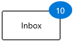

## Adding badge without BadgeContainer

You can directly add the `Badge` to any objects without using the `BadgeContainer`.




public class ListItem {
    public string ItemName { get; set; }
    public int? UnreadMessageount { get; set; }
}

public class ViewModel {
    public List<ListItem> MailItems { get; set; }

    public ViewModel() {
        MailItems = new List<ListItem>();
        MailItems.Add(new ListItem() { ItemName = "Inbox", 
            UnreadMessageount = 20 });
        MailItems.Add(new ListItem() { ItemName = "Drafts", 
            UnreadMessageount = null });
        MailItems.Add(new ListItem() { ItemName = "Sent Intems", 
            UnreadMessageount = 5 });
        MailItems.Add(new ListItem() { ItemName = "Deleted Items",
            UnreadMessageount = null });
        MailItems.Add(new ListItem() { ItemName = "Junk Email",
            UnreadMessageount = null });
    }
}







<Page.DataContext>
    <local:ViewModel/>
</Page.DataContext>
<Grid>
    <ListView BorderThickness="1"
              BorderBrush="LightGray"
              ItemsSource="{Binding MailItems}" 
              SelectedIndex="0"
              VerticalAlignment="Center" 
              HorizontalAlignment="Center">
        <ListView.ItemTemplate>
            <DataTemplate>
                <Grid>
                    <Grid.ColumnDefinitions>
                        <ColumnDefinition Width="150"/>
                        <ColumnDefinition Width="100"/>
                    </Grid.ColumnDefinitions>
                    <ContentPresenter 
                                      Grid.Column="0" 
                                      Content="{Binding ItemName}" 
                                      VerticalAlignment="Center"/>
                    <syncfusion:Badge 
                                      x:Name="badge4"
                                      Grid.Column="1" 
                                      Height="20" 
                                      Width="40" 
                                      Content="{Binding UnreadMessageount}"
                                      Shape="Oval"
                                      Fill="Warning">
                    </syncfusion:Badge>
                </Grid>
            </DataTemplate>
        </ListView.ItemTemplate>
    </ListView>
</Grid>




## Setting Badge display content

If you want to set or change the display content of the `Badge`, use the `Badge.Content` property. The default value of `Badge.Content` property is `null`.




<syncfusion:BadgeContainer Name="badgeContainer"  >
    <syncfusion:BadgeContainer.Badge>
        <syncfusion:Badge  Name="badge" 
                           Content="99+"/>
    </syncfusion:BadgeContainer.Badge>
    <syncfusion:BadgeContainer.Content>
        <Button Content="Inbox">
        </Button>
    </syncfusion:BadgeContainer.Content>
</syncfusion:BadgeContainer>




Badge badge = new Badge();
//Setting Badge display content
badge.Content = "99+";

BadgeContainer badgeContainer = new BadgeContainer();
badgeContainer.Content = new Button(){ Content="Inbox" };

//Assigning Badge control to the content of BadgeContainer
badgeContainer.Badge = badge;




### Custom UI for Badge content

You can change the appearance of `Badge` content by using `Badge.ContentTemplate` property. The `DataContext` of `Badge.ContentTemplate` property is `Badge.Content`.




<syncfusion:BadgeContainer Name="badgeContainer"  >
    <syncfusion:BadgeContainer.Badge>
        <syncfusion:Badge  Name="badge" 
                           Content="10">                
            <syncfusion:Badge.ContentTemplate>
                <DataTemplate>
                    <Grid Background="Yellow">
                        <TextBlock Text="{Binding}" 
                                   Foreground="Red"/>
                    </Grid>
                </DataTemplate>
            </syncfusion:Badge.ContentTemplate>
        </syncfusion:Badge>
    </syncfusion:BadgeContainer.Badge>
    <syncfusion:BadgeContainer.Content>
        <Button Content="Inbox">
        </Button>
    </syncfusion:BadgeContainer.Content>
</syncfusion:BadgeContainer>




## Alignment of Badge

you can align the `Badge` either horizontally or vertically by using the `Badge.HorizontalAlignment` or `Badge.VerticalAlignment` properties. The default value of `Badge.HorizontalAlignment` property is `Right` and `Badge.VerticalAlignment` property is `Top`.

<table>

<tr>
<td></td>
<td></td>
<th colspan=1>HorizontalAlignment</th>
</tr>

<tr>
<th>VerticalAlignment</th>
<td>Left</td>
<td>Center</td>
<td>Right</td>
<td>Stretch</td>
</tr>

<tr>
<td>Top</td>
<td></td>
<td>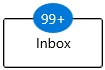</td>
<td></td>
<td>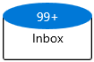</td>
</tr>

<tr>
<td>Center</td>
<td>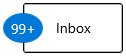</td>
<td>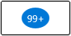</td>
<td>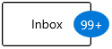</td>
<td>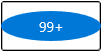</td>
</tr>

<tr>
<td>Bottom</td>
<td></td>
<td></td>
<td></td>
<td></td>
</tr>

<tr>
<td>Stretch</td>
<td>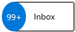</td>
<td></td>
<td></td>
<td>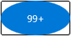</td>
</tr>
</table>




<syncfusion:BadgeContainer Name="badgeContainer"  >
    <syncfusion:BadgeContainer.Badge>
        <syncfusion:Badge HorizontalAlignment="Left"
                          VerticalAlignment="Center"
                          Content="99+"
                          Name="badge"/>
    </syncfusion:BadgeContainer.Badge>
    <syncfusion:BadgeContainer.Content>
        <Button Content="Inbox">
        </Button>
    </syncfusion:BadgeContainer.Content>
</syncfusion:BadgeContainer>




badge.HorizontalAlignment = HorizontalAlignment.Left;
badge.VerticalAlignment = VerticalAlignment.Center;
badge.Content = "99+";




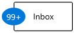

## Positioning of Badge

You can change the horizontal or vertical position of the `Badge` either inside, outside or in the middle by using the `Badge.HorizontalAnchor` and `Badge.VerticalAnchor` properties. The default value of `Badge.HorizontalAnchor` and `Badge.VerticalAnchor` properties is `Center`.




<syncfusion:BadgeContainer Name="badgeContainer"  >
    <syncfusion:BadgeContainer.Badge>
        <syncfusion:Badge HorizontalAnchor="Outside"
                          VerticalAnchor="Center"
                          Content="99+"
                          Name="badge"/>
    </syncfusion:BadgeContainer.Badge>
    <syncfusion:BadgeContainer.Content>
        <Button Content="Inbox">
        </Button>
    </syncfusion:BadgeContainer.Content>
</syncfusion:BadgeContainer>




badge.HorizontalAnchor = BadgeAnchor.Outside;
badge.VerticalAnchor = BadgeAnchor.Center;
badge.Content = "99+";




## Predefined colors for displaying the badges

You can change background color of the `Badge` by using the `Badge.Fill` property. Based on the value of `Badge.Fill` property, respective background color will be applied to the `Badge`. The default value of `Badge.Fill` property is `Accent`.

The `Badge` supports the following different essential states :

* Accent - RoyalBlue background will be applied

* Alt - DarkSlateGray background will be applied

* Default - Lavender background will be applied

* Error - OrangeRed background will be applied

* Information - LightSeaGreen background will be applied

* Success - Green background will be applied

* Warning - Orange background will be applied




<syncfusion:BadgeContainer Name="badgeContainer"  >
    <syncfusion:BadgeContainer.Badge>
        <syncfusion:Badge Fill="Success"
                          Content="99+"
                          Name="badge"/>
    </syncfusion:BadgeContainer.Badge>
    <syncfusion:BadgeContainer.Content>
        <Button Content="Inbox">
        </Button>
    </syncfusion:BadgeContainer.Content>
</syncfusion:BadgeContainer>




badge.Fill = BadgeFill.Success;
badge.Content = "99+";




## Custom colors for displaying the badges

If you want to change the background color of the `Badge` other than the default `Badge.Fill` colors, use the `Badge.Background` property. You can also change foreground of the `Badge` by using the `Badge.Foreground` property. The default value of `Badge.Background` and `Badge.Foreground` properties is `null`. 




<syncfusion:BadgeContainer Name="badgeContainer"  >
    <syncfusion:BadgeContainer.Badge>
        <syncfusion:Badge Background="Black"
                          Foreground="Yellow"
                          Content="99+"
                          Name="badge"/>
    </syncfusion:BadgeContainer.Badge>
    <syncfusion:BadgeContainer.Content>
        <Button Content="Inbox">
        </Button>
    </syncfusion:BadgeContainer.Content>
</syncfusion:BadgeContainer>




badge.Background = new SolidColorBrush(Colors.Black);
badge.Foreground = new SolidColorBrush(Colors.Yellow);
badge.Content = "99+";




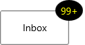

## Predefined shapes for displaying the Badge

You can change the default shape to either `Rectangle`, `Oval` or `Ellipse` by using `Badge.Shape` property. If you want to display the `Badge` content without any default shapes , use the `Badge.Shape` property value as `None`. The default value of `Badge.Shape` property is `Ellipse`.




<syncfusion:BadgeContainer Name="badgeContainer"  >
    <syncfusion:BadgeContainer.Badge>
        <syncfusion:Badge Shape="Oval"
                          Content="99+"
                          Name="badge"/>
    </syncfusion:BadgeContainer.Badge>
    <syncfusion:BadgeContainer.Content>
        <Button Content="Inbox">
        </Button>
    </syncfusion:BadgeContainer.Content>
</syncfusion:BadgeContainer>




badge.Shape = BadgeShape.Oval;
badge.Content = "99+";




## Custom shape for displaying the Badge

If you want to change the shape of the `Badge` other than the default shapes, use the `Badge.CustomShape` property. You can enable the custom shapes by setting the `Badge.Shape` property value as `Custom`.




<syncfusion:BadgeContainer Name="badgeContainer"  >
    <syncfusion:BadgeContainer.Badge>
        <syncfusion:Badge Shape="Custom" 
                          CustomShape="M 300 100 L 500 400 100 400 Z"
                          Content="10"
                          Width="50" Height="30"
                          Name="badge"/>
    </syncfusion:BadgeContainer.Badge>
    <syncfusion:BadgeContainer.Content>
        <Button Content="Inbox">
        </Button>
    </syncfusion:BadgeContainer.Content>
</syncfusion:BadgeContainer>




## Animate when content changes

You can enable the `Scale` or `Opacity` based animation for displaying the `Badge` text by using `Badge.AnimationType` property. You can only see the animation when you change the text of the `Badge`. The default value of `Badge.AnimationType` property is `None`.




<syncfusion:BadgeContainer Name="badgeContainer"  >
    <syncfusion:BadgeContainer.Badge>
        <syncfusion:Badge AnimationType="Scale"
                          Background="Red"
                          Content="1"
                          Name="badge"/>
    </syncfusion:BadgeContainer.Badge>
    <syncfusion:BadgeContainer.Content>
        <Button Content="Inbox">
        </Button>
    </syncfusion:BadgeContainer.Content>
</syncfusion:BadgeContainer>




badge.AnimationType = AnimationType.Scale;
badge.Content = "1";




### Scaling based animation

### Opacity based animation

## Stroke customization

You can change stroke color and its thickness by using the `Badge.Stroke` and `Badge.StrokeThikness` properties. The default value of `Badge.Stroke` property is `null` and `Badge.StrokeThikness` property is `0`.




<syncfusion:BadgeContainer Name="badgeContainer"  >
    <syncfusion:BadgeContainer.Badge>
        <syncfusion:Badge Stroke="Red"
                          StrokeThickness="3"
                          Content="99+"
                          Name="badge"/>
    </syncfusion:BadgeContainer.Badge>
    <syncfusion:BadgeContainer.Content>
        <Button Content="Inbox">
        </Button>
    </syncfusion:BadgeContainer.Content>
</syncfusion:BadgeContainer>




badge.Stroke = new SolidColorBrush(Colors.Red);
badge.StrokeThickness = 3;
badge.Content = "99+";




## Hide the Badge

You can hide the `Badge` by setting the `Badge.Visibility` property value as `Collapsed`. Badge will be hidden when its content is `null`. The default value of `Badge.Visibility` property is `Visible`.




<syncfusion:BadgeContainer Name="badgeContainer"  >
    <syncfusion:BadgeContainer.Badge>
        <syncfusion:Badge Visibility="Collapsed"
                          Content="99+"
                          Name="badge"/>
    </syncfusion:BadgeContainer.Badge>
    <syncfusion:BadgeContainer.Content>
        <Button Content="Inbox">
        </Button>
    </syncfusion:BadgeContainer.Content>
</syncfusion:BadgeContainer>




badge.Visibility = Visibility.Collapsed;
badge.Content = "99+";




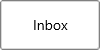

## Display number formatting

You can format the numbers which are displayed in the `Badge` content by using the converters. For example, you can display the number as `99+` which is greater than or equal to `100`.




public class CustomNumberConverter : IValueConverter {
    public object Convert(object value, Type targetType, object parameter, string language)
    {
        if (int.TryParse(value.ToString(), out int number)) {
            if (number <= 99) {
                return value;
            }
            else if (number <= 999) {
                return "99+";
            }
            else if (number < 99999) {
                return (number / 1000).ToString("0.#") + "K";
            }
            else if (number < 999999) {
                return (number / 1000).ToString("#,0K");
            }
            else if (number < 9999999) {
                return (number / 1000000).ToString("0.#") + "M";
            }
            else {
                return (number / 1000000).ToString("#,0M");
            }
        }
        return value;
    }

    public object ConvertBack(object value, Type targetType, object parameter, string language) {
        throw new NotImplementedException();
    }
}







<Page.Resources>
    <local:CustomNumberConverter x:Key="customNumberConverter"/>
</Page.Resources>

<Grid>
    <Grid.ColumnDefinitions>
        <ColumnDefinition/>
        <ColumnDefinition/>
    </Grid.ColumnDefinitions>
    
    <syncfusion:BadgeContainer Name="badgeContainer">
        <syncfusion:BadgeContainer.Badge>
            <syncfusion:Badge  Name="badge"
                               Background="Red"
                               Content="{x:Bind badgeContent.Text, 
                                                Mode=OneWay, 
                                                Converter={StaticResource 
                                                customNumberConverter}}"/>
        </syncfusion:BadgeContainer.Badge>
        <syncfusion:BadgeContainer.Content>
            <Button Content="Inbox">
            </Button>
        </syncfusion:BadgeContainer.Content>
    </syncfusion:BadgeContainer>

    <Grid Grid.Column="1">
        <muxc:NumberBox x:Name="badgeContent"
                        Header="BadgeContent"
                        Value="99"
                        SpinButtonPlacementMode="Compact"
                        Minimum="0"
                        Maximum="100000000"/>
    </Grid>
</Grid>




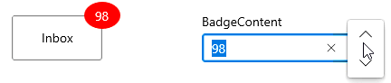

## Change Badge size

You can change the size of `Badge` by using the `Badge.Width` and `Badge.Height` properties. The default value of `Badge.Width` property is `40` and `Badge.Height` property is `30`.




<syncfusion:BadgeContainer Name="badgeContainer"  >
    <syncfusion:BadgeContainer.Badge>
        <syncfusion:Badge Width="60" 
                          Height="60" 
                          Content="99+"
                          Name="badge"/>
    </syncfusion:BadgeContainer.Badge>
    <syncfusion:BadgeContainer.Content>
        <Button Content="Inbox">
        </Button>
    </syncfusion:BadgeContainer.Content>
</syncfusion:BadgeContainer>




badge.Width = 60;
badge.Height = 60;
badge.Content = "99+";




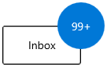

## Badge content alignment

you can place the `Badge` content either horizontally or vertically by using the `Badge.HorizontalContentAlignment` or `Badge.VerticalContentAlignment` properties. The default value of `Badge.HorizontalContentAlignment` and `Badge.VerticalContentAlignment` properties is `Center`.




<syncfusion:BadgeContainer Name="badgeContainer"  >
    <syncfusion:BadgeContainer.Badge>
        <syncfusion:Badge HorizontalContentAlignment="Right"
                          VerticalContentAlignment="Top"
                          Content="99+"
                          Name="badge"/>
    </syncfusion:BadgeContainer.Badge>
    <syncfusion:BadgeContainer.Content>
        <Button Content="Inbox">
        </Button>
    </syncfusion:BadgeContainer.Content>
</syncfusion:BadgeContainer>




badge.HorizontalContentAlignment = HorizontalAlignment.Right;
badge.VerticalContentAlignment = VerticalAlignment.Top;
badge.Content = "99+";




## Text formatting

You can change the style, size and font family of the `Badge` display content by using the `Badge.FontFamily`, `Badge.FontStyle` and `Badge.FontSize` properties. The default value of `Badge.FontFamily` property is `Segoe UI`, `Badge.FontStyle` property is `Normal` and  `Badge.FontSize` property is `14`.




<syncfusion:BadgeContainer Name="badgeContainer"  >
    <syncfusion:BadgeContainer.Badge>
        <syncfusion:Badge  Name="badge"
                           FontFamily="Perpetua"
                           FontSize="20"
                           FontStyle="Oblique" 
                           Content="99+"/>
    </syncfusion:BadgeContainer.Badge>
    <syncfusion:BadgeContainer.Content>
        <Button Content="Inbox">
        </Button>
    </syncfusion:BadgeContainer.Content>
</syncfusion:BadgeContainer>




badge.FontFamily = new FontFamily("Perpetua");
badge.FontSize = 20;
badge.FontStyle = Windows.UI.Text.FontStyle.Oblique;
badge.Content = "99+";




## Rotate the Badge

You can place the `Badge` with a specific rotation angle by using the `Rotation` property. The default value of `Rotation` property is `0`.




<syncfusion:BadgeContainer Name="badgeContainer"  >
    <syncfusion:BadgeContainer.Badge>
        <syncfusion:Badge Rotation="30"
                          Content="99+"
                          Name="badge"/>
    </syncfusion:BadgeContainer.Badge>
    <syncfusion:BadgeContainer.Content>
        <Button Content="Inbox">
        </Button>
    </syncfusion:BadgeContainer.Content>
</syncfusion:BadgeContainer>




badge.Rotation = 30;
badge.Content = "99+";




## Change opacity of Badge

You can change opacity of the `Badge` by using the `Opacity` property. The default value of `Opacity` property is `1`.




<syncfusion:BadgeContainer Name="badgeContainer"  >
    <syncfusion:BadgeContainer.Badge>
        <syncfusion:Badge Opacity="0.6"
                          Content="99+"
                          Name="badge"/>
    </syncfusion:BadgeContainer.Badge>
    <syncfusion:BadgeContainer.Content>
        <Button Content="Inbox">
        </Button>
    </syncfusion:BadgeContainer.Content>
</syncfusion:BadgeContainer>




badge.Opacity = 0.6;
badge.Content = "99+";




