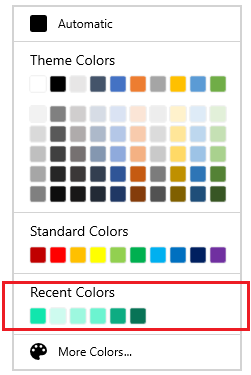
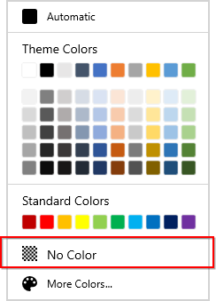

# Getting started with WinUI SfColorPalette

This section explains how to create a WinUI `SfColorPalette` and explains about its structure and features.

## Control Structure

* The Selected Color represents the color that you select.

* The Automatic Color represents the Color, which can be set by you as default color.

* The ToolTip with Color Details represents the ToolTip, when the mouse hovers on the Color.

* The Standard Colors stores the standard colors like `Red`, `Green`, `Blue` and so on.

* The Recently User Colors stores the Colors that are recently selected.

* The No Color represents the `Transparent` color that applied as the selected color. 

* The More Colors Option provides wide range of color in addition to colors in the palette.

* The Theme Variant Colors represents the Theme colors with variants.

### More Color Dialog

## Assembly deployment

Refer to the `control dependencies` section to get the list of assemblies or NuGet package that needs to be added as reference to use the control in any application.

You can find more details about installing the NuGet package in a WinUI application in the following link: 

`How to install nuget packages`

## Adding WinUI SfColorPalette via XAML

To add the `SfColorPalette` control manually in XAML, follow these steps:
1. Create a new WinUI project in Visual Studio.

2. Add the  following assembly references to the project,
    * Syncfusion.Core.WinUI
    * Syncfusion.Editors.WinUI
 
3. Import Syncfusion WinUI schema **using:Syncfusion.UI.Xaml.Editors** and declare the `SfColorPalette` control in XAML page.

4.	Declare the `SfColorPalette` control in XAML page.




<Page
    x:Class="ColorPalette_Sample.MainPage"
    xmlns="http://schemas.microsoft.com/winfx/2006/xaml/presentation"
    xmlns:x="http://schemas.microsoft.com/winfx/2006/xaml"
    xmlns:local="using:ColorPalette_Sample"
    xmlns:d="http://schemas.microsoft.com/expression/blend/2008"
    xmlns:mc="http://schemas.openxmlformats.org/markup-compatibility/2006"
    xmlns:syncfusion="using:Syncfusion.UI.Xaml.Editors">
    <Grid>
        <!--Adding SfColorPalette control -->
        <syncfusion:SfColorPalette Margin="10"
                                   Name="sfColorPalette"/>
    </Grid>
</Window>




## Adding WinUI SfColorPalette via C\#

To add the `SfColorPalette` control manually in C#, follow these steps:

1. Create a new WinUI application via Visual Studio.

2. Add the  following assembly references to the project,
    * Syncfusion.Core.WinUI
    * Syncfusion.Editors.WinUI

3. Include the required namespace and create an instance of `SfColorPalette` and add it to the window.

4.	Declare the `SfColorPalette` control using C#.




using Syncfusion.UI.Xaml.Editors;

public sealed partial class MainPage : Page {
    public MainPage() {
        this.InitializeComponent();

        //Creating an instance of SfColorPalette control
        SfColorPalette sfColorPalette = new SfColorPalette();

        //Adding SfColorPalette as window content
        this.Content = sfColorPalette;
    }
}




## Accessing a Color programmatically

You can set or change the selected color of the `SfColorPalette` programmatically by setting the value to `SelectedBrush` property. You can also get the selected color by using the `SelectedBrush` property. The default value of `SelectedBrush` property is `Transparent(#00FFFFFF)`.




<syncfusion:SfColorPalette SelectedBrush="Yellow"
                           Name="sfColorPalette" />

<Button Background="{Binding ElementName=sfColorPalette, Path=SelectedBrush}"></Button>




sfColorPalette.SelectedBrush = new SolidColorBrush(Colors.Yellow);




Here, `Yellow` color is selected color in the `SfColorPalette`.

## Select color from color palette

You can select a different colors from Theme Color and Standard Color panels. You can show or hide the variant colors of the base Theme Colors and Standard Colors by using the `PaletteColors.ShowColorShades`  and `StandardColors.ShowColorShades` properties value as `true` or `false`.




<syncfusion:SfColorPalette Name="sfColorPalette">
    <syncfusion:SfColorPalette.PaletteColors>
        <syncfusion:ColorPaletteModel ShowColorShades="True"/>
    </syncfusion:SfColorPalette.PaletteColors>
    <syncfusion:SfColorPalette.StandardColors>
        <syncfusion:StandardPaletteModel ShowColorShades="True"/>
    </syncfusion:SfColorPalette.StandardColors>
</syncfusion:SfColorPalette>




sfColorPalette.PaletteColors.ShowColorShades = true;
sfColorPalette.StandardColors.ShowColorShades = true;




## Add your own color in the Theme and Standard color palette

If you want to apply custom colors for base Theme Colors and Standard Colors palette, add the colors into the `PaletteColors.Colors` and `StandardColors.Colors` collections. The varient colors will be automatically created for the own Theme and Standard Colors.




<syncfusion:SfColorPalette Name="sfColorPalette">
    <syncfusion:SfColorPalette.PaletteColors>
        <syncfusion:ColorPaletteModel ShowColors="True" 
                                      ShowColorShades="True"
                                      Header="Custom Theme Colors" >
            <syncfusion:ColorPaletteModel.Colors>
                <syncfusion:ColorCollection>
                    <syncfusion:ColorModel Color="#FF11EBF8" Tooltip="Custom Aqua" />
                    <syncfusion:ColorModel Color="#FFF80FA6" Tooltip="Custom Deep Pink" />
                    <syncfusion:ColorModel Color="#FF8BA7C2" Tooltip="Custom Dark Gray" />
                    <syncfusion:ColorModel Color="#F53CDF07" Tooltip="Custom Lime Green" />
                    <syncfusion:ColorModel Color="#C2929545" Tooltip="Custom Olive Drab" />
                    <syncfusion:ColorModel Color="#2E956145" Tooltip="Custom Sienna" />
                    <syncfusion:ColorModel Color="#78458E95" Tooltip="Custom Steel Blue" />
                    <syncfusion:ColorModel Color="#8B8220E4" Tooltip="Custom Blue Violet" />
                    <syncfusion:ColorModel Color="#FF352722" Tooltip="Custom Dark Slate Gray" />
                    <syncfusion:ColorModel Color="#FF318B86" Tooltip="Custom Sea Green" />
                </syncfusion:ColorCollection>
            </syncfusion:ColorPaletteModel.Colors>                        
        </syncfusion:ColorPaletteModel>
    </syncfusion:SfColorPalette.PaletteColors> 

    <syncfusion:SfColorPalette.StandardColors>
        <syncfusion:StandardPaletteModel ShowColors="True" 
                                         ShowColorShades="True"
                                         Header="Custom Standard Colors" >
            <syncfusion:StandardPaletteModel.Colors>
                <syncfusion:ColorCollection>
                    <syncfusion:ColorModel Color = "Blue" Tooltip = "Custom Blue" />
                    <syncfusion:ColorModel Color = "Orchid" Tooltip = "Custom Orchid" />
                    <syncfusion:ColorModel Color = "Gray" Tooltip = "Custom Gray" />
                    <syncfusion:ColorModel Color = "Gold" Tooltip = "Custom Gold" />
                    <syncfusion:ColorModel Color = "SandyBrown" Tooltip = "Custom SandyBrown" />
                    <syncfusion:ColorModel Color = "Pink" Tooltip = "Custom Pink" />
                    <syncfusion:ColorModel Color = "Violet" Tooltip = "Custom Violet" />
                    <syncfusion:ColorModel Color = "Yellow" Tooltip = "Custom Yellow" />
                    <syncfusion:ColorModel Color = "Orange" Tooltip = "Custom Orange" />
                    <syncfusion:ColorModel Color = "Red" Tooltip = "Custom Red" />
                </syncfusion:ColorCollection>
            </syncfusion:StandardPaletteModel.Colors>                        
        </syncfusion:StandardPaletteModel>
    </syncfusion:SfColorPalette.StandardColors>    
</syncfusion:SfColorPalette>




sfColorPalette.PaletteColors.Header = "Custom Theme Colors";
sfColorPalette.PaletteColors.ShowColors = true;
sfColorPalette.PaletteColors.ShowColorShades = true;

sfColorPalette.StandardColors.Header = "Custom Standard Colors";
sfColorPalette.StandardColors.ShowColors = true;
sfColorPalette.StandardColors.ShowColorShades = true;




## Recently used color items

The recently selected color items are displayed in the Recent color panel. If you want to choose a color which are previously selected, use the Recent color panel. You can get the recently used color list from the `RecentColors` collection.

N> Colors selected from theme and standard colors will not be added in recent colors.




<syncfusion:SfColorPalette Name="sfColorPalette"/>




//Getting the recently used color list
var recentColors = sfColorPalette.RecentColors;




## Choosing a color from MoreColor dialog

If you want to choose a color that is not available in palette, click the more color button and select the color from color spectrums and click the `Ok` button. 




<syncfusion:SfColorPalette ShowMoreColorsButton="true"
                           Name="sfColorPalette"/>




sfColorPalette.ShowMoreColorsButton = true;




## Reset the selected color

If you want to reset the selected color as `No color` or `Transparent`, click the `No Color` button. You can display the
 `No color` button only by setting the `ShowNoColorButton` property value as `true`. The default value of `ShowNoColorButton` property is `false`. 




<syncfusion:SfColorPalette ShowNoColorButton="True"
                           Name="sfColorPalette"/>




sfColorPalette.ShowNoColorButton = true;




## Selected color changed notification

The selected color changed in `SfColorPalette` can be examined using `SelectedBrushChanged` event. The `SelectedBrushChanged` event contains the old and newly selected color values in the `OldBrush`, `NewBrush` properties.




<syncfusion:SfColorPalette SelectedBrushChanged="SfColorPalette_SelectedBrushChanged"
                           Name="sfColorPalette" />




sfColorPalette.SelectedBrushChanged += SfColorPalette_SelectedBrushChanged;







//Invoked when the selected color is changed
private void SfColorPalette_SelectedBrushChanged(object sender, SelectedBrushChangedEventArgs e) {
    var oldBrush= e.OldBrush;
    var newBrush= e.NewBrush;
}



