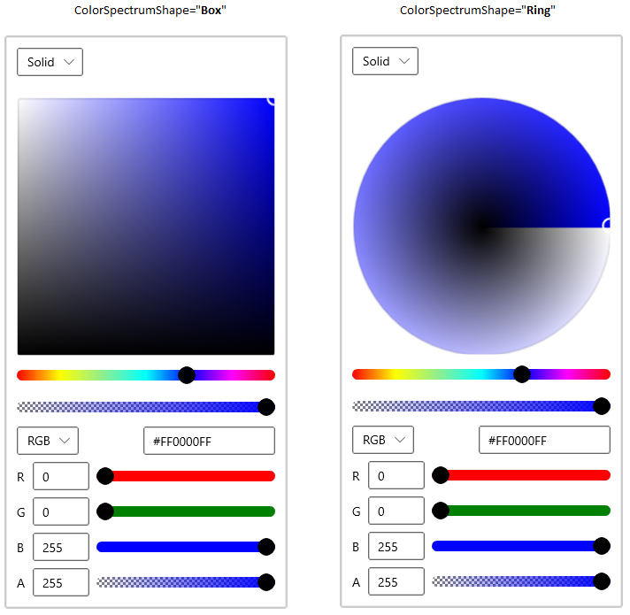

# Getting Started with WinUI SfColorPicker control

This section describes how to create a `SfColorPicker` control in a WinUI application and overview of its basic functionalities.

## Structure of SfColorPicker control

## Assembly deployment

Refer to the `Control Dependencies` section to get the list of assemblies or NuGet package that needs to be added as a reference to use the control in any application.

Refer to this `documentation` to find more details about installing nuget packages in a WinUI application.

## Adding WinUI SfColorPicker control via XAML

To add the `SfColorPicker` control manually in XAML, follow these steps:

1) Create a new WinUI project in Visual Studio.

2) Add the following required assembly references to the project:

* Syncfusion.Core.WinUI

* Syncfusion.Editors.WinUI

3) Import Syncfusion WinUI schema **using:Syncfusion.UI.Xaml.Editors** and declare the `SfColorPicker` control in XAML page.




<Page
    x:Class="ColorPickercontrol_sample.MainPage"
    xmlns="http://schemas.microsoft.com/winfx/2006/xaml/presentation"
    xmlns:x="http://schemas.microsoft.com/winfx/2006/xaml"
    xmlns:local="using:Getting_Started"
    xmlns:d="http://schemas.microsoft.com/expression/blend/2008"
    xmlns:mc="http://schemas.openxmlformats.org/markup-compatibility/2006"
    xmlns:syncfusion="using:Syncfusion.UI.Xaml.Editors">
    <Grid>
        <syncfusion:SfColorPicker Name="sfColorPicker" 
                                  Height="30"
                                  Width="30"/>
    </Grid>
</Page>




## Adding WinUI SfColorPicker control via C#

To add the `SfColorPicker` control manually in C#, follow these steps:

1) Create a new WinUI application via Visual Studio.

2) Add the following required assembly references to the project:

* Syncfusion.Core.WinUI

* Syncfusion.Editors.WinUI

3) Include the required namespace.




using Syncfusion.UI.Xaml.Editors;




4) Create an instance of `SfColorPicker` control and add it to the page.




// Creating an instance of the SfColorPicker control
SfColorPicker sfColorPicker = new SfColorPicker();

// Setting height and width to SfColorPicker control
sfColorPicker.Height = 300;
sfColorPicker.Width = 300;




## Select Solid Color

You can select the solid color by setting the solid color value to the `SelectedBrush` property. The default value of 




 <syncfusion:ColorPicker x:Name="colorPicker"
                         SelectedBrush="Yellow"/>




ColorPicker colorPicker = new ColorPicker();
colorPicker.Color = Colors.Yellow;




## Select Gradient Color

You can select a linear or radial gradient color which holds the multiple colors from the `ColorPicker`.

### Linear Gradient

Linear Gradient color can be selected by the multiple colors and their location along the gradient axis using the `GradientStop` objects and `StartPoint` and `EndPoint` properties. Based on the `StartPoint` and `EndPoint`, the selected colors will be combined in linear manner.




 <syncfusion:SfColorPicker x:Name="colorPicker">
    <syncfusion:SfColorPicker.SelectedBrush>
        <LinearGradientBrush StartPoint="0,0" EndPoint="1,1">
            <GradientStop Color="Yellow" Offset="0.0" />
            <GradientStop Color="Red" Offset="0.25" />
            <GradientStop Color="Blue" Offset="0.75" />
            <GradientStop Color="LimeGreen" Offset="1.0" />
        </LinearGradientBrush>
    </syncfusion:SfColorPicker.SelectedBrush>
</syncfusion:SfColorPicker>




//Creating the linear gradient brush
LinearGradientBrush linearGradient = new LinearGradientBrush();
linearGradient.StartPoint = new Point(0, 0);
linearGradient.EndPoint = new Point(1, 1);
linearGradient.GradientStops.Add(
    new GradientStop() { Color = Colors.Yellow, Offset = 0.0 });
linearGradient.GradientStops.Add(
    new GradientStop() { Color = Colors.Red, Offset = 0.25 });
linearGradient.GradientStops.Add(
    new GradientStop() { Color = Colors.Blue, Offset = 0.75 });
linearGradient.GradientStops.Add(
    new GradientStop() { Color = Colors.LimeGreen, Offset = 1.0 });

//Assigning a linear gradient brush to ColorPicker
colorPicker.SelectedBrush = linearGradient;




### Radial Gradient

Radial Gradient color is similar to Linear Gradient color, except for the axis defined by the circle. Based on the `GradientOrigin`, `Center` and radius point values, the selected gradient colors are combined in a circle manner. 




 <syncfusion:SfColorPicker x:Name="colorPicker">
    <syncfusion:SfColorPicker.SelectedBrush>
        <RadialGradientBrush GradientOrigin="0.5,0.5" 
                             Center="0.5,0.5"
                             RadiusX="0.5" RadiusY="0.5">
            <GradientStop Color="Yellow" Offset="0" />
            <GradientStop Color="Red" Offset="0.25" />
            <GradientStop Color="Blue" Offset="0.75" />
            <GradientStop Color="LimeGreen" Offset="1" />
        </RadialGradientBrush>
    </syncfusion:SfColorPicker.SelectedBrush>
</syncfusion:SfColorPicker>




//Creating a radial gradient brush
RadialGradientBrush radialGradient = new RadialGradientBrush();
radialGradient.GradientOrigin = new Point(0.5, 0.5);
radialGradient.Center = new Point(0.5, 0.5);
radialGradient.RadiusX = 0.5;
radialGradient.RadiusY = 0.5;
radialGradient.GradientStops.Add(
    new GradientStop() {Color=Colors.Yellow, Offset= 0.0 });
radialGradient.GradientStops.Add(
    new GradientStop() {Color=Colors.Red, Offset = 0.25 });
radialGradient.GradientStops.Add(
    new GradientStop() {Color=Colors.Blue, Offset = 0.75 });
radialGradient.GradientStops.Add(
    new GradientStop() {Color=Colors.LimeGreen, Offset = 1.0 });

//Assigning a radial gradient brush to ColorPicker
colorPicker.SelectedBrush = radialGradient;




## Select color programmatically

You can select a color programmatically by setting the value to the `SelectedBrush` property. The deafult value of `SelectedBrush` property is `Transparent`.




 <syncfusion:SfColorPicker x:Name="colorPicker"/>




colorPicker.SelectedBrush = new SolidColorBrush(Colors.Yellow);




## Change selected color at runtime

You can select a solid or gradient color by using the color spectrum and its value editors or delicate slider available in the `SfColorPicker`. You can select a different color channels like `RGB`, `HSV`, `HSL` and `CMYK` in the solid color mode.

## Get the selected color

You can get the selected color by using `SelectedBrush` property. The default value of `SelectedBrush` and `SelectedBrush` properties is `#FF0000FF (Blue)`.

## Selected brush changed notification

The selected brush changed in `SfColorPicker` can be examined by  using `SelectedBrushChanged` events. You can get the old and newly selected brush by using the `OldBrush` and `NewBrush` properties.




<syncfusion:SfColorPicker SelectedBrushChanged="ColorPicker_SelectedBrushChanged"
                      Name="sfColorPicker">




sfColorPicker.SelectedBrushChanged += ColorPicker_SelectedBrushChanged;




You can handle the event as follows,




private void ColorPicker_SelectedBrushChanged(object sender, SelectedBrushChangedEventArgs args) {
    var old_selectedBrush = args.OldBrush;
    var new_selectedBrush = args.NewBrush;
}




## Change color spectrum shapes

You can change the shape of colour spectrum to either `Circle` or `Rectangle` by using the `ColorSpectrumShape` property value as `Ring` or `Box`. The default value of `ColorSpectrumShape` property is `Box`.




<syncfusion:SfColorPicker ColorSpectrumShape="Ring" 
                          x:Name="colorPicker" />




colorPicker.ColorSpectrumShape = ColorSpectrumShape.Ring;




## Switch between solid, linear and gradient brush mode

You can change the color selection mode directly by clicking on the corresponding `Solid`, `Linear` or `Radial` gradient brush mode tab buttons which are placed in the top of the `ColorPicker` control.

