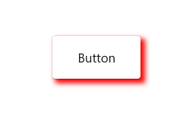
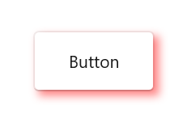
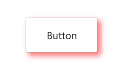
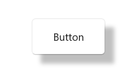

# Customization in WinUI Shadow

This section explains the customization features available in the WinUI Shadow control.

## Applying Color for shadow

The shadow color can be customized using the `Color` property. The default value of `Color` property is `Black` color with 25% alpha value.




<syncfusion:SfShadow Color="Red">
    <Button Height="50" width="100" Content="Button"/>
</syncfusion:SfShadow>




   SfShadow shadow = new SfShadow();
   shadow.Color = Color.FromArgb(255, 255, 0, 0);
   
   Button button = new Button(); 
   button.Height = 50;
   button.width = 100;
   button.Content = "Button";
   shadow.Content = button;




## Applying BlurRadius for shadow

Blur level of shadow effect can be customized using the `BlurRadius` property. The default value of `BlurRadius` property is 8.




<syncfusion:SfShadow BlurRadius="10" OffsetX="10" OffsetY="10">
    <Button Height="50" width="100" Content="Button"/>
</syncfusion:SfShadow>




   SfShadow shadow = new SfShadow();
   shadow.BlurRadius = 10;
   shadow.OffsetX = 10;
   shadow.OffsetY = 10;

   Button button = new Button();
   button.Height = 50;
   button.width = 100;
   button.Content = "Button";
   shadow.Content = button;




## Applying CornerRadius for shadow

The corner radius of the shadow can be customized using the `ShadowCornerRadius` property. The default value of `ShadowCornerRadius` property is 0.




<syncfusion:SfShadow ShadowCornerRadius="10" OffsetX="10" OffsetY="10">
    <Button Height="50" width="100" Content="Button" CornerRadius="10"/>
</syncfusion:SfShadow>




   SfShadow shadow = new SfShadow();
   shadow.ShadowCornerRadius = 10;
   shadow.OffsetX = 10;
   shadow.OffsetY = 10;
   
   Button button = new Button(); 
   button.Height = 50;
   button.width = 100;
   button.Content = "Button";
   button.CornerRadius = 10;
   shadow.Content = button;




## Positioning the shadow

The position of shadow can be customized using the `OffsetX` and `OffsetY` properties. The default value of `OffsetX` and `OffsetY` properties is 4.




<syncfusion:SfShadow OffsetX="10" OffsetY="10">
    <Button Height="50" width="100" Content="Button"/>
</syncfusion:SfShadow>




   SfShadow shadow = new SfShadow();
   shadow.OffsetX = 10;
   shadow.OffsetY = 10;
   
   Button button = new Button(); 
   button.Height = 50;
   button.width = 100;
   button.Content = "Button";
   shadow.Content = button;




