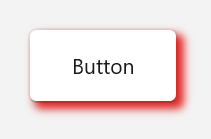

# Customization in WinUI Shadow

This section explains the customization features available in the WinUI [Shadow](https://help.syncfusion.com/cr/winui/Syncfusion.UI.Xaml.Core.SfShadow.html) control.

## Custom colors for displaying the Shadow for button control

If you want to change the color of the `Shadow` other than the default Color value, use the `Color` property. The default value of `Color` property is Black color with 25% alpha value.



<core:SfShadow Name="buttonShadow"
                      Color="Red"
                      BlurRadius="8"
                      OffsetX="4"
                      OffsetY="4"
                      ShadowCornerRadius="5">
          <Button Height="50" width="100" Content="Button"         
              CornerRadius="5"/>
</core:SfShadow>

using Syncfusion.UI.Xaml.Core;

namespace GettingStarted
{
    /// 

    /// An empty page that can be used on its own or navigated to within a Frame.
    /// 

    public sealed partial class MainPage : Page
    {
        public MainPage()
        {
           this.InitializeComponent();
           // Creating an instance of the Shadow control.
           SfShadow shadow = new SfShadow();

           //Setting Color, BlurRadius, OffsetX, OffsetY of Shadow.
           shadow.Color = Color.FromArgb(125, 255, 0, 0);
           shadow.BlurRadius = 8;
           shadow.OffsetX = 4;
           shadow.OffsetY = 4;
        }
    }
}

## Custom colors for displaying the shadow for image




<core:SfShadow Name="imageShadow"
               Color="Red"
 			   BlurRadius="8"
               OffsetX="10"
               OffsetY="10">
    <Image Height="200" Width="250" 
   Source="/Assets/Shadow/Ellipse_Shadow.png/>
</core:SfShadow>




using Syncfusion.UI.Xaml.Core;

namespace GettingStarted
{
    /// 

    /// An empty page that can be used on its own or navigated to within a Frame.
    /// 

    public sealed partial class MainPage : Page
    {
        public MainPage()
        {
           this.InitializeComponent();
           // Creating an instance of the Shadow control.
           SfShadow shadow = new SfShadow();

           //Setting Color, BlurRadius, OffsetX, OffsetY of Shadow.
           shadow.Color = Color.FromArgb(125, 255, 0, 0);
           shadow.BlurRadius = 8;
           shadow.OffsetX = 10;
           shadow.OffsetY = 10;
        }
    }
}




## Custom colors for displaying the shadow for star shape




<core:SfShadow Name="shapeShadow"
               Color="Red"
               BlurRadius="8"
               OffsetX="4"
               OffsetY="4">
      <Path Name="star" Data="M44.5 4L54.0608 33.4114H85L59.9696 51.5886L69.5304 81L44.5 62.8228L19.4696 81L29.0304 51.5886L4 33.4114H34.9392L44.5 4Z" Fill="#FFD700"/>  
</core:SfShadow>




using Syncfusion.UI.Xaml.Core;

namespace GettingStarted
{
    /// 

    /// An empty page that can be used on its own or navigated to within a Frame.
    /// 

    public sealed partial class MainPage : Page
    {
        public MainPage()
        {
           this.InitializeComponent();
           // Creating an instance of the Shadow control.
           SfShadow shadow = new SfShadow();

           //Setting Color, BlurRadius, OffsetX, OffsetY of Shadow.
           shadow.Color = Color.FromArgb(125, 255, 0, 0);
           shadow.BlurRadius = 8;
           shadow.OffsetX = 4;
           shadow.OffsetY = 4;
        }
    }
}




