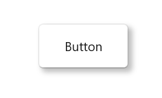

# Getting Started with WinUI Shadow

This section explains the steps required to add the WinUI Shadow control and covers only the basic features needed to get started with Syncfusion `SfShadow` control.

## Creating an application with WinUI Shadow control

1. Create a [WinUI 3 desktop app for C# and .NET 5](https://docs.microsoft.com/en-us/windows/apps/winui/winui3/get-started-winui3-for-desktop).
2. Add reference to [Syncfusion.Core.WinUI](https://www.nuget.org/packages/Syncfusion.Core.WinUI) NuGet. 
3. Import the control namespace `Syncfusion.UI.Xaml.Core` in XAML or C# code.
4. Initialize the `SfShadow` control.




<Page
    x:Class="GettingStarted.MainPage"
    xmlns="http://schemas.microsoft.com/winfx/2006/xaml/presentation"
    xmlns:x="http://schemas.microsoft.com/winfx/2006/xaml"
    xmlns:local="using:GettingStarted"
    xmlns:d="http://schemas.microsoft.com/expression/blend/2008"
    xmlns:mc="http://schemas.openxmlformats.org/markup-compatibility/2006"
    xmlns:syncfusion="using:Syncfusion.UI.Xaml.Core"
    mc:Ignorable="d"
    Background="{ThemeResource ApplicationPageBackgroundThemeBrush}">
    <Grid>
      <syncfusion:SfShadow>
         <Button Height="50" Width="100" Content="Button"/>
      </syncfusion:SfShadow>
    </Grid>
</Page>




// Creating an instance of the Shadow control.
SfShadow shadow = new SfShadow();

// Setting the SfShadow content value.
Button button = new Button();
button.Height = 50;
button.Width = 100;
button.Content = "Button";
shadow.Content = button;




## Applying shadow effect for image

You can apply the shadow effects for any types of [Image](https://docs.microsoft.com/en-us/windows/windows-app-sdk/api/winrt/microsoft.ui.xaml.controls.image) with the help of `SfShadow` control.




<syncfusion:SfShadow>
   <Image Height="150" Width="150" Source="/Assets/Shadow/Ellipse_Shadow.png"/>
</syncfusion:SfShadow>




SfShadow shadow = new SfShadow();

Image image = new Image();
image.Height = 150;
image.Width = 150;
BitmapImage bitmapImage = new BitmapImage();
bitmapImage.UriSource = new Uri("ms-appx:///Assets/Image/Ellipse_Shadow.png");
image.Source = bitmapImage;
shadow.Content = image;




## Applying shadow effect for shape 

You can apply the shadow effects for any types of [Shape](https://docs.microsoft.com/en-us/windows/windows-app-sdk/api/winrt/microsoft.ui.xaml.shapes.shape) and [Path](https://docs.microsoft.com/en-us/windows/windows-app-sdk/api/winrt/microsoft.ui.xaml.shapes.path) with the help of `SfShadow` control.




<StackPanel Orientation="Horizontal">
   <syncfusion:SfShadow>
      <Path Data="M44.5 4L54.0608 33.4114H85L59.9696 51.5886L69.5304 81L44.5 62.8228L19.4696 81L29.0304 51.5886L4 33.4114H34.9392L44.5 4Z" Fill="#FFD700"/>  
   </syncfusion:SfShadow>
   <syncfusion:SfShadow>
      <Path Data="M44.5 4L54.0608 33.4114H85L59.9696 51.5886L69.5304 81L44.5 62.8228L19.4696 81L29.0304 51.5886L4 33.4114H34.9392L44.5 4Z" Fill="#FFD700"/>  
   </syncfusion:SfShadow>
   <syncfusion:SfShadow>
      <Path Data="M44.5 4L54.0608 33.4114H85L59.9696 51.5886L69.5304 81L44.5 62.8228L19.4696 81L29.0304 51.5886L4 33.4114H34.9392L44.5 4Z" Fill="#FFD700"/>  
   </syncfusion:SfShadow>
   <syncfusion:SfShadow>
      <Path Data="M44.5 4L54.0608 33.4114H85L59.9696 51.5886L69.5304 81L44.5 62.8228L19.4696 81L29.0304 51.5886L4 33.4114H34.9392L44.5 4Z" Fill="#FFD700"/>  
   </syncfusion:SfShadow>
   <syncfusion:SfShadow>
      <Path Data="M44.5 4L54.0608 33.4114H85L59.9696 51.5886L69.5304 81L44.5 62.8228L19.4696 81L29.0304 51.5886L4 33.4114H34.9392L44.5 4Z" Fill="#FFD700"/>  
   </syncfusion:SfShadow>
</StackPanel>




StackPanel panel = new StackPanel();
panel.Orientation = Orientation.Horizontal;
panel.HorizontalAlignment = HorizontalAlignment.Center;
panel.VerticalAlignment = VerticalAlignment.Center;

SfShadow shadow1 = new SfShadow();
Path path1 = new Path();
string data1 = "M44.5 4L54.0608 33.4114H85L59.9696 51.5886L69.5304 81L44.5 62.8228L19.4696 81L29.0304 51.5886L4 33.4114H34.9392L44.5 4Z";
path1.SetBinding(Microsoft.UI.Xaml.Shapes.Path.DataProperty, new Binding() { Source = data1 });    
path1.Fill = new SolidColorBrush(Color.FromArgb(255, 255, 215, 0));
shadow1.Content = path1;
           
SfShadow shadow2 = new SfShadow();
Path path2 = new Path();
string data2 = "M44.5 4L54.0608 33.4114H85L59.9696 51.5886L69.5304 81L44.5 62.8228L19.4696 81L29.0304 51.5886L4 33.4114H34.9392L44.5 4Z";
path2.SetBinding(Microsoft.UI.Xaml.Shapes.Path.DataProperty, new Binding() { Source = data2 });
path2.Fill = new SolidColorBrush(Color.FromArgb(255, 255, 215, 0));
shadow2.Content = path2;
          
SfShadow shadow3 = new SfShadow();
Path path3 = new Path();
string data3 = "M44.5 4L54.0608 33.4114H85L59.9696 51.5886L69.5304 81L44.5 62.8228L19.4696 81L29.0304 51.5886L4 33.4114H34.9392L44.5 4Z";
path3.SetBinding(Microsoft.UI.Xaml.Shapes.Path.DataProperty, new Binding() { Source = data3 });
path3.Fill = new SolidColorBrush(Color.FromArgb(255, 255, 215, 0));
shadow3.Content = path3;
           
SfShadow shadow4 = new SfShadow();
Path path4 = new Path();
string data4 = "M44.5 4L54.0608 33.4114H85L59.9696 51.5886L69.5304 81L44.5 62.8228L19.4696 81L29.0304 51.5886L4 33.4114H34.9392L44.5 4Z";
path4.SetBinding(Microsoft.UI.Xaml.Shapes.Path.DataProperty, new Binding() { Source = data4 });
path4.Fill = new SolidColorBrush(Color.FromArgb(255, 255, 215, 0));
shadow4.Content = path4;
        
SfShadow shadow5 = new SfShadow();
Path path5 = new Path();
string data5 = "M44.5 4L54.0608 33.4114H85L59.9696 51.5886L69.5304 81L44.5 62.8228L19.4696 81L29.0304 51.5886L4 33.4114H34.9392L44.5 4Z";
path5.SetBinding(Microsoft.UI.Xaml.Shapes.Path.DataProperty, new Binding() { Source = data5 });
path5.Fill = new SolidColorBrush(Color.FromArgb(255, 255, 215, 0));
shadow5.Content = path5;
            
panel.Children.Add(shadow1);
panel.Children.Add(shadow2);
panel.Children.Add(shadow3);
panel.Children.Add(shadow4);
panel.Children.Add(shadow5);
   



