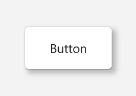

# Getting Started with WinUI Shadow

This section explains the steps required to add the [WinUI Shadow](https://www.syncfusion.com/winui-controls/shadow) control. This section covers only basic features needed to get started with Syncfusion `Shadow` control.

## Creating an application with WinUI Shadow

1. Create a [WinUI 3 desktop app for C# and .NET 5](https://docs.microsoft.com/en-us/windows/apps/winui/winui3/get-started-winui3-for-desktop).
2. Add reference to [Syncfusion.Core.WinUI](https://www.nuget.org/packages/Syncfusion.Core.WinUI) NuGet. 
3. Import the control namespace `Syncfusion.UI.Xaml.Core` in XAML or C# code.
4. Initialize the `SfShadow` control.




<Page
    x:Class="GettingStarted.MainPage"
    xmlns="http://schemas.microsoft.com/winfx/2006/xaml/presentation"
    xmlns:x="http://schemas.microsoft.com/winfx/2006/xaml"
    xmlns:local="using:GettingStarted"
    xmlns:d="http://schemas.microsoft.com/expression/blend/2008"
    xmlns:mc="http://schemas.openxmlformats.org/markup-compatibility/2006"
    xmlns:syncfusion="using:Syncfusion.UI.Xaml.Core"
    mc:Ignorable="d"
    Background="{ThemeResource ApplicationPageBackgroundThemeBrush}">
    <Grid>
       <syncfusion:SfShadow Name="buttonShadow"
                      Color="#40000000"
                      BlurRadius="8"
                      OffsetX="4"
                      OffsetY="4"
                      ShadowCornerRadius="5">
          <Button x:Name="buttonShadow" Height="50" width="100" Content="Button"         
              CornerRadius="5"/>
       </syncfusion:SfShadow>
    </Grid>
</Page>




using Syncfusion.UI.Xaml.Core;

namespace GettingStarted
{
    /// 

    /// An empty page that can be used on its own or navigated to within a Frame.
    /// 

    public sealed partial class MainPage : Page
    {
        public MainPage()
        {
           this.InitializeComponent();
           // Creating an instance of the Shadow control.
           SfShadow shadow = new SfShadow();

           //Setting Color, BlurRadius, OffsetX, OffsetY, ShadowCornerRadius of Shadow.
           shadow.Color = Color.FromArgb(64, 0, 0, 0);
           shadow.BlurRadius = 8;
           shadow.OffsetX = 4;
           shadow.OffsetY = 4;
           shadow.ShadowCornerRadius = 5;
        }
    }
}




## Adding Image for Shadow

If you want to add the image for `Shadow`, add the image source in the shadow control. 




<core:SfShadow Name="imageShadow"
               Color="#40000000"
 			   BlurRadius="8"
               OffsetX="4"
               OffsetY="4">
    <Image Height="200" Width="250" 
   Source="/Assets/Shadow/Ellipse_Shadow.png/>
</core:SfShadow>




using Syncfusion.UI.Xaml.Core;

namespace GettingStarted
{
    /// 

    /// An empty page that can be used on its own or navigated to within a Frame.
    /// 

    public sealed partial class MainPage : Page
    {
        public MainPage()
        {
           this.InitializeComponent();
           // Creating an instance of the Shadow control.
           SfShadow shadow = new SfShadow();

           //Setting Color, BlurRadius, OffsetX, OffsetY of Shadow.
           shadow.Color = Color.FromArgb(64, 0, 0, 0);
           shadow.BlurRadius = 8;
           shadow.OffsetX = 4;
           shadow.OffsetY = 4;
        }
    }
}




## Adding Shape for Shadow

If you want to add the shape for `Shadow`, add the shape as ellipse, rectangle or any other shape path(Ex: Star).




<core:SfShadow Name="shapeShadow"
               Color="#40000000"
               BlurRadius="8"
               OffsetX="4"
               OffsetY="4">
      <Path Name="star" Data="M44.5 4L54.0608 33.4114H85L59.9696 51.5886L69.5304 81L44.5 62.8228L19.4696 81L29.0304 51.5886L4 33.4114H34.9392L44.5 4Z" Fill="#FFD700"/>  
</core:SfShadow>




using Syncfusion.UI.Xaml.Core;

namespace GettingStarted
{
    /// 

    /// An empty page that can be used on its own or navigated to within a Frame.
    /// 

    public sealed partial class MainPage : Page
    {
        public MainPage()
        {
           this.InitializeComponent();
           // Creating an instance of the Shadow control.
           SfShadow shadow = new SfShadow();

           //Setting Color, BlurRadius, OffsetX, OffsetY of Shadow.
           shadow.Color = Color.FromArgb(64, 0, 0, 0);
           shadow.BlurRadius = 8;
           shadow.OffsetX = 4;
           shadow.OffsetY = 4;
        }
    }
}




