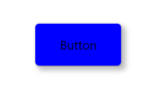

# WinUI Shadow Overview

The [WinUI Shadow control](https://www.syncfusion.com/winui-controls/shadow) is used to apply shadow effects to framework elements to give them an appearance of depth, allowing users to easily differentiate overlapping elements and enjoy a beautiful and appealing user interface.

## Key features

* `Color`: Applies the user's own color to the shadow.
* `BlurRadius`: Applies the blur radius for the shadow.
* `CornerRadius`: Applies the corner radius for the shadow.
* `Offset`: [OffsetX](https://help.syncfusion.com/cr/winui/Syncfusion.UI.Xaml.Core.SfShadow.html#Syncfusion_UI_Xaml_Core_SfShadow_OffsetX) and [OffsetY](https://help.syncfusion.com/cr/winui/Syncfusion.UI.Xaml.Core.SfShadow.html#Syncfusion_UI_Xaml_Core_SfShadow_OffsetY) properties, position the shadow relative to the position of the view.
