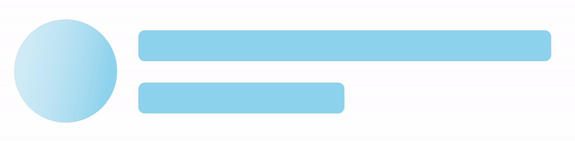

# Customization in WinUI Shimmer

This section explains how to customize the appearance of the WinUI Shimmer control using various properties. You will learn how to modify the following aspects of the shimmer effect:

## Fill

The [Fill](https://help.syncfusion.com/cr/winui/Syncfusion.UI.Xaml.Core.SfShimmer.html#Syncfusion_UI_Xaml_Core_SfShimmer_Fill) property allows you to specify the background color of the shimmer view.




<syncfusion:SfShimmer Fill="#89CFF0" />




SfShimmer Shimmer = new SfShimmer();
Shimmer.Fill = Color.FromRgba("#89CFF0");
this.Content = Shimmer;




## WaveColor

The [WaveColor](https://help.syncfusion.com/cr/winui/Syncfusion.UI.Xaml.Core.SfShimmer.html#Syncfusion_UI_Xaml_Core_SfShimmer_WaveColor) property enables you to define the color of the shimmer wave.




<syncfusion:SfShimmer WaveColor ="#89CFF0" />




SfShimmer Shimmer = new SfShimmer();
Shimmer.WaveColor = Color.FromRgba("#89CFF0");
this.Content = Shimmer;




## WaveDuration

The [WaveDuration](https://help.syncfusion.com/cr/winui/Syncfusion.UI.Xaml.Core.SfShimmer.html#Syncfusion_UI_Xaml_Core_SfShimmer_WaveDuration) property determines the duration of the wave animation in milliseconds.




<syncfusion:SfShimmer WaveDuration="3000" />




SfShimmer Shimmer = new SfShimmer();
Shimmer.WaveDuration =3000;
this.Content = Shimmer;




## WaveWidth

The [WaveWidth](https://help.syncfusion.com/cr/winui/Syncfusion.UI.Xaml.Core.SfShimmer.html#Syncfusion_UI_Xaml_Core_SfShimmer_WaveWidth) property specifies the width of the shimmer wave.




<syncfusion:SfShimmer WaveWidth="70" 
                      WaveColor="#89CFF0"/>




SfShimmer Shimmer = new SfShimmer();
Shimmer.WaveWidth = 70;
Shimmer.WaveColor = Color.FromRgba("#89CFF0");
this.Content = Shimmer;




## RepeatCount

The [RepeatCount](https://help.syncfusion.com/cr/winui/Syncfusion.UI.Xaml.Core.SfShimmer.html#Syncfusion_UI_Xaml_Core_SfShimmer_RepeatCount) property sets the number of times the built-in view should be repeated.




<syncfusion:SfShimmer RepeatCount ="3" />




SfShimmer Shimmer = new SfShimmer();
Shimmer.RepeatCount = 3;
this.Content = Shimmer;




