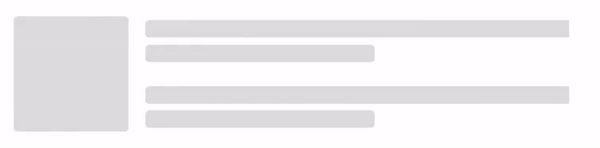

# Getting Started with WinUI Shimmer

This section explains the steps required to add the WinUI Shimmer control and covers only the basic features needed to get started with the Syncfusion Shimmer control.

## Creating an application with WinUI Shimmer control

1. Create a [WinUI 3 desktop app for C# and .NET 6](https://docs.microsoft.com/en-us/windows/apps/winui/winui3/get-started-winui3-for-desktop).
2. Add reference to [Syncfusion.Core.WinUI](https://www.nuget.org/packages/Syncfusion.Core.WinUI) NuGet. 
3. Import the control namespace `Syncfusion.UI.Xaml.Core` in XAML or C# code.
4. Initialize the [SfShimmer](https://help.syncfusion.com/cr/winui/Syncfusion.UI.Xaml.Core.SfShimmer.html) control.

## Initializing Shimmer control 

To initialize the Shimmer control, you can simply add the `SfShimmer` control in your XAML or C# code.




<Window
    x:Class="GettingStarted.MainWindow"
    xmlns="http://schemas.microsoft.com/winfx/2006/xaml/presentation"
    xmlns:x="http://schemas.microsoft.com/winfx/2006/xaml"
    xmlns:local="using:GettingStarted"
    xmlns:d="http://schemas.microsoft.com/expression/blend/2008"
    xmlns:mc="http://schemas.openxmlformats.org/markup-compatibility/2006" 
    xmlns:syncfusion="using:Syncfusion.UI.Xaml.Core"
    mc:Ignorable="d">
    <Grid>
        <syncfusion:SfShimmer />
    </Grid>
</Window>

 


// Creating an instance of the Shimmer control.
SfShimmer Shimmer = new SfShimmer();
           



## Loading shimmer content

Disabling the `IsActive` property of SfShimmer displays the content without any shimmer animation. Enabling the `IsActive` property, which defaults to true, activates the shimmer animation in the background. You can change the IsActive property to control how your content is presented.




<Syncfusion:SfShimmer x:Name="shimmer" Width="500" WaveDuration="3000">
    <Syncfusion:SfShimmer.Content>
        <StackPanel Orientation="Horizontal">
            <Image Source="Assets/Icon.png" Width="130" Height="130"/>
            <StackPanel Orientation="Vertical">
                <TextBlock Text="Syncfusion provides an ecosystem of compatible developer" FontWeight="SemiLight" FontSize="13"  Margin="-10,20,0,0"/>
                <TextBlock Text="control suites, embeddable BI platforms, and business software." FontWeight="SemiLight" FontSize="13" Margin="-10,0,0,0" />
                <TextBlock Text="We are proud to serve a wide variety of customers, from individual" FontWeight="SemiLight" FontSize="13" Margin="-10,20,0,0" />
                <TextBlock Text="developers to Fortune 100 companies." FontWeight="SemiLight" FontSize="13" Margin="-10,0,0,0" />
            </StackPanel>
        </StackPanel>
    </Syncfusion:SfShimmer.Content>
</Syncfusion:SfShimmer>

 


SfShimmer shimmer = new SfShimmer();
shimmer.Name = "shimmer";
shimmer.Width = 500;
shimmer.WaveDuration = 3000;

StackPanel stackPanel = new StackPanel();
stackPanel.Orientation = Orientation.Horizontal;

Image image = new Image();
image.Source = new BitmapImage(new Uri("Assets/Icon.png"));
image.Width = 130;
image.Height = 130;

StackPanel textStackPanel = new StackPanel();
textStackPanel.Orientation = Orientation.Vertical;

TextBlock textBlock1 = new TextBlock();
textBlock1.Text = "Syncfusion provides an ecosystem of compatible developer";
textBlock1.FontWeight = FontWeights.SemiLight;
textBlock1.FontSize = 13;
textBlock1.Margin = new Thickness(-10, 20, 0, 0);

TextBlock textBlock2 = new TextBlock();
textBlock2.Text = "control suites, embeddable BI platforms, and business software.";
textBlock2.FontWeight = FontWeights.SemiLight;
textBlock2.FontSize = 13;
textBlock2.Margin = new Thickness(-10, 0, 0, 0);

TextBlock textBlock3 = new TextBlock();
textBlock3.Text = "We are proud to serve a wide variety of customers, from individual";
textBlock3.FontWeight = FontWeights.SemiLight;
textBlock3.FontSize = 13;
textBlock3.Margin = new Thickness(-10, 20, 0, 0);

TextBlock textBlock4 = new TextBlock();
textBlock4.Text = "developers to Fortune 100 companies.";
textBlock4.FontWeight = FontWeights.SemiLight;
textBlock4.FontSize = 13;
textBlock4.Margin = new Thickness(-10, 0, 0, 0);

textStackPanel.Children.Add(textBlock1);
textStackPanel.Children.Add(textBlock2);
textStackPanel.Children.Add(textBlock3);
textStackPanel.Children.Add(textBlock4);

stackPanel.Children.Add(image);
stackPanel.Children.Add(textStackPanel);

shimmer.Content = stackPanel;

this.Content = shimmer;




