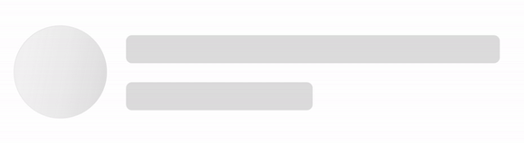

# Getting Started with WinUI Shimmer

This section explains how to get started with the WinUI Shimmer control in a WinUI application and covers the basic steps required to add and use the control.

## Creating an application with the WinUI Shimmer control

1. Create a [WinUI 3 desktop application in C#](https://learn.microsoft.com/en-us/windows/apps/winui/winui3/get-started-winui3-for-desktop).
2. Install the [Syncfusion.Core.WinUI](https://www.nuget.org/packages/Syncfusion.Core.WinUI) NuGet package.
3. Import the **Syncfusion.UI.Xaml.Core** namespace in XAML or C#.
4. Add and initialize the [SfShimmer](https://help.syncfusion.com/cr/winui/Syncfusion.UI.Xaml.Core.SfShimmer.html) control.

## Initializing Shimmer control

You can add the [SfShimmer](https://help.syncfusion.com/cr/winui/Syncfusion.UI.Xaml.Core.SfShimmer.html) control in XAML or create an instance of it programmatically in code-behind.




<Window
    x:Class="GettingStarted.MainWindow"
    xmlns="http://schemas.microsoft.com/winfx/2006/xaml/presentation"
    xmlns:x="http://schemas.microsoft.com/winfx/2006/xaml"
    xmlns:local="using:GettingStarted"
    xmlns:d="http://schemas.microsoft.com/expression/blend/2008"
    xmlns:mc="http://schemas.openxmlformats.org/markup-compatibility/2006"
    xmlns:syncfusion="using:Syncfusion.UI.Xaml.Core"
    mc:Ignorable="d">
    <Grid>
        <syncfusion:SfShimmer />
    </Grid>
</Window>

 


// Creating an instance of the Shimmer control.
using Microsoft.UI.Xaml;
using Syncfusion.UI.Xaml.Core;

namespace GettingStarted
{
    public sealed partial class MainWindow : Window
    {
        public MainWindow()
        {
            InitializeComponent();
            SfShimmer shimmer = new SfShimmer();
            this.Content = shimmer;
        }
    }
}




