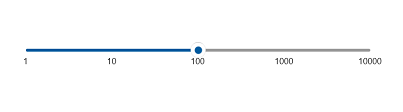

# Custom Range in WinUI Slider

The `SfSlider` allows you to define a custom scale range by extending the control based on your business logic.

## Overriding GenerateVisibleLabels, ValueToFactor and FactorToValue

Override the following methods of the [`SfSlider`](https://help.syncfusion.com/cr/winui/Syncfusion.UI.Xaml.Sliders.SfSlider.html?tabs=tabid-1) to define a custom scale range:

* [`GenerateVisibleLabels`](https://help.syncfusion.com/cr/winui/Syncfusion.UI.Xaml.Sliders.SliderBase.html?tabs=tabid-1#Syncfusion_UI_Xaml_Sliders_SliderBase_GenerateVisibleLabels) – Generates the visible labels for the custom scale range.
* [`ValueToFactor`](https://help.syncfusion.com/cr/winui/Syncfusion.UI.Xaml.Sliders.SliderBase.html#Syncfusion_UI_Xaml_Sliders_SliderBase_ValueToFactor_System_Double_) – Converts the custom value to a factor (between 0 and 1) used to position the thumb.
* [`FactorToValue`](https://help.syncfusion.com/cr/winui/Syncfusion.UI.Xaml.Sliders.SliderBase.html#Syncfusion_UI_Xaml_Sliders_SliderBase_FactorToValue_System_Double_) – Converts the factor (between 0 and 1) back to the custom value.





<local:LogarithmicSlider Minimum="1"
                         Maximum="10000"
                         Value="100"
                         ShowLabels="True" />





public class LogarithmicSlider : SfSlider
{
    int labelsCount;

    public override List<SliderLabelInfo> GenerateVisibleLabels()
    {
        List<SliderLabelInfo> labelInfos = new List<SliderLabelInfo>();
        int minimum = (int)LogBase(this.Minimum, 10);
        int maximum = (int)LogBase(this.Maximum, 10);
        for (int i = minimum; i <= maximum; i++)
        {
            double value = Math.Floor(Math.Pow(10, i)); // logBase  value is 10
            SliderLabelInfo label = new SliderLabelInfo()
            {
                Value = value,
                Text = value.ToString()
            };
            labelInfos.Add(label);
        }

        labelsCount = labelInfos.Count;
        return labelInfos;
    }

    private double LogBase(double value, int baseValue)
    {
        return Math.Log(value) / Math.Log(baseValue);
    }

    public override double ValueToFactor(double value)
    {
        return LogBase(value, 10) / (labelsCount - 1);
    }

    public override double FactorToValue(double factor)
    {
        return Math.Pow(10, factor * (labelsCount - 1));
    }
}





N> In XAML, declare the `local` namespace pointing to the assembly that contains the `LogarithmicSlider` class (for example, `xmlns:local="using:SliderGettingStartedDesktop"`).

