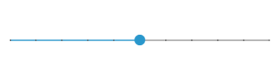
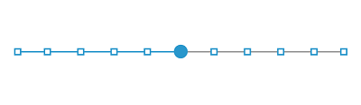
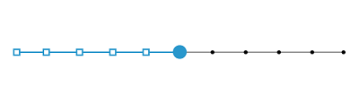

# Divisors in the Slider

This section explains about how to add the divisors in the slider.

## Show Divisors

The `ShowDivisors` property is used to render the divisors on the track. The default value of the `ShowDivisors` property is false. It is a shape which is used to represent the major interval points of the track.

For example, if `Minimum` is 0 and `Maximum` is 100 and `Interval` is 10, the slider will render the divisors at 0, 10, 20 and so on.





<slider:SfSlider Value="50"
                 Interval="10"
                 ShowDivisors="True" />





SfSlider sfSlider = new SfSlider();
sfSlider.Value = 50;
sfSlider.Interval = 10;
sfSlider.ShowDivisors = true;
this.Content = sfSlider;





## Divisors Height and Width

You can change the divisor height and width of the slider using `DivisorHeight` and `DivisorWidth` properties respectively.





<slider:SfSlider Value="50"
                 Interval="10"
                 ShowDivisors="True"
                 DivisorHeight="4"
                 DivisorWidth="4" />





SfSlider sfSlider = new SfSlider();
sfSlider.Value = 50;
sfSlider.Interval = 10;
sfSlider.ShowDivisors = true;
sfSlider.DivisorHeight = 4;
sfSlider.DivisorWidth = 4;
this.Content = sfSlider;





## Divisor Stroke Thickness and Stroke Color

You can change the divisor stroke thickness of the slider using the `DivisorStrokeThickness` property. The default value of `DivisorStrokeThickness` is 0. Also, you can change the divisor stroke of the slider using the `DivisorStroke` property.





<slider:SfSlider Value="50"
                 Interval="10"
                 ShowDivisors="True"
                 DivisorHeight="10"
                 DivisorWidth="10"
                 DivisorStrokeThickness="2"
                 DivisorStroke="Red" />





SfSlider sfSlider = new SfSlider();
sfSlider.Value = 50;
sfSlider.Interval = 10;
sfSlider.ShowDivisors = true;
sfSlider.DivisorHeight = 10;
sfSlider.DivisorWidth = 10;
sfSlider.DivisorStrokeThickness = 2;
sfSlider.DivisorStroke = new SolidColorBrush(Colors.Red);
this.Content = sfSlider;





## Divisor Fill

You can change the divisor fill of the slider using the `DivisorFill` property.





<slider:SfSlider Value="50"
                 Interval="10"
                 ShowDivisors="True"
                 DivisorHeight="10"
                 DivisorWidth="10"
                 DivisorFill="#ff7979" />





SfSlider sfSlider = new SfSlider();
sfSlider.Value = 50;
sfSlider.Interval = 10;
sfSlider.ShowDivisors = true;
sfSlider.DivisorHeight = 10;
sfSlider.DivisorWidth = 10;
sfSlider.DivisorFill = new SolidColorBrush(ColorHelper.FromArgb(255,255, 121, 121));
this.Content = sfSlider;





## Divisor Template

**Setting Template for Divisors**

The `DivisorTemplate` property allows you to define the data template for the divisor's like the following code example.





<DataTemplate x:Key="DivisorTemplate">
    <Rectangle Height="{Binding DivisorHeight}"
               Width="{Binding DivisorWidth}"
               Fill="{ThemeResource SystemAltHighColor}"
               Stroke="{ThemeResource SystemAccentColor}"
               StrokeThickness="{Binding DivisorStrokeThickness}" />
</DataTemplate>

<slider:SfSlider Value="50"
                 Interval="10"
                 ShowDivisors="True"
                 DivisorHeight="10"
                 DivisorWidth="10"
                 DivisorStrokeThickness="2"
                 DivisorTemplate="{StaticResource DivisorTemplate}">
</slider:SfSlider>





SfSlider sfSlider = new SfSlider();
sfSlider.ShowDivisors = true;
sfSlider.DivisorHeight = 10;
sfSlider.DivisorWidth = 10;
sfSlider.DivisorStrokeThickness = 2;
sfSlider.DivisorTemplate = this.Resources["DivisorTemplate"] as DataTemplate;
sfSlider.Value = 50;
this.Content = sfSlider;





N> Its DataContext is `SliderBase`.

**Setting Active Template for Divisors**

The `DivisorTemplate` property allows you to define the data template for the divisor's like the following code example.





<DataTemplate x:Key="ActiveDivisorTemplate">
    <Rectangle Height="6"
               Width="6"
               Fill="{ThemeResource SystemAltHighColor}"
               Stroke="{ThemeResource SystemAccentColor}"
               StrokeThickness="2" />
</DataTemplate>

<slider:SfSlider Value="50"
                 Interval="10"
                 ShowDivisors="True"
                 DivisorHeight="5"
                 DivisorWidth="5"
                 ActiveDivisorTemplate="{StaticResource ActiveDivisorTemplate}">
</slider:SfSlider>





SfSlider sfSlider = new SfSlider();
sfSlider.ShowDivisors = true;
sfSlider.DivisorHeight = 5;
sfSlider.DivisorWidth = 5;
sfSlider.ActiveDivisorTemplate = this.Resources["ActiveDivisorTemplate"] as DataTemplate;
sfSlider.Value = 50;
this.Content = sfSlider;





