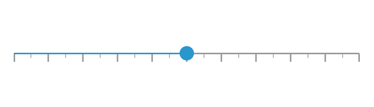
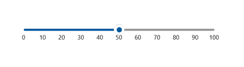

# Getting Started with WinUI Slider (SfSlider)

This section explains the steps required to add the slider control and its elements such as values, ticks, divisors, labels and tooltip. This section covers only basic features needed to know to get started with Syncfusion slider.

## Creating an application with WinUI Slider

1. Create a simple project using the instructions given in the [Getting Started with your first WinUI app](https://docs.microsoft.com/en-us/windows/apps/winui/winui3/get-started-winui3-for-uwp) documentation.

2. Add reference to [Syncfusion.Sliders.WinUI](https://www.nuget.org/packages/Syncfusion.Sliders.WinUI) NuGet.

3. Import the control namespace `Syncfusion.UI.Xaml.Sliders` in XAML or C# code.

4. Initialize the SfSlider control

The default value of the [`Minimum`](https://help.syncfusion.com/cr/winui/Syncfusion.UI.Xaml.Sliders.SliderBase.html#Syncfusion_UI_Xaml_Sliders_SliderBase_Minimum) and [`Maximum`](https://help.syncfusion.com/cr/winui/Syncfusion.UI.Xaml.Sliders.SliderBase.html#Syncfusion_UI_Xaml_Sliders_SliderBase_Maximum) properties of the `SfSlider` is 0 and 100 respectively. So, the [`Value`](https://help.syncfusion.com/cr/winui/Syncfusion.UI.Xaml.Sliders.SfSlider.html#Syncfusion_UI_Xaml_Sliders_SfSlider_Value) property must be given within the range.





<slider:SfSlider />





SfSlider sfSlider = new SfSlider();
this.Content = sfSlider;





## Set Value

You can show value in the slider by setting double value to the [`Value`](https://help.syncfusion.com/cr/winui/Syncfusion.UI.Xaml.Sliders.SfSlider.html#Syncfusion_UI_Xaml_Sliders_SfSlider_Value) properties.





<slider:SfSlider Value="50" />





SfSlider sfSlider = new SfSlider();
sfSlider.Value = 50;
this.Content = sfSlider;





## Enable Ticks

You can enable ticks in the slider using the [`ShowTicks`](https://help.syncfusion.com/cr/winui/Syncfusion.UI.Xaml.Sliders.SliderBase.html#Syncfusion_UI_Xaml_Sliders_SliderBase_ShowTicks) property.





<slider:SfSlider Value="50"
                 ShowTicks="True" />





SfSlider sfSlider = new SfSlider();
sfSlider.Value = 50;
sfSlider.ShowTicks = true;
this.Content = sfSlider;





## Enable Labels

You can enable ticks in the slider using the [`ShowLabels`](https://help.syncfusion.com/cr/winui/Syncfusion.UI.Xaml.Sliders.SliderBase.html#Syncfusion_UI_Xaml_Sliders_SliderBase_ShowLabels) property.





<slider:SfSlider Value="50"
                 ShowLabels="True" />





SfSlider sfSlider = new SfSlider();
sfSlider.Value = 50;
sfSlider.ShowLabels = true;
this.Content = sfSlider;





## Enable Divisors

You can enable divisors in the slider using the [`ShowDivisors`](https://help.syncfusion.com/cr/winui/Syncfusion.UI.Xaml.Sliders.SliderBase.html#Syncfusion_UI_Xaml_Sliders_SliderBase_ShowDivisors) property.





<slider:SfSlider Value="50"
                 ShowDivisors="True"
                 DivisorHeight="4"
                 DivisorWidth="4"
                 ActiveTrackHeight="4"
                 InactiveTrackHeight="4" />





SfSlider sfSlider = new SfSlider();
sfSlider.Value = 50;
sfSlider.ShowDivisors = true;
sfSlider.DivisorHeight = 4;
sfSlider.DivisorWidth = 4;
sfSlider.ActiveTrackHeight = 4;
sfSlider.InactiveTrackHeight = 4;
this.Content = sfSlider;





N> Download demo application from [GitHub]()