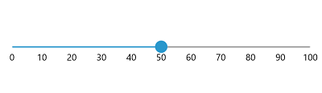

# Getting Started with WinUI Slider

This section explains the steps required to add the [WinUI Slider](https://www.syncfusion.com/winui-controls/slider) control and its elements such as values, ticks, divisors, labels, and tooltip. This section covers only basic features needed to get started with Syncfusion Slider.

## Creating an application with WinUI Slider

1. Create a [WinUI 3 desktop app for C# and .NET 5](https://docs.microsoft.com/en-us/windows/apps/winui/winui3/get-started-winui3-for-desktop) or [WinUI 3 app in UWP for C#](https://docs.microsoft.com/en-us/windows/apps/winui/winui3/get-started-winui3-for-uwp).

2. Add reference to [Syncfusion.Sliders.WinUI](https://www.nuget.org/packages/Syncfusion.Sliders.WinUI) NuGet.

3. Import the control namespace `Syncfusion.UI.Xaml.Sliders` in XAML or C# code.

4. Initialize the [`SfSlider`](https://help.syncfusion.com/cr/winui/Syncfusion.UI.Xaml.Sliders.SfSlider.html?tabs=tabid-1) control

The default value of the [`Minimum`](https://help.syncfusion.com/cr/winui/Syncfusion.UI.Xaml.Sliders.SliderBase.html#Syncfusion_UI_Xaml_Sliders_SliderBase_Minimum) and [`Maximum`](https://help.syncfusion.com/cr/winui/Syncfusion.UI.Xaml.Sliders.SliderBase.html#Syncfusion_UI_Xaml_Sliders_SliderBase_Maximum) properties of the [`SfSlider`](https://help.syncfusion.com/cr/winui/Syncfusion.UI.Xaml.Sliders.SfSlider.html?tabs=tabid-1) is 0 and 100 respectively. So, the [`Value`](https://help.syncfusion.com/cr/winui/Syncfusion.UI.Xaml.Sliders.SfSlider.html#Syncfusion_UI_Xaml_Sliders_SfSlider_Value) property must be given within the range.





<slider:SfSlider />





SfSlider sfSlider = new SfSlider();
this.Content = sfSlider;





## Set Value

You can show value in the slider by setting double value to the [`Value`](https://help.syncfusion.com/cr/winui/Syncfusion.UI.Xaml.Sliders.SfSlider.html#Syncfusion_UI_Xaml_Sliders_SfSlider_Value) properties.





<slider:SfSlider Value="50" />





SfSlider sfSlider = new SfSlider();
sfSlider.Value = 50;
this.Content = sfSlider;





## Enable Ticks

You can enable ticks in the slider using the [`ShowTicks`](https://help.syncfusion.com/cr/winui/Syncfusion.UI.Xaml.Sliders.SliderBase.html#Syncfusion_UI_Xaml_Sliders_SliderBase_ShowTicks) property.





<slider:SfSlider Value="50"
                 ShowTicks="True" />





SfSlider sfSlider = new SfSlider();
sfSlider.Value = 50;
sfSlider.ShowTicks = true;
this.Content = sfSlider;





## Enable Labels

You can enable labels in the slider using the [`ShowLabels`](https://help.syncfusion.com/cr/winui/Syncfusion.UI.Xaml.Sliders.SliderBase.html#Syncfusion_UI_Xaml_Sliders_SliderBase_ShowLabels) property.





<slider:SfSlider Value="50"
                 ShowLabels="True" />





SfSlider sfSlider = new SfSlider();
sfSlider.Value = 50;
sfSlider.ShowLabels = true;
this.Content = sfSlider;





## Enable Divisors

You can enable divisors in the slider using the [`ShowDivisors`](https://help.syncfusion.com/cr/winui/Syncfusion.UI.Xaml.Sliders.SliderBase.html#Syncfusion_UI_Xaml_Sliders_SliderBase_ShowDivisors) property.





<slider:SfSlider Value="50"
                 ShowDivisors="True"
                 DivisorHeight="4"
                 DivisorWidth="4"
                 ActiveTrackHeight="4"
                 InactiveTrackHeight="4" />





SfSlider sfSlider = new SfSlider();
sfSlider.Value = 50;
sfSlider.ShowDivisors = true;
sfSlider.DivisorHeight = 4;
sfSlider.DivisorWidth = 4;
sfSlider.ActiveTrackHeight = 4;
sfSlider.InactiveTrackHeight = 4;
this.Content = sfSlider;





N> Download demo application from the [GitHub](https://github.com/SyncfusionExamples/WinUI_Sliders_Getting_Started)