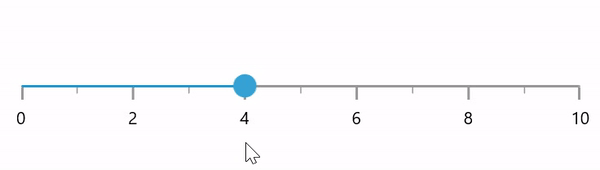

## Interval

Range slider elements like labels, ticks and divisors are rendered based on the `Interval`, `Minimum` and `Maximum` properties. The default value of `Interval` is 0.

For example, if `Minimum` is 0 and `Maximum` is 10 and `Interval` is 2, the slider will render the labels, major ticks, and divisors at 0, 2, 4 and so on.





<slider:SfRangeSlider Minimum="0"
                      Maximum="10"
                      Interval="2"
                      RangeStart="2"
                      RangeEnd="8"
                      ShowTicks="True"
                      ShowLabels="True" />





SfRangeSlider sfRangeSlider = new SfRangeSlider();
sfRangeSlider.Minimum = 0;
sfRangeSlider.Maximum = 10;
sfRangeSlider.Interval = 2;
sfRangeSlider.RangeStart = 2;
sfRangeSlider.RangeEnd = 8;
sfRangeSlider.ShowTicks = true;
sfRangeSlider.ShowLabels = true;
this.Content = sfRangeSlider;





N> Slider having auto interval support. So, the auto interval calculated by default.

N>
* Refer the `ShowDivisors` to know about the rendering of divisors at given interval.
* Refer the `ShowTicks` to know about the rendering of major ticks at given interval.
* Refer the `ShowLabels` to know about the rendering of labels at given interval.

## Discrete selection for values

You can move the thumb in discrete manner for numeric values using the `StepFrequency` property in the range slider.





<slider:SfRangeSlider Minimum="0"
                      Maximum="10"
                      Interval="2"
                      RangeStart="2"
                      RangeEnd="8"
                      StepFrequency="2"
                      ShowTicks="True"
                      ShowLabels="True" />





SfSlider sfRangeSlider = new SfRangeSlider();
sfRangeSlider.Minimum = 0;
sfRangeSlider.Maximum = 10;
sfRangeSlider.Interval = 2;
sfRangeSlider.RangeStart = 2;
sfRangeSlider.RangeEnd = 8;
sfRangeSlider.StepFrequency = 2;
sfRangeSlider.ShowTicks = true;
sfRangeSlider.ShowLabels = true;
this.Content = sfRangeSlider;





