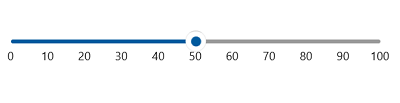
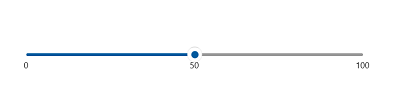
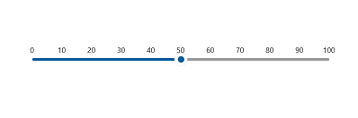
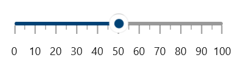
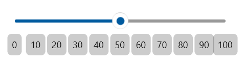
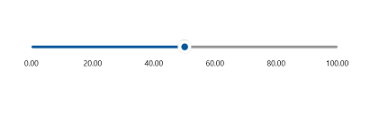

# Labels in the Slider

This section explains about how to add the labels in the slider.

## Show Labels

The `ShowLabels` property is used to render the labels on `Interval`. The default value of `ShowLabels` property is false.





<slider:SfSlider ShowLabels="True"
                 Value="50" />





SfSlider sfSlider = new SfSlider();
sfSlider.ShowLabels = true;
sfSlider.Value = 50;
this.Content = sfSlider;





## Maximum number of labels per 100 logical pixels

By default, a maximum of three labels are displayed for each 100 logical pixels in slider. The maximum number of labels that should present within 100 logical pixels length can be customized using the `MaximumLabelsCount` property of the slider. This property is applicable only for automatic range calculation and will not work if you set value for `Interval` property of an slider.





<slider:SfSlider Value="50"
                 MaximumLabelsCount="1"
                 ShowLabels="True" />





SfSlider sfSlider = new SfSlider();
sfSlider.MaximumLabelsCount = 1;
sfSlider.Value = 50;
sfSlider.ShowLabels = true;
this.Content = sfSlider;





## Label Placement

The `labelPlacement` property is used to place the labels either before or after the track. The default value of the `LabelPlacement` property is `Placement.After`.





<slider:SfSlider ShowLabels="True"
                 Value="50"
                 LabelPlacement="Before" />





SfSlider sfSlider = new SfSlider();
sfSlider.ShowLabels = true;
sfSlider.Value = 50;
sfSlider.LabelOffset = Placement.Before;
this.Content = sfSlider;





## Label Offset

You can adjust the space between ticks and labels of the slider using the `LabelOffset` property. The default value of `LabelOffset` property is 5.





<slider:SfSlider ShowTicks="True"
                 ShowLabels="True"
                 Value="50"
                 LabelOffset="10" />





SfSlider sfSlider = new SfSlider();
sfSlider.ShowTicks = true;
sfSlider.ShowLabels = true;
sfSlider.LabelOffset = 10;
sfSlider.Value = 50;
this.Content = sfSlider;





## Label Template

**Setting Template for Labels**

The `LabelTemplate` property allows you to define the data template for the label’s like the following code example.





<DataTemplate x:Key="TrackLabelTemplate">
    <Grid CornerRadius="5"
          Background="{ThemeResource SystemBaseLowColor}">
        <TextBlock Text="{Binding Text}"
                   Margin="6" />
    </Grid>
</DataTemplate>

<slider:SfSlider ShowLabels="True"
                 LabelOffset="15"
                 LabelTemplate="{StaticResource TrackLabelTemplate}"
                 Value="50" />





SfSlider sfSlider = new SfSlider();
sfSlider.ShowLabels = true;
sfSlider.LabelOffset = 15;
sfSlider.LabelTemplate = this.Resources["TrackLabelTemplate"] as DataTemplate;
sfSlider.Value = 50;
this.Content = sfSlider;





N> Its DataContext is `SliderLabelInfo`.

**Setting Active Template for Labels**

The `ActiveLabelTemplate` property allows you to define the data template for the active label’s like the following code example.





<DataTemplate x:Key="ActiveTrackLabelTemplate">
    <TextBlock Text="{Binding Text}"
               Foreground="{ThemeResource SystemAccentColor}" />

</DataTemplate>

<slider:SfSlider ShowLabels="True"
                 LabelOffset="10"
                 ActiveLabelTemplate="{StaticResource ActiveTrackLabelTemplate}"
                 Value="50" />





SfSlider sfSlider = new SfSlider();
sfSlider.ShowLabels = true;
sfSlider.LabelOffset = 10;
sfSlider.ActiveLabelTemplate = this.Resources["ActiveTrackLabelTemplate"] as DataTemplate;
sfSlider.Value = 50;
this.Content = sfSlider;





N> Its DataContext is `SliderLabelInfo`.

**Formating Track Labels using Label Template**

By adding `Converters` in `LabelTemplate` you can customize the format the labels or display the custom text.





<DataTemplate x:Key="LabelTemplate">
    <TextBlock Text="{Binding Value,
                              Converter={StaticResource FormatStringConverter},
                              ConverterParameter='N2'}" />
</DataTemplate>

<slider:SfSlider ShowLabels="True"
                 Interval="20"
                 LabelOffset="15"
                 LabelTemplate="{StaticResource LabelTemplate}"
                 Value="50" />





SfSlider sfSlider = new SfSlider();
sfSlider.ShowLabels = true;
sfSlider.Interval = 20;
sfSlider.LabelOffset = 15;
sfSlider.LabelTemplate = this.Resources["TLabelTemplate"] as DataTemplate;
sfSlider.Value = 50;
this.Content = sfSlider;





N> Its DataContext is `SliderLabelInfo`.