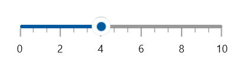
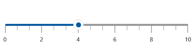
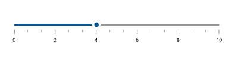
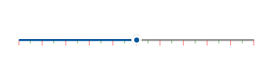
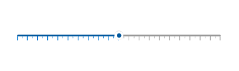

# Ticks features in WinUI Slider

This section helps to learn about how to add major and minor ticks in the slider.

## Show major ticks

You can enable the major ticks on the track. It is a shape which is used to represent the major interval points of the track. The default value of `ShowTicks` property is false.

For example, if `Minimum` is 0 and `Maximum` is 10 and `Interval` is 2, the slider will render the major ticks at 0, 2, 4 and so on.





<slider:SfSlider Minimum="0"
                 Maximum="10"
                 Interval="2"
                 Value="4"
                 MinorTicksPerInterval="0"
                 ShowTicks="True"
                 ShowLabels="True" />





SfSlider sfSlider = new SfSlider();
sfSlider.Minimum = 0;
sfSlider.Maximum = 10;
sfSlider.Interval = 2;
sfSlider.MinorTicksPerInterval = 0;
sfSlider.Value = 4;
sfSlider.ShowTicks = true;
sfSlider.ShowLabels = true;
this.Content = sfSlider;





## Show minor ticks

It is used to represent the number of smaller ticks between two major ticks. For example, if min is 0 and max is 10 and interval is 2, the slider will render the major ticks at 0, 2, 4 and so on. If `MinorTicksPerInterval` is 1, then smaller ticks will be rendered on 1, 3 and so on. The default value of `MinorTicksPerInterval` property is 1.





<slider:SfSlider Minimum="0"
                 Maximum="10"
                 Interval="2"
                 Value="4"
                 MinorTicksPerInterval="2"
                 ShowTicks="True"
                 ShowLabels="True" />





SfSlider sfSlider = new SfSlider();
sfSlider.Minimum = 0;
sfSlider.Maximum = 10;
sfSlider.Interval = 2;
sfSlider.MinorTicksPerInterval = 2;
sfSlider.Value = 4;
sfSlider.ShowTicks = true;
sfSlider.ShowLabels = true;
this.Content = sfSlider;





## Tick length

You can change the major and minor ticks length of the slider using the MajorTickLength and MinorTickLength properties respectively. The default value of MajorTickLength and MinorTickLength properties are 10 and 5 respectively.





<slider:SfSlider Minimum="0"
                 Maximum="10"
                 Interval="2"
                 Value="4"
                 MinorTicksPerInterval="2"
                 MajorTickLength="15"
                 MinorTickLength="10"
                 ShowTicks="True"
                 ShowLabels="True" />





SfSlider sfSlider = new SfSlider();
sfSlider.Minimum = 0;
sfSlider.Maximum = 10;
sfSlider.Interval = 2;
sfSlider.Value = 4;
sfSlider.MinorTicksPerInterval = 2;
sfSlider.MajorTickLength = 15;
sfSlider.MinorTickLength = 10;
sfSlider.ShowTicks = true;
sfSlider.ShowLabels = true;
this.Content = sfSlider;





## Tick placement

The `TickPlacement` property is used to place the ticks either before or after the track. The default value of the `TickPlacement` property is `Placement.After`.





<slider:SfSlider ShowTicks="True"
                 TickPlacement="Before"
                 Value="50" />





SfSlider sfSlider = new SfSlider();
sfSlider.ShowTicks = true;
sfSlider.TickPlacement = Placement.Before;
sfSlider.Value = 50;
this.Content = sfSlider;





## Ticks offset

You can adjust the space between track and ticks of the slider using the `TickOffset` property. The default value of the `TickOffset` property is 0.





<slider:SfSlider Minimum="0"
                 Maximum="10"
                 Interval="2"
                 Value="4"
                 MinorTicksPerInterval="2"
                 TickOffset="10"
                 ShowTicks="True"
                 ShowLabels="True" />





SfSlider sfSlider = new SfSlider();
sfSlider.Minimum = 0;
sfSlider.Maximum = 10;
sfSlider.Interval = 2;
sfSlider.Value = 4;
sfSlider.MinorTicksPerInterval = 2;
sfSlider.TickOffset = 10;
sfSlider.ShowTicks = true;
sfSlider.ShowLabels = true;
this.Content = sfSlider;





## Tick style

**Setting style for major and minor ticks**

The `MajorTickStyle` and `MinorTickStyle` properties allows you to define the style for the major and minor tick’s respectively as shown in the following code example.





<slider:SfSlider ShowTicks="True"
                 Interval="10"
                 Value="50"
                 MajorTickStyle="{StaticResource MajorTickStyle}"
                 MinorTickStyle="{StaticResource MinorTickStyle}" />





SfSlider sfSlider = new SfSlider();
sfSlider.ShowTicks = true;
sfSlider.Interval = 10;
sfSlider.Value = 50;
sfSlider.MajorTickStyle = this.Resources["MajorTickStyle"] as Style;
sfSlider.MinorTickStyle = this.Resources["MinorTickStyle"] as Style;
this.Content = sfSlider;





**Setting active style for major and minor ticks**

The `ActiveMajorTickStyle` and `ActiveMinorTickStyle` properties allows you to define the active style for the major and minor tick’s respectively as shown in the following code example.





<slider:SfSlider ShowTicks="True"
                 Interval="5"
                 Value="50"
                 ActiveMajorTickStyle="{StaticResource ActiveMajorTickStyle}"
                 ActiveMinorTickStyle="{StaticResource ActiveMinorTickStyle}" />





SfSlider sfSlider = new SfSlider();
sfSlider.ShowTicks = true;
sfSlider.Interval = 5;
sfSlider.Value = 50;
sfSlider.ActiveMajorTickStyle = this.Resources["ActiveMajorTickStyle"] as Style;
sfSlider.ActiveMinorTickStyle = this.Resources["ActiveMinorTickStyle"] as Style;
this.Content = sfSlider;





