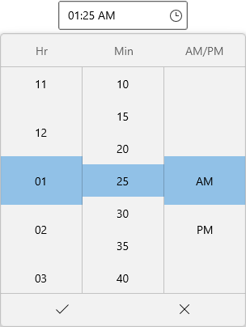
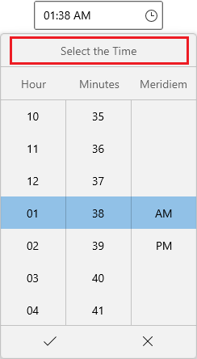
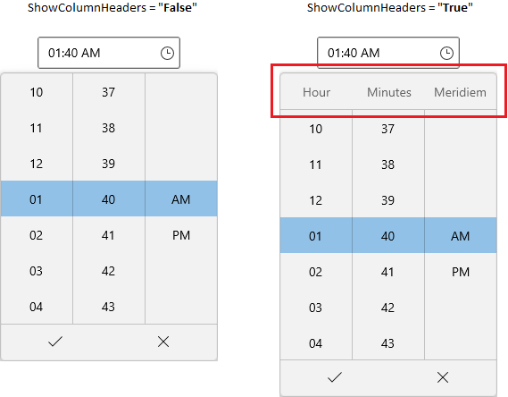
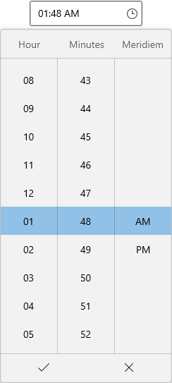

# Dropdown Time Spinner in WinUI Time Picker

This section describes how to select a time from drop down time spinner and its customization options in [Time Picker](https://help.syncfusion.com/cr/winui/Syncfusion.UI.Xaml.Editors.SfTimePicker.html) control.

## Change dropdown alignment

You can change the alignment of the dropdown time spinner as full, center, left, right, top or bottom edge of the `Time Picker` by using the [DropDownPlacement](https://help.syncfusion.com/cr/winui/Syncfusion.UI.Xaml.Editors.SfDropDownBase.html#Syncfusion_UI_Xaml_Editors_SfDropDownBase_DropDownPlacement) property. The default value of `DropDownPlacement` property is `Auto`.

N> If you change the dropdown alignment by using `DropDownPlacement` property and there is not sufficient space, then `Time Picker` smartly shifts the spinner alignment.




<editors:SfTimePicker DropDownPlacement="BottomEdgeAlignedLeft" 
                      x:Name="sfTimePicker"/>




SfTimePicker sfTimePicker = new SfTimePicker();
sfTimePicker.DropDownPlacement = FlyoutPlacementMode.BottomEdgeAlignedLeft;




N> Download demo application from [GitHub](https://github.com/SyncfusionExamples/syncfusion-winui-tools-timepicker-examples/blob/main/Samples/ViewAndItemCustomization)

## Hide the dropdown button

You can hide the dropdown button in `Time Picker` by setting the [ShowDropDownButton](https://help.syncfusion.com/cr/winui/Syncfusion.UI.Xaml.Editors.SfDropDownBase.html#Syncfusion_UI_Xaml_Editors_SfDropDownBase_ShowDropDownButton) property value as `false`. The default value of `ShowDropDownButton` property is `true`.




<editors:SfTimePicker ShowDropDownButton="False" 
                      x:Name="sfTimePicker"/>




SfTimePicker sfTimePicker = new SfTimePicker();
sfTimePicker.ShowDropDownButton = false;




N> Download demo application from [GitHub](https://github.com/SyncfusionExamples/syncfusion-winui-tools-timepicker-examples/blob/main/Samples/ViewAndItemCustomization)

## Custom UI for specific cell in dropdown spinner

You can change the UI of specific hour, minutes or seconds cells in dropdown spinner by using the `ItemTemplateSelector` property. The `DataContext` of `ItemTemplateSelector` is `SfTimePicker`. 




public class TimeItemTemplateSelector : DataTemplateSelector
{
    public DataTemplate DefaultTemplate { get; set; }
    public DataTemplate AlarmTemplate { get; set; }
    public DataTemplate SleepTemplate { get; set; }
    public DataTemplate GroupMeetingTemplate { get; set; }

    protected override DataTemplate SelectTemplateCore(object item, DependencyObject container)
    {
        DateTimeFieldItemInfo dateTimeField = item as DateTimeFieldItemInfo;
        if (dateTimeField.Field == DateTimeField.Hour12)
        {
            switch (dateTimeField.DateTime.Value.Hour)
            {
                case 2:
                    return SleepTemplate as DataTemplate;
                case 5:
                    return AlarmTemplate as DataTemplate;
                case 10:
                    return GroupMeetingTemplate as DataTemplate;
                case 14:
                    return GroupMeetingTemplate as DataTemplate;
                case 17:
                    return AlarmTemplate as DataTemplate;
                case 22:
                    return SleepTemplate as DataTemplate;
            }
        }

        return base.SelectTemplateCore(item, container);
    }
}







<Page.Resources>
        <x:String x:Key="alarm">M9.6840663,27.625012C9.9398422,27.624013 10.196118,27.720757 10.392638,27.915246 10.785677,28.304223 10.787677,28.938186 10.398638,29.330163L8.0474019,31.704021C7.8523824,31.90101 7.5953565,32.000003 7.3373306,32.000003 7.082305,32.000003 6.8282794,31.90301 6.6332597,31.710021 6.2402203,31.321044 6.2382201,30.687081 6.6272594,30.294105L8.9784956,27.921247C9.1730151,27.724759,9.4282908,27.626014,9.6840663,27.625012z M22.175801,27.625012C22.43158,27.626014,22.68686,27.724759,22.881381,27.921247L25.232649,30.294105C25.621695,30.687081 25.619694,31.321044 25.226649,31.710021 25.031626,31.90301 24.777598,32.000003 24.522568,32.000003 24.264538,32.000003 24.00751,31.90101 23.812487,31.704021L21.461218,29.330163C21.072173,28.938186 21.074173,28.304223 21.467219,27.915246 21.663743,27.720757 21.920022,27.624013 22.175801,27.625012z M15.956983,9.9329987C16.509982,9.9329987,16.95698,10.380999,16.95698,10.934L16.95698,15.762003 20.273972,15.762003C20.826971,15.762003 21.273968,16.210004 21.273968,16.763004 21.273968,17.316005 20.826971,17.764005 20.273972,17.764005L14.956986,17.764005 14.956986,10.934C14.956986,10.380999,15.403985,9.9329987,15.956983,9.9329987z M15.99992,7.9759977C11.035938,7.9759974 6.998956,12.018003 6.9989562,16.984996 6.998956,21.952996 11.035938,25.994987 15.99992,25.994987 20.963903,25.994987 25.000885,21.952996 25.000885,16.984996 25.000885,12.018003 20.963903,7.9759974 15.99992,7.9759977z M15.99992,5.9739994C22.065892,5.9739995 27.001921,10.914 27.001921,16.984996 27.001921,23.056998 22.065892,27.996999 15.99992,27.996999 9.9339495,27.996999 4.9979209,23.056998 4.9979208,16.984996 4.9979209,10.914 9.9339495,5.9739995 15.99992,5.9739994z M24.816739,1.9833174C24.452729,1.983192,24.088719,2.1171966,23.823212,2.3857057L22.889187,3.3287373 28.664343,9.1609316 29.586369,8.2299008C30.141383,7.6698818,30.141383,6.7588514,29.586369,6.1988328L25.810265,2.3857057C25.544758,2.1176965,25.180748,1.9834421,24.816739,1.9833174z M7.1846187,1.9698024C6.8096122,1.9698024,6.4556063,2.1178052,6.1906016,2.3858111L2.4145396,6.19889C1.8595307,6.7599016,1.8595307,7.6709205,2.4145396,8.2309322L3.336555,9.1609516 9.11165,3.3288302 8.1776347,2.3858111C7.9126303,2.1178052,7.5586245,1.9698024,7.1846187,1.9698024z M7.1837437,0.0010113716C8.0686328,0.0007610321,8.9536476,0.32576799,9.5976582,0.97678137L11.145684,2.5378139C11.576691,2.974823,11.576691,3.6838377,11.145684,4.1198471L3.8385633,11.498 3.3355551,11.534001 2.9185479,11.534001 2.539542,11.201994 0.99451637,9.6399612C-0.3315053,8.3029337,-0.3315053,6.1268884,0.99451637,4.7898605L4.7705787,0.97678137C5.4140892,0.32676792,6.2988538,0.0012612343,7.1837437,0.0010113716z M24.816739,4.7683716E-07C25.701764,0.00037574768,26.586789,0.32613659,27.230305,0.97665834L31.006407,4.7887857C32.332442,6.1268303,32.332442,8.3029029,31.006407,9.6399479L29.167357,11.49801 28.665343,11.534011 28.254332,11.534011 27.876322,11.209 20.856131,4.1197636C20.424119,3.6827488,20.424119,2.9747252,20.855132,2.5387106L22.403174,0.97565842C23.046692,0.32463646,23.931715,-0.00037431717,24.816739,4.7683716E-07z</x:String>
        <x:String x:Key="groupMeeting">M16.485048,11.615066C13.010075,11.615066,10.182073,14.44307,10.182073,17.918048L10.182073,20.706074 22.788024,20.706074 22.788024,17.918048C22.788024,14.44307,19.960083,11.615066,16.485048,11.615066z M16.485048,9.676039C21.030029,9.6760393,24.727049,13.374039,24.727049,17.918048L24.727049,22.64504 8.2430484,22.64504 8.2430484,17.918048C8.2430484,13.374039,11.941045,9.6760393,16.485048,9.676039z M26.168022,8.4040185C29.660028,8.4040183,32.001034,10.742021,32.001034,14.222025L32.001034,20.040032 25.631395,20.040032 25.631395,18.101029 30.062029,18.101029 30.062029,14.222025C30.062029,11.829022 28.572027,10.343021 26.175022,10.343021 24.996019,10.343021 23.857018,10.818021 23.042016,11.646022L21.659014,10.28602C22.837015,9.0890191,24.480019,8.4040183,26.168022,8.4040185z M6.3570112,8.404018C8.1380143,8.4040183,9.9490175,9.1250192,11.09202,10.286021L9.7100171,11.646022C8.9300157,10.854021 7.6180133,10.343021 6.3660108,10.343021 4.1620069,10.343021 1.9400029,11.675022 1.9400029,14.222025L1.9400029,18.101029 7.3396385,18.101029 7.3396385,20.040032 0,20.040032 0,14.222025C0,10.905021,2.7330046,8.4040183,6.3570112,8.404018z M26.181997,2.8080306C25.209997,2.8080306 24.420998,3.5980282 24.420998,4.5690246 24.420998,5.5400214 25.209997,6.330019 26.181997,6.330019 27.152998,6.330019 27.941998,5.5400214 27.941998,4.5690246 27.941998,3.5980282 27.152998,2.8080306 26.181997,2.8080306z M6.3500191,2.8080306C5.379019,2.8080306 4.590019,3.5980282 4.5900192,4.5690246 4.590019,5.5400214 5.379019,6.330019 6.3500191,6.330019 7.3220187,6.330019 8.1110186,5.5400214 8.1110184,4.5690246 8.1110186,3.5980282 7.3220187,2.8080306 6.3500191,2.8080306z M16.445042,1.9389987C14.997042,1.9389987 13.819043,3.1169982 13.819043,4.5649972 13.819043,6.0129964 14.997042,7.1909959 16.445042,7.1909957 17.893041,7.1909959 19.07104,6.0129964 19.07104,4.5649972 19.07104,3.1169982 17.893041,1.9389987 16.445042,1.9389987z M26.181997,0.86903667C28.221998,0.86903667 29.881998,2.5290313 29.881998,4.5690246 29.881998,6.6090181 28.221998,8.2690126 26.181997,8.2690126 24.140998,8.2690126 22.480998,6.6090181 22.480998,4.5690246 22.480998,2.5290313 24.140998,0.86903667 26.181997,0.86903667z M6.3500191,0.86903667C8.3910186,0.86903667 10.051018,2.5290313 10.051018,4.5690246 10.051018,6.6090181 8.3910186,8.2690126 6.3500191,8.2690126 4.310019,8.2690126 2.6500192,6.6090181 2.6500192,4.5690246 2.6500192,2.5290313 4.310019,0.86903667 6.3500191,0.86903667z M16.445042,0C18.96204,0 21.010039,2.0479984 21.010039,4.5649972 21.010039,7.081996 18.96204,9.1299948 16.445042,9.1299946 13.928043,9.1299948 11.880044,7.081996 11.880044,4.5649972 11.880044,2.0479984 13.928043,0 16.445042,0z</x:String>
        <x:String x:Key="sleep">M2,20.001007L2,22.999999 30,22.999999 30,20.001007z M17,14.001002C15.897,14.001002,15,14.898003,15,16.001002L15,18.001002 30,18.001002 30,16.001002C30,14.898003,29.103001,14.001002,28,14.001002z M6.4579964,14.001002C5.6309962,14.001002 4.9579964,14.674003 4.9579966,15.501002 4.9579964,16.328003 5.6309962,17.001003 6.4579964,17.001002 7.2849965,17.001003 7.9579964,16.328003 7.9579964,15.501002 7.9579964,14.674003 7.2849965,14.001002 6.4579964,14.001002z M0,0L2,0 2,18.001007 4.0117812,18.001007 3.9842463,17.974753C3.3504963,17.341003 2.9579962,16.466003 2.957996,15.501002 2.9579962,13.571002 4.5279963,12.001002 6.4579964,12.001002 8.3879962,12.001002 9.9579964,13.571002 9.9579964,15.501002 9.9579964,16.466003 9.5654964,17.341003 8.9317465,17.974753L8.9042115,18.001007 13,18.001007 13,16.001002C13,13.795002,14.794,12.001002,17,12.001002L28,12.001002C30.205999,12.001002,32,13.795002,32,16.001002L32,18.001007 32,20.001002 32,32.001007 30,32.001007 30,24.999999 2,24.999999 2,31.999999 0,31.999999z</x:String>
        
        <DataTemplate x:Key="defaultTemplate">
            <TextBlock Text="{Binding DisplayText}" />
        </DataTemplate>
        <DataTemplate x:Key="alarmTemplate">
            <Grid>
                <TextBlock
                    HorizontalAlignment="Center"
                    VerticalAlignment="Center"
                    Text="{Binding DisplayText}" />
                <Path
                    Width="18"
                    Height="18"
                    Margin="3"
                    HorizontalAlignment="Right"
                    VerticalAlignment="Top"
                    Data="{StaticResource alarm}"
                    Fill="{ThemeResource SystemBaseHighColor}"
                    Stretch="Uniform" />
            </Grid>
        </DataTemplate>
        <DataTemplate x:Key="groupMeetingTemplate">
            <Grid>
                <TextBlock
                    HorizontalAlignment="Center"
                    VerticalAlignment="Center"
                    Text="{Binding DisplayText}" />
                <Path
                    Width="18"
                    Height="18"
                    Margin="3"
                    HorizontalAlignment="Right"
                    VerticalAlignment="Top"
                    Data="{StaticResource groupMeeting}"
                    Fill="{ThemeResource SystemBaseHighColor}"
                    Stretch="Uniform" />
            </Grid>
        </DataTemplate>
        <DataTemplate x:Key="sleepTemplate">
            <Grid>
                <TextBlock
                    HorizontalAlignment="Center"
                    VerticalAlignment="Center"
                    Text="{Binding DisplayText}" />
                <Path
                    Width="18"
                    Height="18"
                    Margin="3"
                    HorizontalAlignment="Right"
                    VerticalAlignment="Top"
                    Data="{StaticResource sleep}"
                    Fill="{ThemeResource SystemBaseHighColor}"
                    Stretch="Uniform" />
            </Grid>
        </DataTemplate>

        <local:TimeItemTemplateSelector
            x:Key="selector"
            AlarmTemplate="{StaticResource alarmTemplate}"
            DefaultTemplate="{StaticResource defaultTemplate}"
            GroupMeetingTemplate="{StaticResource groupMeetingTemplate}"
            SleepTemplate="{StaticResource sleepTemplate}" />
    </Page.Resources>

    <editors:SfTimePicker ItemTemplateSelector="{StaticResource selector}"
                          x:Name="sfTimePicker"/>




N> Download demo application from [GitHub](https://github.com/SyncfusionExamples/syncfusion-winui-tools-timepicker-examples/blob/main/Samples/CustomUI)

## Customize the time fields in dropdown spinner using event

You can change the time interval, header text, size of time field cells and customize the UI of time field cells, etc., by using the [TimeFieldPrepared](https://help.syncfusion.com/cr/winui/Syncfusion.UI.Xaml.Editors.SfTimePicker.html#Syncfusion_UI_Xaml_Editors_SfTimePicker_TimeFieldPrepared) event.

Here, time interval, header and cell size of the dropdown time fields is customized by using `TimeFieldPrepared` event.




<editors:SfTimePicker TimeFieldPrepared="SfTimePicker_TimeFieldPrepared"
                      x:Name="sfTimePicker"/>




SfTimePicker sfTimePicker = new SfTimePicker();
sfTimePicker.TimeFieldPrepared = SfTimePicker_TimeFieldPrepared;




You can handle the event as follows,




/// 

/// Get the ItemsSource for minute or second column.
/// 

/// <returns>Return the ItemsSource for minute or second column.</returns>
private static ObservableCollection<string> GetMinutesOrSeconds(string pattern)
{
    ObservableCollection<string> minutes = new ObservableCollection<string>();
    NumberFormatInfo provider = new NumberFormatInfo();
    for (int i = 0; i < 60; i = i + 5)
    {
        if (i > 9 || pattern == "%s" || pattern == "{second.integer}" || pattern == "%m" || pattern == "{minute.integer}")
        {
            minutes.Add(i.ToString(provider));
        }
        else
        {
            minutes.Add("0" + i.ToString(provider));
        }
    }

    return minutes;
}

private void SfTimePicker_TimeFieldPrepared(object sender, DateTimeFieldPreparedEventArgs e)
{
    if (e.Column != null)
    {
        //Minutes interval changed as 5.
        if (e.Column.Field == DateTimeField.Minute || e.Column.Field == DateTimeField.Second)
        {
            e.Column.ItemsSource = GetMinutesOrSeconds(e.Column.Format);
        }
        if (e.Column.Field == DateTimeField.Hour12)
        {
            e.Column.Header = "Hr";
            e.Column.ItemHeight = 60;
            e.Column.ItemWidth = 100;
        }
        else if (e.Column.Field == DateTimeField.Minute)
        {
            e.Column.Header = "Min";
            e.Column.ItemHeight = 40;
            e.Column.ItemWidth = 100;
        }
        else if (e.Column.Field == DateTimeField.Meridiem)
        {
            e.Column.Header = "AM/PM";
            e.Column.ItemHeight = 60;
            e.Column.ItemWidth = 100;
        }                    
        e.Column.ShowHeader = true;
       
    }
}




N> Download demo application from [GitHub](https://github.com/SyncfusionExamples/syncfusion-winui-tools-timepicker-examples/blob/main/Samples/TimeFieldPrepared)

## Setting hints in dropdown header

You can add a hints in dropdown header by using the [DropDownHeader](https://help.syncfusion.com/cr/winui/Syncfusion.UI.Xaml.Editors.SfTimePicker.html#Syncfusion_UI_Xaml_Editors_SfTimePicker_DropDownHeader) property. The dropdown hints will be shown only by setting the [ShowDropDownHeader](https://help.syncfusion.com/cr/winui/Syncfusion.UI.Xaml.Editors.SfTimePicker.html#Syncfusion_UI_Xaml_Editors_SfTimePicker_ShowDropDownHeader) property values as `true`. Otherwise, drop down header will not be shown. The default value of `DropDownHeader` property is `null` and `ShowDropDownHeader` property is `false`.




<editors:SfTimePicker DropDownHeader="Select the Time" 
                      ShowDropDownHeader="True" 
                      x:Name="sfTimePicker"/>




SfTimePicker sfTimePicker = new SfTimePicker();
sfTimePicker.DropDownHeader = "Select the Time";
sfTimePicker.ShowDropDownHeader = true;




N> Download demo application from [GitHub](https://github.com/SyncfusionExamples/syncfusion-winui-tools-timepicker-examples/blob/main/Samples/ViewAndItemCustomization)

## Custom UI of dropdown header

You can customize the header of dropdown time spinner by using the [DropDownHeaderTemplate](https://help.syncfusion.com/cr/winui/Syncfusion.UI.Xaml.Editors.SfTimePicker.html#Syncfusion_UI_Xaml_Editors_SfTimePicker_DropDownHeaderTemplate) property. The `DataContext` of `DropDownHeaderTemplate` property is `SfTimePicker.DropDownHeader`.




<editors:SfTimePicker DropDownHeader="Set an Alarm" 
                      ShowDropDownHeader="True"
                      x:Name="sfTimePicker">
    <editors:SfTimePicker.DropDownHeaderTemplate>
        <DataTemplate>
            <StackPanel>
                <TextBlock
                    HorizontalAlignment="Center"
                    VerticalAlignment="Center"
                    Foreground="Green"
                    Text="{Binding}" />
                <Path
                    Width="32"
                    Height="32"
                    Margin="5,5,5,10"
                    HorizontalAlignment="Center"
                    VerticalAlignment="Bottom"
                    Fill="Blue"
                    Data="M5.0499409,20.854989C5.6799391,20.854989 6.1909379,21.365994 6.1909379,21.995999 6.1909379,22.626004 5.6799391,23.137007 5.0499409,23.137007 4.4199427,23.137007 3.9099439,22.626004 3.9099437,21.995999 3.9099439,21.365994 4.4199427,20.854989 5.0499409,20.854989z M14.596949,20.759993C15.226947,20.759993 15.737946,21.270998 15.737946,21.901003 15.737946,22.531008 15.226947,23.042012 14.596949,23.042012 13.966951,23.042012 13.456952,22.531008 13.456952,21.901003 13.456952,21.270998 13.966951,20.759993 14.596949,20.759993z M5.4789585,10.087996C5.2049588,10.087996,4.9809588,10.311996,4.9809588,10.585996L4.9809588,12.577998C4.9809588,14.500999,6.5449585,16.065,8.4669574,16.065L11.455957,16.065C13.377957,16.065,14.941956,14.500999,14.941956,12.577998L14.941956,10.585996C14.941956,10.311996,14.718956,10.087996,14.443957,10.087996z M5.4789585,9.0919948L14.443957,9.0919948C15.267956,9.0919948,15.937956,9.7619953,15.937956,10.585996L15.937956,12.577998C15.937956,15.05,13.927957,17.061,11.455957,17.061L8.4669574,17.061C5.9959587,17.061,3.984959,15.05,3.9849592,12.577998L3.9849592,10.585996C3.984959,9.7619953,4.6549586,9.0919948,5.4789585,9.0919948z M10.605848,6.2067145C10.182643,6.2076663,9.9221548,6.2276208,9.9099678,6.2286375L9.8250068,6.2326353C3.4400006,6.2326355,2.1699818,8.8086996,1.9920029,9.2787094L1.9920029,23.634949C1.9920033,24.403944,2.6179796,25.030968,3.3879987,25.030968L16.945976,25.030968C17.489004,25.030968,17.929983,24.588944,17.929983,24.044928L17.931997,9.3637023C16.43066,6.4917114,12.266111,6.202981,10.605848,6.2067145z M10.652609,4.2130087C12.769905,4.2105492,17.93724,4.6332789,19.83196,8.7126899L19.924001,8.9116983 19.922963,24.044928C19.922963,25.686985,18.586965,27.023009,16.945976,27.023009L15.744038,27.023009 18.39861,30.386019C18.739616,30.818005 18.665614,31.444987 18.234607,31.785977 18.051605,31.929972 17.8336,31.99997 17.617597,31.99997 17.322593,31.99997 17.030588,31.870974 16.834585,31.621981L13.203441,27.023009 7.3373374,27.023009 3.7063731,31.621964C3.5103699,31.869967 3.2183651,31.99997 2.92336,31.99997 2.7073566,31.99997 2.489353,31.929968 2.3063499,31.785967 1.8753428,31.444962 1.8013416,30.817952 2.1423472,30.385945L4.7967409,27.023009 3.3879987,27.023009C1.5189811,27.023009,1.5606929E-09,25.502963,0,23.634949L0.018981917,8.9346786C0.057983368,8.7426891 1.067016,4.2546039 9.7849678,4.2405961 9.9051145,4.2323452 10.21317,4.2135194 10.652609,4.2130087z M9.9619535,0C10.772957,0 11.430959,0.65799594 11.430959,1.4689908 11.430959,2.2799857 10.772957,2.9379814 9.9619535,2.9379817 9.1509508,2.9379814 8.4929479,2.2799857 8.4929479,1.4689908 8.4929479,0.65799594 9.1509508,0 9.9619535,0z"
                    Stretch="Uniform" />
            </StackPanel>
        </DataTemplate>
    </editors:SfTimePicker.DropDownHeaderTemplate>
</editors:SfTimePicker>




N> Download demo application from [GitHub](https://github.com/SyncfusionExamples/syncfusion-winui-tools-timepicker-examples/blob/main/Samples/CustomUI)

## Hide the dropdown column headers

If you want to hide the dropdown hour, minute and meridiem field spinner's column headers, use the [ShowColumnHeaders](https://help.syncfusion.com/cr/winui/Syncfusion.UI.Xaml.Editors.SfTimePicker.html#Syncfusion_UI_Xaml_Editors_SfTimePicker_ShowColumnHeaders) property value as `false`. The default value of `ShowColumnHeaders` property is `true`.




<editors:SfTimePicker ShowColumnHeaders="False" 
                      x:Name="sfTimePicker"/>




SfTimePicker sfTimePicker = new SfTimePicker();
sfTimePicker.ShowColumnHeaders = false;




N> Download demo application from [GitHub](https://github.com/SyncfusionExamples/syncfusion-winui-tools-timepicker-examples/blob/main/Samples/ViewAndItemCustomization)

## Hide submit button(Select time directly from time spinner)

If you want to hide the submit button and select the time directly from the dropdown time spinner without clicking the `Ok` button, use the [ShowSubmitButtons](https://help.syncfusion.com/cr/winui/Syncfusion.UI.Xaml.Editors.SfDropDownBase.html#Syncfusion_UI_Xaml_Editors_SfDropDownBase_ShowSubmitButtons) property value as `false`. The default value of `ShowSubmitButtons` property is `true`.




<editors:SfTimePicker ShowSubmitButtons="False"
                      x:Name="sfTimePicker"/>




SfTimePicker sfTimePicker = new SfTimePicker();
sfTimePicker.ShowSubmitButtons = false;




N> Download demo application from [GitHub](https://github.com/SyncfusionExamples/syncfusion-winui-tools-timepicker-examples/blob/main/Samples/ViewAndItemCustomization)

## Change the number of dropdown cells to be shown in the dropdown

You can change the number of dropdown cells to be shown in the drop down time spinner by using the [VisibleItemsCount](https://help.syncfusion.com/cr/winui/Syncfusion.UI.Xaml.Editors.SfTimePicker.html#Syncfusion_UI_Xaml_Editors_SfTimePicker_VisibleItemsCount) property. The default value of `VisibleItemsCount` property is `-1`.




<editors:SfTimePicker VisibleItemsCount="5" 
                      x:Name="sfTimePicker"/>




SfTimePicker sfTimePicker = new SfTimePicker();
sfTimePicker.VisibleItemsCount = 5




N> Download demo application from [GitHub](https://github.com/SyncfusionExamples/syncfusion-winui-tools-timepicker-examples/blob/main/Samples/TimeRestriction)

## Change the size of dropdown cells

You can change the cell size in the drop down time spinner by setting the values to [ItemWidth](https://help.syncfusion.com/cr/winui/Syncfusion.UI.Xaml.Editors.SfTimePicker.html#Syncfusion_UI_Xaml_Editors_SfTimePicker_ItemWidth) and [ItemHeight](https://help.syncfusion.com/cr/winui/Syncfusion.UI.Xaml.Editors.SfTimePicker.html#Syncfusion_UI_Xaml_Editors_SfTimePicker_ItemHeight) properties. The default value of the `ItemWidth` and `ItemHeight` properties is `80` and `40`. 

You can also restrict the width of drop down time spinner cells with particular pixels by using the [MinItemWidth](https://help.syncfusion.com/cr/winui/Syncfusion.UI.Xaml.Editors.SfTimePicker.html#Syncfusion_UI_Xaml_Editors_SfTimePicker_MinItemWidth) and [MaxItemWidth](https://help.syncfusion.com/cr/winui/Syncfusion.UI.Xaml.Editors.SfTimePicker.html#Syncfusion_UI_Xaml_Editors_SfTimePicker_MaxItemWidth) properties. The default value of `MinItemWidth` property is `0` and `MaxItemWidth` property is `Infinity`.

N> `ItemWidth` values must be within the `MinItemWidth` and `MaxItemWidth`values. Otherwise, `ItemWidth` will take the closest value from `MinItemWidth` or `MaxItemWidth` value.




<editors:SfTimePicker MinItemWidth="70" 
                      MaxItemWidth="120" 
                      ItemWidth="100"
                      ItemHeight="50"
                      x:Name="sfTimePicker"/>




SfTimePicker sfTimePicker = new SfTimePicker();
sfTimePicker.MinItemWidth = 70;
sfTimePicker.MaxItemWidth = 120;
sfTimePicker.ItemWidth = 100;
sfTimePicker.ItemHeight = 50;




N> Download demo application from [GitHub](https://github.com/SyncfusionExamples/syncfusion-winui-tools-timepicker-examples/blob/main/Samples/ViewAndItemCustomization)

## Change dropdown height

You can change the height of drop down time spinner by using the [DropDownHeight](https://help.syncfusion.com/cr/winui/Syncfusion.UI.Xaml.Editors.SfDropDownBase.html#Syncfusion_UI_Xaml_Editors_SfDropDownBase_DropDownHeight) property. Based on the value of `DropDownHeight`, `ItemWidth` and `ItemHeight` properties, particular time cells to be visible. The default value of `DropDownHeight` property is `NaN`.




<editors:SfTimePicker DropDownHeight="500"
                      x:Name="sfTimePicker"/>




SfTimePicker sfTimePicker = new SfTimePicker();
sfTimePicker.DropDownHeight = 500;




N> Download demo application from [GitHub](https://github.com/SyncfusionExamples/syncfusion-winui-tools-timepicker-examples/blob/main/Samples/ViewAndItemCustomization)

## Change flow direction

You can change the flow direction of the `Time Picker` layout from right to left by setting the `FlowDirection` property value as `RightToLeft`. The default value of `FlowDirection` property is `LeftToRight`.




<editors:SfTimePicker FlowDirection="RightToLeft" 
                      x:Name="sfTimePicker"/>




SfTimePicker sfTimePicker = new SfTimePicker();
sfTimePicker.FlowDirection = FlowDirection.RightToLeft;




N> Download demo application from [GitHub](https://github.com/SyncfusionExamples/syncfusion-winui-tools-timepicker-examples/blob/main/Samples/ViewAndItemCustomization)

## DropDown value types

The `Time Picker` control supports 12 hours and 24 hours formats. You can change the time format by using `ClockIdentifier` property. The default value of `ClockIdentifier` property is `12HourClock`.

You can select the required `ClockIdentifier` value from below formats.

* 12HourClock
* 24HourClock 




<editors:SfTimePicker ClockIdentifier="24HourClock"
                               x:Name="sfTimePicker"/>




SfTimePicker sfTimePicker = new SfTimePicker();
sfTimePicker.CalendarIdentifier = "24HourClock";




