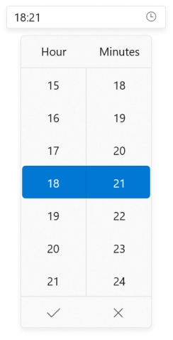
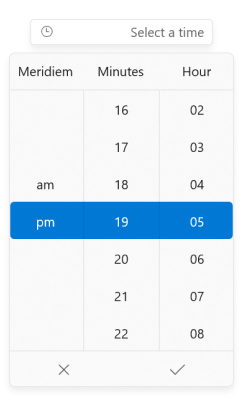
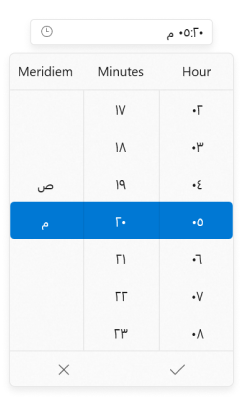
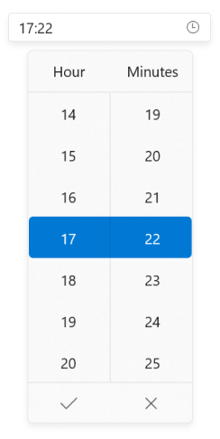

# Localization and Formatting in WinUI Time Picker

This section describes how to localize and format the WinUI [Time Picker](https://help.syncfusion.com/cr/winui/Syncfusion.UI.Xaml.Editors.SfTimePicker.html) control using [`CalendarIdentifier`](https://help.syncfusion.com/cr/winui/Syncfusion.UI.Xaml.Calendar.SfCalendar.html#Syncfusion_UI_Xaml_Calendar_SfCalendar_CalendarIdentifier) and `Language` properties and to change the display formats.

## Change the type of clock

The `Time Picker` control supports 12 hours and 24 hours formats. You can change the time format by using `ClockIdentifier` property. The default value of `ClockIdentifier` property is `12HourClock`.

You can select the required `ClockIdentifier` value from below formats.

* 12HourClock
* 24HourClock 




<editors:SfTimePicker 
                      x:Name="sfTimePicker"
                      ClockIdentifier="24HourClock"/>




SfTimePicker sfTimePicker = new SfTimePicker();
sfTimePicker.ClockIdentifier = "24HourClock";




N> Download demo application from [GitHub](https://github.com/SyncfusionExamples/syncfusion-winui-tools-timepicker-examples/tree/main/Samples/Localization)

## Change flow direction

You can change the flow direction of the `Time Picker` layout from right to left by setting the `FlowDirection` property value as `RightToLeft`. The default value of `FlowDirection` property is `LeftToRight`.




<editors:SfTimePicker  
                      x:Name="sfTimePicker"
                      FlowDirection="RightToLeft"/>




SfTimePicker sfTimePicker = new SfTimePicker();
sfTimePicker.FlowDirection = FlowDirection.RightToLeft;




N> Download demo application from [GitHub](https://github.com/SyncfusionExamples/syncfusion-winui-tools-timepicker-examples/blob/main/Samples/ViewAndItemCustomization)

## Change the language

You can localize the `Time Picker` using the `Language` property. The default value of `Language` property is **en-US**.




<editors:SfTimePicker 
                      x:Name="sfTimePicker"
                      Language="ar-SA"/>




SfTimePicker sfTimePicker = new SfTimePicker();
sfTimePicker.Language = "ar";




N> `Time Picker` control updates the flow direction visually based on the `Language` property value.

N> When `Language` and `FlowDirection` properties are set, `FlowDirection` property have higher precedence.

N> Download demo application from [GitHub](https://github.com/SyncfusionExamples/syncfusion-winui-tools-timepicker-examples/tree/main/Samples/Localization)

## Change time display format

 You can edit and display the selected time with various formatting like hour, minutes, seconds and meridiem formats by using the [`DisplayTimeFormat`](https://help.syncfusion.com/cr/winui/Syncfusion.UI.Xaml.Editors.SfTimePicker.html#Syncfusion_UI_Xaml_Editors_SfTimePicker_DisplayTimeFormat) property. The default value of `DisplayTimeFormat` property is `hh:mm tt`.




<editors:SfTimePicker x:Name="sfTimePicker" 
                      DisplayTimeFormat="HH:mm"/>




SfTimePicker sfTimePicker = new SfTimePicker();
sfTimePicker.DisplayTimeFormat= "HH:mm";




N> Download demo application from [GitHub](https://github.com/SyncfusionExamples/syncfusion-winui-tools-timepicker-examples/blob/main/Samples/TimeRestriction)

## Edit time using mask mode

By default ‘Mask’ editing is enabled, which ensure that it contains only valid value. As soon as in input is given, the value is validated and correction is done immediately. Once input is completed for a field, cursor moves to next field automatically.

Based on the `DisplayTimeFormat` and your input values, hour and minute field values are automatically corrected. 

For example,

|    Default Masking   |    Input     |     Output      |
|:---------------------|:-------------|:---------------:|
| If you try to enter values between `13-19` into the `12HourClock` hour field, it will add last input digit(3-9) in the hour field and move the cursor to the next field. | 15 (in hour field)   |   |
| If you try to enter input in hour field that is greater than `19`, it will add first digit in hour field and last digit added into next field. | 48 (in hour field)   |   | 
| If you try to enter input in minute field that is greater than `59`, it will add first digit in minute field and move the cursor to the next field. |87 (in minute field) |   | 




<editors:SfTimePicker 
                      x:Name="sfTimePicker"
                      EditMode="Mask" />




SfTimePicker sfTimePicker = new SfTimePicker();
sfTimePicker.EditMode = DateTimeEditMode.Mask;




N> Download demo application from [GitHub](https://github.com/SyncfusionExamples/syncfusion-winui-tools-timepicker-examples/blob/main/Samples/TimeRestriction)

## Edit time using free form editing

If you want to perform the validation after the user completely entering their time inputs, use the [EditMode](https://help.syncfusion.com/cr/winui/Syncfusion.UI.Xaml.Editors.SfTimePicker.html#Syncfusion_UI_Xaml_Editors_SfTimePicker_EditMode) property value as `Normal`. Then the entered time value is validated with the `DisplayTimeFormat` property value by pressing the `Enter` key or lost focus. If entered value is not suit with `DisplayTimeFormat` property, the previously selected time value sets to `SelectedTime` property.




<editors:SfTimePicker 
                      x:Name="sfTimePicker"
                      EditMode="Normal" />




SfTimePicker sfTimePicker = new SfTimePicker();
sfTimePicker.EditMode = DateTimeEditingMode.Normal;




N> Download demo application from [GitHub](https://github.com/SyncfusionExamples/syncfusion-winui-tools-timepicker-examples/blob/main/Samples/TimeRestriction)

## Hide clear button in the editor

By default, the clear button `X` will be displayed in the editor of the `Time Picker` control, which can be used to clear the entered input. You can hide the clear button in `Time Picker` control using the [ShowClearButton](https://help.syncfusion.com/cr/winui/Syncfusion.UI.Xaml.Editors.DateTimePickerBase.html#Syncfusion_UI_Xaml_Editors_DateTimePickerBase_ShowClearButton) property. The default value of `ShowClearButton` property value is **true**.




<editors:SfTimePicker 
                      Name="sfTimePicker"
                      ShowClearButton="False"/>




SfTimePicker sfTimePicker = new SfTimePicker();
sfTimePicker.ShowClearButton = false;




