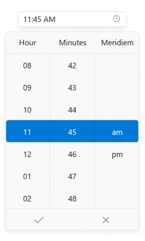

# About Syncfusion WinUI Time Picker Control

The [WinUI Time Picker](https://help.syncfusion.com/cr/winui/Syncfusion.UI.Xaml.Editors.SfTimePicker.html) control provides an intuitive, touch-friendly interface to select a time from a drop-down spinner quickly. It supports different time formats. Time selection can be restricted by specifying minimum and maximum times. Times can also be hidden or disabled from selection. In addition, it supports editing with validation and built-in watermark text display.

### Normal view:

### Expanded view:

## Key Features

* Formatting – The control displays the selected time value in various formats.
* Time spinner – The drop-down portion is used for selecting the time and it can be customized.
* Spinner customization - Allows you to customize the drop-down spinner header and each cell.