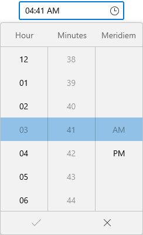
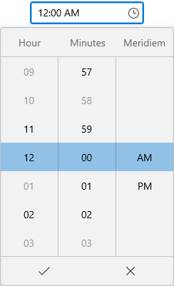
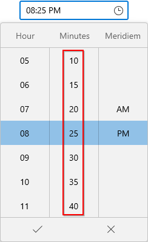

# Time Restriction in WinUI Time Picker

This section explains how to restrict the time selection in WinUI [Time Picker](https://help.syncfusion.com/cr/winui/Syncfusion.UI.Xaml.Editors.SfTimePicker.html) control.

## Limit the available times

You can restrict the users from selecting a time within the particular range by specifying [`MinTime`](https://help.syncfusion.com/cr/winui/Syncfusion.UI.Xaml.Editors.SfTimePicker.html#Syncfusion_UI_Xaml_Editors_SfTimePicker_MinTime) and [`MaxTime`](https://help.syncfusion.com/cr/winui/Syncfusion.UI.Xaml.Editors.SfTimePicker.html#Syncfusion_UI_Xaml_Editors_SfTimePicker_MaxTime) properties in `Time Picker` control. The default value of `MinTime` property is `1/1/1921 10:37:16 PM` and `MaxTime` property is `12/31/2121 10:37:16 PM}`.




SfTimePicker sfTimePicker = new SfTimePicker();
sfTimePicker.MinTime = new DateTimeOffset(new DateTime(DateTime.Now.Year, DateTime.Now.Month, DateTime.Now.Day, 4, 00, 00));
sfTimePicker.MaxTime = new DateTimeOffset(new DateTime(DateTime.Now.Year, DateTime.Now.Month, DateTime.Now.Day, 6, 59, 59));




N> Download demo application from [GitHub](https://github.com/SyncfusionExamples/syncfusion-winui-tools-timepicker-examples/blob/main/Samples/TimeRestriction)

## Disable times using BlackoutTimes

If you want to block particular times from the time selection, then add that times into the [`BlackoutTimes`](https://help.syncfusion.com/cr/winui/Syncfusion.UI.Xaml.Editors.SfTimePicker.html#Syncfusion_UI_Xaml_Editors_SfTimePicker_BlackoutTimes) collection. You can add more block out times to the `BlackoutTimes` collection. The default value of `BlackoutTimes` property is `null`.




public class ViewModel
{       
    public DateTimeOffset? SelectedTime { get; set; }
    public DateTimeOffsetCollection BlackoutTimes { get; set; }
    public ViewModel()
    {
        SelectedTime = DateTimeOffset.Now.Date;
        BlackoutTimes = new DateTimeOffsetCollection();
        BlackoutTimes.Add(new DateTimeOffset(DateTimeOffset.Now.Year, DateTimeOffset.Now.Month, DateTimeOffset.Now.Day, 0, 3, 0, DateTimeOffset.Now.Offset));
        BlackoutTimes.Add(new DateTimeOffset(DateTimeOffset.Now.Year, DateTimeOffset.Now.Month, DateTimeOffset.Now.Day, 0, 58, 0, DateTimeOffset.Now.Offset));
        BlackoutTimes.Add(new DateTimeOffset(DateTimeOffset.Now.Year, DateTimeOffset.Now.Month, DateTimeOffset.Now.Day, 1, 0, 0, DateTimeOffset.Now.Offset));
        BlackoutTimes.Add(new DateTimeOffset(DateTimeOffset.Now.Year, DateTimeOffset.Now.Month, DateTimeOffset.Now.Day, 3, 0, 0, DateTimeOffset.Now.Offset));
        BlackoutTimes.Add(new DateTimeOffset(DateTimeOffset.Now.Year, DateTimeOffset.Now.Month, DateTimeOffset.Now.Day, 9, 0, 0, DateTimeOffset.Now.Offset));
        BlackoutTimes.Add(new DateTimeOffset(DateTimeOffset.Now.Year, DateTimeOffset.Now.Month, DateTimeOffset.Now.Day, 10, 0, 0, DateTimeOffset.Now.Offset));
    }
}







<editors:SfTimePicker SelectedTime="{Binding SelectedTime}" 
                      BlackoutTimes="{Binding BlackoutTimes}"
                      x:Name="sfTimePicker">
    <editors:SfTimePicker.DataContext>
        <local:ViewModel/>
    </editors:SfTimePicker.DataContext>
</editors:SfTimePicker>




sfTimePicker.DataContext = new ViewModel();
sfTimePicker.SelectedTime = (sfTimePicker.DataContext as ViewModel).SelectedTime;
sfTimePicker.BlackoutTimes = (sfTimePicker.DataContext as ViewModel).BlackoutTimes;




N> Download demo application from [GitHub](https://github.com/SyncfusionExamples/syncfusion-winui-tools-timepicker-examples/blob/main/Samples/ViewAndItemCustomization)

## Custom time interval

You can restrict the users to select the times from specific minute or hour intervals by using the [`TimeFieldPrepared`](https://help.syncfusion.com/cr/winui/Syncfusion.UI.Xaml.Editors.SfTimePicker.html#Syncfusion_UI_Xaml_Editors_SfTimePicker_TimeFieldPrepared) event.




<editors:SfTimePicker TimeFieldPrepared="SfTimePicker_TimeFieldPrepared"
                      x:Name="sfTimePicker"/>




SfTimePicker sfTimePicker = new SfTimePicker();
sfTimePicker.TimeFieldPrepared = SfTimePicker_TimeFieldPrepared;




You can handle the event as follows,




/// 

/// Get the ItemsSource for minute or second column.
/// 

/// <returns>Return the ItemsSource for minute or second column.</returns>
private static ObservableCollection<string> GetMinutesOrSeconds(string pattern)
{
    ObservableCollection<string> minutes = new ObservableCollection<string>();
    NumberFormatInfo provider = new NumberFormatInfo();
    for (int i = 0; i < 60; i = i + 5)
    {
        if (i > 9 || pattern == "%s" || pattern == "{second.integer}" || pattern == "%m" || pattern == "{minute.integer}")
        {
            minutes.Add(i.ToString(provider));
        }
        else
        {
            minutes.Add("0" + i.ToString(provider));
        }
    }

    return minutes;
}

private void SfTimePicker_TimeFieldPrepared(object sender, DateTimeFieldPreparedEventArgs e)
{
    if (e.Column != null)
    {
        //Minutes interval changed as 5.
        if (e.Column.Field == DateTimeField.Minute || e.Column.Field == DateTimeField.Second)
        {
            e.Column.ItemsSource = GetMinutesOrSeconds(e.Column.Format);
        }
}




N> Download demo application from [GitHub](https://github.com/SyncfusionExamples/syncfusion-winui-tools-timepicker-examples/blob/main/Samples/TimeFieldPrepared)

## Select time as you scroll spinner

If you want to hide the submit button and select the time directly from the dropdown time spinner without clicking the `Ok` button, use the [`ShowSubmitButtons`](https://help.syncfusion.com/cr/winui/Syncfusion.UI.Xaml.Editors.SfDropDownBase.html#Syncfusion_UI_Xaml_Editors_SfDropDownBase_ShowSubmitButtons) property value as `false`. The default value of `ShowSubmitButtons` property is `true`.




<editors:SfTimePicker ShowSubmitButtons="False"
                      x:Name="sfTimePicker"/>




SfTimePicker sfTimePicker = new SfTimePicker();
sfTimePicker.ShowSubmitButtons = false;




N> Download demo application from [GitHub](https://github.com/SyncfusionExamples/syncfusion-winui-tools-timepicker-examples/blob/main/Samples/ViewAndItemCustomization)

## Cancel a time that is being changed

The [`TimeChanging`](https://help.syncfusion.com/cr/winui/Syncfusion.UI.Xaml.Editors.SfTimePicker.html#Syncfusion_UI_Xaml_Editors_SfTimePicker_TimeChanging) event will be triggered as soon as a date is selected but before [`SelectedTime`](https://help.syncfusion.com/cr/winui/Syncfusion.UI.Xaml.Editors.SfTimePicker.html#Syncfusion_UI_Xaml_Editors_SfTimePicker_SelectedTime) property is updated. If the change is considered invalid, it can be canceled. The `TimeChanging` event contains the following properties.

* `OldTime` - Gets a time which is previously selected.
* `NewTime` - Gets a time which is currently selected.
* `Cancel` - Gets or sets whether to cancel the selected time value update.

Users are restricted to select a blackout time from dropdown, however user can give text input through editor. As selecting a blackout time leads to crash, we can cancel the change using `TimeChanging` event.

N> `TimeChanging` event is called before the [`TimeChanged`](https://help.syncfusion.com/cr/winui/Syncfusion.UI.Xaml.Editors.SfTimePicker.html#Syncfusion_UI_Xaml_Editors_SfTimePicker_TimeChanged) event when a time is selected.




<editor:SfTimePicker Height="35" Width="150" TImeChanging="SfTimePicker_TimeChanging" />




SfTimePicker sfTimePicker = new SfTimePicker();
sfTimePicker.TimeChanging += SfTimePicker_TimeChanging;




You can handle the event as follows:




 private void SfTimePicker_TimeChanging(object sender, Syncfusion.UI.Xaml.Editors.TimeChangingEventArgs e)
{
    var OldTime = e.OldTime;
    var NewTime = e.NewTime;

    //Cancel Selected time update
    e.Cancel = true;
}




