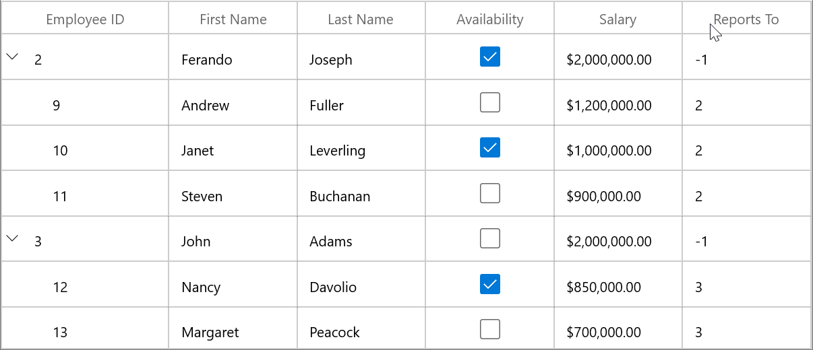
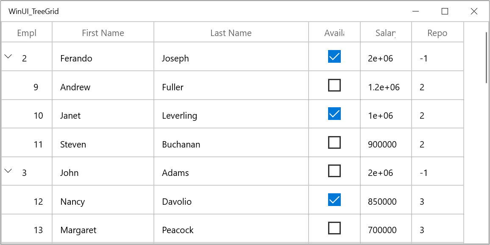

# Column Sizing in WinUi TreeGrid

SfTreeGrid allows you to set the column widths based on certain logic using [SfTreeGrid.ColumnWidthMode](https://help.syncfusion.com/cr/winui/Syncfusion.UI.Xaml.TreeGrid.SfTreeGrid.html#Syncfusion_UI_Xaml_TreeGrid_SfTreeGrid_ColumnWidthMode) or [TreeGridColumn.ColumnSizer](https://help.syncfusion.com/cr/winui/Syncfusion.UI.Xaml.TreeGrid.TreeGridColumn.html#Syncfusion_UI_Xaml_TreeGrid_TreeGridColumn_ColumnSizer) property. 

Below is the list of predefined column sizing options available.

<table>
<tr>
<th>
Type
</th>
<th>
Column width
</th>
</tr>
<tr>
<td>
<code>Star</code>
</td>
<td>
Divides the total width equally for columns. 
</td>
</tr>
<tr>
<td>
<code>Auto</code>
</td>
<td>
Calculates the width of column based on header and cell contents. So that header and cell content&#39;s are not truncated.  
</td>
</tr>
<tr>
<td>
<code>AutoLastColumnFill</code>
</td>
<td>
The size is based on the contents of both the cells and the column header with last column auto fill. The column to be filled can be any column.
</td>
</tr>
<tr>
<td>
<code>AutoWithLastColumnFill</code>
</td>
<td>
The size is based on the contents of both the cells and the column header with last column fill by default. The column to be filled can be any column.
</td>
</tr>
<tr>
<td>
<code>SizeToCells</code>
</td>
<td>
Calculates the width of column based on cell contents. So that cell content&#39;s are not truncated.  
</td>
</tr>
<tr>
<td>
<code>SizeToHeader</code>
</td>
<td>
Calculates the width of column based on header content. So that header content is not truncated.  
</td>
</tr>
<tr>
<td>
<code>None</code>
</td>
<td>
Default column width or defined width set to column.
</td>
</tr>
</table>

N> ColumnWidthMode will not work when the column width defined explicitly. ColumnWidthMode calculates column width based on `MinWidth` and `MaxWidth` properties.

Below code, applies `GridLengthUnitType.Star` to equally set width for `SfTreeGrid.Columns`.



<syncfusion:SfTreeGrid Name="treeGrid"
                AllowEditing="True"
        ColumnWidthMode="Star"
        AutoExpandMode="AllNodesExpanded"
        AutoGenerateColumns="False"
        ChildPropertyName="ReportsTo"
        ItemsSource="{Binding Employees}"
        ParentPropertyName="ID"
        SelfRelationRootValue="-1" >
    <syncfusion:SfTreeGrid.Columns>
        <syncfusion:TreeGridTextColumn HeaderText="Employee ID" MappingName="ID" />
        <syncfusion:TreeGridTextColumn HeaderText="First Name" MappingName="FirstName" />
        <syncfusion:TreeGridTextColumn HeaderText="Last Name" MappingName="LastName"   />
        <syncfusion:TreeGridCheckBoxColumn HeaderText="Availability" MappingName="AvailabilityStatus" />
        <syncfusion:TreeGridTextColumn DisplayBinding="{Binding Salary,
                                        Converter={StaticResource converter}}"
                                        HeaderText="Salary"
                                        MappingName="Salary" />
        <syncfusion:TreeGridTextColumn HeaderText="Reports To" MappingName="ReportsTo" />
    </syncfusion:SfTreeGrid.Columns>
</syncfusion:SfTreeGrid>


public class DisplayBindingConverter : IValueConverter
{
    public object Convert(object value, Type targetType, object parameter, string language)
    {
        return string.Format("{0:C2}", value);
    }
    public object ConvertBack(object value, Type targetType, object parameter, string language)
    {
        return value;
    }
}



N> The `TreeGridColumn.ColumnSizer` takes higher priority than the `SfTreeGrid.ColumnWidthMode`.

### Refreshing ColumnSizer at runtime

You can refresh the `ColumnSizer` at runtime by calling [SfTreeGrid.TreeGridColumnSizer.Refresh](https://help.syncfusion.com/cr/winui/Syncfusion.UI.Xaml.TreeGrid.TreeGridColumnSizer.html#Syncfusion_UI_Xaml_TreeGrid_TreeGridColumnSizer_Refresh) method.
SfTreeGrid support to recalculates the column auto width by calling reset methods of `TreeGridColumnSizer`. [TreeGridColumnSizer.ResetAutoCalculationforAllColumns](https://help.syncfusion.com/cr/winui/Syncfusion.UI.Xaml.Grids.DataGridRowColumnSizer-1.html#Syncfusion_UI_Xaml_Grids_DataGridRowColumnSizer_1_ResetAutoCalculationforAllColumns) method reset widths to all columns. [TreeGridColumnSizer.ResetAutoCalculation](https://help.syncfusion.com/cr/winui/Syncfusion.UI.Xaml.Grids.DataGridRowColumnSizer-1.html#Syncfusion_UI_Xaml_Grids_DataGridRowColumnSizer_1_ResetAutoCalculation_Syncfusion_UI_Xaml_Grids_GridColumnBase_) method reset the width to particular column.

N> The `TreeGridColumnSizer.ResetAutoCalculationforAllColumns` or `TreeGridColumnSizer.ResetAutoCalculation` methods applicable for Auto, FillColumn, AutoFillColumn, SizeToCells types.

For example, you can refresh all the column&#39;s width based on the cell contents of newly added records at runtime. 



var viewModel = this.treeGrid.DataContext as ViewModel;
viewModel.PersonDetails.Add(new PersonInfo("Smith", "Anders","Red", new DateTime(2008, 10, 26), null));
this.treeGrid.TreeGridColumnSizer.ResetAutoCalculationforAllColumns();
this.treeGrid.TreeGridColumnSizer.Refresh();   



### Resetting column width to apply ColumnSizer

When the width of the column is explicitly defined or column is resized, then column width is not changed based on `TreeGridColumnSizer`. You can reset [TreeGridColumn.Width](https://help.syncfusion.com/cr/winui/Syncfusion.UI.Xaml.Grids.GridColumnBase.html#Syncfusion_UI_Xaml_Grids_GridColumnBase_Width) by setting `double.NaN` to apply column width based on column sizer.




foreach (var column in treeGrid.Columns)
{
	if (!double.IsNaN(column.Width))
		column.Width = double.NaN;
}
this.treeGrid.TreeGridColumnSizer.Refresh();   



### Customizing built-in column sizing logic

SfTreeGrid process column sizing operations in [TreeGridColumnSizer](https://help.syncfusion.com/cr/winui/Syncfusion.UI.Xaml.TreeGrid.TreeGridColumnSizer.html) class. You can customize the column sizing operations by overriding `GridColumnSizer` and set it to `SfTreeGrid.TreeGridColumnSizer`.



this.treeGrid.TreeGridColumnSizer = new TreeGridColumnSizerExt(treeGrid);

public class TreeGridColumnSizerExt:TreeGridColumnSizer
{

	public TreeGridColumnSizerExt(SfTreeGrid treeGrid)
		:base(treeGrid)
	{
	}        

	// Calculate Width for column when ColumnSizer is SizeToCells.        

	protected override double CalculateCellWidth(TreeGridColumn column)
	{
		return base.CalculateCellWidth(column);
	}

	//Calculate Width for the column when ColumnSizer is SizeToHeader

	protected override double CalculateHeaderWidth(TreeGridColumn column)
	{
		return base.CalculateHeaderWidth(column);
	}
}



### Auto width calculation based on font settings

By default, the ColumnSizer calculates column&#39;s width based on fixed `FontSize`, `FontFamily`, `Margin`,`SortIconWidth`. You can change the calculation by customized settings.

#### Changing SortIcon width

You can change the filter icon and sort icon widths for column width calculation by setting [TreeGridColumnSizer.SortIconWidth](https://help.syncfusion.com/cr/winui/Syncfusion.UI.Xaml.Grids.DataGridRowColumnSizer-1.html#Syncfusion_UI_Xaml_Grids_DataGridRowColumnSizer_1_SortIconWidth) properties.



this.treeGrid.TreeGridColumnSizer.SortIconWidth = 20;



#### Changing Font settings for SfTreeGrid

You can change the `font settings` for column width calculation by setting [TreeGridColumnSizer.FontSize](https://help.syncfusion.com/cr/winui/Syncfusion.UI.Xaml.Grids.DataGridRowColumnSizer-1.html#Syncfusion_UI_Xaml_Grids_DataGridRowColumnSizer_1_FontSize), [TreeGridColumnSizer.FontFamily](https://help.syncfusion.com/cr/winui/Syncfusion.UI.Xaml.Grids.DataGridRowColumnSizer-1.html#Syncfusion_UI_Xaml_Grids_DataGridRowColumnSizer_1_FontFamily) and [TreeGridColumnSizer.Margin](https://help.syncfusion.com/cr/winui/Syncfusion.UI.Xaml.Grids.DataGridRowColumnSizer-1.html#Syncfusion_UI_Xaml_Grids_DataGridRowColumnSizer_1_Margin) properties.  This settings will be considered for all columns.



this.treeGrid.TreeGridColumnSizer.FontSize = 10.0;
this.treeGrid.TreeGridColumnSizer.FontFamily = new FontFamily("TimesNewRoman");
this.treeGrid.TreeGridColumnSizer.Margin = new Thickness(9, 3, 1, 3);



### Star column sizer ratio support

You can customize the `ColumnWidthMode.Star` width calculation logic by overriding [SetStarWidth](https://help.syncfusion.com/cr/winui/Syncfusion.UI.Xaml.TreeGrid.TreeGridColumnSizer.html#Syncfusion_UI_Xaml_TreeGrid_TreeGridColumnSizer_SetStarWidth_System_Double_System_Collections_Generic_IEnumerable_Syncfusion_UI_Xaml_TreeGrid_TreeGridColumn__) method of [TreeGridColumnSizer](https://help.syncfusion.com/cr/winui/Syncfusion.UI.Xaml.TreeGrid.TreeGridColumnSizer.html).

For example, you can calculate the column width, with specified ratios instead of dividing equal width for all columns in Star calculation using `ColumnRatio` attached property.



public static class StarRatio
{

	public static int GetColumnRatio(DependencyObject obj)
	{
		return (int)obj.GetValue(ColumnRatioProperty);
	}

	public static void SetColumnRatio(DependencyObject obj, int value)
	{
		obj.SetValue(ColumnRatioProperty, value);
	}

	public static readonly DependencyProperty ColumnRatioProperty = DependencyProperty.RegisterAttached("ColumnRatio", typeof(int), typeof(StarRatio), new PropertyMetadata(1, null));
}



Below code to define the star width calculation based on the `ColumnRatio`.



//Assign the customized TreeGridColumnSizerExt to SfTreeGrid.TreeGridColumnSizer
this.treeGrid.TreeGridColumnSizer = new TreeGridColumnSizerExt(treeGrid);

public class TreeGridColumnSizerExt : TreeGridColumnSizer
{

	public TreeGridColumnSizerExt(SfTreeGrid treeGrid) : base(treeGrid)
	{
	}

	protected override void SetStarWidth(double remainingColumnWidth, IEnumerable<TreeGridColumn> remainingColumns)
	{           
		var removedColumn = new List<TreeGridColumn>();
		var columns = remainingColumns.ToList();
		var totalRemainingStarValue = remainingColumnWidth;
		double removedWidth = 0;
		bool isRemoved;

		while (columns.Count > 0)
		{
			isRemoved = false;
			removedWidth = 0;
			var columnsCount = 0;

			columns.ForEach((col) =>
			{
				columnsCount += StarRatio.GetColumnRatio(col);
			});

			double starWidth = Math.Floor((totalRemainingStarValue / columnsCount));
			var column = columns.First();
			starWidth *= StarRatio.GetColumnRatio(column);
			double computedWidth = SetColumnWidth(column, starWidth);

			if (starWidth != computedWidth && starWidth > 0)
			{
				isRemoved = true;
				columns.Remove(column);

				foreach (var remColumn in removedColumn)
				{

					if (!columns.Contains(remColumn))
					{
						removedWidth += remColumn.ActualWidth;
						columns.Add(remColumn);
					}
				}
				removedColumn.Clear();
				totalRemainingStarValue += removedWidth;
			}

			totalRemainingStarValue = totalRemainingStarValue - computedWidth;

			if (!isRemoved)
			{
				columns.Remove(column);

				if (!removedColumn.Contains(column))
					removedColumn.Add(column);
			}
		}
	}
}
	



Below code uses the `ColumnRatio` to apply the defined star width for each column.




<syncfusion:SfTreeGrid Name="treeGrid"
                AllowEditing="True"
        ColumnWidthMode="Star"
        AutoExpandMode="AllNodesExpanded"
        AutoGenerateColumns="False"
        ChildPropertyName="ReportsTo"
        ItemsSource="{Binding Employees}"
        ParentPropertyName="ID"
        SelfRelationRootValue="-1" >
    <syncfusion:SfTreeGrid.Columns>
        <syncfusion:TreeGridTextColumn HeaderText="Employee ID" 
									MappingName="ID" 
									TextAlignment="Left" 
									local:StarRatio.ColumnRatio="1" />
        <syncfusion:TreeGridTextColumn HeaderText="First Name" 
									MappingName="FirstName" 
									local:StarRatio.ColumnRatio="2" />
        <syncfusion:TreeGridTextColumn HeaderText="Last Name" 
									MappingName="LastName" 
									local:StarRatio.ColumnRatio="3"/>
        <syncfusion:TreeGridCheckBoxColumn HeaderText="Availability" MappingName="AvailabilityStatus" />
        <syncfusion:TreeGridTextColumn HeaderText="Salary" MappingName="Salary" />
        <syncfusion:TreeGridTextColumn HeaderText="Reports To" MappingName="ReportsTo" />
    </syncfusion:SfTreeGrid.Columns>
</syncfusion:SfTreeGrid>
	



