# Column Types in WinUI TreeGrid

SfTreeGrid provides support for various built-in column types. Each column has its own properties and renderer to handle different types of data. 
You can also add or override existing columns and renderers as you need.

<table>
<tr>
<th>
Column Type
</th>
<th>
Renderer 
</th>
<th>
Description
</th>
</tr>
<tr>
<td>
{{'[TreeGridTextColumn](https://help.syncfusion.com/cr/winui/Syncfusion.UI.Xaml.TreeGrid.TreeGridTextColumn.html#"")'| markdownify }}
</td>
<td>
{{'[TreeGridCellTextBoxRenderer](https://help.syncfusion.com/cr/winui/Syncfusion.UI.Xaml.TreeGrid.Renderers.TreeGridCellTextBlockRenderer.html#"")'| markdownify }}
</td>
<td>
Use to display the string data. 
</td>
</tr>
<tr>
<td>
{{'[TreeGridNumericColumn](https://help.syncfusion.com/cr/winui/Syncfusion.UI.Xaml.TreeGrid.TreeGridNumericColumn.html#"")'| markdownify }}
</td>
<td>
{{'[TreeGridCellNumericRenderer](https://help.syncfusion.com/cr/winui/Syncfusion.UI.Xaml.TreeGrid.Renderers.TreeGridCellNumericRenderer.html#"")'| markdownify }}
</td>
<td>
Use to display the numeric data. 
</td>
</tr>
<tr>
<td>
{{'[TreeGridComboBoxColumn](https://help.syncfusion.com/cr/winui/Syncfusion.UI.Xaml.TreeGrid.TreeGridComboBoxColumn.html#"")'| markdownify }}
</td>
<td>
{{'[TreeGridCellComboBoxRenderer](https://help.syncfusion.com/cr/winui/Syncfusion.UI.Xaml.TreeGrid.Renderers.TreeGridCellComboBoxRenderer.html#"")'| markdownify }}
</td>
<td>
Use to display the IEnumerable data using ComboBox.
</td>
</tr>
<tr>
<td>
{{'[TreeGridCheckBoxColumn](https://help.syncfusion.com/cr/winui/Syncfusion.UI.Xaml.TreeGrid.TreeGridCheckBoxColumn.html#"")'| markdownify }}
</td>
<td>
{{'[TreeGridCellCheckBoxRenderer](https://help.syncfusion.com/cr/winui/Syncfusion.UI.Xaml.TreeGrid.Renderers.TreeGridCellCheckBoxRenderer.html#"")'| markdownify }}
</td>
<td>
Use to display the boolean type data.
</td>
</tr>
<tr>
<td>
{{'[TreeGridDateColumn](https://help.syncfusion.com/cr/winui/Syncfusion.UI.Xaml.TreeGrid.TreeGridDateColumn.html#"")'| markdownify }}
</td>
<td>
{{'[TreeGridCellDateRenderer](https://help.syncfusion.com/cr/winui/Syncfusion.UI.Xaml.TreeGrid.Renderers.TreeGridCellDateRenderer.html#"")'| markdownify }}
</td>
<td>
Use to display the date value.
</td>
</tr>
<tr>
<td>
{{'[TreeGridHyperlinkColumn](https://help.syncfusion.com/cr/winui/Syncfusion.UI.Xaml.TreeGrid.TreeGridHyperlinkColumn.html#"")'| markdownify }}
</td>
<td>
{{'[TreeGridCellHyperLinkRenderer](https://help.syncfusion.com/cr/winui/Syncfusion.UI.Xaml.TreeGrid.Renderers.TreeGridCellHyperlinkRenderer.html#"")'| markdownify }}
</td>
<td>
Use to display the URI data.
</td>
</tr>
<tr>
<td>
{{'[TreeGridTemplateColumn](https://help.syncfusion.com/cr/winui/Syncfusion.UI.Xaml.TreeGrid.TreeGridTemplateColumn.html#"")'| markdownify }}
</td>
<td>
{{'[TreeGridCellTemplateRenderer](https://help.syncfusion.com/cr/winui/Syncfusion.UI.Xaml.TreeGrid.Renderers.TreeGridCellTemplateRenderer.html#"")'| markdownify }}
</td>
<td>
Use to display the custom template-specified content.
</td>
</tr>
<tr>
<td>
{{'[TreeGridTimeColumn](https://help.syncfusion.com/cr/winui/Syncfusion.UI.Xaml.TreeGrid.TreeGridTimeColumn.html#"")'| markdownify }}
</td>
<td>
{{'[TreeGridCellTimeRenderer](https://help.syncfusion.com/cr/winui/Syncfusion.UI.Xaml.TreeGrid.Renderers.TreeGridCellTimeRenderer.html#"")'| markdownify }}
</td>
<td>
Use to display the <code>DateTimeOffset</code> type data as time value.
</td>
</tr>
</table>

## TreeGridColumn

TreeGridColumn is an abstract class provides base functionalities for all the column types in SfTreeGrid. 

### Mapping column to particular property

Column can be bound to a property in data object using [TreeGridColumn.MappingName](https://help.syncfusion.com/cr/winui/Syncfusion.UI.Xaml.Grids.GridColumnBase.html#Syncfusion_UI_Xaml_Grids_GridColumnBase_MappingName) property. In addition, it supports to format or bind different property for display and edit mode separately via [TreeGridColumn.DisplayBinding](https://help.syncfusion.com/cr/winui/Syncfusion.UI.Xaml.Grids.GridColumnBase.html#Syncfusion_UI_Xaml_Grids_GridColumnBase_DisplayBinding) and [TreeGridColumn.ValueBinding](https://help.syncfusion.com/cr/winui/Syncfusion.UI.Xaml.Grids.GridColumnBase.html#Syncfusion_UI_Xaml_Grids_GridColumnBase_ValueBinding). 

When you set `MappingName`, `DisplayBinding` and `ValueBinding` are created based on `MappingName`, if these properties are not defined explicitly. 

You can use `DisplayBinding` property to format the column in display, by setting `Converter` property of `Binding`.



<treeGrid:TreeGridTextColumn DisplayBinding="{Binding Hike,
                                                        Converter={StaticResource converter}}"
                                HeaderText="Hike"
                                MappingName="Hike" />


public class DisplayBindingConverter : IValueConverter
{
    public object Convert(object value, Type targetType, object parameter, string language)
    {
        return String.Format("{0:P2}", (value as double?)/100);
    }
    public object ConvertBack(object value, Type targetType, object parameter, string language)
    {
        return value;
    }
}



In the below screenshot, `Hike` column display value is formatted to percentage by setting `DisplayBinding` property.

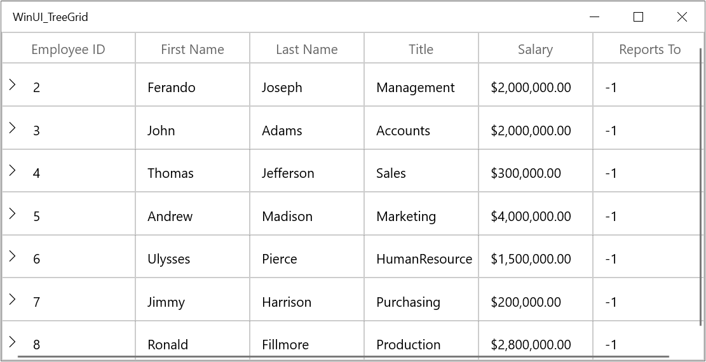

By default, Columns handling the data operations (sorting) based on `MappingName` property.

### CellTemplate in TreeGridColumn

You can load any WinUI control in the display mode for all columns by setting [TreeGridColumn.CellTemplate](https://help.syncfusion.com/cr/winui/Syncfusion.UI.Xaml.Grids.GridColumnBase.html#Syncfusion_UI_Xaml_Grids_GridColumnBase_CellTemplate) property. In edit mode, corresponding editor will be loaded based on column type. 

In the below code snippet, `TreeGridTextColumn` is loaded with `ProgressBar` and `TextBlock`. When you start editing `DoubleTextBox` will be loaded as Editor.



<treeGrid:SfTreeGrid Name="treeGrid"
                AllowEditing="True"
        ColumnWidthMode="Star"
        AutoExpandMode="AllNodesExpanded"
        AutoGenerateColumns="False"
        ChildPropertyName="ReportsTo"
        ItemsSource="{Binding Employees}"
        ParentPropertyName="ID"
        SelfRelationRootValue="-1" >
    <treeGrid:SfTreeGrid.Columns>
        <treeGrid:TreeGridTextColumn HeaderText="First Name" MappingName="FirstName" />
        <treeGrid:TreeGridTextColumn HeaderText="Last Name" MappingName="LastName" />
        <treeGrid:TreeGridNumericColumn HeaderText="Employee ID"  MappingName="ID"/>
        <treeGrid:TreeGridTextColumn HeaderText="Title" MappingName="Title" />
        <treeGrid:TreeGridTextColumn MappingName="Salary">
            <treeGrid:TreeGridTextColumn.CellTemplate>
                <DataTemplate>
                    <Grid>
                        <ProgressBar x:Name="progressBar"
                Height="50"
                Background="Transparent"
                BorderThickness="0"
                Maximum="200000"
                Minimum="0"
                Visibility="Visible"
                Value="{Binding Path=Salary}" />
                        <TextBlock HorizontalAlignment="Right"
            VerticalAlignment="Center"
            Text="{Binding Path=Salary, Converter={StaticResource converter}}"
            TextAlignment="Center" />
                    </Grid>
                </DataTemplate>
            </treeGrid:TreeGridTextColumn.CellTemplate>
        </treeGrid:TreeGridTextColumn>
        <treeGrid:TreeGridTextColumn HeaderText="Reports To" MappingName="ReportsTo" />
    </treeGrid:SfTreeGrid.Columns>
</treeGrid:SfTreeGrid>


public class DisplayBindingConverter : IValueConverter
{
    public object Convert(object value, Type targetType, object parameter, string language)
    {
        return string.Format("{0:C2}", value);
    }
    public object ConvertBack(object value, Type targetType, object parameter, string language)
    {
        return value;
    }
}



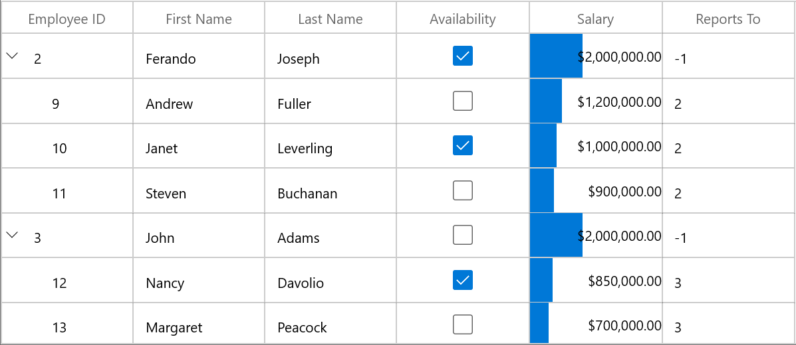

`CellTemplate` is not support by [TreeGridHyperlinkColumn](https://help.syncfusion.com/cr/winui/Syncfusion.UI.Xaml.TreeGrid.TreeGridHyperlinkColumn.html) and [TreeGridCheckboxColumn](https://help.syncfusion.com/cr/winui/Syncfusion.UI.Xaml.TreeGrid.TreeGridCheckBoxColumn.html) columns.

#### Reusing same DataTemplate for multiple columns

By default, underlying record is `DataContext` for CellTemplate. So you have to define, template for each column to display values based on `MappingName`. 

You can use the same [DataTemplate](https://docs.microsoft.com/en-us/windows/winui/api/microsoft.ui.xaml.datatemplate?view=winui-3.0) for all columns to display value based on MappingName by setting [TreeGridColumn.SetCellBoundValue](https://help.syncfusion.com/cr/winui/Syncfusion.UI.Xaml.Grids.GridColumnBase.html#Syncfusion_UI_Xaml_Grids_GridColumnBase_SetCellBoundValue)  property to `true`. When `SetCellBoundValue` is set to true, the DataContext for CellTemplate is changed to `DataContextHelper` which has the following members,

* `Value` - Return the value base on `MappingName`.
* `Record` - Returns the underlying data object.



<treeGrid:SfTreeGrid Name="treeGrid"
                ColumnWidthMode="Star"
                AutoExpandMode="AllNodesExpanded"
                AutoGenerateColumns="False"
                ChildPropertyName="ReportsTo"
                ItemsSource="{Binding Employees}"
                ParentPropertyName="ID"
                SelfRelationRootValue="-1" >
    <treeGrid:SfTreeGrid.Resources>
        <DataTemplate x:Key="cellTemplate">
            <TextBlock Margin="3,0,0,0"
                    Foreground="Red"
                    TextAlignment="Center"
                    Text="{Binding Path=Value}" />
        </DataTemplate>                    
    </treeGrid:SfTreeGrid.Resources>            
    <treeGrid:SfTreeGrid.Columns>
        <treeGrid:TreeGridTextColumn CellTemplate="{StaticResource cellTemplate}"
                                HeaderText="First Name" 
                                MappingName="FirstName"
                                SetCellBoundValue="True" />
        <treeGrid:TreeGridTextColumn HeaderText="Last Name" MappingName="LastName" />
        <treeGrid:TreeGridNumericColumn CellTemplate="{StaticResource cellTemplate}"
                                HeaderText="Employee ID"
                                MappingName="ID"
                                SetCellBoundValue="True" />
        <treeGrid:TreeGridTextColumn MappingName="Title" />
        <treeGrid:TreeGridNumericColumn MappingName="Salary" DisplayNumberFormat="C2"/>
        <treeGrid:TreeGridNumericColumn HeaderText="Reports To" MappingName="ReportsTo" />
    </treeGrid:SfTreeGrid.Columns>
</treeGrid:SfTreeGrid>



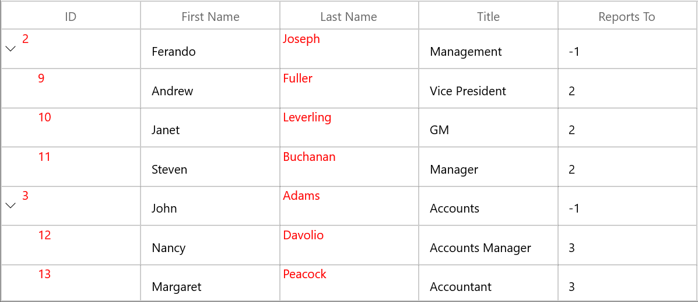

#### Setting CellTemplate based on custom logic using TemplateSelector

`TreeGridColumn` allows you to select a different[DataTemplate](https://docs.microsoft.com/en-us/windows/winui/api/microsoft.ui.xaml.datatemplate?view=winui-3.0) based on underlying data object by using the [TreeGridColumn.CellTemplateSelector](https://help.syncfusion.com/cr/winui/Syncfusion.UI.Xaml.Grids.GridColumnBase.html#Syncfusion_UI_Xaml_Grids_GridColumnBase_CellTemplateSelector) property. 

For example, two different templates loaded alternatively in `ID` column. 



<Application.Resources>
    <local:CustomCellTemplateSelector x:Key="cellTemplateSelector" />
    <DataTemplate x:Key="DefaultTemplate">
        <TextBlock Foreground="Red"
                Text="{Binding Path=ID}"
                TextAlignment="Center" />
    </DataTemplate>
    <DataTemplate x:Key="AlternateTemplate">
        <TextBlock Foreground="Green"
                Text="{Binding Path=ID}"
                TextAlignment="Center" />
    </DataTemplate>
</Application.Resources>   



Below code returns the `DefaultTemplate` and `AlternateTemplate` based on Salary’s value.



public class CustomCellTemplateSelector : DataTemplateSelector
{

    protected override DataTemplate SelectTemplateCore(object item, DependencyObject container)
    {

        if (item == null)
            return null;
        var data = item as EmployeeInfo;

        if (data.ID < 10)
            return App.Current.Resources["AlternateTemplate"] as DataTemplate;

        else
            return App.Current.Resources["DefaultTemplate"] as DataTemplate;
    }
}



In the below code, the custom template selector set to `TreeGridColumn.CellTemplateSelector`.



<treeGrid:SfTreeGrid Name="treeGrid"
        ColumnWidthMode="Star"
        AutoExpandMode="AllNodesExpanded"
        AutoGenerateColumns="False"
        ChildPropertyName="ReportsTo"
        ItemsSource="{Binding Employees}"
        ParentPropertyName="ID"
        SelfRelationRootValue="-1" >
    <treeGrid:SfTreeGrid.Columns>
        <treeGrid:TreeGridTextColumn HeaderText="First Name" MappingName="FirstName" />
        <treeGrid:TreeGridTextColumn HeaderText="Last Name" MappingName="LastName" />
        <treeGrid:TreeGridNumericColumn CellTemplateSelector="{StaticResource cellTemplateSelector}"
                                HeaderText="Employee ID" MappingName="ID" />
        <treeGrid:TreeGridTextColumn HeaderText="Title" MappingName="Title" />
        <treeGrid:TreeGridNumericColumn MappingName="Salary" HeaderText="Salary" DisplayNumberFormat="C2"/>
        <treeGrid:TreeGridNumericColumn HeaderText="Reports To" MappingName="ReportsTo" />
    </treeGrid:SfTreeGrid.Columns>
</treeGrid:SfTreeGrid>



N> Non-Editable columns does not support `CellTemplate`.

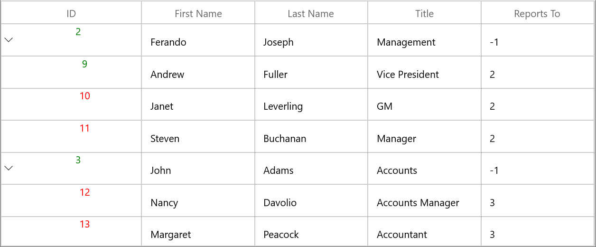

### Data Formatting

`TreeGridColumn` supports to format the data using the [Converter](https://docs.microsoft.com/en-us/windows/winui/api/microsoft.ui.xaml.data.binding?view=winui-3.0) property, by defining the `TreeGridColumn.DisplayBinding` and `TreeGridColumn.ValueBinding`. In display mode `TreeGridColumn.DisplayBinding` formats the data. In edit mode, `TreeGridColumn.ValueBinding` formats the data.

#### Format column using Converter

You can format the column using `Converter` property by defining `DisplayBinding`. 



<treeGrid:SfTreeGrid Name="treeGrid"
                AutoExpandMode="AllNodesExpanded"
                ChildPropertyName="ReportsTo"
                ItemsSource="{Binding Employees}"
                ParentPropertyName="ID">
    <treeGrid:SfTreeGrid.Resources>
        <local:CurrencyFormatConverter x:Key="converter" />   
    </treeGrid:SfTreeGrid.Resources>            
    <treeGrid:SfTreeGrid.Columns>
        <treeGrid:TreeGridTextColumn HeaderText="Salary"
                                    DisplayBinding="{Binding Salary,Converter={StaticResource converter}}"
                                    MappingName="Salary" />
    </treeGrid:SfTreeGrid.Columns>    
</treeGrid:SfTreeGrid>





public class CurrencyFormatConverter : IValueConverter
{
    public object Convert(object value, Type targetType, object parameter, string language)
    {
        return string.Format("{0:C2}", value);
    }

    public object ConvertBack(object value, Type targetType, object parameter, string language)
    {
        return value;
    }
}



When column is auto-generated, you can set the `Converter` by handling [AutoGeneratingColumn](https://help.syncfusion.com/cr/winui/Syncfusion.UI.Xaml.TreeGrid.SfTreeGrid.html#Syncfusion_UI_Xaml_TreeGrid_SfTreeGrid_AutoGeneratingColumn) event



treeGrid.AutoGeneratingColumn += TreeGrid_AutoGeneratingColumn;

private void TreeGrid_AutoGeneratingColumn(object sender, TreeGridAutoGeneratingColumnEventArgs e)
{
    if (e.Column.MappingName == "Salary")
    {

        if (e.Column is TreeGridTextColumn)
        {
            e.Column = new TreeGridTextColumn() { MappingName = "Salary" };
        }
        e.Column.DisplayBinding = new Binding() { Path = new PropertyPath(e.Column.MappingName), Converter = new CurrencyFormatConverter() };
    }
}



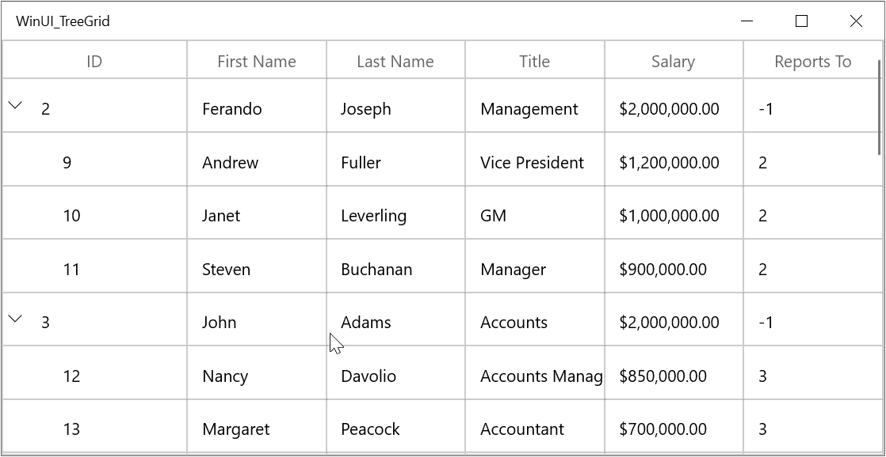

### Styling TreeGridColumn

`TreeGridColumn` support to customize the style of particular column using [TreeGridColumn.CellStyle](https://help.syncfusion.com/cr/winui/Syncfusion.UI.Xaml.Grids.GridColumnBase.html#Syncfusion_UI_Xaml_Grids_GridColumnBase_CellStyle) property.
 
#### Change the font setting

You can change the font settings such as `FontSize`, `FontFamily`, `FontWeight` etc. by writing style of TargetType `TreeGridCell` or `TreeGridColumn.CellStyle` property.



<treeGrid:SfTreeGrid Name="treeGrid"
                ColumnWidthMode="Star"
                AutoExpandMode="AllNodesExpanded"
                AutoGenerateColumns="False"
                ChildPropertyName="ReportsTo"
                ItemsSource="{Binding Employees}"
                ParentPropertyName="ID"
                SelfRelationRootValue="-1" >
    <treeGrid:SfTreeGrid.Columns>
        <treeGrid:TreeGridTextColumn HeaderText="First Name" MappingName="FirstName" />
        <treeGrid:TreeGridTextColumn HeaderText="Last Name" MappingName="LastName">
            <treeGrid:TreeGridTextColumn.CellStyle>
                
            </treeGrid:TreeGridTextColumn.CellStyle>
        </treeGrid:TreeGridTextColumn>
        <treeGrid:TreeGridNumericColumn HeaderText="Employee ID" MappingName="ID" />
        <treeGrid:TreeGridTextColumn HeaderText="Title" MappingName="Title" />
        <treeGrid:TreeGridNumericColumn MappingName="Salary" HeaderText="Salary" DisplayNumberFormat="C2"/>
        <treeGrid:TreeGridNumericColumn HeaderText="Reports To" MappingName="ReportsTo" />
    </treeGrid:SfTreeGrid.Columns>
</treeGrid:SfTreeGrid>



When column is auto-generated, you can style the column by handling `AutoGeneratingColumn` event



<Application.Resources>       
            
</Application.Resources>





treeGrid.AutoGeneratingColumn += TreeGrid_AutoGeneratingColumn;

private void TreeGrid_AutoGeneratingColumn(object sender, TreeGridAutoGeneratingColumnEventArgs e)
{

    if (e.Column.MappingName == "FirstName")
    {
         e.Column.CellStyle=App.Current.Resources["cellStyle"] as Style;
    }
}



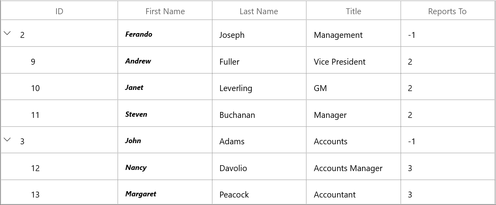

#### Styles based on custom logic

You can apply the styles to columns based on certain condition using `TreeGridColumn.CellStyleSelector` property.

Below code creates two different styles by TargetType `TreeGridCell`.



<Application.Resources>
    
    
</Application.Resources>



In the below code, returns the style based on `ID` value. Using `Container` you can format the columns data based on `TreeGridCell`.



public class CustomCellStyleSelector : StyleSelector
{
    protected override Style SelectStyleCore(object item, DependencyObject container)
    {
        var treeGridCell = container as TreeGridCell;
        var mappingName = treeGridCell.ColumnBase.TreeGridColumn.MappingName;
        var record = treeGridCell.DataContext;
        var cellValue = record.GetType().GetProperty(mappingName).GetValue(record);

        if (mappingName.Equals("ID"))
        {

            if (Convert.ToInt16(cellValue)%3==0)
                return App.Current.Resources["cellStyle1"] as Style;

            else
                return App.Current.Resources["cellStyle2"] as Style;
        }
        return base.SelectStyle(item, container);
    }
}



Below code, sets the customized style selector to `TreeGridColumn.CellStyleSelector` property.



<treeGrid:SfTreeGrid Name="treeGrid"
                        AutoExpandMode="AllNodesExpanded"
                        AutoGenerateColumns="True"
                        ChildPropertyName="ReportsTo"
                        ItemsSource="{Binding Employees}"
                        ParentPropertyName="ID">
    <treeGrid:SfTreeGrid.Resources>
        <local:CustomCellStyleSelector x:Key="cellStyleSelector" />                
    </treeGrid:SfTreeGrid.Resources>
    <treeGrid:SfTreeGrid.Columns>
        <treeGrid:TreeGridNumericColumn HeaderText="Employee ID" MappingName="ID"  
                                        CellStyleSelector="{StaticResource cellStyleSelector}" />
    </treeGrid:SfTreeGrid.Columns>
</treeGrid:SfTreeGrid>



When column is auto-generated, you can style the column by handling `AutoGeneratingColumn` event



treeGrid.AutoGeneratingColumn += TreeGrid_AutoGeneratingColumn;

private void TreeGrid_AutoGeneratingColumn(object sender, TreeGridAutoGeneratingColumnEventArgs e)
{
    if (e.Column.MappingName == "ID")
    {
        e.Column.CellStyleSelector = new CustomCellStyleSelector();
    }
}



### UI Interaction

#### Hide Column

You can hide or unhide the particular column programmatically by setting [TreeGridColumn.IsHidden](https://help.syncfusion.com/cr/winui/Syncfusion.UI.Xaml.Grids.GridColumnBase.html#Syncfusion_UI_Xaml_Grids_GridColumnBase_IsHidden) property. For allowing end-user to hide or unhide column in UI refer [Resizing Columns](https://help.syncfusion.com/winui/treegrid/column-sizing) section.

#### Disable column

You can disable column by setting [TreeGridColumn.AllowFocus](https://help.syncfusion.com/cr/winui/Syncfusion.UI.Xaml.Grids.GridColumnBase.html#Syncfusion_UI_Xaml_Grids_GridColumnBase_AllowFocus) property. Therefore, that column can’t be selected or edited. 

### Width, alignment and padding settings

#### Width

The width of `TreeGridColumn` can be changed by setting `Width` property. Column width set based on [TreeGridColumn.MinimumWidth](https://help.syncfusion.com/cr/winui/Syncfusion.UI.Xaml.Grids.GridColumnBase.html#Syncfusion_UI_Xaml_Grids_GridColumnBase_MinimumWidth) and [TreeGridColumn.MaximumWidth](https://help.syncfusion.com/cr/winui/Syncfusion.UI.Xaml.Grids.GridColumnBase.html#Syncfusion_UI_Xaml_Grids_GridColumnBase_MaximumWidth) properties.

N> If the `TreeGridColumn.Width` is defined explicitly takes priority than `TreeGridColumn.ColumnSizer`.

#### Padding

TreeGridColumn allows you to the change the padding of cell content by setting `Padding` property. 

#### Alignment

TreeGridColumn allows you to change the alignment of `TreeGridCell` and `TreeGridHeaderCellControl` content using `TextAlignment`, `VerticalAlignment` and `HorizontalHeaderContentAlignment` properties.

## TreeGridTextColumnBase

[TreeGridTextColumnBase](https://help.syncfusion.com/cr/winui/Syncfusion.UI.Xaml.TreeGrid.TreeGridTextColumnBase.html) is the abstract class derived from `TreeGridColumn`. The following columns are derived from the `TreeGridTextColumnBase`.

1. TreeGridTextColumn

2. TreeGridNumericColumn

3. TreeGridDateColumn

4. TreeGridTimeColumn

5. TreeGridTemplateColumn

### TreeGridTextColumnBase properties

* Text trimming - You can [trim](https://docs.microsoft.com/en-us/windows/winui/api/microsoft.ui.xaml.texttrimming?view=winui-3.0) the column’s data using the [TextTrimming](https://help.syncfusion.com/cr/winui/Syncfusion.UI.Xaml.TreeGrid.TreeGridTextColumnBase.html#Syncfusion_UI_Xaml_TreeGrid_TreeGridTextColumnBase_TextTrimming) property.

* Text wrapping - You can [wrap](https://docs.microsoft.com/en-us/windows/winui/api/microsoft.ui.xaml.textwrapping?view=winui-3.0) the column’s data using the [TextWrapping](https://help.syncfusion.com/cr/winui/Syncfusion.UI.Xaml.TreeGrid.TreeGridTextColumnBase.html#Syncfusion_UI_Xaml_TreeGrid_TreeGridTextColumnBase_TextWrapping) property. 



<treeGrid:SfTreeGrid Name="treeGrid"                               
                AutoExpandMode="AllNodesExpanded"
                AutoGenerateColumns="True"
                ChildPropertyName="ReportsTo"
                ItemsSource="{Binding Employees}"
                ParentPropertyName="ID">
    <treeGrid:SfTreeGrid.Columns>
        <treeGrid:TreeGridTextColumn HeaderText="Last Name" 
                                       MappingName="LastName"  
                                       Width="60" 
                                       TextTrimming="CharacterEllipsis" 
                                       TextWrapping="Wrap"/>
    </treeGrid:SfTreeGrid.Columns>
</treeGrid:SfTreeGrid>



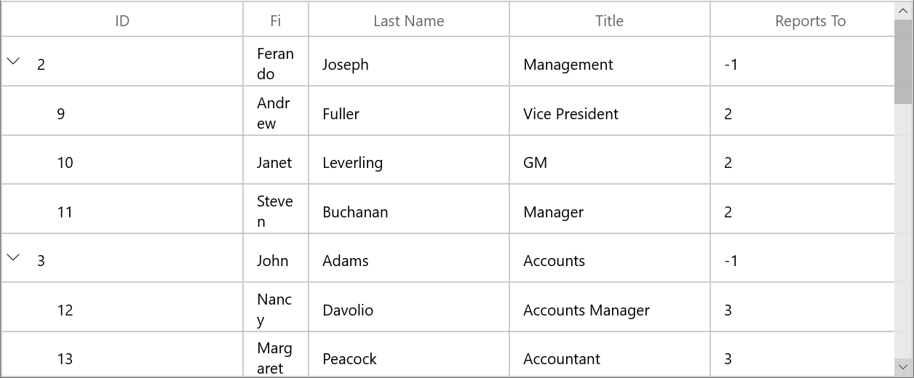

## TreeGridTextColumn

`TreeGridTextColumn` derived from `TreeGridTextColumnBase` which hosts `TextBox` in edit mode.



<treeGrid:SfTreeGrid Name="treeGrid"   
                AutoGenerateColumns="False"
                ChildPropertyName="ReportsTo"
                ItemsSource="{Binding Employees}"
                ParentPropertyName="ID">
    <treeGrid:SfTreeGrid.Columns>
        <treeGrid:TreeGridTextColumn HeaderText="First Name" 
                                       MappingName="FirstName"  
                                      />
    </treeGrid:SfTreeGrid.Columns>
</treeGrid:SfTreeGrid>


treeGrid.Columns.Add(new TreeGridTextColumn()
{
    MappingName = "FirstName",
    HeaderText = "First Name"
});



### Spell check while editing

You can enable spell check in TreeGridTextColumn using `IsSpellCheckEnabled` property.



<treeGrid:TreeGridTextColumn HeaderText="First Name" 
                               IsSpellCheckEnabled="True"
                               MappingName="FirstName"  />


this.treeGrid.Columns.Add(new TreeGridTextColumn() { MappingName = "FirstName", HeaderText = "First Name", IsSpellCheckEnabled = true });



## TreeGridNumericColumn

[TreeGridNumericColumn](https://help.syncfusion.com/cr/winui/Syncfusion.UI.Xaml.TreeGrid.TreeGridNumericColumn.html) is derived from `TreeGridTextColumnBase` and hosts [NumberBox](https://help.syncfusion.com/cr/winui/Syncfusion.UI.Xaml.Editors.SfNumberBox.html) in edit mode.



<treeGrid:SfTreeGrid x:Name="treeGrid"
                AutoExpandMode="RootNodesExpanded" 
                AutoGenerateColumns="False" 
                AllowEditing="True" 
                ItemsSource="{Binding EmployeeDetails}"
                ChildPropertyName="ReportsTo"
                ParentPropertyName="ID"
                SelfRelationRootValue="-1" >
    <treeGrid:SfTreeGrid.Columns>
        <treeGrid:TreeGridTextColumn MappingName="FirstName" HeaderText="First Name" />
        <treeGrid:TreeGridTextColumn MappingName="LastName" HeaderText="Last Name" />
        <treeGrid:TreeGridNumericColumn HeaderText="Employee ID" MappingName="ID" />
        <treeGrid:TreeGridTextColumn MappingName="Title" HeaderText="Title" />
        <treeGrid:TreeGridNumericColumn MappingName="Salary" HeaderText="Salary" />        
        <treeGrid:TreeGridNumericColumn MappingName="ReportsTo" HeaderText="Reports To" />
    </treeGrid:SfTreeGrid.Columns>
</treeGrid:SfTreeGrid>


this.treeGrid.Columns.Add(new TreeGridNumericColumn()
{
    HeaderText = "Salary",
    MappingName = "Salary",                               
});



### Change the format of numeric value

You can format the value of a `TreeGridNumericColumn` using the [DisplayNumberFormat](https://help.syncfusion.com/cr/winui/Syncfusion.UI.Xaml.TreeGrid.TreeGridNumericColumn.html#Syncfusion_UI_Xaml_TreeGrid_TreeGridNumericColumn_DisplayNumberFormat) or [NumberFormatter](https://help.syncfusion.com/cr/winui/Syncfusion.UI.Xaml.TreeGrid.TreeGridNumericColumn.html#Syncfusion_UI_Xaml_TreeGrid_TreeGridNumericColumn_NumberFormatter) property. The default value of `DisplayNumberFormat` and `NumberFormatter` properties are **null**.

The following example shows how to set [CurrencyFormatter](https://docs.microsoft.com/en-us/uwp/api/windows.globalization.numberformatting.currencyformatter?view=winrt-19041) for `NumberFormatter` property. 

N> To learn more about the formatting classes that can assigned for `NumberFormatter` property. [Refer here](https://docs.microsoft.com/en-us/uwp/api/windows.globalization.numberformatting?view=winrt-19041#classes)



CultureInfo culture = new CultureInfo("en-US");

// Format numericColumn in currency
numericColumn.NumberFormatter = new CurrencyFormatter(new RegionInfo(culture.LCID).ISOCurrencySymbol);



You can also set the [PercentFormatter](https://docs.microsoft.com/en-us/uwp/api/windows.globalization.numberformatting.percentformatter?view=winrt-19041) and [DecimalFormatter](https://docs.microsoft.com/en-us/uwp/api/windows.globalization.numberformatting.decimalformatter?view=winrt-19041) for `NumberFormatter` property to format the values in percent and numeric custom formats.   

Using the **N**, **C**, and **P** format values, you can apply numeric, currency, and percent custom formats in `DisplayNumberFormat` property.

N> When using both the `DisplayNumberFormat` and the `NumberFormatter` properties, the `DisplayNumberFormat` property takes high precedence. 



<treeGrid:SfTreeGrid x:Name="treeGrid" 
                AutoExpandMode="RootNodesExpanded" 
                AutoGenerateColumns="False" 
                AllowEditing="True"
                ItemsSource="{Binding EmployeeDetails}"
                ChildPropertyName="ReportsTo"
                ParentPropertyName="ID"
                SelfRelationRootValue="-1" >
    <treeGrid:SfTreeGrid.Columns>
        <treeGrid:TreeGridTextColumn MappingName="FirstName" HeaderText="First Name" />
        <treeGrid:TreeGridTextColumn MappingName="LastName" HeaderText="Last Name" />
        <treeGrid:TreeGridNumericColumn HeaderText="Employee ID" MappingName="ID" />
        <treeGrid:TreeGridTextColumn MappingName="Title" HeaderText="Title" />
        <treeGrid:TreeGridNumericColumn MappingName="Salary" HeaderText="Salary" DisplayNumberFormat="C2" />
        <treeGrid:TreeGridNumericColumn MappingName="ReportsTo" HeaderText="Reports To" />
    </treeGrid:SfTreeGrid.Columns>
</treeGrid:SfTreeGrid>


// Format numericColumn in currency
numericColumn.DisplayNumberFormat = "C2";



### Null value support

`TreeGridNumericColumn` provides support to restrict or allow null value in columns based on [AllowNull](https://help.syncfusion.com/cr/winui/Syncfusion.UI.Xaml.TreeGrid.TreeGridNumericColumn.html#Syncfusion_UI_Xaml_TreeGrid_TreeGridNumericColumn_AllowNull) property. Instead of displaying null values, you can display hint text using the [PlaceholderText](https://help.syncfusion.com/cr/winui/Syncfusion.UI.Xaml.TreeGrid.TreeGridNumericColumn.html#Syncfusion_UI_Xaml_TreeGrid_TreeGridNumericColumn_PlaceholderText) property.

The `PlaceholderText` is not displayed, when the `AllowNull` is set to `false`.



<treeGrid:SfTreeGrid x:Name="treeGrid"
                AutoExpandMode="RootNodesExpanded" 
                AutoGenerateColumns="False" 
                AllowEditing="True"
                ItemsSource="{Binding EmployeeDetails}"
                ChildPropertyName="ReportsTo" 
                ParentPropertyName="ID"
                SelfRelationRootValue="-1"  >
    <treeGrid:SfTreeGrid.Columns>
        <treeGrid:TreeGridTextColumn MappingName="FirstName" HeaderText="First Name" />
        <treeGrid:TreeGridTextColumn MappingName="LastName" HeaderText="Last Name" />
        <treeGrid:TreeGridNumericColumn HeaderText="Employee ID" MappingName="ID" />
        <treeGrid:TreeGridTextColumn MappingName="Title" HeaderText="Title" />
        <treeGrid:TreeGridNumericColumn MappingName="Salary" HeaderText="Salary" DisplayNumberFormat="C2"
                                        AllowNull="True" PlaceholderText="Enter the amount" />
        <treeGrid:TreeGridNumericColumn MappingName="ReportsTo" HeaderText="Reports To" />
    </treeGrid:SfTreeGrid.Columns>
</treeGrid:SfTreeGrid>



### Restrict value within range

You can restrict the users to enter input within a minimum and maximum range in `TreeGridNumericColumn` using the [MinValue](https://help.syncfusion.com/cr/winui/Syncfusion.UI.Xaml.TreeGrid.TreeGridNumericColumn.html#Syncfusion_UI_Xaml_TreeGrid_TreeGridNumericColumn_MinValue) and [MaxValue](https://help.syncfusion.com/cr/winui/Syncfusion.UI.Xaml.TreeGrid.TreeGridNumericColumn.html#Syncfusion_UI_Xaml_TreeGrid_TreeGridNumericColumn_MaxValue) properties. The default value of the `MinValue` property is **double.MinValue** and `MaxValue` property is **double.MaxValue**.



<treeGrid:SfTreeGrid x:Name="treeGrid" 
                AutoExpandMode="RootNodesExpanded" 
                AutoGenerateColumns="False"
                AllowEditing="True"
                ItemsSource="{Binding EmployeeDetails}"
                ChildPropertyName="ReportsTo"
                ParentPropertyName="ID"
                SelfRelationRootValue="-1"   >
    <treeGrid:SfTreeGrid.Columns>
        <treeGrid:TreeGridNumericColumn MappingName="Salary" HeaderText="Salary" MaxValue="100000" MinValue="5000" />
    </treeGrid:SfTreeGrid.Columns>
</treeGrid:SfTreeGrid>



### UpDown button placement

You can increase or decrease the value of the `TreeGridNumericColumn` using the up-down button. By default, the value of [UpDownPlacementMode](https://help.syncfusion.com/cr/winui/Syncfusion.UI.Xaml.TreeGrid.TreeGridNumericColumn.html#Syncfusion_UI_Xaml_TreeGrid_TreeGridNumericColumn_UpDownPlacementMode) property is [Hidden](https://help.syncfusion.com/cr/winui/Syncfusion.UI.Xaml.Editors.NumberBoxUpDownPlacementMode.html#Syncfusion_UI_Xaml_Editors_NumberBoxUpDownPlacementMode_Hidden). You can change the up-down button position by assigning the value `UpDownPlacementMode` property as [Inline](https://help.syncfusion.com/cr/winui/Syncfusion.UI.Xaml.Editors.NumberBoxUpDownPlacementMode.html#Syncfusion_UI_Xaml_Editors_NumberBoxUpDownPlacementMode_Inline) or [Compact](https://help.syncfusion.com/cr/winui/Syncfusion.UI.Xaml.Editors.NumberBoxUpDownPlacementMode.html#Syncfusion_UI_Xaml_Editors_NumberBoxUpDownPlacementMode_Compact).



<treeGrid:SfTreeGrid x:Name="treeGrid"
                AutoExpandMode="RootNodesExpanded" 
                AutoGenerateColumns="False"
                AllowEditing="True"
                ItemsSource="{Binding EmployeeDetails}"
                ChildPropertyName="ReportsTo"
                ParentPropertyName="ID"
                SelfRelationRootValue="-1"   >
    <treeGrid:SfTreeGrid.Columns>
        <treeGrid:TreeGridNumericColumn MappingName="Salary" HeaderText="Salary" UpDownPlacementMode="InLine" />
    </treeGrid:SfTreeGrid.Columns>
</treeGrid:SfTreeGrid>



## TreeGridDateColumn

[TreeGridDateColumn](https://help.syncfusion.com/cr/winui/Syncfusion.UI.Xaml.TreeGrid.TreeGridDateColumn.html) is derived from `TreeGridTextColumnBase` and displays columns data as date. It hosts [SfCalendarDatePicker](https://help.syncfusion.com/cr/winui/Syncfusion.UI.Xaml.Calendar.SfCalendarDatePicker.html) element in editing mode.



<treeGrid:SfTreeGrid x:Name="treeGrid" 
                ChildPropertyName="ReportsTo"
                AutoExpandMode="RootNodesExpanded"
                ItemsSource="{Binding EmployeeDetails}"
                ParentPropertyName="ID" 
                SelfRelationRootValue="-1" 
                AllowEditing="True" 
                AutoGenerateColumns="False">
    <treeGrid:SfTreeGrid.Columns>
        <treeGrid:TreeGridTextColumn MappingName="FirstName" HeaderText="First Name" />
        <treeGrid:TreeGridTextColumn MappingName="LastName" HeaderText="Last Name" />
        <treeGrid:TreeGridNumericColumn HeaderText="Employee ID" MappingName="ID" />
        <treeGrid:TreeGridDateColumn MappingName="Date" HeaderText="Date" />
        <treeGrid:TreeGridTextColumn MappingName="Title" HeaderText="Title" />
        <treeGrid:TreeGridNumericColumn MappingName="ReportsTo" HeaderText="Reports To" />
    </treeGrid:SfTreeGrid.Columns>
</treeGrid:SfTreeGrid>


this.treeGrid.Columns.Add(new TreeGridDateColumn() { HeaderText = "Date", MappingName = "Date" });



### Change the format of date value

By using the [DisplayDateFormat](https://help.syncfusion.com/cr/winui/Syncfusion.UI.Xaml.TreeGrid.TreeGridDateColumn.html#Syncfusion_UI_Xaml_TreeGrid_TreeGridDateColumn_DisplayDateFormat) property, you can edit and display the selected date in various formats such as date, month and year formats. The default value of `DisplayDateFormat` property is **d**. For example, in the below image, the DateColumn has a `DisplayDateFormat` set to **M**.



<treeGrid:SfTreeGrid x:Name="treeGrid" 
                ChildPropertyName="ReportsTo"
                AutoExpandMode="RootNodesExpanded"
                ItemsSource="{Binding EmployeeDetails}"
                ParentPropertyName="ID" 
                SelfRelationRootValue="-1" 
                AllowEditing="True" 
                AutoGenerateColumns="False">
    <treeGrid:SfTreeGrid.Columns>
        <treeGrid:TreeGridTextColumn MappingName="FirstName" HeaderText="First Name" />
        <treeGrid:TreeGridTextColumn MappingName="LastName" HeaderText="Last Name" />
        <treeGrid:TreeGridNumericColumn HeaderText="Employee ID" MappingName="ID" />
        <treeGrid:TreeGridDateColumn MappingName="Date" HeaderText="Date" DisplayDateFormat="M" />
        <treeGrid:TreeGridTextColumn MappingName="Title" HeaderText="Title" />
        <treeGrid:TreeGridNumericColumn MappingName="ReportsTo" HeaderText="Reports To" />
    </treeGrid:SfTreeGrid.Columns>
</treeGrid:SfTreeGrid>


this.treeGrid.Columns.Add(new TreeGridDateColumn() { HeaderText = "Date", MappingName = "Date" , DisplayDateFormat="M" });



### Null value support

`TreeGridDateColumn` provides support to restrict or allow null value in columns based on [AllowNull](https://help.syncfusion.com/cr/winui/Syncfusion.UI.Xaml.TreeGrid.TreeGridDateColumn.html#Syncfusion_UI_Xaml_TreeGrid_TreeGridDateColumn_AllowNull) property. Instead of displaying null values, you can display hint text using the [PlaceholderText](https://help.syncfusion.com/cr/winui/Syncfusion.UI.Xaml.TreeGrid.TreeGridDateColumn.html#Syncfusion_UI_Xaml_TreeGrid_TreeGridDateColumn_PlaceholderText) property.

The `PlaceholderText` is not displayed, when the `AllowNull` is set to `false`.



<treeGrid:SfTreeGrid x:Name="treeGrid" 
                ChildPropertyName="ReportsTo"
                AutoExpandMode="RootNodesExpanded"
                ItemsSource="{Binding EmployeeDetails}"
                ParentPropertyName="ID" 
                SelfRelationRootValue="-1" 
                AllowEditing="True"
                AutoGenerateColumns="False">
    <treeGrid:SfTreeGrid.Columns>
        <treeGrid:TreeGridTextColumn MappingName="FirstName" HeaderText="First Name" />
        <treeGrid:TreeGridTextColumn MappingName="LastName" HeaderText="Last Name" />
        <treeGrid:TreeGridNumericColumn HeaderText="Employee ID" MappingName="ID" />
        <treeGrid:TreeGridDateColumn MappingName="Date" HeaderText="Date" AllowNull="True" PlaceholderText="Change the date" />
        <treeGrid:TreeGridTextColumn MappingName="Title" HeaderText="Title" />
        <treeGrid:TreeGridNumericColumn MappingName="ReportsTo" HeaderText="Reports To" />
    </treeGrid:SfTreeGrid.Columns>
</treeGrid:SfTreeGrid>




### Setting date value range

You can restrict and display the input value within the range using the [MinDate](https://help.syncfusion.com/cr/winui/Syncfusion.UI.Xaml.TreeGrid.TreeGridDateColumn.html#Syncfusion_UI_Xaml_TreeGrid_TreeGridDateColumn_MinDate) and [MaxDate](https://help.syncfusion.com/cr/winui/Syncfusion.UI.Xaml.TreeGrid.TreeGridDateColumn.html#Syncfusion_UI_Xaml_TreeGrid_TreeGridDateColumn_MaxDate) properties.

## TreeGridCheckBoxColumn

[TreeGridCheckBoxColumn](https://help.syncfusion.com/cr/winui/Syncfusion.UI.Xaml.TreeGrid.TreeGridCheckBoxColumn.html) derived from `TreeGridColumn` and it used display and edit `Boolean` type data. It hosts `CheckBox` element as `TreeGridCell` content.




<treeGrid:SfTreeGrid Name="treeGrid"
        ColumnWidthMode="Star"
        AllowEditing="True"
        AutoExpandMode="AllNodesExpanded"
        AutoGenerateColumns="False"
        ChildPropertyName="ReportsTo"
        ItemsSource="{Binding Employees}"
        ParentPropertyName="ID"
        SelfRelationRootValue="-1" >
    <treeGrid:SfTreeGrid.Columns>
        <treeGrid:TreeGridTextColumn HeaderText="First Name" MappingName="FirstName"/>
        <treeGrid:TreeGridTextColumn HeaderText="Last Name" MappingName="LastName" />
        <treeGrid:TreeGridNumericColumn HeaderText="Employee ID" MappingName="ID" />
        <treeGrid:TreeGridTextColumn MappingName="Title" />
        <treeGrid:TreeGridCheckBoxColumn HeaderText="Availability" MappingName="AvailabilityStatus" />
        <treeGrid:TreeGridTextColumn HeaderText="Reports To" MappingName="ReportsTo" />
    </treeGrid:SfTreeGrid.Columns>
</treeGrid:SfTreeGrid>


treeGrid.Columns.Add(new TreeGridCheckBoxColumn()
{
    MappingName = "AvailabilityStatus",
    HeaderText = "Available Status"
});



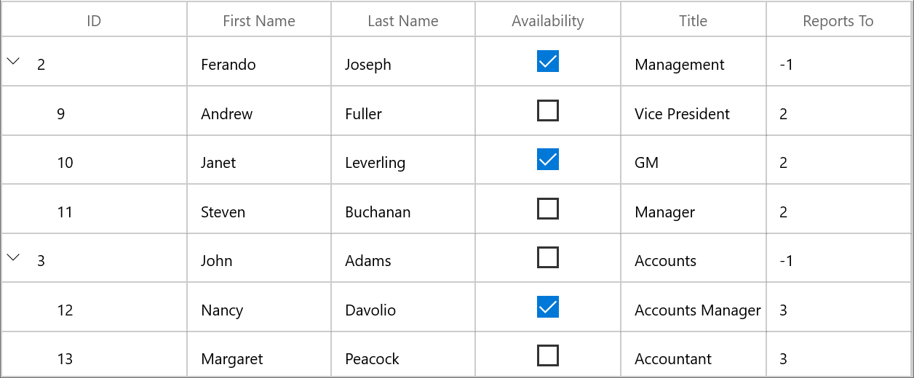

`TreeGridCheckBoxColumn` allows you to customize check box state and its alignment.

* [IsThreeState](https://help.syncfusion.com/cr/winui/Syncfusion.UI.Xaml.TreeGrid.TreeGridCheckBoxColumn.html#Syncfusion_UI_Xaml_TreeGrid_TreeGridCheckBoxColumn_IsThreeState) - By default, the `TreeGridCheckBoxColumn` has `Checked` and `Unchecked` state. You can enable another `Intermediate` state setting `IsThreeState` property to `true`.

* [HorizontalAlignment](https://help.syncfusion.com/cr/winui/Syncfusion.UI.Xaml.TreeGrid.TreeGridCheckBoxColumn.html#Syncfusion_UI_Xaml_TreeGrid_TreeGridCheckBoxColumn_HorizontalAlignment) - You can change the horizontal alignment of CheckBox using `HorizontalAlignment` property.  

## TreeGridTemplateColumn

[TreeGridTemplateColumn](https://help.syncfusion.com/cr/winui/Syncfusion.UI.Xaml.TreeGrid.TreeGridTemplateColumn.html) derived from `TreeGridTextColumnBase` and it displays the template-specified cell content. You can load any WinUI control in the display mode for all columns by setting `CellTemplate` and `EditTemplate` properties.



xmlns:treeGrid="using:Syncfusion.UI.Xaml.TreeGrid"

<treeGrid:SfTreeGrid Name="treeGrid"
                ChildPropertyName="ReportsTo"
                ItemsSource="{Binding Employees}"
                ParentPropertyName="ID">
    <treeGrid:SfTreeGrid.Columns>
        <treeGrid:TreeGridTemplateColumn MappingName="FirstName" HeaderText="First Name">
            <treeGrid:TreeGridTemplateColumn.CellTemplate>
                <DataTemplate>
                    <TextBlock Text="{Binding FirstName}"/>
                </DataTemplate>
            </treeGrid:TreeGridTemplateColumn.CellTemplate>
            <treeGrid:TreeGridTemplateColumn.EditTemplate>
                <DataTemplate>
                    <TextBox Text="{Binding FirstName}" />
                </DataTemplate>
            </treeGrid:TreeGridTemplateColumn.EditTemplate>
        </treeGrid:TreeGridTemplateColumn>
    </treeGrid:SfTreeGrid.Columns>
</treeGrid:SfTreeGrid>


StringBuilder sb1 = new StringBuilder();
sb1.Append("<DataTemplate xmlns=\"http://schemas.microsoft.com/winfx/2006/xaml/presentation\">");
sb1.Append("<TextBlock Text=\"{Binding FirstName}\" />");
sb1.Append("</DataTemplate>");
DataTemplate cellTemplate = (DataTemplate)XamlReader.Load(sb1.ToString());

StringBuilder sb2 = new StringBuilder();
sb2.Append("<DataTemplate xmlns=\"http://schemas.microsoft.com/winfx/2006/xaml/presentation\">");
sb2.Append("<TextBox Text=\"{Binding FirstName, Mode=TwoWay}\" />");
sb2.Append("</DataTemplate>");
DataTemplate editTemplate = (DataTemplate)XamlReader.Load(sb2.ToString());

this.treeGrid.Columns.Add(new TreeGridTemplateColumn()
{
    MappingName = "FirstName",
    CellTemplate = cellTemplate,
    EditTemplate = editTemplate
});



### Sets EditTemplate based on custom logic

`TreeGridTemplateColumn` provides support to load different edit elements based on underlying data object using [TreeGridTemplateColumn.EditTemplateSelector](https://help.syncfusion.com/cr/winui/Syncfusion.UI.Xaml.TreeGrid.TreeGridTemplateColumn.html#Syncfusion_UI_Xaml_TreeGrid_TreeGridTemplateColumn_EditTemplateSelector) property.

Below code returns the `DefaultTemplate` and `AlternateTemplate` based on ID’s value.



<Application.Resources>
    <DataTemplate x:Key="DefaultCellTemplate">
        <TextBlock VerticalAlignment="Center"
               Foreground="Red"
               Text="{Binding Path=ID}"
               TextAlignment="Center" />
    </DataTemplate>

    <DataTemplate x:Key="AlternateCellTemplate">
        <TextBlock VerticalAlignment="Center"
               Foreground="Green"
               Text="{Binding Path=ID}"
               TextAlignment="Center" />
    </DataTemplate>

    <DataTemplate x:Key="DefaultEditTemplate">
        <TextBox Height="45"
             VerticalAlignment="Center"
             Foreground="Red"
             Text="{Binding Path=ID}"
             TextAlignment="Center" />
    </DataTemplate>

    <DataTemplate x:Key="AlternateEditTemplate">
        <TextBox Height="45"
             VerticalAlignment="Center"
             Foreground="Green"
             Text="{Binding Path=ID}"
             TextAlignment="Center" />
    </DataTemplate>
</Application.Resources>


public class CustomCellTemplateSelector : DataTemplateSelector
{
    protected override DataTemplate SelectTemplateCore(object item, DependencyObject container)
    {

        if (item == null)
            return null;

        var data = item as EmployeeInfo;

        if (data.ID % 2 == 0)
            return App.Current.Resources["AlternateCellTemplate"] as DataTemplate;

        else
            return App.Current.Resources["DefaultCellTemplate"] as DataTemplate;
    }
}

public class CustomEditTemplateSelector : DataTemplateSelector
{

    protected override DataTemplate SelectTemplateCore(object item, DependencyObject container)
    {

        if (item == null)
            return null;

        var data = item as EmployeeInfo;

        if (data.ID % 2 == 0)
            return App.Current.Resources["AlternateEditTemplate"] as DataTemplate;

        else
            return App.Current.Resources["DefaultEditTemplate"] as DataTemplate;
    }
}



In the below code, custom template selector set to `TreeGridTemplateColumn.EditTemplateSelector`.



<treeGrid:SfTreeGrid Name="treeGrid"
            AllowEditing="True"
            AutoExpandMode="RootNodesExpanded"
            AutoGenerateColumns="False"
            ChildPropertyName="ReportsTo"
            ItemsSource="{Binding Employees}"
            ParentPropertyName="ID">
    <treeGrid:SfTreeGrid.Resources>
        <local:CustomCellTemplateSelector x:Key="cellTemplateSelector" />
        <local:CustomEditTemplateSelector x:Key="editTemplateSelector" />
    </treeGrid:SfTreeGrid.Resources>
    <treeGrid:SfTreeGrid.Columns>
        <treeGrid:TreeGridTemplateColumn CellTemplateSelector="{StaticResource cellTemplateSelector}"
            EditTemplateSelector="{StaticResource editTemplateSelector}" HeaderText="Employee ID" MappingName="ID" />
    </treeGrid:SfTreeGrid.Columns>
</treeGrid:SfTreeGrid>



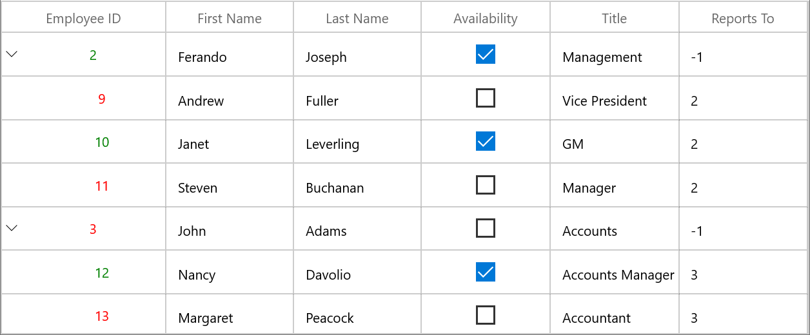

## TreeGridComboBoxColumn

[TreeGridComboBoxColumn](https://help.syncfusion.com/cr/winui/Syncfusion.UI.Xaml.TreeGrid.TreeGridComboBoxColumn.html) derived from `TreeGridColumn` which hosts `ComboBox` as edit element. The data source to ComboBox can be set by using [TreeGridComboBoxColumn.ItemsSource](https://help.syncfusion.com/cr/winui/Syncfusion.UI.Xaml.TreeGrid.TreeGridComboBoxColumn.html#Syncfusion_UI_Xaml_TreeGrid_TreeGridComboBoxColumn_ItemsSource) property.

By default, `TreeGridComboBoxColumn` displays the value using `MappingName` property. You can set [DisplayMemberPath](https://help.syncfusion.com/cr/winui/Syncfusion.UI.Xaml.TreeGrid.TreeGridComboBoxColumn.html#Syncfusion_UI_Xaml_TreeGrid_TreeGridComboBoxColumn_DisplayMemberPath) which denotes the path to a value on the source object (TreeGridComboBoxColumn.ItemsSource) to serve as the visual representation of object. You can set the `SelectedValuePath` which denotes the path to get the SelectedValue from the SelectedItem. 



<treeGrid:SfTreeGrid x:Name="treeGrid"                              
                    AllowEditing="True"
                    AutoExpandMode="RootNodesExpanded"
                    AutoGenerateColumns="False"
                    ChildPropertyName="ReportsTo"
                    ItemsSource="{Binding Employees}"
                    ParentPropertyName="ID">
    <treeGrid:SfTreeGrid.Columns>
        <treeGrid:TreeGridComboBoxColumn ItemsSource="{Binding CityCollection, Source={StaticResource viewModel}}"  MappingName="City" />
    </treeGrid:SfTreeGrid.Columns>
</treeGrid:SfTreeGrid>


treeGrid.Columns.Add(new TreeGridComboBoxColumn()
{
    MappingName = "City",
    ItemsSource = viewModel.CityCollection
});



SfTreeGrid triggers, `CurrentCellDropDownSelectionChanged` event, when the SelectedValue is changed. [CurrentCellDropDownSelectionChangedEventArgs](https://help.syncfusion.com/cr/winui/Syncfusion.UI.Xaml.Grids.CurrentCellDropDownSelectionChangedEventArgs.html) of [CurrentCellDropDownSelectionChanged](https://help.syncfusion.com/cr/winui/Syncfusion.UI.Xaml.TreeGrid.SfTreeGrid.html#Syncfusion_UI_Xaml_TreeGrid_SfTreeGrid_CurrentCellDropDownSelectionChanged) event provides the information about the changed cell value. 

`SelectedIndex` property returns the index of selected item.

`SelectedItem` property returns the selected item from drop down list.

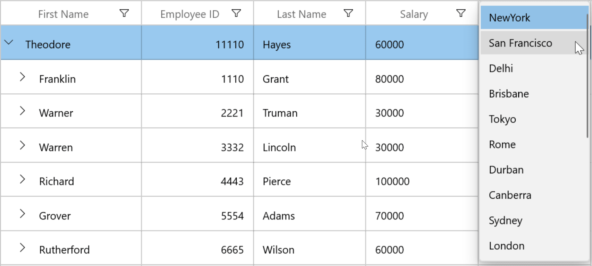

### Improving dropdown opening time

You can improve the drop-down opening time on loading by setting [VirtualizingStackPanel](https://docs.microsoft.com/en-us/windows/winui/api/microsoft.ui.xaml.controls.virtualizingstackpanel?view=winui-3.0) as [ItemsPanelTemplate](https://docs.microsoft.com/en-us/windows/winui/api/microsoft.ui.xaml.controls.itemspaneltemplate?view=winui-3.0) of `ComboBox`, when the large number of items loaded in it.



<Application.Resources>
    
</Application.Resources>



### Opening dropdown popup in single-click

You can open the drop down within single click by setting [ComboBox.IsDropDownOpen](https://docs.microsoft.com/en-us/windows/winui/api/microsoft.ui.xaml.controls.combobox?view=winui-3.0) property to `true` in `OnInitializeEditElement`method by overriding existing renderer.
Below code, creates `TreeGridCellComboBoxRendererExt` to set `IsDropDownOpen` property. Replace the default renderer with created renderer in [SfTreeGrid.CellRenderers](https://help.syncfusion.com/cr/winui/Syncfusion.UI.Xaml.TreeGrid.SfTreeGrid.html#Syncfusion_UI_Xaml_TreeGrid_SfTreeGrid_CellRenderers) collection.



treeGrid.CellRenderers.Remove("ComboBox");
treeGrid.CellRenderers.Add("ComboBox", new TreeGridCellComboBoxRendererExt());

public class TreeGridCellComboBoxRendererExt : TreeGridCellComboBoxRenderer
{

    public override void OnInitializeEditElement(TreeDataColumnBase dataColumn, ComboBox uiElement, object dataContext)
    {
        base.OnInitializeEditElement(dataColumn, uiElement, dataContext);
        uiElement.IsDropDownOpen = true;
    }
}



N> This is applicable when `SfTreeGrid.EditTrigger` is `OnTap`

## TreeGridHyperlinkColumn

[TreeGridHyperlinkColumn](https://help.syncfusion.com/cr/winui/Syncfusion.UI.Xaml.TreeGrid.TreeGridHyperlinkColumn.html) derived from `TreeGridTextColumn` and it displays columns data as hyperlink. It hosts `HyperlinkButton` element as `TreeGridCell` content.



 <treeGrid:SfTreeGrid Name="treeGrid"
                ColumnWidthMode="Star"
                AllowEditing="True"
                AutoExpandMode="AllNodesExpanded"
                AutoGenerateColumns="False"
                ChildPropertyName="ReportsTo"
                ItemsSource="{Binding Employees}"
                ParentPropertyName="ID"
                SelfRelationRootValue="-1" >
    <treeGrid:SfTreeGrid.Columns>
        <treeGrid:TreeGridHyperlinkColumn HeaderText="Last Name" MappingName="LastName"   />
    </treeGrid:SfTreeGrid.Columns>
</treeGrid:SfTreeGrid>


treeGrid.Columns.Add(new TreeGridHyperlinkColumn()
{
    MappingName = "City",
    HeaderText ="City"
});



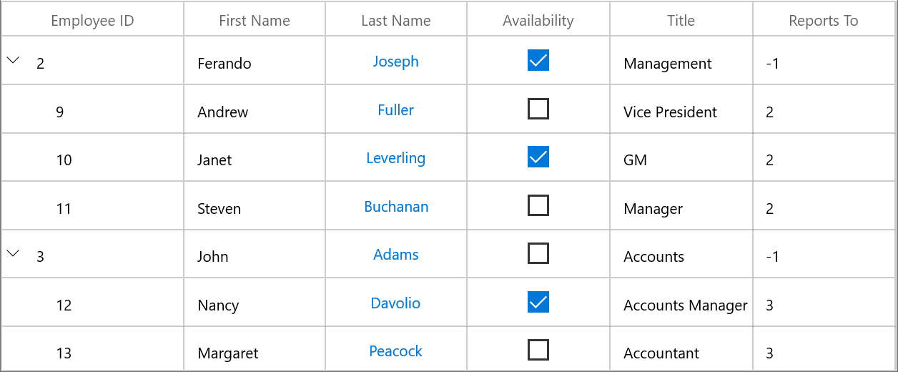

You can allow end-user to navigate the `Uri` when the cell value contains valid `Uri` address or using [CurrentCellRequestNavigate](https://help.syncfusion.com/cr/winui/Syncfusion.UI.Xaml.TreeGrid.SfTreeGrid.html#Syncfusion_UI_Xaml_TreeGrid_SfTreeGrid_CurrentCellRequestNavigate) event. The `CurrentCellRequestNavigate` occurs when the current cell in `TreeGridHyperLinkColumn` is clicked for navigation.  

[CurrentCellRequestNavigateEventArgs](https://help.syncfusion.com/cr/winui/Syncfusion.UI.Xaml.Grids.CurrentCellRequestNavigateEventArgs.html) of `CurrentCellRequestNavigate` event provide information about the hyperlink triggered this event. [CurrentCellRequestNavigateEventArgs.NavigateText](https://help.syncfusion.com/cr/winui/Syncfusion.UI.Xaml.Grids.CurrentCellRequestNavigateEventArgs.html#Syncfusion_UI_Xaml_Grids_CurrentCellRequestNavigateEventArgs_NavigateText) returns the value using `ValueBinding` or `MappingName` to navigate. 



treeGrid.CurrentCellRequestNavigate += TreeGrid_CurrentCellRequestNavigate;
                             
private void TreeGrid_CurrentCellRequestNavigate(object sender, CurrentCellRequestNavigateEventArgs e)
{
    var URI = string.Format("https://en.wikipedia.org/wiki/" + e.NavigateText);
    Windows.System.Launcher.LaunchUriAsync(new Uri(URI));
}



### Cancel the navigation

You can cancel the navigation when clicking hyperlink by setting [CurrentCellRequestNavigateEventArgs.Handled](https://help.syncfusion.com/cr/winui/Syncfusion.UI.Xaml.Grids.CurrentCellRequestNavigateEventArgs.html#Syncfusion_UI_Xaml_Grids_CurrentCellRequestNavigateEventArgs_Handled) to `false`. 



treeGrid.CurrentCellRequestNavigate += TreeGrid_CurrentCellRequestNavigate;  
                             
private async void TreeGrid_CurrentCellRequestNavigate(object sender, Syncfusion.UI.Xaml.Grid.CurrentCellRequestNavigateEventArgs args)
{
   args.Handled = true;
}



### Customize Hyperlink

#### Change the alignment

You can change the horizontal alignment of `TreeGridHyperlinkColumn` using `HorizontalAlignment` property.

#### Change the foreground color

You can change the foreground color of `TreeGridHyperlinkColumn` by writing the style with target type `HyperlinkButton`.



<Application.Resources>
    
</Application.Resources>



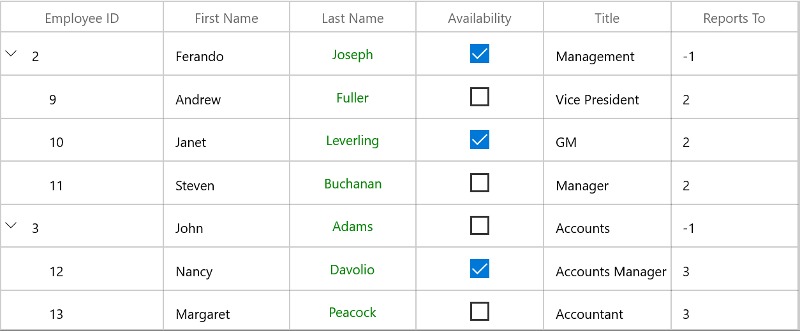

## TreeGridTimeColumn

[TreeGridTimeColumn](https://help.syncfusion.com/cr/winui/Syncfusion.UI.Xaml.TreeGrid.TreeGridTimeColumn.html) is derived from `TreeGridTextColumnBase` and displays column data as time. In editing mode, it hosts the [SfTimePicker](https://help.syncfusion.com/cr/winui/Syncfusion.UI.Xaml.Editors.SfTimePicker.html) element.




<treeGrid:SfTreeGrid Name="treeGrid"
        ColumnWidthMode="Star"
        AllowEditing="True"
        AutoExpandMode="AllNodesExpanded"
        AutoGenerateColumns="False"
        ChildPropertyName="ReportsTo"
        ItemsSource="{Binding Employees}"
        ParentPropertyName="ID"
        SelfRelationRootValue="-1" >
    <treeGrid:SfTreeGrid.Columns>
        <treeGrid:TreeGridTextColumn HeaderText="First Name" MappingName="FirstName"/>
        <treeGrid:TreeGridTextColumn HeaderText="Last Name" MappingName="LastName" />
        <treeGrid:TreeGridNumericColumn HeaderText="Employee ID" MappingName="ID" />
        <treeGrid:TreeGridTimeColumn HeaderText="Reporting Time" MappingName="ReportingTime" />
        <treeGrid:TreeGridTextColumn MappingName="Title" />
        <treeGrid:TreeGridTextColumn HeaderText="Reports To" MappingName="ReportsTo" />
    </treeGrid:SfTreeGrid.Columns>
</treeGrid:SfTreeGrid>


treeGrid.Columns.Add(new TreeGridTimeColumn()
{
    MappingName = "ReportingTime",
    HeaderText = "Reporting Time"
});



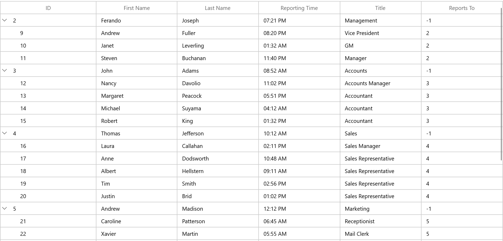

### Change the format of time value

By using the [DisplayTimeFormat](https://help.syncfusion.com/cr/winui/Syncfusion.UI.Xaml.TreeGrid.TreeGridTimeColumn.html#Syncfusion_UI_Xaml_TreeGrid_TreeGridTimeColumn_DisplayTimeFormat) property, you can edit and display the selected time in various formats such as hour, minutes, seconds, meridiem, 12-Hour and 24-Hour format. The default value of `DisplayTimeFormat` property is **hh:mm tt**. For example, in the below image the TimeColumn has `DisplayTimeFormat` set to **HH:mm tt**.




<treeGrid:SfTreeGrid Name="treeGrid"
        ColumnWidthMode="Star"
        AllowEditing="True"
        AutoExpandMode="AllNodesExpanded"
        AutoGenerateColumns="False"
        ChildPropertyName="ReportsTo"
        ItemsSource="{Binding Employees}"
        ParentPropertyName="ID"
        SelfRelationRootValue="-1" >
    <treeGrid:SfTreeGrid.Columns>
        <treeGrid:TreeGridTextColumn HeaderText="First Name" MappingName="FirstName"/>
        <treeGrid:TreeGridTextColumn HeaderText="Last Name" MappingName="LastName" />
        <treeGrid:TreeGridNumericColumn HeaderText="Employee ID" MappingName="ID" />
        <treeGrid:TreeGridTimeColumn HeaderText="Reporting Time" MappingName="ReportingTime" DisplayTimeFormat="HH:mm tt" />
        <treeGrid:TreeGridTextColumn MappingName="Title" />
        <treeGrid:TreeGridTextColumn HeaderText="Reports To" MappingName="ReportsTo" />
    </treeGrid:SfTreeGrid.Columns>
</treeGrid:SfTreeGrid>


treeGrid.Columns.Add(new TreeGridTimeColumn()
{
    MappingName = "ReportingTime",
    HeaderText = "Reporting Time"
    DisplayTimeFormat="HH:mm tt",
});



### Null value support

`TreeGridTimeColumn` provides support to restrict or allow null value in columns based on [AllowNull](https://help.syncfusion.com/cr/winui/Syncfusion.UI.Xaml.TreeGrid.TreeGridTimeColumn.html#Syncfusion_UI_Xaml_TreeGrid_TreeGridTimeColumn_AllowNull) property. The default value of `AllowNull` property is `True`. Instead of displaying null values, you can display hint text using the [PlaceholderText](https://help.syncfusion.com/cr/winui/Syncfusion.UI.Xaml.TreeGrid.TreeGridTimeColumn.html#Syncfusion_UI_Xaml_TreeGrid_TreeGridTimeColumn_PlaceholderText) property.

The `PlaceholderText` is not displayed, when the `AllowNull` is set to `false`. The default value of `PlaceholderText` property is `select a time`.




<treeGrid:SfTreeGrid Name="treeGrid"
        ColumnWidthMode="Star"
        AllowEditing="True"
        AutoExpandMode="AllNodesExpanded"
        AutoGenerateColumns="False"
        ChildPropertyName="ReportsTo"
        ItemsSource="{Binding Employees}"
        ParentPropertyName="ID"
        SelfRelationRootValue="-1" >
    <treeGrid:SfTreeGrid.Columns>
        <treeGrid:TreeGridTextColumn HeaderText="First Name" MappingName="FirstName"/>
        <treeGrid:TreeGridTextColumn HeaderText="Last Name" MappingName="LastName" />
        <treeGrid:TreeGridNumericColumn HeaderText="Employee ID" MappingName="ID" />
        <treeGrid:TreeGridTimeColumn HeaderText="Reporting Time" MappingName="ReportingTime" PlaceholderText="Change the time" />
        <treeGrid:TreeGridTextColumn MappingName="Title" />
        <treeGrid:TreeGridTextColumn HeaderText="Reports To" MappingName="ReportsTo" />
    </treeGrid:SfTreeGrid.Columns>
</treeGrid:SfTreeGrid>


treeGrid.Columns.Add(new TreeGridTimeColumn()
{
    MappingName = "ReportingTime",
    HeaderText = "Reporting Time"
    PlaceholderText="Change the Time",
});




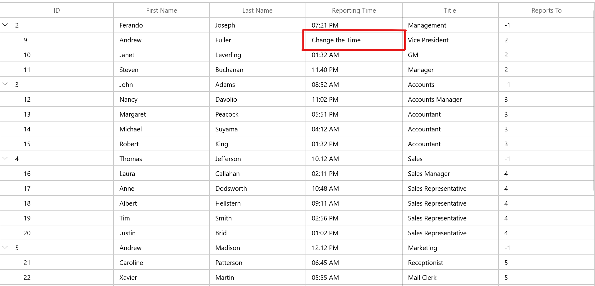

### Setting time value range

You can restrict and display the input value within the range using the [MinTime](https://help.syncfusion.com/cr/winui/Syncfusion.UI.Xaml.TreeGrid.TreeGridTimeColumn.html#Syncfusion_UI_Xaml_TreeGrid_TreeGridTimeColumn_MinTime) and [MaxTime](https://help.syncfusion.com/cr/winui/Syncfusion.UI.Xaml.TreeGrid.TreeGridTimeColumn.html#Syncfusion_UI_Xaml_TreeGrid_TreeGridTimeColumn_MaxTime) properties.

### Editing support

`TreeGridTimeColumn` provides support to edit the time value in different modes.
* [Normal](#normal)
* [Mask](#mask)
* [None](#none)

#### Normal

To allow editing and perform input validation only after editing is completed, set the [EditMode](https://help.syncfusion.com/cr/winui/Syncfusion.UI.Xaml.TreeGrid.TreeGridTimeColumn.html#Syncfusion_UI_Xaml_TreeGrid_TreeGridTimeColumn_EditMode) property value as `Normal`.

For more information refer [here](https://help.syncfusion.com/winui/time-picker/localization-and-formatting#edit-time-using-free-form-editing).

#### Mask

To allow editing and perform input validation as user edits the time value, set the [EditMode](https://help.syncfusion.com/cr/winui/Syncfusion.UI.Xaml.TreeGrid.TreeGridTimeColumn.html#Syncfusion_UI_Xaml_TreeGrid_TreeGridTimeColumn_EditMode) property value as `Mask`.
The default value for `EditMode` property is `Mask`.

For more information refer [here](https://help.syncfusion.com/winui/time-picker/localization-and-formatting#edit-time-using-mask-mode).
 
#### None
You can disable the editing in edit part by setting the [EditMode](https://help.syncfusion.com/cr/winui/Syncfusion.UI.Xaml.TreeGrid.TreeGridTimeColumn.html#Syncfusion_UI_Xaml_TreeGrid_TreeGridTimeColumn_EditMode) Property as `None`.

### Select time as you scroll spinner

If you want to hide the submit button and select the time directly from the drop-down time spinner without clicking `Ok`, set the [ShowSubmitButtons](https://help.syncfusion.com/cr/winui/Syncfusion.UI.Xaml.TreeGrid.TreeGridTimeColumn.html#Syncfusion_UI_Xaml_TreeGrid_TreeGridTimeColumn_ShowSubmitButtons) property value as `false`. The default value of `ShowSubmitButtons` property is `true`.




<treeGrid:SfTreeGrid Name="treeGrid"
        ColumnWidthMode="Star"
        AllowEditing="True"
        AutoExpandMode="AllNodesExpanded"
        AutoGenerateColumns="False"
        ChildPropertyName="ReportsTo"
        ItemsSource="{Binding Employees}"
        ParentPropertyName="ID"
        SelfRelationRootValue="-1" >
    <treeGrid:SfTreeGrid.Columns>
        <treeGrid:TreeGridTextColumn HeaderText="First Name" MappingName="FirstName"/>
        <treeGrid:TreeGridTextColumn HeaderText="Last Name" MappingName="LastName" />
        <treeGrid:TreeGridNumericColumn HeaderText="Employee ID" MappingName="ID" />
        <treeGrid:TreeGridTimeColumn HeaderText="Reporting Time" MappingName="ReportingTime" ShowSubmitButtons="False" />
        <treeGrid:TreeGridTextColumn MappingName="Title" />
        <treeGrid:TreeGridTextColumn HeaderText="Reports To" MappingName="ReportsTo" />
    </treeGrid:SfTreeGrid.Columns>
</treeGrid:SfTreeGrid>


treeGrid.Columns.Add(new TreeGridTimeColumn()
{
    MappingName = "ReportingTime",
    HeaderText = "Reporting Time"
    ShowSubmitButtons="False",
});




For more information refer [here](https://help.syncfusion.com/winui/time-picker/time-restriction#select-time-as-you-scroll-spinner).

### Customize column renderer

SfTreeGrid allows you to customize the column related operations like key navigation and UI related interactions by overriding the corresponding renderer associated with the column. Each column has its own renderer with set of virtual methods for handling the column level operations. 
Below table lists the available cell types for unbound row and its renderers.
<table>
<tr>
<th>
Column Name
</th>
<th>
Renderer
</th>
<td>
Cell Type
</td>
</tr>
<tr>
<td>
{{'[TreeGridTextColumn](https://help.syncfusion.com/cr/winui/Syncfusion.UI.Xaml.TreeGrid.TreeGridTextColumn.html#"")'| markdownify }}
</td>
<td>
{{'[TreeGridCellTextBoxRenderer](https://help.syncfusion.com/cr/winui/Syncfusion.UI.Xaml.TreeGrid.Renderers.TreeGridCellTextBoxRenderer.html#"")'| markdownify }}
</td>
<td>
TextBox
</td>
</tr>
<tr>
<td>
{{'[TreeGridCheckBoxColumn](https://help.syncfusion.com/cr/winui/Syncfusion.UI.Xaml.TreeGrid.TreeGridCheckBoxColumn.html#"")'| markdownify }}
</td>
<td>
{{'[TreeGridCheckBoxCellRenderer](https://help.syncfusion.com/cr/winui/Syncfusion.UI.Xaml.TreeGrid.Renderers.TreeGridCellCheckBoxRenderer.html#"")'| markdownify }}
</td>
<td>
CheckBox
</td>
</tr>
<tr>
<td>
{{'[TreeGridDateColumn](https://help.syncfusion.com/cr/winui/Syncfusion.UI.Xaml.TreeGrid.TreeGridDateColumn.html#"")'| markdownify }}
</td>
<td>
{{'[TreeGridCellDateRenderer](https://help.syncfusion.com/cr/winui/Syncfusion.UI.Xaml.TreeGrid.Renderers.TreeGridCellDateRenderer.html#"")'| markdownify }}
</td>
<td>
DateTimeOffset
</td>
</tr>
<tr>
<td>
{{'[TreeGridNumericColumn](https://help.syncfusion.com/cr/winui/Syncfusion.UI.Xaml.TreeGrid.TreeGridNumericColumn.html#"")'| markdownify }}
</td>
<td>
{{'[TreeGridCellNumericRenderer](https://help.syncfusion.com/cr/winui/Syncfusion.UI.Xaml.TreeGrid.Renderers.TreeGridCellNumericRenderer.html#"")'| markdownify }}
</td>
<td>
Numeric
</td>
</tr>
<tr>
<td>
{{'[TreeGridTemplateColumn](https://help.syncfusion.com/cr/winui/Syncfusion.UI.Xaml.TreeGrid.TreeGridTemplateColumn.html#"")'| markdownify }}
</td>
<td>
{{'[TreeGridCellTemplateRenderer](https://help.syncfusion.com/cr/winui/Syncfusion.UI.Xaml.TreeGrid.Renderers.TreeGridCellTemplateRenderer.html#"")'| markdownify }}
</td>
<td>
Template
</td>
</tr>
<tr>
<td>
{{'[TreeGridComboBoxColumn](https://help.syncfusion.com/cr/winui/Syncfusion.UI.Xaml.TreeGrid.TreeGridComboBoxColumn.html#"")'| markdownify }}
</td>
<td>
{{'[TreeGridCellComboBoxRenderer](https://help.syncfusion.com/cr/winui/Syncfusion.UI.Xaml.TreeGrid.Renderers.TreeGridCellComboBoxRenderer.html#"")'| markdownify }}
</td>
<td>
ComboBox
</td>
</tr>
<tr>
<td>
{{'[TreeGridHyperlinkColumn](https://help.syncfusion.com/cr/winui/Syncfusion.UI.Xaml.TreeGrid.TreeGridHyperlinkColumn.html#"")'| markdownify }}
</td>
<td>
{{'[TreeGridCellHyperlinkRenderer](https://help.syncfusion.com/cr/winui/Syncfusion.UI.Xaml.TreeGrid.Renderers.TreeGridCellHyperlinkRenderer.html#"")'| markdownify }}
</td>
<td>
HyperlinkButton
</td>
</tr>
<tr>
<td>
{{'[TreeGridTimeColumn](https://help.syncfusion.com/cr/winui/Syncfusion.UI.Xaml.TreeGrid.TreeGridTimeColumn.html#"")'| markdownify }}
</td>
<td>
{{'[TreeGridCellTimeRenderer](https://help.syncfusion.com/cr/winui/Syncfusion.UI.Xaml.TreeGrid.Renderers.TreeGridCellTimeRenderer.html#"")'| markdownify }}
</td>
<td>
Time
</td>
</tr>
</table>

Below code, creates the `TreeGridCellTextBoxRendererExt` to change the fore ground of `FirstName` column and replacing created renderer to `CellRenderers`.



treeGrid.CellRenderers.Remove("TextBox");
treeGrid.CellRenderers.Add("TextBox",new TreeGridCellTextBoxRendererExt());

public class TreeGridCellTextBoxRendererExt : TreeGridCellTextBoxRenderer
{
 
    public override void OnInitializeDisplayElement(TreeDataColumnBase dataColumn, TextBlock uiElement, object dataContext)
    {
        base.OnInitializeDisplayElement(dataColumn, uiElement, dataContext);

        if (dataColumn.TreeGridColumn.MappingName.Equals("FirstName"))
            uiElement.Foreground = new SolidColorBrush(Colors.Blue);
    }

    public override void OnUpdateDisplayBinding(TreeDataColumnBase dataColumn, TextBlock uiElement, object dataContext)
    {
        base.OnUpdateDisplayBinding(dataColumn, uiElement, dataContext);

        if (dataColumn.TreeGridColumn.MappingName.Equals("FirstName"))
            uiElement.Foreground = new SolidColorBrush(Colors.Blue);
    }
}



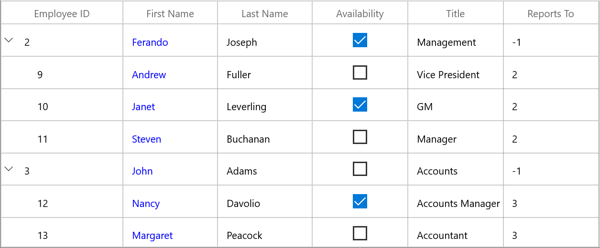

## How To

### Restrict the input content length

You can restrict the range of input using `MaxLength` property on `TreeGridColumn` in below ways.

* Using Converter property in [DisplayBinding](https://help.syncfusion.com/cr/winui/Syncfusion.UI.Xaml.Grids.GridColumnBase.html#Syncfusion_UI_Xaml_Grids_GridColumnBase_DisplayBinding) and [ValueBinding](https://help.syncfusion.com/cr/winui/Syncfusion.UI.Xaml.Grids.GridColumnBase.html#Syncfusion_UI_Xaml_Grids_GridColumnBase_ValueBinding) 

* Using control style 

* Overriding existing cell types

#### Using Converter

You can restrict the length of user input in both display and edit element using `Converter` using `DisplayBinding` and `ValueBinding`.



<treeGrid:SfTreeGrid x:Name="treeGrid"
                AutoExpandMode="RootNodesExpanded"
                AllowEditing="True"
                AutoGenerateColumns="False"
                ChildPropertyName="Children"
                ItemsSource="{Binding EmployeeDetails}">
    <treeGrid:SfTreeGrid.Resources>
        <local:MaxLengthConverter x:Key="maxLengthConverter"/>
    </treeGrid:SfTreeGrid.Resources>
    <treeGrid:SfTreeGrid.Columns>
        <treeGrid:TreeGridTextColumn HeaderText="First Name" 
                                    MappingName="FirstName"
                                    DisplayBinding="{Binding FirstName,Converter={StaticResource maxLengthConverter}}" 
                                    ValueBinding="{Binding FirstName,Converter={StaticResource maxLengthConverter}}" />
    </treeGrid:SfTreeGrid.Columns>
</treeGrid:SfTreeGrid>


public class MaxLengthConverter : IValueConverter
{

    public object Convert(object value, Type targetType, object parameter, string language)
    {

        // Define max length for column.
        int maxLength = 5;

        // Get the ColumnValue
        var columnValue = System.Convert.ToString(value);

        if (columnValue.Length < maxLength)
            return columnValue;

        else
            return columnValue.Substring(0, maxLength);
    }

    public object ConvertBack(object value, Type targetType, object parameter, string language)
    {
        return value;
    }
}



#### Using control style 

You can set the `MaxLength` property in edit mode by writing style of TargetType edit element of the corresponding column.

N> TextBlock does not have the MaxLength property. Therefore, you can use the converter to format in display.



<treeGrid:SfTreeGrid x:Name="treeGrid"
        AutoExpandMode="RootNodesExpanded"
        AllowEditing="True"
        AutoGenerateColumns="False"
        ChildPropertyName="Children"
        ItemsSource="{Binding EmployeeDetails}">
    <treeGrid:SfTreeGrid.Resources>
        
    </treeGrid:SfTreeGrid.Resources>
    <treeGrid:SfTreeGrid.Columns>
        <treeGrid:TreeGridTextColumn HeaderText="First Name" MappingName="FirstName" />
    </treeGrid:SfTreeGrid.Columns>
</treeGrid:SfTreeGrid>



#### Overriding existing cell types

You can set the `MaxLength` property to the edit element of the particular column by overriding existing cell types. 
Below code, overrides the `OnInitializeEditElement` method of the corresponding renderer and set the `MaxLength` to the UIElement and add the renderer to [STreeGrid.CellRenderers](https://help.syncfusion.com/cr/winui/Syncfusion.UI.Xaml.TreeGrid.SfTreeGrid.html#Syncfusion_UI_Xaml_TreeGrid_SfTreeGrid_CellRenderers) collection.



treeGrid.CellRenderers.Remove("TextBox");
treeGrid.CellRenderers.Add("TextBox", new TreeGridCellTextBoxRendererExt());

public class TreeGridCellTextBoxRendererExt : TreeGridCellTextBoxRenderer
{

    public override void OnInitializeEditElement(TreeDataColumnBase dataColumn, TextBox uiElement, object dataContext)
    {

        if (dataColumn.TreeGridColumn != null && dataColumn.TreeGridColumn.MappingName == "FirstName")
        {
            uiElement.MaxLength = 7;
        }

        else
        {
            uiElement.MaxLength = 0;
        }
        base.OnInitializeEditElement(dataColumn, uiElement, dataContext);
    }
}


