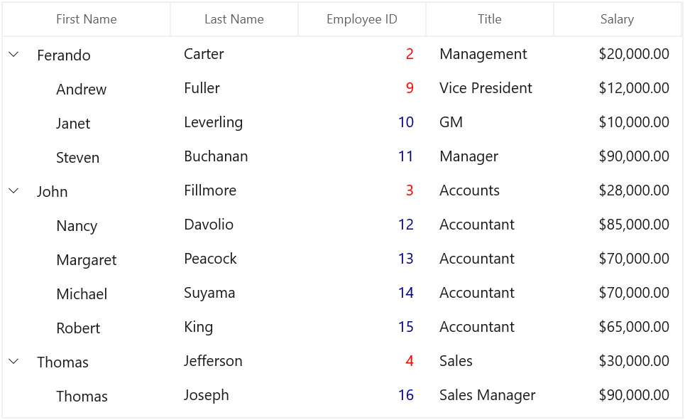
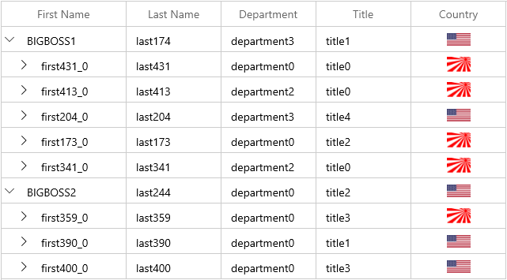

# Conditional styling in WinUI TreeGrid

You can style the treegrid and its inner elements conditionally based on data Using StyleSelector.

## Cells

### Style cells using style selector

The record cells ([TreeGridCell](https://help.syncfusion.com/cr/winui/Syncfusion.UI.Xaml.TreeGrid.TreeGridCell.html)) can be customized conditionally based on data by setting [SfTreeGrid.CellStyleSelector](https://help.syncfusion.com/cr/winui/Syncfusion.UI.Xaml.TreeGrid.SfTreeGrid.html#Syncfusion_UI_Xaml_TreeGrid_SfTreeGrid_CellStyleSelector) property and the particular column record cells can be customized by setting [GridColumn.CellStyleSelector](https://help.syncfusion.com/cr/winui/Syncfusion.UI.Xaml.Grids.GridColumnBase.html#Syncfusion_UI_Xaml_Grids_GridColumnBase_CellStyleSelector) property and you can get the container as TreeGridCell in the StyleSelector.



<Application.Resources>
    <local:SelectorClass x:Key="styleSelector" />
    
    
</Application.Resources>

<treeGrid:SfTreeGrid Name="treeGrid"
                    AutoGenerateColumns="False"
                    ColumnWidthMode="Star"         
                    CellStyleSelector="{StaticResource styleSelector}"
                    ItemsSource="{Binding Employees}"
                    ParentPropertyName="ID" 
                    ChildPropertyName="ReportsTo"
                    SelfRelationRootValue="-1" />


public class SelectorClass : StyleSelector
{
    protected override Style SelectStyleCore(object item, DependencyObject container)
    {
        var data = item as PersonInfo;
        if (data != null && ((container as TreeGridCell).ColumnBase.TreeGridColumn.MappingName == "ID"))
        {
            //custom condition is checked based on data.
            if (data.ID < 10)
                return App.Current.Resources["redCellStyle"] as Style;
            return App.Current.Resources["blueCellStyle"] as Style;
        }
        return base.SelectStyleCore(item, container);
    }
}




### Add image to cell

You can add the image to tree gird cell by using TreeGridTemplateColumn,



<treeGrid:SfTreeGrid Name="treeGrid"                 
                    AutoGenerateColumns="False"
                    AutoExpandMode="RootNodesExpanded"
                    ChildPropertyName="ReportsTo"
                    AllowResizingColumns="True"
                    NavigationMode="Cell" 
                    AllowEditing="True"
                    SelfRelationRootValue="-1"
                    SelectionMode="Single" 
                    ItemsSource="{Binding EmployeeDetails}" >
    <treeGrid:SfTreeGrid.Columns>
        <treeGrid:TreeGridTextColumn MappingName="FirstName"/>
        <treeGrid:TreeGridTextColumn MappingName="LastName"/>
        <treeGrid:TreeGridNumericColumn HeaderText="Employee ID" MappingName="ID" />
        <treeGrid:TreeGridTextColumn MappingName="Title"/>
        <treeGrid:TreeGridTemplateColumn HeaderText="Country" MappingName="ImageLink">
            <treeGrid:TreeGridTemplateColumn.CellTemplate>
                <DataTemplate>
                    <Grid>
                        <Image Width="30"
                               Height="20"
                               Source="{Binding ImageLink,
                                                Converter={StaticResource converter}}" />
                    </Grid>
                </DataTemplate>
            </treeGrid:TreeGridTemplateColumn.CellTemplate>
        </treeGrid:TreeGridTemplateColumn>
    </treeGrid:SfTreeGrid.Columns>
</treeGrid:SfTreeGrid>



class StringToImageConverter : IValueConverter
{
    public object Convert(object value, Type targetType, object parameter, string language)
    {
        string imageName = value.ToString();
        if (imageName == "US.jpg")
        {
            Uri uri = new Uri("ms-appx:///Images/US.jpg");
            BitmapImage image = new BitmapImage(uri);
            return image;
        }

        else if (imageName == "UK.jpg")
        {
            Uri uri1 = new Uri("ms-appx:///Images/UK.jpg");
            BitmapImage image = new BitmapImage(uri1);
            return image;
        }

        else
        {
            Uri uri1 = new Uri("ms-appx:///Images/Japan.jpg");
            BitmapImage image = new BitmapImage(uri1);
            return image;
        }
    }

    public object ConvertBack(object value, Type targetType, object parameter, string language)
    {
        throw new NotImplementedException();
    }
}




N> View sample in [GitHub](https://github.com/SyncfusionExamples/How-to-load-images-in-a-cell-in-winui-treegrid).
