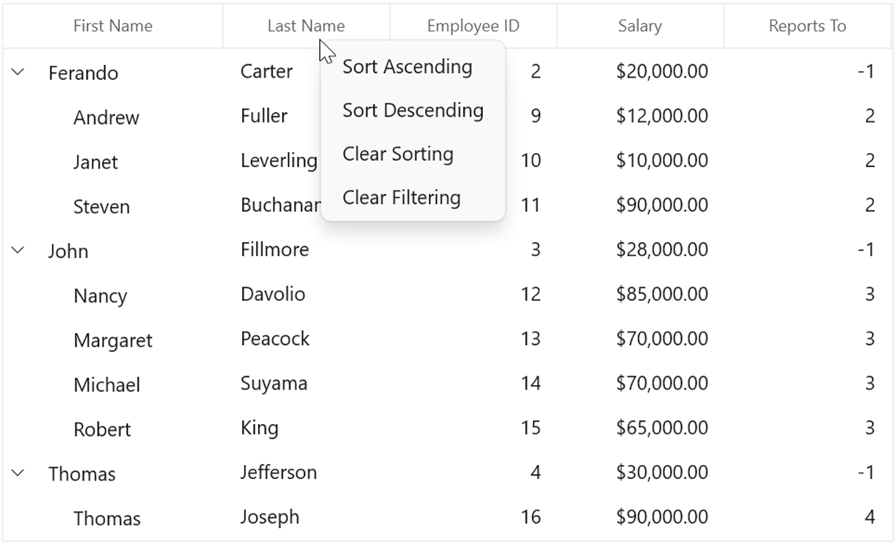
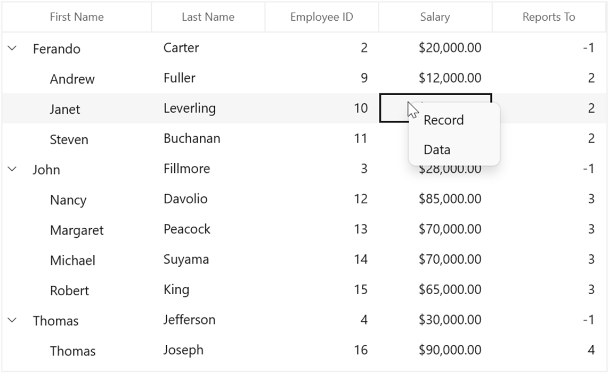

# ContextFlyout in WinUi TreeGrid (SfTreeGrid)

This section explains how to show ContextFlyout and using built-in commands in the TreeGrid.

## ContextFlyout

SfTreeGrid provides an entirely customizable ContextFlyout to expose the functionalities on user interface. You can create ContextFlyout for different rows in an efficient manner.

### ContextFlyout based on rows

You can set different context menus to SfTreeGrid based on rows.

#### ContextFlyout for nodes

You can set the context menu to data rows using the [SfTreeGrid.ContextFlyout](https://help.syncfusion.com/cr/winui/Syncfusion.UI.Xaml.Grids.SfGridBase.html#Syncfusion_UI_Xaml_Grids_SfGridBase_RecordContextFlyout) property.
  



<syncfusion:SfTreeGrid.ContextFlyout>
    <MenuFlyout>
        <MenuFlyoutItem  x:Name="Cut" Text="Cut" />
        <MenuFlyoutItem  x:Name="Copy" Text="Copy"  />
        <MenuFlyoutItem  x:Name="Paste" Text="Paste" />
        <MenuFlyoutItem  x:Name="Delete" Text="Delete" />
    </MenuFlyout>
</syncfusion:SfTreeGrid.ContextFlyout>




#### ContextFlyout for header

You can set the context menu to header using the [SfTreeGrid.HeaderContextFlyout](https://help.syncfusion.com/cr/winui/Syncfusion.UI.Xaml.Grids.SfGridBase.html#Syncfusion_UI_Xaml_Grids_SfGridBase_HeaderContextFlyout) property.




<syncfusion:SfTreeGrid.HeaderContextFlyout>
    <MenuFlyout>
        <MenuFlyoutItem  x:Name="SortAscending" Text="SortAscending" />
        <MenuFlyoutItem  x:Name="SortDescending" Text="SortDescending"  />
        <MenuFlyoutItem  x:Name="ClearSorting" Text="ClearSorting" />
        <MenuFlyoutItem  x:Name="ClearFiltering" Text="ClearFiltering" />
    </MenuFlyout>
</syncfusion:SfTreeGrid.HeaderContextFlyout>




### ContextFlyout for expander

You can set the context menu to header using the [SfTreeGrid.ExpanderContextFlyout](https://help.syncfusion.com/cr/winui/Syncfusion.UI.Xaml.TreeGrid.SfTreeGrid.html#Syncfusion_UI_Xaml_TreeGrid_SfTreeGrid_ExpanderContextFlyout) property.




<syncfusion:SfTreeGrid.ExpanderContextFlyout>
    <MenuFlyout>
        <MenuFlyoutItem x:Name="Expand" Text="Expand" />
        <MenuFlyoutItem x:Name="Collapse" Text="Collapse" />
    </MenuFlyout>
</syncfusion:SfTreeGrid.ExpanderContextFlyout>




### Events

The [TreeGridContextFlyoutOpening](https://help.syncfusion.com/cr/winui/Syncfusion.UI.Xaml.TreeGrid.SfTreeGrid.html#Syncfusion_UI_Xaml_TreeGrid_SfTreeGrid_TreeGridContextFlyoutOpening) event occurs when opening the ccontextflyout in SfTreeGrid. [TreeGridContextFlyoutEventArgs](https://help.syncfusion.com/cr/winui/Syncfusion.UI.Xaml.TreeGrid.TreeGridContextFlyoutEventArgs.html) has the following members, which provide information about the TreeGridContextFlyoutOpening event:
  
[ContextFlyout](https://help.syncfusion.com/cr/winui/Syncfusion.UI.Xaml.TreeGrid.TreeGridContextFlyoutEventArgs.html#Syncfusion_UI_Xaml_TreeGrid_TreeGridContextFlyoutEventArgs_ContextFlyout) – Gets the corresponding contextflyout. 
[ContextFlyoutInfo](https://help.syncfusion.com/cr/winui/Syncfusion.UI.Xaml.TreeGrid.TreeGridContextFlyoutEventArgs.html#Syncfusion_UI_Xaml_TreeGrid_TreeGridContextFlyoutEventArgs_ContextFlyoutInfo) – Returns the context menu info based on the row that opens the context menu.
[ContextFlyoutType](https://help.syncfusion.com/cr/winui/Syncfusion.UI.Xaml.TreeGrid.TreeGridContextFlyoutEventArgs.html#Syncfusion_UI_Xaml_TreeGrid_TreeGridContextFlyoutEventArgs_ContextFlyoutType) – Returns the type of context menu.
[RowColumnIndex](https://help.syncfusion.com/cr/winui/Syncfusion.UI.Xaml.TreeGrid.TreeGridContextFlyoutEventArgs.html#Syncfusion_UI_Xaml_TreeGrid_TreeGridContextFlyoutEventArgs_RowColumnIndex) – RowColumnIndex of the context menu, which is currently going to be opened. The RowColumnIndex is updated only for the RecordContextFlyout and remains empty.
[Handled](https://help.syncfusion.com/cr/winui/Syncfusion.UI.Xaml.Grids.GridHandledEventArgs.html#Syncfusion_UI_Xaml_Grids_GridHandledEventArgs_Handled) - Indicates whether the TreeGridContextFlyoutOpening event is handled or not.

### Customizing ContextFlyout

#### Changing the menu item when ContextFlyout opens

You can use the [TreeGridContextFlyoutOpening](https://help.syncfusion.com/cr/winui/Syncfusion.UI.Xaml.TreeGrid.SfTreeGrid.html#Syncfusion_UI_Xaml_TreeGrid_SfTreeGrid_TreeGridContextFlyoutOpening) event to change the menu item when the context menu opens. 




<syncfusion:SfTreeGrid.RecordContextFlyout>
    <MenuFlyout>
        <MenuFlyoutItem  x:Name="Cut" Text="Cut" />
        <MenuFlyoutItem  x:Name="Copy" Text="Copy"  />
        <MenuFlyoutItem  x:Name="Paste" Text="Paste" />
    </MenuFlyout>
</syncfusion:SfTreeGrid.RecordContextFlyout>




treeGrid.TreeGridContextFlyoutOpening += TreeGrid_TreeGridContextFlyoutOpening;

private void TreeGrid_TreeGridContextFlyoutOpening(object sender, TreeGridContextFlyoutEventArgs e)
{
    e.ContextFlyout.Items.Clear();

    if (e.ContextFlyoutType == Syncfusion.UI.Xaml.TreeGrid.ContextFlyoutType.RecordCell)
    {
        e.ContextFlyout.Items.Add(new MenuFlyoutItem() { Text = "Record" });
        e.ContextFlyout.Items.Add(new MenuFlyoutItem() { Text = "Data" });
    }
}




