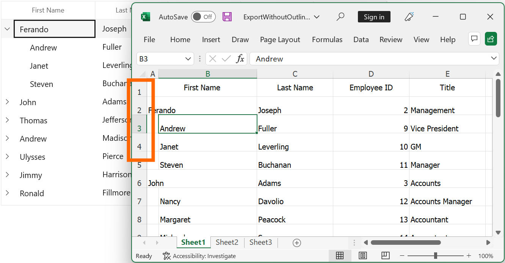
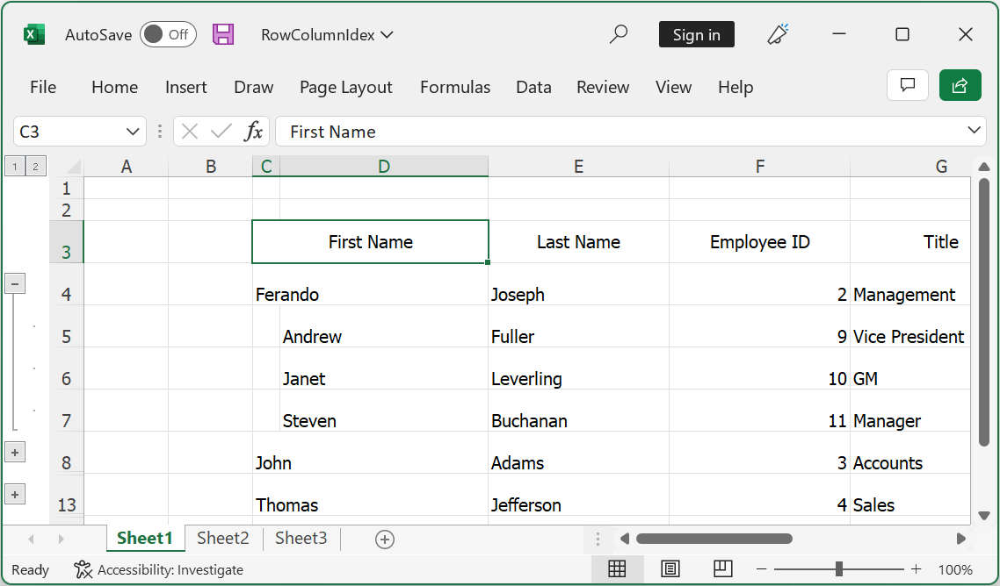
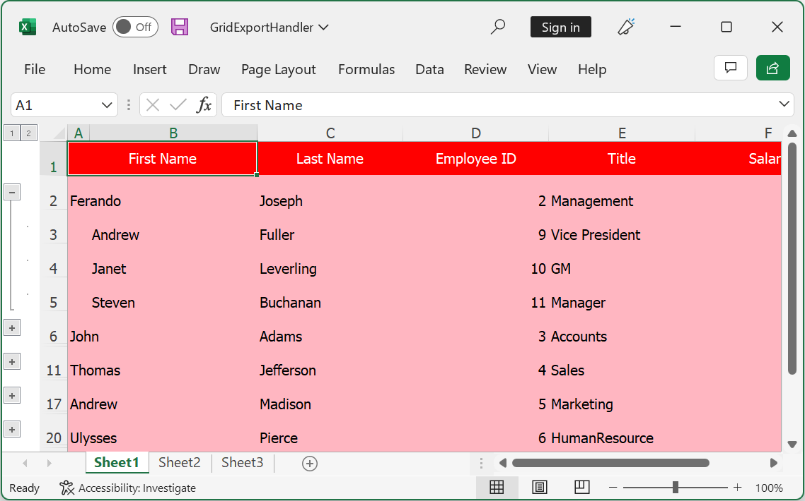
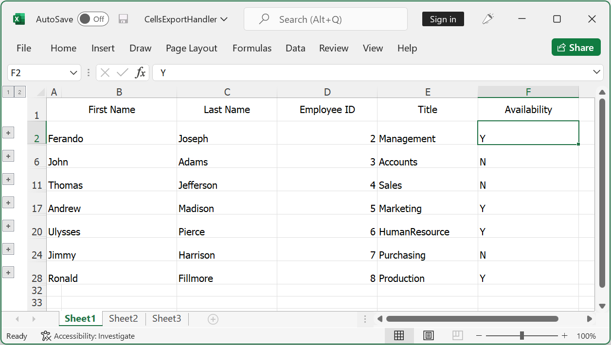
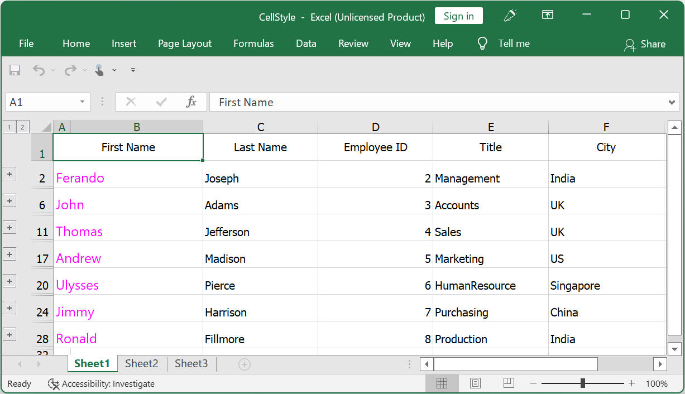
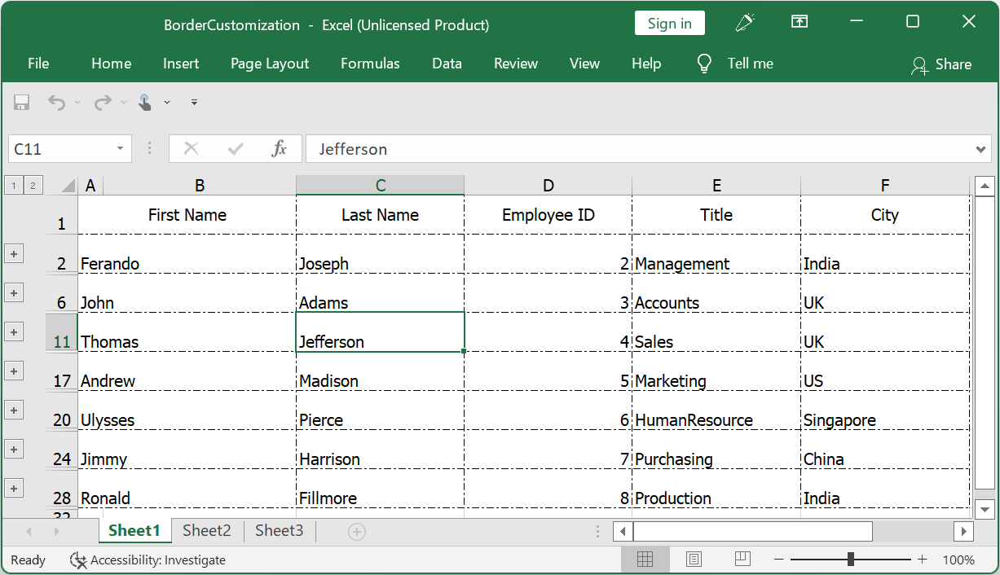
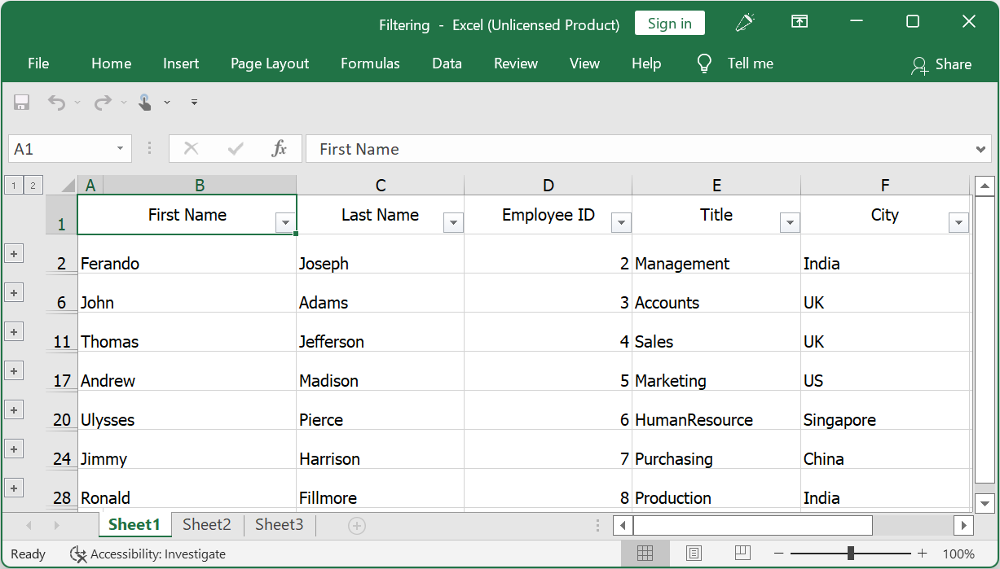
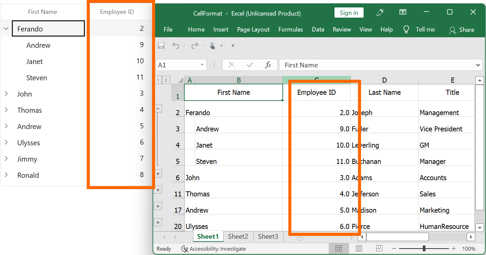

# Export To Excel in WinUI TreeGrid (SfTreeGrid)

The [WinUI TreeGrid](https://help.syncfusion.com/winui/treegrid/overview) supports exporting data to excel. Export merged cells and stacked headers while exporting.

The following assemblies needs to be added for exporting to excel.

* Syncfusion.GridExport.WinUI
* Syncfusion.XlsIO.NET

For NuGet package, install the [Syncfusion.GridExport.WinUI](https://www.nuget.org/packages/Syncfusion.GridExport.WinUI) package.

Export the SfTreeGrid to excel by using the [ExportToExcel](https://help.syncfusion.com/cr/winui/Syncfusion.UI.Xaml.TreeGrid.Export.TreeGridExcelExportExtensions.html#Syncfusion_UI_Xaml_TreeGrid_Export_TreeGridExcelExportExtensions_ExportToExcel_Syncfusion_UI_Xaml_TreeGrid_SfTreeGrid_Syncfusion_UI_Xaml_TreeGrid_Export_TreeGridExcelExportOptions_) extension method in the [Syncfusion.UI.Xaml.TreeGrid.Export](https://help.syncfusion.com/cr/winui/Syncfusion.UI.Xaml.TreeGrid.Export.html) namespace.



using Syncfusion.UI.Xaml.TreeGrid.Export;
var options = new TreeGridExcelExportOptions();
var excelEngine = treeGrid.ExportToExcel(options);
var workBook = excelEngine.Excel.Workbooks[0];
MemoryStream stream = new MemoryStream();
workBook.SaveAs(stream);
Save(stream, "Sample");

async void Save(MemoryStream stream, string filename)
{
    StorageFile stFile;

    if (!(Windows.Foundation.Metadata.ApiInformation.IsTypePresent("Windows.Phone.UI.Input.HardwareButtons")))
    {
        FileSavePicker savePicker = new FileSavePicker();
        savePicker.DefaultFileExtension = ".xlsx";
        savePicker.SuggestedFileName = filename;
        savePicker.FileTypeChoices.Add("Excel Documents", new List<string>() { ".xlsx" });
        var hwnd = System.Diagnostics.Process.GetCurrentProcess().MainWindowHandle;
        WinRT.Interop.InitializeWithWindow.Initialize(savePicker, hwnd);
        stFile = await savePicker.PickSaveFileAsync();
    }
    else
    {
        StorageFolder local = Windows.Storage.ApplicationData.Current.LocalFolder;
        stFile = await local.CreateFileAsync(filename, CreationCollisionOption.ReplaceExisting);
    }
    if (stFile != null)
    {
        using (IRandomAccessStream zipStream = await stFile.OpenAsync(FileAccessMode.ReadWrite))
        {
            //Write the compressed data from the memory to the file.
            using (Stream outstream = zipStream.AsStreamForWrite())
            {
                byte[] buffer = stream.ToArray();
                outstream.Write(buffer, 0, buffer.Length);
                outstream.Flush();
            }
        }
        //Launch the saved Excel file.
        await Windows.System.Launcher.LaunchFileAsync(stFile);
    }
}



N> The SfTreeGrid exports data to excel by using [XlsIO](http://help.syncfusion.com/file-formats/xlsio/overview). For manipulating the exported worksheets, refer to the [XlsIO documentation](http://help.syncfusion.com/file-formats/xlsio/working-with-excel-worksheet).

## Excel exporting options

The exporting operation can be customized by passing the [TreeGridExcelExportOptions](https://help.syncfusion.com/cr/winui/Syncfusion.UI.Xaml.TreeGrid.Export.TreeGridExcelExportOptions.html) instance as an argument to the [ExportToExcel](https://help.syncfusion.com/cr/winui/Syncfusion.UI.Xaml.TreeGrid.Export.TreeGridExcelExportExtensions.html#Syncfusion_UI_Xaml_TreeGrid_Export_TreeGridExcelExportExtensions_ExportToExcel_Syncfusion_UI_Xaml_TreeGrid_SfTreeGrid_Syncfusion_UI_Xaml_TreeGrid_Export_TreeGridExcelExportOptions_) method. 

### Export mode

By default, only the actual value will be exported to excel. To export the display text, set the [ExportMode](https://help.syncfusion.com/cr/winui/Syncfusion.UI.Xaml.TreeGrid.Export.ExportMode.html) property as [Text(https://help.syncfusion.com/cr/winui/Syncfusion.UI.Xaml.TreeGrid.Export.ExportMode.html#Syncfusion_UI_Xaml_TreeGrid_Export_ExportMode_Text).] 



var options = new TreeGridExcelExportOptions();
options.ExportMode = ExportMode.Text;
var excelEngine = treeGrid.ExportToExcel(options);
var workBook = excelEngine.Excel.Workbooks[0];
MemoryStream stream = new MemoryStream();
workBook.SaveAs(stream);
Save(stream, "Sample"); 



### Export without outlines	

By default, all the children in TreeGrid will be exported based on the state in TreeGrid. Disable the outlines in Excel by setting the [ShowOutlines](https://help.syncfusion.com/cr/winui/Syncfusion.UI.Xaml.TreeGrid.Export.TreeGridExcelExportOptions.html#Syncfusion_UI_Xaml_TreeGrid_Export_TreeGridExcelExportOptions_ShowOutlines) property to false in the [TreeGridExcelExportOptions](https://help.syncfusion.com/cr/winui/Syncfusion.UI.Xaml.TreeGrid.Export.TreeGridExcelExportOptions.html) class.



var options = new TreeGridExcelExportOptions();
options.ExcelVersion = ExcelVersion.Excel2013;
options.ShowOutlines = false;
var excelEngine = treeGrid.ExportToExcel(options);
var workBook = excelEngine.Excel.Workbooks[0];
MemoryStream stream = new MemoryStream();
workBook.SaveAs(stream);
Save(stream, "Sample"); 



### Exclude columns while exporting

By default, all the columns (including hidden columns) in TreeGrid will be exported to Excel. To exclude some columns, use [ExcludedColumns](https://help.syncfusion.com/cr/winui/Syncfusion.UI.Xaml.TreeGrid.Export.TreeGridExcelExportOptions.html#Syncfusion_UI_Xaml_TreeGrid_Export_TreeGridExcelExportOptions_ExcludedColumns) field in the [TreeGridExcelExportOptions](https://help.syncfusion.com/cr/winui/Syncfusion.UI.Xaml.TreeGrid.Export.TreeGridExcelExportOptions.html) class.



var options = new TreeGridExcelExportOptions();
options.ExcelVersion = ExcelVersion.Excel2013;
options.ExcludedColumns.Add("FirstName");
options.ExcludedColumns.Add("LastName");
var excelEngine = treeGrid.ExportToExcel(options);
var workBook = excelEngine.Excel.Workbooks[0];
MemoryStream stream = new MemoryStream();
workBook.SaveAs(stream);
Save(stream, "Sample"); 



Here, the columns having FirstName and LastName as MappingName are excluded when exporting.

### Excel version

While exporting to Excel, specify the excel version by using the [ExcelVersion](https://help.syncfusion.com/cr/winui/Syncfusion.UI.Xaml.TreeGrid.Export.TreeGridExcelExportOptions.html#Syncfusion_UI_Xaml_TreeGrid_Export_TreeGridExcelExportOptions_ExcelVersion) property.



var options = new TreeGridExcelExportOptions();
options.ExcelVersion = ExcelVersion.Excel2013;
var excelEngine = treeGrid.ExportToExcel(options);
var workBook = excelEngine.Excel.Workbooks[0];
MemoryStream stream = new MemoryStream();
workBook.SaveAs(stream);
Save(stream, "Sample"); 



### Exporting stacked headers

Export the stacked headers to excel by setting the [CanExportStackedHeaders](https://help.syncfusion.com/cr/winui/Syncfusion.UI.Xaml.TreeGrid.Export.TreeGridExcelExportOptions.html#Syncfusion_UI_Xaml_TreeGrid_Export_TreeGridExcelExportOptions_CanExportStackedHeaders) property to `true.`



var options = new TreeGridExcelExportOptions();
options.CanExportStackedHeaders = true;
var excelEngine = treeGrid.ExportToExcel(options);
var workBook = excelEngine.Excel.Workbooks[0];
MemoryStream stream = new MemoryStream();
workBook.SaveAs(stream);
Save(stream, "Sample"); 



### Exporting merged cells

Export the merged cells to excel by setting the [CanExportMergedCells](https://help.syncfusion.com/cr/winui/Syncfusion.UI.Xaml.TreeGrid.Export.TreeGridExcelExportOptions.html#Syncfusion_UI_Xaml_TreeGrid_Export_TreeGridExcelExportOptions_CanExportMergedCells) property as `true.`



var options = new TreeGridExcelExportOptions();
options.CanExportMergedCells = true;
var excelEngine = treeGrid.ExportToExcel(options);
var workBook = excelEngine.Excel.Workbooks[0];
MemoryStream stream = new MemoryStream();
workBook.SaveAs(stream);
Save(stream, "Sample"); 



### Export column width to Excel

Export the columns with their actual width by setting the [CanExportColumnWidth](https://help.syncfusion.com/cr/winui/Syncfusion.UI.Xaml.TreeGrid.Export.TreeGridExcelExportOptions.html#Syncfusion_UI_Xaml_TreeGrid_Export_TreeGridExcelExportOptions_CanExportColumnWidth) property to `true.` 



var options =new TreeGridExcelExportOptions();
options.ExcelVersion = ExcelVersion.Excel2013;
options.CanExportColumnWidth = true;
var excelEngine = treeGrid.ExportToExcel(options);
var workBook = excelEngine.Excel.Workbooks[0];
MemoryStream stream = new MemoryStream();
workBook.SaveAs(stream);
Save(stream, "Sample"); 



The default value of the [CanExportColumnWidth](https://help.syncfusion.com/cr/winui/Syncfusion.UI.Xaml.TreeGrid.Export.TreeGridExcelExportOptions.html#Syncfusion_UI_Xaml_TreeGrid_Export_TreeGridExcelExportOptions_CanExportColumnWidth) property is `true.`

### Export with customized row height

Export the TreeGrid to Excel with customized row height by using the [DefaultRowHeight](https://help.syncfusion.com/cr/winui/Syncfusion.UI.Xaml.TreeGrid.Export.TreeGridExcelExportOptions.html#Syncfusion_UI_Xaml_TreeGrid_Export_TreeGridExcelExportOptions_DefaultRowHeight) property.



var options =new TreeGridExcelExportOptions();
options.ExcelVersion = ExcelVersion.Excel2013;
options.DefaultRowHeight = 60;
var excelEngine = treeGrid.ExportToExcel(options);
var workBook = excelEngine.Excel.Workbooks[0];
MemoryStream stream = new MemoryStream();
workBook.SaveAs(stream);
Save(stream, "Sample"); 



### Change the node expand state in Excel

Change the node expanding state in Excel by using the [NodeExpandMode](https://help.syncfusion.com/cr/winui/Syncfusion.UI.Xaml.TreeGrid.Export.TreeGridExcelExportOptions.html#Syncfusion_UI_Xaml_TreeGrid_Export_TreeGridExcelExportOptions_NodeExpandMode) property.



var options =new TreeGridExcelExportOptions();
options.ExcelVersion = ExcelVersion.Excel2013;
options.NodeExpandMode = NodeExpandMode.CollapseAll;
var excelEngine = treeGrid.ExportToExcel(options);
var workBook = excelEngine.Excel.Workbooks[0];
MemoryStream stream = new MemoryStream();
workBook.SaveAs(stream);
Save(stream, "Sample");



### Changing start row and column index while exporting

Export the data to the specified row and column index in the worksheet by setting the [StartRowIndex](https://help.syncfusion.com/cr/winui/Syncfusion.UI.Xaml.TreeGrid.Export.TreeGridExcelExportOptions.html#Syncfusion_UI_Xaml_TreeGrid_Export_TreeGridExcelExportOptions_StartRowIndex) and [StartColumnIndex](https://help.syncfusion.com/cr/winui/Syncfusion.UI.Xaml.TreeGrid.Export.TreeGridExcelExportOptions.html#Syncfusion_UI_Xaml_TreeGrid_Export_TreeGridExcelExportOptions_StartColumnIndex) properties.



var options = new TreeGridExcelExportOptions();
options.ExcelVersion = ExcelVersion.Excel2013;
options.StartRowIndex = 3;
options.StartColumnIndex = 3;
var excelEngine = treeGrid.ExportToExcel(options);
var workBook = excelEngine.Excel.Workbooks[0];
MemoryStream stream = new MemoryStream();
workBook.SaveAs(stream);
Save(stream, "Sample");



## Row Height and Column Width customization  

After exporting the data to Excel, set different row heights and column widths for the columns. Refer to [here](http://help.syncfusion.com/file-formats/xlsio/worksheet-rows-and-columns-manipulation#adjust-row-height-and-column-width) for more information.



var options = new TreeGridExcelExportOptions();
options.ExcelVersion = ExcelVersion.Excel2013;
var excelEngine = treeGrid.ExportToExcel(options);
var workBook = excelEngine.Excel.Workbooks[0];
workBook.Worksheets[0].SetRowHeight(2, 50);
workBook.Worksheets[0].SetColumnWidth(2, 50);
MemoryStream stream = new MemoryStream();
workBook.SaveAs(stream);
Save(stream, "Sample");



## Styling cells based on CellType in Excel

Customize the cell styles based on the [CellType](https://help.syncfusion.com/cr/winui/Syncfusion.UI.Xaml.TreeGrid.Export.ExportCellType.html) by using the [GridExportHandler(https://help.syncfusion.com/cr/winui/Syncfusion.UI.Xaml.TreeGrid.Export.TreeGridExcelExportOptions.html#Syncfusion_UI_Xaml_TreeGrid_Export_TreeGridExcelExportOptions_GridExportHandler).]



var options = new TreeGridExcelExportOptions();
options.ExcelVersion = ExcelVersion.Excel2013;
options.GridExportHandler = GridExportHandler;
var excelEngine = treeGrid.ExportToExcel(options);
var workBook = excelEngine.Excel.Workbooks[0];
MemoryStream stream = new MemoryStream();
workBook.SaveAs(stream);
Save(stream, "Sample");

private void GridExportHandler(object sender, TreeGridExcelExportStartOptions e)
{
    if (e.CellType == ExportCellType.HeaderCell)
    {
        e.Style.Color = Color.Red;
        e.Style.Font.Color = ExcelKnownColors.White;
        e.Handled = true;
    }
    else if(e.CellType == ExportCellType.RecordCell)
    {
        e.Style.Color = Color.LightPink;
        e.Handled = true;
    }
}



## Cell customization in Excel while exporting

Customize the cells by setting the [CellsExportHandler](https://help.syncfusion.com/cr/winui/Syncfusion.UI.Xaml.TreeGrid.Export.TreeGridExcelExportOptions.html#Syncfusion_UI_Xaml_TreeGrid_Export_TreeGridExcelExportOptions_CellsExportHandler) in the [TreeGridExcelExportOptions(https://help.syncfusion.com/cr/winui/Syncfusion.UI.Xaml.TreeGrid.Export.TreeGridExcelExportOptions.html).]

### Customize cell value while exporting

Customize the cell values while exporting to excel by using the [CellsExportHandler](https://help.syncfusion.com/cr/winui/Syncfusion.UI.Xaml.TreeGrid.Export.TreeGridExcelExportOptions.html#Syncfusion_UI_Xaml_TreeGrid_Export_TreeGridExcelExportOptions_CellsExportHandler) in the [TreeGridExcelExportOptions(https://help.syncfusion.com/cr/winui/Syncfusion.UI.Xaml.TreeGrid.Export.TreeGridExcelExportOptions.html).]



var options = new TreeGridExcelExportOptions();
options.ExcelVersion = ExcelVersion.Excel2013;
options.CellsExportHandler = CellsExportHandler;
var excelEngine = treeGrid.ExportToExcel(options);
var workBook = excelEngine.Excel.Workbooks[0];
MemoryStream stream = new MemoryStream();
workBook.SaveAs(stream);
Save(stream, "Sample");

private void CellsExportHandler(object sender, TreeGridCellExcelExportOptions e)
{
    // Based on the column mapping name and the cell type, change the cell values while exporting to excel.
    if (e.CellType == ExportCellType.RecordCell && e.ColumnName == "Availability")
    {
        if (e.CellValue.Equals(true))
            e.Range.Cells[0].Value = "Y";

        else
            e.Range.Cells[0].Value = "N";
        e.Handled = true;
    }
}



Here, the cell values changed for the Availability column are based on the custom condition.

### Changing row style in Excel based on data

Customize the rows based on the record values by using the [CellsExportHandler(https://help.syncfusion.com/cr/winui/Syncfusion.UI.Xaml.TreeGrid.Export.TreeGridExcelExportOptions.html#Syncfusion_UI_Xaml_TreeGrid_Export_TreeGridExcelExportOptions_CellsExportHandler).]



var options = new TreeGridExcelExportOptions();
options.ExcelVersion = ExcelVersion.Excel2013;
options.CellsExportHandler = CellsExportHandler;
var excelEngine = treeGrid.ExportToExcel(options);
var workBook = excelEngine.Excel.Workbooks[0];
MemoryStream stream = new MemoryStream();
workBook.SaveAs(stream);
Save(stream, "Sample");

private void CellsExportHandler(object sender, TreeGridCellExcelExportOptions e)
{
    if ((e.Node == null))
        return;
    var record = e.Node as EmployeeInfo;

    if (record.City == "UK")
    {
        e.Range.CellStyle.Color = Color.LightYellow;
        e.Range.CellStyle.Font.Color = ExcelKnownColors.Pink;
    }
}



Here, the records having the `City` name as `US` are customized.

### Customize the cells based on column name

Customize the cells based on the [TreeGridCellExcelExportOptions.ColumnName](https://help.syncfusion.com/cr/winui/Syncfusion.UI.Xaml.TreeGrid.Export.TreeGridCellExcelExportOptions.html#Syncfusion_UI_Xaml_TreeGrid_Export_TreeGridCellExcelExportOptions_ColumnName) property in the [CellsExportHandler(https://help.syncfusion.com/cr/winui/Syncfusion.UI.Xaml.TreeGrid.Export.TreeGridExcelExportOptions.html#Syncfusion_UI_Xaml_TreeGrid_Export_TreeGridExcelExportOptions_CellsExportHandler).]



var options = new TreeGridExcelExportOptions();
options.ExcelVersion = ExcelVersion.Excel2013;
options.CellsExportHandler = CellsExportHandler;
var excelEngine = treeGrid.ExportToExcel(options);
var workBook = excelEngine.Excel.Workbooks[0];
MemoryStream stream = new MemoryStream();
workBook.SaveAs(stream);
Save(stream, "Sample");

private void CellsExportHandler(object sender, TreeGridCellExcelExportOptions e)
{
    if (e.ColumnName != "FirstName")
        return;

    e.Range.CellStyle.Font.Size = 12;
    e.Range.CellStyle.Font.Color = ExcelKnownColors.Pink;
    e.Range.CellStyle.Font.FontName = "Segoe UI";
}



Here, the `ID` column cells are customized while exporting.

## Customize exported workbook and worksheet

The TreeGrid can be exported to Excel using [XlsIO](http://help.syncfusion.com/file-formats/xlsio/overview). Refer to the [XlsIO documentation](http://help.syncfusion.com/file-formats/xlsio/working-with-excel-worksheet) for manipulating the workbooks and sheets after exporting.

### Set borders

Set the borders to Excel cells by directly accessing the worksheet after exporting the data.



var options = new TreeGridExcelExportOptions();
options.ExcelVersion = ExcelVersion.Excel2013;
var excelEngine = treeGrid.ExportToExcel(options);
var workBook = excelEngine.Excel.Workbooks[0];
workBook.Worksheets[0].UsedRange.BorderInside(ExcelLineStyle.Dash_dot, ExcelKnownColors.Black);
workBook.Worksheets[0].UsedRange.BorderAround(ExcelLineStyle.Dash_dot, ExcelKnownColors.Black);
MemoryStream stream = new MemoryStream();
workBook.SaveAs(stream);
Save(stream, "Sample");



#### Enabling Filters

Show filters in the exported worksheet by enabling a filter for the exported range in the worksheet.



var options = new TreeGridExcelExportOptions();
options.ExcelVersion = ExcelVersion.Excel2013;
var excelEngine = treeGrid.ExportToExcel(options);
var workBook = excelEngine.Excel.Workbooks[0];
workBook.Worksheets[0].AutoFilters.FilterRange = workBook.Worksheets[0].UsedRange;
MemoryStream stream = new MemoryStream();
workBook.SaveAs(stream);
Save(stream, "Sample");



While using the [stacked headers](https://help.syncfusion.com/winui/treegrid/columns#stacked-headers), the filter option enables the stacked header cell. To avoid this, specify the `range` based on the Stacked headers count to show the filter icon in the header cell.



var options = new TreeGridExcelExportOptions();
options.ExcelVersion = ExcelVersion.Excel2013;
var excelEngine = treeGrid.ExportToExcel(options);
var workBook = excelEngine.Excel.Workbooks[0];
var range = "A" + (treeGrid.StackedHeaderRows.Count + 1).ToString() + ":" + workBook.Worksheets[0].UsedRange.End.AddressLocal;
excelEngine.Excel.Workbooks[0].Worksheets[0].AutoFilters.FilterRange = workBook.Worksheets[0].Range[range];
MemoryStream stream = new MemoryStream();
workBook.SaveAs(stream);
Save(stream, "Sample");



Please refer to the [XlsIO documentation](http://help.syncfusion.com/file-formats/xlsio/worksheet-cells-manipulation#data-filtering).

## Performance

Using the [TreeGridExcelExportOptions.CellsExportHandler](https://help.syncfusion.com/cr/winui/Syncfusion.UI.Xaml.TreeGrid.Export.TreeGridExcelExportOptions.html#Syncfusion_UI_Xaml_TreeGrid_Export_TreeGridExcelExportOptions_CellsExportHandler) and changing the settings for each cell will consume more memory and time. So, avoid using the [CellsExportHandler](https://help.syncfusion.com/cr/winui/Syncfusion.UI.Xaml.TreeGrid.Export.TreeGridExcelExportOptions.html#Syncfusion_UI_Xaml_TreeGrid_Export_TreeGridExcelExportOptions_CellsExportHandler), and instead of this, do the required settings in the exported sheet.

### Formatting column without using CellsExportHandler

Perform cell-level customization such as row-level styling and formatting particular columns in the exported worksheet. 

In the following code sample, the NumberFormat for the `Salary` column is changed in the exported sheet after exporting without using the [CellsExportHandler(https://help.syncfusion.com/cr/winui/Syncfusion.UI.Xaml.TreeGrid.Export.TreeGridExcelExportOptions.html#Syncfusion_UI_Xaml_TreeGrid_Export_TreeGridExcelExportOptions_CellsExportHandler).] 

Reference:
[CellRange Formatting](http://help.syncfusion.com/file-formats/xlsio/working-with-cell-or-range-formatting)



var options = new TreeGridExcelExportOptions();
options.ExportMode = ExportMode.Value;
options.ExcelVersion = ExcelVersion.Excel2013;
var excelEngine = treeGrid.ExportToExcel(options);
IWorkbook workBook = excelEngine.Excel.Workbooks[0];
workBook.ActiveSheet.Columns[2].NumberFormat = "0.0";
MemoryStream stream = new MemoryStream();
workBook.SaveAs(stream);
Save(stream, "Sample");



## How to

### Export the TreeGrid that is not loaded in view

Export the TreeGrid that is not loaded in view by calling the ApplyTemplate() method before exporting.



var options = new TreeGridExcelExportOptions();
options.ExcelVersion = ExcelVersion.Excel2013;
treeGrid1.ApplyTemplate();
var excelEngine = treeGrid1.ExportToExcel(options);
var workBook1 = excelEngine.Excel.Workbooks[0];
MemoryStream stream = new MemoryStream();
workBook1.SaveAs(stream);
Save(stream, "Sample");


