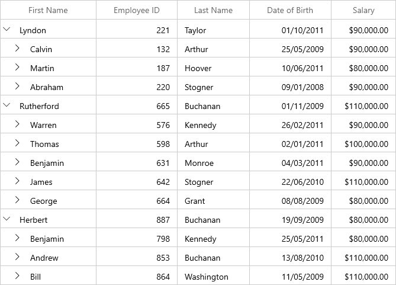
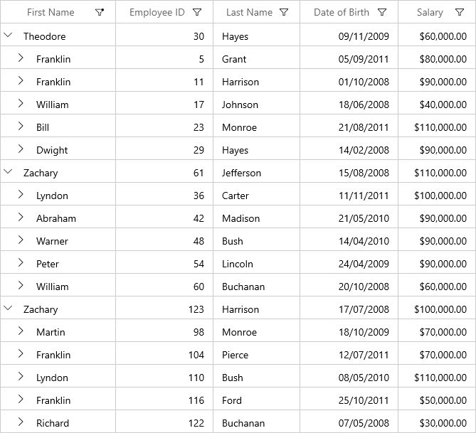
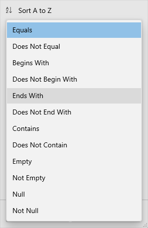
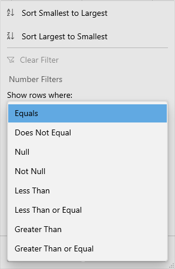
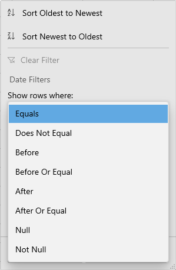
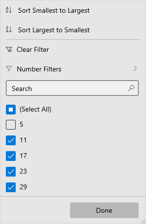
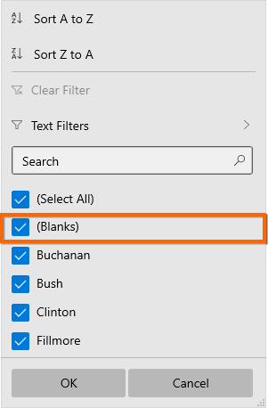
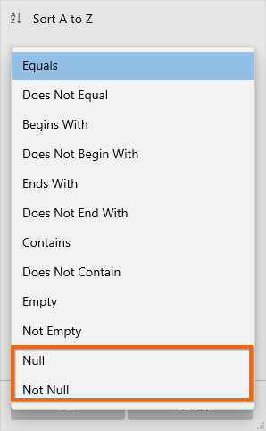
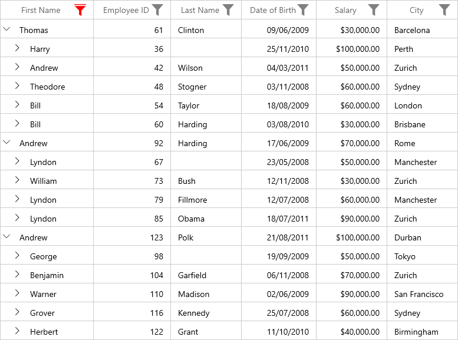

# Filtering in WinUI TreeGrid

Filtering is the process of retrieving the values from a collection that satisfies the specified condition. In SfTreeGrid, filtering can be applied through the UI as well as the programmatic filters.

## FilterLevel

You can filter the nodes based on level using the [SfTreeGrid.FilterLevel](https://help.syncfusion.com/cr/winui/Syncfusion.UI.Xaml.TreeGrid.SfTreeGrid.html#Syncfusion_UI_Xaml_TreeGrid_SfTreeGrid_FilterLevel) property.




treeGrid.FilterLevel = FilterLevel.All;




* Root - Filter will be applied to root nodes only in SfTreeGrid.

* All - Filter will be applied to all the nodes in SfTreeGrid.

* Extended - Filter will be applied to all the nodes. If a node matches the filter condition, its all ancestors will be displayed even though the parent node does not match the filter condition.

**Root**

Filter will be applied to root nodes only in SfTreeGrid. For other nodes, `IsFiltered` value will be false, and they always will be displayed in view.

**All**

Filter will be applied to all the nodes in SfTreeGrid. If a parent node does not match the filter condition, filter will not be applied for child nodes. Else, filter will be applied to its child nodes also.

**Extended**

Filter will be applied to all the nodes. If a node matches the filter condition, its all ancestors will also be displayed even though the parent node does not match the filter condition, and parent node’s `IsFiltered` value will be set to false.

N> You can change the `FilterLevel` at run time.

## Programmatic filtering

The programmatic filtering can be applied to SfTreeGrid using the following methods:

*	View Filtering
* 	Column Filtering

### View filtering

View filtering can be achieved by setting the [SfTreeGrid.View.Filter](https://help.syncfusion.com/cr/winui/Syncfusion.UI.Xaml.TreeGrid.TreeGridView.html#Syncfusion_UI_Xaml_TreeGrid_TreeGridView_Filter) delegate and calling the [SfTreeGrid.View.RefreshFilter](https://help.syncfusion.com/cr/winui/Syncfusion.UI.Xaml.TreeGrid.TreeGridView.html#Syncfusion_UI_Xaml_TreeGrid_TreeGridView_RefreshFilter) method.




public bool FilerNodes(object o)
{
    var data = o as Employee;

    if (data.Salary > 70000)
        return true;
    return false;
}

private void Button_Click(object sender, RoutedEventArgs e)
{
    treeGrid.View.Filter = FilerNodes;
    treeGrid.View.RefreshFilter();
}




Here, `FilterNodes` delegate filters the data based on Salary. `FilterNodes` delegate is assigned to [SfTreeGrid.View.Filter](https://help.syncfusion.com/cr/winui/Syncfusion.UI.Xaml.TreeGrid.TreeGridView.html#Syncfusion_UI_Xaml_TreeGrid_TreeGridView_Filter) method is called to refresh the nodes. If the node satisfies the filter conditions, true will be returned. Else false will be returned.

While filtering, if the node satisfies filter condition, [IsFiltered](https://help.syncfusion.com/cr/winui/Syncfusion.UI.Xaml.TreeGrid.TreeNode.html#Syncfusion_UI_Xaml_TreeGrid_TreeNode_IsFiltered) property of [TreeNode](https://help.syncfusion.com/cr/winui/Syncfusion.UI.Xaml.TreeGrid.TreeNode.html) will be set as false. Else, it will be true. If `IsFiltered` value is True, the node will not be displayed in view, else it will be displayed in view.

N> SfTreeGrid refreshes the filtering on property change if [SfTreeGrid.LiveNodeUpdateMode ](https://help.syncfusion.com/cr/winui/Syncfusion.UI.Xaml.TreeGrid.SfTreeGrid.html#Syncfusion_UI_Xaml_TreeGrid_SfTreeGrid_LiveNodeUpdateMode) is set as `AllowDataShaping`.

### Clear filters

You can clear the view filters applied in tree grid by setting the [SfTreeGrid.View.Filter](https://help.syncfusion.com/cr/winui/Syncfusion.UI.Xaml.TreeGrid.TreeGridView.html#Syncfusion_UI_Xaml_TreeGrid_TreeGridView_Filter) delegate to null and calling the `SfTreeGrid.View.RefreshFilter` method.




treeGrid.View.Filter = null;
treeGrid.View.RefreshFilter();




**HasVisibleChildNodes**

You can find whether a particular node has child node(s) displayed in a view (matches filtering criteria) using the [HasVisibleChildNodes](https://help.syncfusion.com/cr/winui/Syncfusion.UI.Xaml.TreeGrid.TreeNode.html#Syncfusion_UI_Xaml_TreeGrid_TreeNode_HasVisibleChildNodes) property in [TreeNode](https://help.syncfusion.com/cr/winui/Syncfusion.UI.Xaml.TreeGrid.TreeNode.html).




var treeNode=treeGrid.View.Nodes[0];
var hasVisibleChildNodes = treeNode.HasVisibleChildNodes;




### Column filtering

The column filtering can be achieved by adding the [FilterPredicate](https://help.syncfusion.com/cr/winui/Syncfusion.UI.Xaml.Data.FilterPredicate.html) to the [TreeGridColumn.FilterPredicates](https://help.syncfusion.com/cr/winui/Syncfusion.UI.Xaml.TreeGrid.TreeGridColumn.html#Syncfusion_UI_Xaml_TreeGrid_TreeGridColumn_FilterPredicates) property.




this.treeGrid.Columns["FirstName"].FilterPredicates.Add(
  new FilterPredicate()
  {
      FilterType = FilterType.Equals,
      FilterValue = "Chester"
  });




#### Filter behavior
The [FilterBehavior](https://help.syncfusion.com/cr/winui/Syncfusion.UI.Xaml.TreeGrid.TreeGridColumn.html#Syncfusion_UI_Xaml_TreeGrid_TreeGridColumn_FilterBehavior) property is used to specify whether to consider the [FilterValue](https://help.syncfusion.com/cr/winui/Syncfusion.UI.Xaml.Data.FilterPredicate.html#Syncfusion_UI_Xaml_Data_FilterPredicate_FilterValue) as string or specific data type.

* StringTyped - Records are filtered without considering the type and it takes FilterValue type as string.
* StronglyTyped - Records are filtered by considering the FilterValue underlying type.

#### Clear filtering

The filters applied to SfTreeGrid can be removed by clearing the `FilterPredicates` added for the columns. This can be achieved using the following methods:

* [SfTreeGrid.ClearFilters](https://help.syncfusion.com/cr/winui/Syncfusion.UI.Xaml.TreeGrid.SfTreeGrid.html#Syncfusion_UI_Xaml_TreeGrid_SfTreeGrid_ClearFilters) - Clears filters for all the columns programmatically.
* [SfTreeGrid.ClearFilter(String columnName)](https://help.syncfusion.com/cr/winui/Syncfusion.UI.Xaml.TreeGrid.SfTreeGrid.html#Syncfusion_UI_Xaml_TreeGrid_SfTreeGrid_ClearFilter_System_String_) - Clears the filter for a specific column that has the columnName as MappingName.
* [SfTreeGrid.ClearFilter(TreeGridColumn column)](https://help.syncfusion.com/cr/winui/Syncfusion.UI.Xaml.TreeGrid.SfTreeGrid.html#Syncfusion_UI_Xaml_TreeGrid_SfTreeGrid_ClearFilter_Syncfusion_UI_Xaml_TreeGrid_TreeGridColumn_) - Clears the filter for a specific column alone.




this.treeGrid.ClearFilters();
this.treeGrid.ClearFilter("FirstName");
this.treeGrid.ClearFilter(this.treeGrid.Columns["FirstName"]);




#### Adding multiple filter predicates for a column

The [PredicateType](https://help.syncfusion.com/cr/winui/Syncfusion.UI.Xaml.Data.FilterPredicate.html#Syncfusion_UI_Xaml_Data_FilterPredicate_PredicateType) property is used to apply multiple [FilterPredicates](https://help.syncfusion.com/cr/winui/Syncfusion.UI.Xaml.TreeGrid.TreeGridColumn.html#Syncfusion_UI_Xaml_TreeGrid_TreeGridColumn_FilterPredicates) for a column.

* And: Performs And operation in filters.
* AndAlso: Performs AndAlso operation in filters.
* Or: Performs Or operation in filters.
* OrElse: Performs OrElse operation in filters.




this.treeGrid.Columns["FirstName"].FilterPredicates.Add(
    new FilterPredicate()
    {
        FilterType = FilterType.Equals,
        FilterValue = "Theodore",
        PredicateType = PredicateType.Or
    });

this.treeGrid.Columns["FirstName"].FilterPredicates.Add(
    new FilterPredicate()
    {
        FilterType = FilterType.Equals,
        FilterValue = "Zachary",
        PredicateType = PredicateType.Or
    });




## UI filtering

SfTreeGrid provides Excel-like filtering UI and advanced filter UI to filter the data easily. UI filtering can be enabled by setting the [SfTreeGrid.AllowFiltering](https://help.syncfusion.com/cr/winui/Syncfusion.UI.Xaml.TreeGrid.SfTreeGrid.html#Syncfusion_UI_Xaml_TreeGrid_SfTreeGrid_AllowFiltering) property to `true`. This allows to open the filter UI by clicking the filter icon on the column header to filter the nodes.

The filtering can be enabled or disabled for a specific column by setting the [TreeGridColumn.AllowFiltering](https://help.syncfusion.com/cr/winui/Syncfusion.UI.Xaml.TreeGrid.TreeGridColumn.html#Syncfusion_UI_Xaml_TreeGrid_TreeGridColumn_AllowFiltering) property.




// Enable UI filtering for SfTreeGrid.
this.treeGrid.AllowFiltering = true;

// Enable UI filtering for EmployeeID column.
this.treeGrid.Columns["EmployeeID"].AllowFiltering = true;




N> `TreeGridColumn.AllowFiltering` has higher priority than the `SfTreeGrid.AllowFiltering` property.

### Built-in UI views

The SfTreeGrid provides the following types of filter pop-up modes:

* Check box filter: Provides Excel-like filter interface with a list of check boxes. 

* Advanced filter: Provides advanced filter options to filter the data.

* Both: Both check box filter and advanced filter are loaded while opening the filter pop-up.

By default, the filter pop-up mode of the column is set to Both. The check box and the advanced filters can be switched using the Advanced Filter button.

#### Checkbox filtering UI

#### Advanced filtering UI

## Changing filter UI for grid

Filter UI view can be changed for all the columns in grid by changing the [FilterMode](https://help.syncfusion.com/cr/winui/Syncfusion.UI.Xaml.TreeGrid.Filtering.TreeGridFilterControl.html#Syncfusion_UI_Xaml_TreeGrid_Filtering_TreeGridFilterControl_FilterMode) in [TreeGridFilterControl](https://help.syncfusion.com/cr/winui/Syncfusion.UI.Xaml.TreeGrid.Filtering.TreeGridFilterControl.html) by writing style and assign it to [SfTreeGrid.FilterPopupStyle](https://help.syncfusion.com/cr/winui/Syncfusion.UI.Xaml.TreeGrid.SfTreeGrid.html#Syncfusion_UI_Xaml_TreeGrid_SfTreeGrid_FilterPopupStyle).




xmlns:treeGridFiltering="using:Syncfusion.UI.Xaml.TreeGrid.Filtering"

<treeGrid:SfTreeGrid Name="sfTreeGrid"
                           FilterPopupStyle="{StaticResource filterControlStyle}"
                           AllowFiltering="True”
                           ItemsSource="{Binding EmployeeDetails}" />




## Changing filter UI for a column

Filter UI view can be changed for a specific column by changing the [FilterMode](https://help.syncfusion.com/cr/winui/Syncfusion.UI.Xaml.TreeGrid.Filtering.TreeGridFilterControl.html#Syncfusion_UI_Xaml_TreeGrid_Filtering_TreeGridFilterControl_FilterMode) in [TreeGridFilterControl](https://help.syncfusion.com/cr/winui/Syncfusion.UI.Xaml.TreeGrid.Filtering.TreeGridFilterControl.html) by writing style and assigning it to [TreeGridColumn.FilterPopupStyle](https://help.syncfusion.com/cr/winui/Syncfusion.UI.Xaml.TreeGrid.TreeGridColumn.html#Syncfusion_UI_Xaml_TreeGrid_TreeGridColumn_FilterPopupStyle).




xmlns:treeGridFiltering="using:Syncfusion.UI.Xaml.TreeGrid.Filtering"

<treeGrid:TreeGridTextColumn MappingName="FirstName"
                               FilterPopupStyle="{StaticResource filterControlStyle}"/>




## Setting default filter popup style for a specific column

You can skip the [TreeGridFilterControl](https://help.syncfusion.com/cr/winui/Syncfusion.UI.Xaml.TreeGrid.Filtering.TreeGridFilterControl.html) styling for a specific column in [SfTreeGrid.FilterPopupStyle](https://help.syncfusion.com/cr/winui/Syncfusion.UI.Xaml.TreeGrid.SfTreeGrid.html#Syncfusion_UI_Xaml_TreeGrid_SfTreeGrid_FilterPopupStyle) by setting [TreeGridColumn.FilterPopupStyle](https://help.syncfusion.com/cr/winui/Syncfusion.UI.Xaml.TreeGrid.TreeGridColumn.html#Syncfusion_UI_Xaml_TreeGrid_TreeGridColumn_FilterPopupStyle) to null.




xmlns:treeGridFiltering="using:Syncfusion.UI.Xaml.TreeGrid.Filtering"

<treeGrid:SfTreeGrid Name="sfTreeGrid"
                           FilterPopupStyle="{StaticResource filterControlStyle}"
                           AllowFiltering="True”
                           ItemsSource="{Binding EmployeeDetails}" />

<treeGrid:TreeGridTextColumn MappingName="LastName" FilterPopupStyle="{x:Null}"/>




## Check box filtering

The check box filtering is the same as Excel-like filter popup, which displays a search text box and a list of check boxes with unique items from the expanded tree nodes.

The items in the checked state will be visible in the view, and the other items will be filtered out of the view.

This filtering operation is performed based on the value of [SfTreeGrid.FilterLevel](https://help.syncfusion.com/cr/winui/Syncfusion.UI.Xaml.TreeGrid.SfTreeGrid.html#Syncfusion_UI_Xaml_TreeGrid_SfTreeGrid_FilterLevel) property.

## Advanced filtering

Advanced filter UI provides multiple filter options to filter the data easily. Filter menu options are loaded based on advanced filter type by automatically detecting the underlying date type.

The following built-in filter types are supported in SfTreeGrid:

* Text filter: Loads various menu options to filter the display text effectively.

* Number filter: Loads various menu options to filter the numeric data.

<table>
<tr>
<th>
Text filters
</th>
<th>
Number filters
</th>
<th>
Date filters
</th>
</tr>
<tr>
<td>
When the string value is bound to the {{'[TreeGridColumn](https://help.syncfusion.com/cr/winui/Syncfusion.UI.Xaml.TreeGrid.TreeGridColumn.html)'| markdownify }} or the items source is {{'[dynamic](https://docs.microsoft.com/en-us/dotnet/csharp/language-reference/keywords/dynamic)'| markdownify}}, then `TextFilters` are loaded in {{'[TreeGridAdvancedFilterControl](https://help.syncfusion.com/cr/winui/Syncfusion.UI.Xaml.TreeGrid.Filtering.TreeGridAdvancedFilterControl.html)'|markdownify}}.
</td>
<td>
When integer, double, short, decimal, byte, or long are bound to the {{'[TreeGridColumn](https://help.syncfusion.com/cr/winui/Syncfusion.UI.Xaml.TreeGrid.TreeGridColumn.html)'|markdownify}}, then `Number Filters` are loaded in {{'[TreeGridAdvancedFilterControl](https://help.syncfusion.com/cr/winui/Syncfusion.UI.Xaml.TreeGrid.Filtering.TreeGridAdvancedFilterControl.html)'|markdownify}}.
</td>
<td>
When the DateTime type value is bound to the {{'[TreeGridColumn](https://help.syncfusion.com/cr/winui/Syncfusion.UI.Xaml.TreeGrid.TreeGridColumn.html)'|markdownify}}, then `Date Filters` are loaded in {{'[TreeGridAdvancedFilterControl](https://help.syncfusion.com/cr/winui/Syncfusion.UI.Xaml.TreeGrid.Filtering.TreeGridAdvancedFilterControl.html)'|markdownify}}.
</td>
</tr>
<tr>
<td>

</td>
<td>

</td>
<td>

</td>
</tr>
<tr>
<td>
  
<b>Filter menu options</b>
<ol>
<li>Equals</li>
<li>Does Not Equal</li>
<li>Begins With</li> 
<li>Ends With</li> 
<li>Contains</li> 
<li>Does Not Contain</li>
<li>Empty</li> 
<li>Not Empty</li>
<li>Null</li> 
<li>Not Null</li> 
</ol>
</td>
<td>
<b>Filter menu options</b>
<ol>
<li>Equals</li>
<li>Does Not Equal</li>
<li>Null</li>
<li>Not Null</li>
<li>Less Than</li>
<li>Less Than or Equal</li>
<li>Greater Than</li>
<li>Greater Than or Equal</li>
</ol>
</td>
<td>
<b>Filter menu options</b>
<ol>
<li>Equals</li>
<li>Does Not Equal</li>
<li>Before</li>
<li>Before Or Equal</li>
<li>After</li>
<li>After Or Equal</li>
<li>Null</li>
<li>Not Null</li>
</ol>
</td>
</tr>
</table>

N> The `Null` and `Not Null` options are available only when `AllowBlankFilters` is set to `True`.

## Instant filtering

By default, filters are applied to the columns when OK button is clicked in UI filtering. To update the filters immediately whenever update in filter popup, set [TreeGridColumn.ImmediateUpdateColumnFilter](https://help.syncfusion.com/cr/winui/Syncfusion.UI.Xaml.TreeGrid.TreeGridColumn.html#Syncfusion_UI_Xaml_TreeGrid_TreeGridColumn_ImmediateUpdateColumnFilter) to `true`.




<treeGrid:TreeGridTextColumn MappingName="EmployeeID" 
                               ImmediateUpdateColumnFilter="True"/>







this.sfTreeGrid.Columns["EmployeeID"].ImmediateUpdateColumnFilter = true;




Here, the OK and Cancel buttons are unavailable and Done button is available to just close the popup.

The following screenshot illustrates the check box filter when `ImmediateUpdateColumnFilter` is set to `true`.

The following screenshot illustrates the advanced filter when `ImmediateUpdateColumnFilter` is set to `true`.

N> In check box filter, the `SelectAll` option is not reflected in the filter updates if [ImmediateUpdateColumnFilter](https://help.syncfusion.com/cr/winui/Syncfusion.UI.Xaml.TreeGrid.TreeGridColumn.html#Syncfusion_UI_Xaml_TreeGrid_TreeGridColumn_ImmediateUpdateColumnFilter) is true.

## Filtering null values

To filter the null values, the [TreeGridColumn.AllowBlankFilters](https://help.syncfusion.com/cr/winui/Syncfusion.UI.Xaml.TreeGrid.TreeGridColumn.html#Syncfusion_UI_Xaml_TreeGrid_TreeGridColumn_AllowBlankFilters) property should be enabled. Enabling `AllowBlankFilters` includes null values into the filter items list.




<treeGrid:TreeGridTextColumn MappingName="FirstName" AllowBlankFilters="True"/>







this.sfTreeGrid.Columns["FirstName"].AllowBlankFilters = true;




The following screenshot illustrates the check box filter when `AllowBlankFilters` is set to `true`.

The following screenshot illustrates advanced filter when `AllowBlankFilters` is set to `true`.

## Changing AdvancedFilter type when loading dynamic ItemsSource

By default, the text filters will be loaded for the columns if `ItemsSource` is [dynamic](https://msdn.microsoft.com/en-us/library/dd264741.aspx). The [TreeGridColumn.ColumnMemberType](https://help.syncfusion.com/cr/winui/Syncfusion.UI.Xaml.TreeGrid.TreeGridColumn.html#Syncfusion_UI_Xaml_TreeGrid_TreeGridColumn_ColumnMemberType) property loads number filters or date filters based on the column values.




this.sfTreeGrid.Columns["EmployeeID"].ColumnMemberType = typeof(double);




## Customization using events

### Loading text filter for number or date column

The [SfTreeGrid.FilterItemsPopulating](https://help.syncfusion.com/cr/winui/Syncfusion.UI.Xaml.TreeGrid.SfTreeGrid.html#Syncfusion_UI_Xaml_TreeGrid_SfTreeGrid_FilterItemsPopulating) event is used to load text filters for the columns that have number or date value as underlying type by setting value of the `TreeGridFilterItemsPopulatingEventArgs.FilterControl.AdvancedFilterType` property to `AdvancedFilterType.TextFilter`.




this.sfTreeGrid.FilterItemsPopulating += OnSfTreeGridFilterItemsPopulating;

private void OnSfTreeGridFilterItemsPopulating(object sender, TreeGridFilterItemsPopulatingEventArgs e)
 {
     if (e.Column.MappingName == "EmployeeID")
         e.FilterControl.AdvancedFilterType = AdvancedFilterType.TextFilter;
 }




### Customizing filter predicates

The filter predicates can be customized using the [SfTreeGrid.FilterChanging](https://help.syncfusion.com/cr/winui/Syncfusion.UI.Xaml.TreeGrid.SfTreeGrid.html#Syncfusion_UI_Xaml_TreeGrid_SfTreeGrid_FilterChanging) event. This event occurs when applying filter using the filter control. Here, [FilterValue](https://help.syncfusion.com/cr/winui/Syncfusion.UI.Xaml.Data.FilterPredicate.html#Syncfusion_UI_Xaml_Data_FilterPredicate_FilterValue) is changed based on some conditions.




this.sfTreeGrid.FilterChanging += OnSfTreeGridFilterChanging;

private void OnSfTreeGridFilterChanging(object sender, TreeGridFilterChangingEventArgs e)
{
    if (e.FilterPredicates == null || e.Column.MappingName != "FirstName")
        return;

    if (e.FilterPredicates[0].FilterValue.Equals("Chester"))
        e.FilterPredicates[0].FilterValue = "Abraham";
}




### Customizing Excel-like filter ItemsSource

The [TreeGridFilterControl](https://help.syncfusion.com/cr/winui/Syncfusion.UI.Xaml.TreeGrid.Filtering.TreeGridFilterControl.html) `ItemsSource` can be customized to restrict some data from filtering using the [SfTreeGrid.FilterItemsPopulated](https://help.syncfusion.com/cr/winui/Syncfusion.UI.Xaml.TreeGrid.SfTreeGrid.html#Syncfusion_UI_Xaml_TreeGrid_SfTreeGrid_FilterItemsPopulated) event. Here, the [FilterElement](https://help.syncfusion.com/cr/winui/Syncfusion.UI.Xaml.Grids.FilterElement.html) that has actual value as 0 is removed from `ItemsSource`.




this.sfTreeGrid.FilterItemsPopulated += OnSfTreeGridFilterItemsPopulated;

private void OnSfTreeGridFilterItemsPopulated(object sender, TreeGridFilterItemsPopulatedEventArgs e)
{
    if (e.Column.MappingName == "EmployeeID")
    {
        var itemsSource = e.ItemsSource as List<FilterElement>;

        // Get the FilterElement to remove from itemsSource.
        var filterElement = itemsSource.FirstOrDefault(items => items.ActualValue.Equals(0));

        // Remove the FilterElement from itemsSource.
        itemsSource.Remove(filterElement);
    }
}




### Changing filter UI

Filter UI can be changed either for all the columns or for a specific column in SfTreeGrid by changing the [FilterMode](https://help.syncfusion.com/cr/winui/Syncfusion.UI.Xaml.TreeGrid.Filtering.TreeGridFilterControl.html#Syncfusion_UI_Xaml_TreeGrid_Filtering_TreeGridFilterControl_FilterMode) property value using the [SfTreeGrid.FilterItemsPopulating](https://help.syncfusion.com/cr/winui/Syncfusion.UI.Xaml.TreeGrid.SfTreeGrid.html#Syncfusion_UI_Xaml_TreeGrid_SfTreeGrid_FilterItemsPopulating) event.

Here, filter UI is changed to `AdvancedFilter` only for `EmployeeID` column.




this.sfTreeGrid.FilterItemsPopulating += SfTreeGrid_FilterItemsPopulating;

private void SfTreeGrid_FilterItemsPopulating(object sender, TreeGridFilterItemsPopulatingEventArgs e)
{
    if (e.Column.MappingName == "EmployeeID")
        e.FilterControl.FilterMode = FilterMode.AdvancedFilter;
}




### Customizing sort options text

Sort options text can be customized by changing the value of [AscendingSortString](https://help.syncfusion.com/cr/winui/Syncfusion.UI.Xaml.TreeGrid.Filtering.TreeGridFilterControl.html#Syncfusion_UI_Xaml_TreeGrid_Filtering_TreeGridFilterControl_AscendingSortString) and [DescendingSortString](https://help.syncfusion.com/cr/winui/Syncfusion.UI.Xaml.TreeGrid.Filtering.TreeGridFilterControl.html#Syncfusion_UI_Xaml_TreeGrid_Filtering_TreeGridFilterControl_DescendingSortString) properties in the [TreeGridFilterControl](https://help.syncfusion.com/cr/winui/Syncfusion.UI.Xaml.TreeGrid.Filtering.TreeGridFilterControl.html) using the [SfTreeGrid.FilterItemsPopulating](https://help.syncfusion.com/cr/winui/Syncfusion.UI.Xaml.TreeGrid.SfTreeGrid.html#Syncfusion_UI_Xaml_TreeGrid_SfTreeGrid_FilterItemsPopulating) event.




this.sfTreeGrid.FilterItemsPopulating += OnSfTreeGridFilterItemsPopulating;

private void OnSfTreeGridFilterItemsPopulating(object sender, TreeGridFilterItemsPopulatingEventArgs e)
{
    if (e.Column.MappingName == "FirstName")
    {
        e.FilterControl.AscendingSortString = "Sort Ascending";
        e.FilterControl.DescendingSortString = "Sort Descending";
    }
}




## Appearance

### Hiding sort options

Sort options can be collapsed by setting the [SortOptionVisibility](https://help.syncfusion.com/cr/winui/Syncfusion.UI.Xaml.TreeGrid.Filtering.TreeGridFilterControl.html#Syncfusion_UI_Xaml_TreeGrid_Filtering_TreeGridFilterControl_SortOptionVisibility) property in [TreeGridFilterControl](https://help.syncfusion.com/cr/winui/Syncfusion.UI.Xaml.TreeGrid.Filtering.TreeGridFilterControl.html).




xmlns:treeGridFiltering="using:Syncfusion.UI.Xaml.TreeGrid.Filtering"

<treeGrid:SfTreeGrid Name="sfTreeGrid"
                           FilterPopupStyle="{StaticResource filterControlStyle}"
                           AllowFiltering="True”
                           ItemsSource="{Binding EmployeeDetails}" />




### Customizing the filter popup size 

The size of the filter popup can be changed using the [FilterPopupHeight](https://help.syncfusion.com/cr/winui/Syncfusion.UI.Xaml.TreeGrid.Filtering.TreeGridFilterControl.html#Syncfusion_UI_Xaml_TreeGrid_Filtering_TreeGridFilterControl_FilterPopupHeight) and [FilterPopupWidth](https://help.syncfusion.com/cr/winui/Syncfusion.UI.Xaml.TreeGrid.Filtering.TreeGridFilterControl.html#Syncfusion_UI_Xaml_TreeGrid_Filtering_TreeGridFilterControl_FilterPopupWidth) properties in [TreeGridFilterControl](https://help.syncfusion.com/cr/winui/Syncfusion.UI.Xaml.TreeGrid.Filtering.TreeGridFilterControl.html).




xmlns:treeGridFiltering="using:Syncfusion.UI.Xaml.TreeGrid.Filtering"

<Page.Resources>
    
</Page.Resources>




### Changing filter icon style after applying filters

The filter icon style can be changed by writing style with TargetType as [FilterToggleButton](https://help.syncfusion.com/cr/winui/Syncfusion.UI.Xaml.Grids.FilterToggleButton.html).







