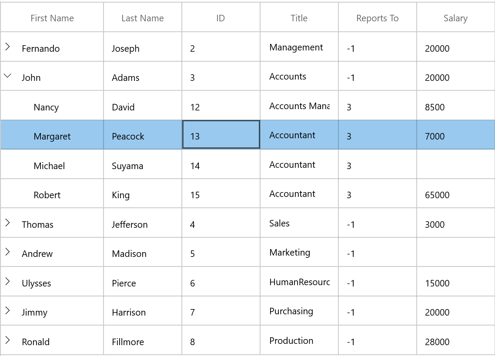
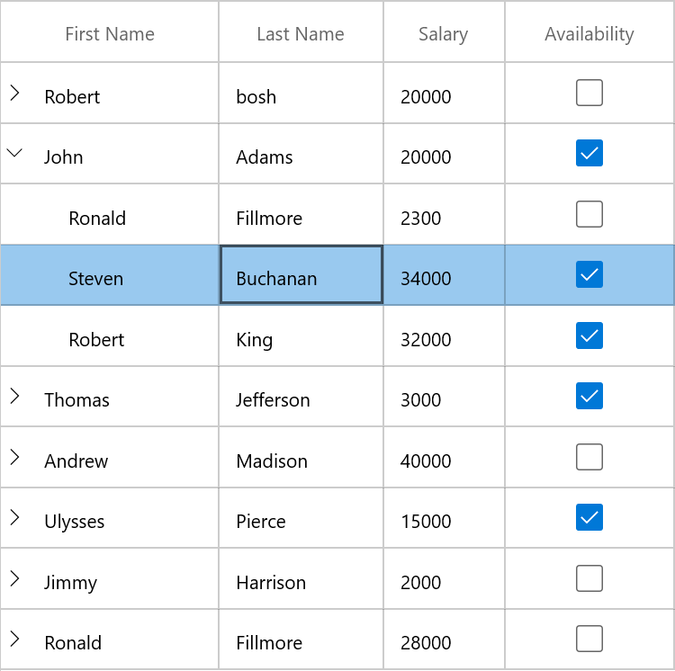

# Getting started with WinUI TreeGrid (SfTreeGrid)

This section explains the steps required to add the TreeGrid control and binding data in treegrid control. This section covers only basic features needed to get started with Syncfusion treegrid control.

## Creating an application with WinUI TreeGrid

1.	Create a simple project using the instructions given in the [Getting Started with your first WinUI app](https://docs.microsoft.com/en-us/windows/apps/winui/winui3/get-started-winui3-for-uwp) documentation.

2.	Add reference to [Syncfusion.Grid.WinUI](https://www.nuget.org/packages/Syncfusion.Grid.WinUI) NuGet. 

3.	Import the control namespace `Syncfusion.UI.Xaml.TreeGrid`  in XAML or C# code.

4.	Initialize the SfTreeGrid control.



<Page
    x:Class="GettingStarted.MainPage"
    xmlns="http://schemas.microsoft.com/winfx/2006/xaml/presentation"
    xmlns:x="http://schemas.microsoft.com/winfx/2006/xaml"
    xmlns:local="using:GettingStarted"
    xmlns:d="http://schemas.microsoft.com/expression/blend/2008"
    xmlns:mc="http://schemas.openxmlformats.org/markup-compatibility/2006"
    xmlns:syncfusion="using:Syncfusion.UI.Xaml.TreeGrid"
    mc:Ignorable="d"
    Background="{ThemeResource ApplicationPageBackgroundThemeBrush}">
    <Page.DataContext>
        <local:ViewModel/>
    </Page.DataContext>
    <Grid x:Name="Root_Grid">
        <syncfusion:SfTreeGrid x:Name="sfTreeGrid" />
    </Grid>
</Page>



using Syncfusion.UI.Xaml.TreeGrid;
namespace GettingStarted
{
    /// 

    /// An empty page that can be used on its own or navigated to within a Frame.
    /// 

    public sealed partial class MainPage : Page
    {
        public MainPage()
        {
            this.InitializeComponent();
            SfTreeGrid sfTreeGrid = new SfTreeGrid();
            Root_Grid.Children.Add(sfTreeGrid);
        }
    }
}



### Binding self-relational data in SfTreeGrid

SfTreeGrid supports to bind self-relational data by setting `SfTreeGrid.ParentPropertyName` and `SfTreeGrid.ChildPropertyName` properties where tree structure is formed based on these two properties.

`SfTreeGrid.ParentPropertyName` – Denotes the property in data object which is used to identify the root nodes.
`SfTreeGrid.ChildPropertyName` - Denotes the property in data object which is used identify its parent by matching the property value with `ParentPropertyName` property value of other data objects.

The data objects which has unique property value in `SfTreeGrid.ParentPropertyName` or the data objects which has the property value as in `SfTreeGrid.SelfRelationRootValue` are root nodes.

SfTreeGrid is a data-bound control. So before create binding to the control, you must create data model for Application.

1. Creating data object class named `EmployeeInfo` and declare properties as shown below,



public class EmployeeInfo
{
    int _id;
    string _firstName;
    string _lastName;
    private string _title;
    double? _salary;
    int _reportsTo;

    public string FirstName
    {
        get { return _firstName; }
        set { _firstName = value; }
    }

    public string LastName
    {
        get { return _lastName; }
        set { _lastName = value; }
    }

    public int ID
    {
        get { return _id; }
        set { _id = value; }
    }

    public string Title
    {
        get { return _title; }
        set { _title = value; }
    }

    public double? Salary
    {
        get { return _salary; }
        set { _salary = value; }
    }

    public int ReportsTo
    {
        get { return _reportsTo; }
        set { _reportsTo = value; }
    }
}



N> If you want your data object (EmployeeInfo class) to automatically reflect property changes, then the object must implement `INotifyPropertyChanged` interface.
 
2. Create a `ViewModel` class with Employees property and Employees property is initialized with several data objects in constructor.



public class ViewModel
{

    public ViewModel()
    {
        this.Employees = this.GetEmployees();
    }
    private ObservableCollection<EmployeeInfo> _employees;

    public ObservableCollection<EmployeeInfo> Employees
    {
        get { return _employees; }
        set { _employees = value; }
    }

private  ObservableCollection<EmployeeInfo> GetEmployees()
 {
        ObservableCollection<EmployeeInfo> employeeDetails = new ObservableCollection<EmployeeInfo>();
        employeeDetails.Add(new EmployeeInfo() { FirstName = "Ferando", LastName = "Joseph", Title = "Management", Salary = 2000000, ReportsTo = -1, ID = 2 });
        employeeDetails.Add(new EmployeeInfo() { FirstName = "John", LastName = "Adams", Title = "Accounts", Salary = 2000000, ReportsTo = -1, ID = 3 });
        employeeDetails.Add(new EmployeeInfo() { FirstName = "Thomas", LastName = "Jefferson", Title = "Sales", Salary = 300000, ReportsTo = -1, ID = 4 });
        employeeDetails.Add(new EmployeeInfo() { FirstName = "Andrew", LastName = "Madison", Title = "Marketing", Salary = 4000000, ReportsTo = -1, ID = 5 });
        employeeDetails.Add(new EmployeeInfo() { FirstName = "Ulysses", LastName = "Pierce", Title = "HumanResource", Salary = 1500000, ReportsTo = -1, ID = 6 });
        employeeDetails.Add(new EmployeeInfo() { FirstName = "Jimmy", LastName = "Harrison", Title = "Purchasing", Salary = 200000, ReportsTo = -1, ID = 7 });
        employeeDetails.Add(new EmployeeInfo() { FirstName = "Ronald", LastName = "Fillmore", Title = "Production", Salary = 2800000, ReportsTo = -1, ID = 8 });
        //Management

        employeeDetails.Add(new EmployeeInfo() { FirstName = "Andrew", LastName = "Fuller", ID = 9, Salary = 1200000, ReportsTo = 2, Title = "Vice President" });
        employeeDetails.Add(new EmployeeInfo() { FirstName = "Janet", LastName = "Leverling", ID = 10, Salary = 1000000, ReportsTo = 2, Title = "GM" });
        employeeDetails.Add(new EmployeeInfo() { FirstName = "Steven", LastName = "Buchanan", ID = 11, Salary = 900000, ReportsTo = 2, Title = "Manager" });

        //Accounts
        employeeDetails.Add(new EmployeeInfo() { FirstName = "Nancy", LastName = "Davolio", ID = 12, Salary = 850000, ReportsTo = 3, Title = "Accounts Manager" });
        employeeDetails.Add(new EmployeeInfo() { FirstName = "Margaret", LastName = "Peacock", ID = 13, Salary = 700000, ReportsTo = 3, Title = "Accountant" });
        employeeDetails.Add(new EmployeeInfo() { FirstName = "Michael", LastName = "Suyama", ID = 14, Salary = 700000, ReportsTo = 3, Title = "Accountant" });
        employeeDetails.Add(new EmployeeInfo() { FirstName = "Robert", LastName = "King", ID = 15, Salary = 650000, ReportsTo = 3, Title = "Accountant" });

        //Sales
        employeeDetails.Add(new EmployeeInfo() { FirstName = "Laura", LastName = "Callahan", ID = 16, Salary = 900000, ReportsTo = 4, Title = "Sales Manager" });
        employeeDetails.Add(new EmployeeInfo() { FirstName = "Anne", LastName = "Dodsworth", ID = 17, Salary = 800000, ReportsTo = 4, Title = "Sales Representative" });
        employeeDetails.Add(new EmployeeInfo() { FirstName = "Albert", LastName = "Hellstern", ID = 18, Salary = 750000, ReportsTo = 4, Title = "Sales Representative" });
        employeeDetails.Add(new EmployeeInfo() { FirstName = "Tim", LastName = "Smith", ID = 19, Salary = 700000, ReportsTo = 4, Title = "Sales Representative" });
        employeeDetails.Add(new EmployeeInfo() { FirstName = "Justin", LastName = "Brid", ID = 20, Salary = 700000, ReportsTo = 4, Title = "Sales Representative" });

        //Back Office
        employeeDetails.Add(new EmployeeInfo() { FirstName = "Caroline", LastName = "Patterson", ID = 21, Salary = 800000, ReportsTo = 5, Title = "Receptionist" });
        employeeDetails.Add(new EmployeeInfo() { FirstName = "Xavier", LastName = "Martin", ID = 22, Salary = 700000, ReportsTo = 5, Title = "Mail Clerk" });

        //HR
        employeeDetails.Add(new EmployeeInfo() { FirstName = "Laurent", LastName = "Pereira", ID = 23, Salary = 900000, ReportsTo = 6, Title = "HR Manager" });
        employeeDetails.Add(new EmployeeInfo() { FirstName = "Syed", LastName = "Abbas", ID = 24, Salary = 650000, ReportsTo = 6, Title = "HR Assistant" });
        employeeDetails.Add(new EmployeeInfo() { FirstName = "Amy", LastName = "Alberts", ID = 25, Salary = 650000, ReportsTo = 6, Title = "HR Assistant" });

        //Purchasing

        employeeDetails.Add(new EmployeeInfo() { FirstName = "Pamela", LastName = "Ansman-Wolfe", ID = 26, Salary = 600000, ReportsTo = 7, Title = "Purchase Manager" });
        employeeDetails.Add(new EmployeeInfo() { FirstName = "Michael", LastName = "Blythe", ID = 27, Salary = 550000, ReportsTo = 7, Title = "Store Keeper" });
        employeeDetails.Add(new EmployeeInfo() { FirstName = "David", LastName = "Campbell", ID = 28, Salary = 450000, ReportsTo = 7, Title = "Store Keeper" });

        //Production
        employeeDetails.Add(new EmployeeInfo() { FirstName = "Jillian", LastName = "Carson", ID = 29, Salary = 600000, ReportsTo = 8, Title = "Production Manager" });
        employeeDetails.Add(new EmployeeInfo() { FirstName = "Shu", LastName = "Ito", ID = 30, Salary = 550000, ReportsTo = 8, Title = "Production Engineer" });
        employeeDetails.Add(new EmployeeInfo() { FirstName = "Stephen", LastName = "Jiang", ID = 31, Salary = 450000, ReportsTo = 8, Title = "Production Engineer" });

        return employeeDetails;
    }
}



#### Binding to Data

To bind the SfTreeGrid to data, set `SfTreeGrid.ItemsSource` property to an IEnumerable of implementation and to form tree structure from self-relational data, set `SfTreeGrid.ParentPropertyName` and `SfTreeGrid.ChildPropertyName` properties. Each row is SfTreeGrid is bound to an object in ItemsSource and each column is bound to a property in data object.

Bind the self-relations collection created in the previous step to `SfTreeGrid.ItemsSource` property and set `ParentPropertyName` as `ID` and `ChildPropertyName` as `ReportsTo` to form the tree structure as shown below,



<Page
    x:Class="GettingStarted.MainPage"
    xmlns="http://schemas.microsoft.com/winfx/2006/xaml/presentation"
    xmlns:x="http://schemas.microsoft.com/winfx/2006/xaml"
    xmlns:local="using:GettingStarted"
    xmlns:d="http://schemas.microsoft.com/expression/blend/2008"
    xmlns:mc="http://schemas.openxmlformats.org/markup-compatibility/2006"
    xmlns:syncfusion="using:Syncfusion.UI.Xaml.TreeGrid"
    mc:Ignorable="d"
    Background="{ThemeResource ApplicationPageBackgroundThemeBrush}">
    <Page.DataContext>
        <local:ViewModel/>
    </Page.DataContext>
    <Grid x:Name="Root_Grid">
        <syncfusion:SfTreeGrid Name="sfTreeGrid"
                               ChildPropertyName="ReportsTo"
                               ItemsSource="{Binding Employees}"
                               ParentPropertyName="ID"
                               SelfRelationRootValue="-1" />
    </Grid>
</Page>






using Syncfusion.UI.Xaml.TreeGrid;
namespace GettingStarted
{

    public partial class MainWindow : Window
    {

        public MainWindow()
        {
            InitializeComponent();
            SfTreeGrid sfTreeGrid = new SfTreeGrid();
            ViewModel viewModel = new ViewModel();           
            sfTreeGrid.ParentPropertyName = "ID";
            sfTreeGrid.ChildPropertyName = "ReportsTo";
            sfTreeGrid.SelfRelationRootValue = -1;
            sfTreeGrid.AutoExpandMode = AutoExpandMode.RootNodesExpanded;
            sfTreeGrid.ItemsSource = viewModel.Employees;
            Root_Grid.Children.Add(sfTreeGrid);
        }
    }    
}



### Binding Nested collection with SfTreeGrid

SfTreeGrid supports to bind nested or hierarchical collection (where each data object has hierarchy within) by setting the property name to `SfTreeGrid.ChildPropertyName` which holds the child collection.

#### Creating Data Model for nested collection

1. Create data object class named `PersonInfo` and declare properties as shown below, 



public class PersonInfo
{
    private string _firstName;
    private string _lastName;
    private bool _available;
    private double _salary;
    private ObservableCollection<PersonInfo> _children;

    public string FirstName
    {
        get { return _firstName; }
        set { _firstName = value; }
    }

    public string LastName
    {
        get { return _lastName; }
        set { _lastName = value; }
    }

    public bool Availability
    {
        get { return _available; }
        set { _available = value; }
    }

    public double Salary
    {
        get { return _salary; }
        set { _salary = value; }
    }
 
    public ObservableCollection<PersonInfo> Children
    {
        get { return _children; }
        set { _children = value; }
    }
}




2. Create a `ViewModel` class with PersonDetails property and PersonDetails property is initialized with several data objects in constructor



public class ViewModel 
{
    public ViewModel()
    {
        this.PersonDetails = this. CreatePersonData();
    }
    private ObservableCollection<PersonInfo> _personDetails;

    public ObservableCollection<PersonInfo> PersonDetails
    {
        get { return _personDetails; }
        set { _personDetails = value; }
    }

    private ObservableCollection<PersonInfo> CreatePersonData()
    {
        var personList = new ObservableCollection<PersonInfo>();
        ObservableCollection<PersonInfo> childCollection1 = new ObservableCollection<PersonInfo>();
        childCollection1.Add(new PersonInfo() { FirstName = "Andrew", LastName = "Fuller",Availability=true, Salary = 1200000 });
        childCollection1.Add(new PersonInfo() { FirstName = "Theodore", LastName = "Hoover",Availability=true, Salary = 1200000 });
        childCollection1.Add(new PersonInfo() { FirstName = "Harry", LastName = "Nixon",Availability=false, Salary = 1200000 });
        ObservableCollection<PersonInfo> childCollection2 = new ObservableCollection<PersonInfo>();
        childCollection2.Add(new PersonInfo { FirstName = "Ronald", LastName = "Fillmore", Availability = false, Salary = 23000 });
        childCollection2.Add(new PersonInfo() { FirstName = "Steven", LastName = "Buchanan", Availability = true, Salary = 340000 });
        childCollection2.Add(new PersonInfo() { FirstName = "Robert", LastName = "King", Availability = true, Salary = 32000 });
        personList.Add(new PersonInfo() { FirstName = "Obama", LastName = "bosh",Availability=false, Salary = 2000000, Children = childCollection1 });
        personList.Add(new PersonInfo() { FirstName = "John", LastName = "Adams",Availability=true, Salary = 2000000, Children = childCollection2 });
        personList.Add(new PersonInfo() { FirstName = "Thomas", LastName = "Jefferson",Availability=true, Salary = 300000, Children = childCollection1 });
        personList.Add(new PersonInfo() { FirstName = "Andrew", LastName = "Madison",Availability=false, Salary = 4000000, Children = childCollection2 });
        personList.Add(new PersonInfo() { FirstName = "Ulysses", LastName = "Pierce",Availability=true, Salary = 1500000, Children = childCollection1 });
        personList.Add(new PersonInfo() { FirstName = "Jimmy", LastName = "Harrison",Availability=false, Salary = 200000, Children = childCollection2 });
        personList.Add(new PersonInfo() { FirstName = "Ronald", LastName = "Fillmore", Availability=false,Salary = 2800000, Children = childCollection1 });
            
        return personList;
    }
}



#### Binding to Data

To bind the SfTreeGrid to data, set ItemsSource property to an IEnumerable of implementation and to form tree structure from nested collection data, set `SfTreeGrid.ChildPropertyName`. Each row in SfTreeGrid is bound to an object in ItemsSource and each column is bound to a property in data object.
Bind the nested collection created in the previous step to `SfTreeGrid.ItemsSource` property and set `ChildPropertyName` as `Children` to form the tree structure as shown below, 



<Page
    x:Class="GettingStarted.MainPage"
    xmlns="http://schemas.microsoft.com/winfx/2006/xaml/presentation"
    xmlns:x="http://schemas.microsoft.com/winfx/2006/xaml"
    xmlns:local="using:GettingStarted"
    xmlns:d="http://schemas.microsoft.com/expression/blend/2008"
    xmlns:mc="http://schemas.openxmlformats.org/markup-compatibility/2006"
    xmlns:syncfusion="using:Syncfusion.UI.Xaml.TreeGrid"
    mc:Ignorable="d"
    Background="{ThemeResource ApplicationPageBackgroundThemeBrush}">

    <Page.DataContext>
        <local:ViewModel />
    </Page.DataContext>

    <Grid x:Name="Root_Grid">

        <syncfusion:SfTreeGrid Name="sfTreeGrid" 
                               ChildPropertyName="Children"
                               ItemsSource="{Binding PersonDetails}"/>
    </Grid>
</Page>


using Syncfusion.UI.Xaml.TreeGrid;
namespace GettingStarted
{

    public partial class MainWindow : Window
    {

        public MainWindow()
        {
            InitializeComponent();
            SfTreeGrid sfTreeGrid = new SfTreeGrid();
            ViewModel viewModel = new ViewModel();
            sfTreeGrid.ItemsSource = viewModel.PersonDetails;
            sfTreeGrid.ChildPropertyName = "Children";
            Root_Grid.Children.Add(sfTreeGrid);
        }
    }    
}



## Defining Columns

By default, the SfTreeGrid control generates the columns automatically when value assigned to `SfTreeGrid.ItemsSource` property. The type of the column generated depends on the type of data in the column and the attribute of the property the column bound with.

The following table lists the column types and its constraints for auto column generation.
<table>
<tr>
<th>
Generated Column Type
</th>
<th>
Data Type / Attribute
</th>
</tr>
<tr>
<td>
TreeGridTextColumn
</td>
<td>
Property of type String and any other type apart from below specified cases.
</td>
</tr>
<tr>
<td>
TreeGridCheckBoxColumn
</td>
<td>
Property of type Bool
</td>
</tr>
<tr>
<td>
TreeGridHyperLinkColumn
</td>
<td>
Property of type Uri
</td>
</tr>
</table>

When columns are auto-generated, you can handle the `SfTreeGrid.AutoGeneratingColumn` event to customize or cancel the columns before they are added to the SfTreeGrid.
You can prevent the automatic column generation by setting `SfTreeGrid.AutoGenerateColumns` property to false. When `SfTreeGrid.AutoGenerateColumns` property is false, you should define the columns to be displayed as below,



<syncfusion:SfTreeGrid x:Name="sfTreeGrid" 
                        ChildPropertyName="ReportsTo"
                        AllowEditing="True"
                        ColumnWidthMode="Auto"
                        ItemsSource="{Binding Employees}"
                        ParentPropertyName="ID"
                        SelfRelationRootValue="-1">
    <syncfusion:SfTreeGrid.Columns>
        <syncfusion:TreeGridTextColumn HeaderText="First Name"    MappingName="FirstName" />
        <syncfusion:TreeGridTextColumn HeaderText="Last Name" MappingName="LastName" />
        <syncfusion:TreeGridTextColumn HeaderText="ID"  MappingName="ID"/>
        <syncfusion:TreeGridTextColumn HeaderText="Title" MappingName="Title" />
        <syncfusion:TreeGridTextColumn HeaderText="Reports To" MappingName="ReportsTo" />
        <syncfusion:TreeGridTextColumn MappingName="Salary"/>
    </syncfusion:SfTreeGrid.Columns>
</syncfusion:SfTreeGrid>




Below are the list of column types provided in SfDataGrid.

<table>
<tr>
<th>
Column Type
</th>
<th>
Comments
</th>
</tr>
<tr>
<td>
GridTextColumn
</td>
<td>
Represents SfDataGrid column that hosts textual content in its cells.
</td>
</tr>
<tr>
<td>
GridComboBoxColumn
</td>
<td>
Represents SfDataGrid column that hosts <code>ComboBox</code> controls in its cells.
</td>
</tr>
<tr>
<td>
GridCheckBoxColumn
</td>
<td>
Represents SfDataGrid column that hosts <code>CheckBox</code> controls in its cells.
</td>
</tr>
<tr>
<td>
GridHyperlinkColumn
</td>
<td>
Represents SfDataGrid column that hosts <code>HyperlinkButton</code> controls in its cells.
</td>
</tr>
<tr>
<td>
GridTemplateColumn
</td>
<td>
Represents SfDataGrid column that hosts template-specified content in its cells
</td>
</tr>
</table>

## Selection

By default, the entire row is selected when a user clicks a cell in a SfTreeGrid. You can set the `SfTreeGrid.SelectionMode` property to specify whether a user can select single row or cell, or multiple rows or cells. 
You can handle the selection operations with the help of `SfTreeGrid.SelectionChanging` and `SfTreeGrid.SelectionChanged` events.

## Sorting

By default, you can sort columns in a SfTreeGrid by clicking the column header. You can configure the sorting by setting `SfTreeGrid.SortColumnDescriptions` property.
You can customize sorting by handling the `SfTreeGrid.SortColumnChanging` and `SfTreeGrid.SortColumnChanged` events. To cancel the default sort, set the Cancel property to true in `SfTreeGrid.SortColumnChanging` event.

## Editing

Editing can be enabled by setting `SfTreeGrid.AllowEditing` property to True. You can customize the editing operations by handling `SfTreeGrid.CurrentCellBeginEdit` and `SfTreeGrid.CurrentCellEndEdit` events.

## Filtering

Filtering can be enabled by setting the `SfTreeGrid.AllowFiltering` property to true, where advanced filter UI can be opened by clicking the filter icon in column header to filter the nodes in SfTreeGrid. The filtering operations can be customized by handling the `SfTreeGrid.FilterChanging` and `SfTreeGrid.FilterChanged` events.

