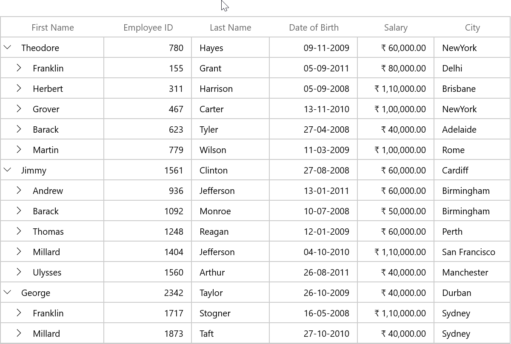

# Grid Lines Customization in WinUI TreeGrid

SfTreeGrid allows you to customize the grid lines visibility to vertical, horizontal, both or none. To achieve this, use the following properties.

[SfTreeGrid.GridLinesVisibility](https://help.syncfusion.com/cr/winui/Syncfusion.UI.Xaml.Grids.SfGridBase.html#Syncfusion_UI_Xaml_Grids_SfGridBase_GridLinesVisibility): To set the border lines for the cells other than header and stacked header cells.
[SfTreeGrid.HeaderLinesVisibility](https://help.syncfusion.com/cr/winui/Syncfusion.UI.Xaml.Grids.SfGridBase.html#Syncfusion_UI_Xaml_Grids_SfGridBase_HeaderLinesVisibility): To set the border lines only for header and stacked header cells.

The following are the list of options available to customize grid lines visibility,

* Both
* Vertical
* Horizontal
* None

## Record rows

### Both

The [GridLinesVisibility.Both](https://help.syncfusion.com/cr/winui/Syncfusion.UI.Xaml.Grids.GridLinesVisibility.html#Syncfusion_UI_Xaml_Grids_GridLinesVisibility_Both) displays the TreeGrid with both horizontal and vertical grid lines. By default GridLinesVisibility value set as Both.



xmlns:treeGrid="using:Syncfusion.UI.Xaml.TreeGrid"

<treeGrid:SfTreeGrid  x:Name="sfTreeGrid"
                      AutoExpandMode="RootNodesExpanded"
                      AutoGenerateColumns="False"
                      GridLinesVisibility="Both"
                      ChildPropertyName="Children"
                      ColumnWidthMode="AutoWithLastColumnFill"
                      ExpanderColumn="FirstName"
                      ItemsSource="{Binding Persons}"/>



this.sfTreeGrid.GridLinesVisibility = GridLinesVisibility.Both;



### Horizontal

The [GridLinesVisibility.Horizontal]https://help.syncfusion.com/cr/winui/Syncfusion.UI.Xaml.Grids.GridLinesVisibility.html#Syncfusion_UI_Xaml_Grids_GridLinesVisibility_Horizontal) displays the TreeGrid with horizontal grid lines only.



xmlns:treeGrid="using:Syncfusion.UI.Xaml.TreeGrid"

<treeGrid:SfTreeGrid  x:Name="sfTreeGrid"
                      AutoExpandMode="RootNodesExpanded"
                      AutoGenerateColumns="True"
                      GridLinesVisibility="Horizontal"
                      ChildPropertyName="Children"
                      ColumnWidthMode="AutoWithLastColumnFill"
                      ExpanderColumn="FirstName"
                      ItemsSource="{Binding Persons}"/>



this.sfTreeGrid.GridLinesVisibility = GridLinesVisibility.Horizontal;



### Vertical

The [GridLinesVisibility.Vertical](https://help.syncfusion.com/cr/winui/Syncfusion.UI.Xaml.Grids.GridLinesVisibility.html#Syncfusion_UI_Xaml_Grids_GridLinesVisibility_Vertical) displays the TreeGrid with vertical grid lines only.



xmlns:treeGrid="using:Syncfusion.UI.Xaml.TreeGrid"

<treeGrid:SfTreeGrid  x:Name="sfTreeGrid"
                      AutoExpandMode="RootNodesExpanded"
                      AutoGenerateColumns="True"
                      GridLinesVisibility="Vertical"
                      ChildPropertyName="Children"
                      ColumnWidthMode="AutoWithLastColumnFill"
                      ExpanderColumn="FirstName"
                      ItemsSource="{Binding Persons}"/>



this.sfTreeGrid.GridLinesVisibility = GridLinesVisibility.Vertical;



### None
[GridLinesVisibility.None](https://help.syncfusion.com/cr/winui/Syncfusion.UI.Xaml.Grids.GridLinesVisibility.html#Syncfusion_UI_Xaml_Grids_GridLinesVisibility_None) displays the TreeGrid without grid lines.



xmlns:treeGrid="using:Syncfusion.UI.Xaml.TreeGrid"

<treeGrid:SfTreeGrid  x:Name="sfTreeGrid"
                      Height="514"
                      Width="800"
                      Margin="5"
                      VerticalAlignment="Top"
                      AutoExpandMode="RootNodesExpanded"
                      AutoGenerateColumns="False"
                      GridLinesVisibility="None"
                      ChildPropertyName="Children"
                      ColumnWidthMode="AutoWithLastColumnFill"
                      ExpanderColumn="FirstName"
                      ItemsSource="{Binding Persons}"/>



this.sfTreeGrid.GridLinesVisibility = GridLinesVisibility.None;



## Header rows

You can customize the TreeGrid header lines visibility by using the [SfTreeGrid.HeaderLinesVisibility](https://help.syncfusion.com/cr/winui/Syncfusion.UI.Xaml.Grids.SfGridBase.html#Syncfusion_UI_Xaml_Grids_SfGridBase_HeaderLinesVisibility) property. You can also customize the header lines visibility to horizontal, vertical, none or both. By default HeaderLinesVisibility value set as Both.



xmlns:treeGrid="using:Syncfusion.UI.Xaml.TreeGrid"

<treeGrid:SfTreeGrid  x:Name="sfTreeGrid"
                      AutoExpandMode="RootNodesExpanded"
                      AutoGenerateColumns="True"
                      HeaderLinesVisibility="Horizontal"
                      ChildPropertyName="Children"
                      ColumnWidthMode="AutoWithLastColumnFill"
                      ExpanderColumn="FirstName"
                      ItemsSource="{Binding Persons}"/>



this.sfTreeGrid.HeaderLinesVisibility = GridLinesVisibility.Horizontal;



## Limitations

* Grid lines customization are not supported for RowHeader.
