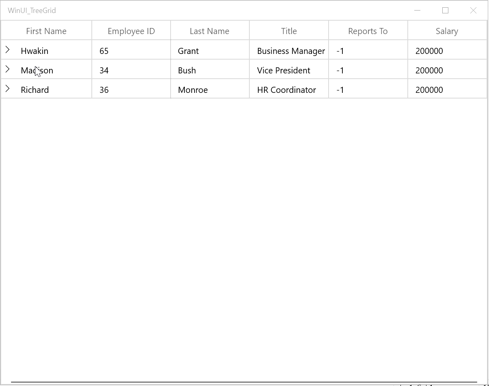

# Load On Demand in WinUI TreeGrid

SfTreeGrid supports to load the data in on-demand. It helps to load the child items from services when end-user expands the node. This can be achieved by using the [SfTreeGrid.LoadOnDemandCommand](https://help.syncfusion.com/cr/winui/Syncfusion.UI.Xaml.TreeGrid.SfTreeGrid.html#Syncfusion_UI_Xaml_TreeGrid_SfTreeGrid_LoadOnDemandCommand) command or [SfTreeGrid.RequestTreeItems](https://help.syncfusion.com/cr/winui/Syncfusion.UI.Xaml.TreeGrid.SfTreeGrid.html#Syncfusion_UI_Xaml_TreeGrid_SfTreeGrid_RequestTreeItems) event as follows.                                                                                          

## Load on demand using command

SfTreeGrid allows you to load child items only when they are requested to load on-demand. Initially populate the root Nodes by assigning `SfTreeGrid.ItemsSource` and then when any node is expanded, child items can be loaded using [SfTreeGrid.LoadOnDemandCommand](https://help.syncfusion.com/cr/winui/Syncfusion.UI.Xaml.TreeGrid.SfTreeGrid.html#Syncfusion_UI_Xaml_TreeGrid_SfTreeGrid_LoadOnDemandCommand).



<Page.DataContext>
    <local:ViewModel />
</Page.DataContext>

<syncfusion:SfTreeGrid Name="treeGrid"
                       LoadOnDemandCommand="{Binding CommandLoad}"
                       AutoGenerateColumns="True"
                       ItemsSource="{Binding EmployeeDetails}" >
</syncfusion:SfTreeGrid>



public class ViewModel : NotificationObject
{
    public ICommand CommandLoad
    { get; set; }

    /// 

    /// Initializes a new instance of the <see cref="ViewModel"/> class.
    /// 

    public ViewModel()
    {
        CommandLoad = new LoadCommand();
        EmployeeDetails = new List<EmployeeInfo>();
        EmployeeDetails.Add(new EmployeeInfo() { FirstName = "Hwakin", ID = 65, LastName = "Grant", Title = "Business Manager", Salary = 200000, ReportsTo = -1 });
        EmployeeDetails.Add(new EmployeeInfo() { FirstName = "Madison", ID = 34, LastName = "Bush", Title = "Vice President", Salary = 200000, ReportsTo = -1 });
        EmployeeDetails.Add(new EmployeeInfo() { FirstName = "Richard", ID = 36, LastName = "Monroe", Title = "HR Coordinator", Salary = 200000, ReportsTo = -1 });
        EmployeeDetails.Add(new EmployeeInfo() { FirstName = "Jack", ID = 43, LastName = "Madison", Title = "Supervisor", Salary = 25000, ReportsTo = 55 });
    }

    /// 

    /// Gets or sets the employee details.
    /// 

    /// <value>The employee details.</value>
    public List<EmployeeInfo> EmployeeDetails
    {
        get;
        set;
    }

    /// 

    /// Gets the reportees.
    /// 

    /// <param name="bossID">The boss ID.</param>
    /// <returns></returns>
    public IEnumerable<EmployeeInfo> GetReportees(int bossID)
    {
        List<EmployeeInfo> list = new List<EmployeeInfo>();

        if (bossID == 65)
        {
            list.Add(new EmployeeInfo() { FirstName = "John", ID = 5, LastName = "Polk", Title = "Marketing Specialist", Salary = 100000, ReportsTo = 65 });
            list.Add(new EmployeeInfo() { FirstName = "Bill", ID = 26, LastName = "Wilson", Title = "Senior Tool Designer", Salary = 100000, ReportsTo = 65 });
            list.Add(new EmployeeInfo() { FirstName = "Jimmy", ID = 23, LastName = "Harry", Title = "Stocker", Salary = 50000, ReportsTo = 65 });
            list.Add(new EmployeeInfo() { FirstName = "Harry", ID = 68, LastName = "Coolidge", Title = "Maintainence Superviser", Salary = 50000, ReportsTo = 65 });
        }

        if (bossID == 34)
        {
            list.Add(new EmployeeInfo() { FirstName = "Franklin", ID = 24, LastName = "Madison", Title = "Quality Assurance Supervisor", Salary = 40000, ReportsTo = 34 });
            list.Add(new EmployeeInfo() { FirstName = "William", ID = 66, LastName = "Nixon", Title = "Production Technician", Salary = 40000, ReportsTo = 34 });
            list.Add(new EmployeeInfo() { FirstName = "Grover", ID = 35, LastName = "Taft", Title = "Stocker", Salary = 50000, ReportsTo = 34 });
            list.Add(new EmployeeInfo() { FirstName = "Bill", ID = 18, LastName = "Nixon", Title = "Maintainence Superviser", Salary = 50000, ReportsTo = 34 });
        }

        if (bossID == 36)
        {
            list.Add(new EmployeeInfo() { FirstName = "Madison", ID = 64, LastName = "Franklin", Title = "Quality Assurance Supervisor", Salary = 40000, ReportsTo = 36 });
            list.Add(new EmployeeInfo() { FirstName = "Wilson", ID = 67, LastName = "Harry", Title = "Production Technician", Salary = 40000, ReportsTo = 36 });
            list.Add(new EmployeeInfo() { FirstName = "Harry", ID = 59, LastName = "Taft", Title = "Stocker", Salary = 50000, ReportsTo = 36 });
            list.Add(new EmployeeInfo() { FirstName = "Jimmy", ID = 08, LastName = "Grover", Title = "Maintainence Superviser", Salary = 50000, ReportsTo = 36 });
        }

        if (bossID == 5)
        {
            list.Add(new EmployeeInfo() { FirstName = "Franklin", ID = 47, LastName = "William", Title = "Quality Assurance Supervisor", Salary = 40000, ReportsTo = 5 });
            list.Add(new EmployeeInfo() { FirstName = "Taft", ID = 52, LastName = "Peter", Title = "Production Technician", Salary = 40000, ReportsTo = 5 });
            list.Add(new EmployeeInfo() { FirstName = "Harry", ID = 34, LastName = "Wilson", Title = "Stocker", Salary = 50000, ReportsTo = 5 });
            list.Add(new EmployeeInfo() { FirstName = "Grover", ID = 41, LastName = "John", Title = "Maintainence Superviser", Salary = 50000, ReportsTo = 5 });
        }

        if (bossID == 26)
        {
            list.Add(new EmployeeInfo() { FirstName = "Andrew", ID = 11, LastName = "Wilson", Title = "Quality Assurance Supervisor", Salary = 40000, ReportsTo = 26 });
            list.Add(new EmployeeInfo() { FirstName = "George", ID = 24, LastName = "Madison", Title = "Production Technician", Salary = 40000, ReportsTo = 26 });
            list.Add(new EmployeeInfo() { FirstName = "Peter", ID = 33, LastName = "Taft", Title = "Stocker", Salary = 50000, ReportsTo = 26 });
            list.Add(new EmployeeInfo() { FirstName = "Jimmy", ID = 54, LastName = "Harry", Title = "Maintainence Superviser", Salary = 50000, ReportsTo = 26 });
        }

        if (bossID == 23)
        {
            list.Add(new EmployeeInfo() { FirstName = "Bush", ID = 98, LastName = "Bill", Title = "Quality Assurance Supervisor", Salary = 40000, ReportsTo = 23 });
            list.Add(new EmployeeInfo() { FirstName = "Hayes", ID = 32, LastName = "William", Title = "Production Technician", Salary = 40000, ReportsTo = 23 });
            list.Add(new EmployeeInfo() { FirstName = "Madison", ID = 12, LastName = "Franklin", Title = "Stocker", Salary = 50000, ReportsTo = 23 });
            list.Add(new EmployeeInfo() { FirstName = "Arthur", ID = 96, LastName = "Grover", Title = "Maintainence Superviser", Salary = 50000, ReportsTo = 23 });
        }

        if (bossID == 18)
        {
            list.Add(new EmployeeInfo() { FirstName = "Adams", ID = 71, LastName = "Reagan", Title = "Quality Assurance Supervisor", Salary = 40000, ReportsTo = 18 });
            list.Add(new EmployeeInfo() { FirstName = "Nixon", ID = 92, LastName = "Tyler", Title = "Production Technician", Salary = 40000, ReportsTo = 18 });
            list.Add(new EmployeeInfo() { FirstName = "Coolidge", ID = 43, LastName = "Polk", Title = "Design Engineer", Salary = 50000, ReportsTo = 18 });
            list.Add(new EmployeeInfo() { FirstName = "George", ID = 84, LastName = "Harrison", Title = "Maintainence Superviser", Salary = 50000, ReportsTo = 18 });
        }

        if (bossID == 68)
        {
            list.Add(new EmployeeInfo() { FirstName = "Madison", ID = 125, LastName = "Bill", Title = "Marketing Specialist", Salary = 100000, ReportsTo = 68 });
            list.Add(new EmployeeInfo() { FirstName = "Nixon", ID = 226, LastName = "Wilson", Title = "Senior Tool Designer", Salary = 100000, ReportsTo = 68 });
            list.Add(new EmployeeInfo() { FirstName = "Taft", ID = 253, LastName = "Franklin", Title = "Stocker", Salary = 50000, ReportsTo = 68 });
            list.Add(new EmployeeInfo() { FirstName = "Harry", ID = 618, LastName = "Coolidge", Title = "Maintainence Superviser", Salary = 50000, ReportsTo = 68 });
        }

        if (bossID == 24)
        {
            list.Add(new EmployeeInfo() { FirstName = "Franklin", ID = 244, LastName = "Madison", Title = "Quality Assurance Supervisor", Salary = 40000, ReportsTo = 24 });
            list.Add(new EmployeeInfo() { FirstName = "William", ID = 166, LastName = "Nixon", Title = "Production Technician", Salary = 40000, ReportsTo = 24 });
            list.Add(new EmployeeInfo() { FirstName = "Grover", ID = 355, LastName = "Taft", Title = "Stocker", Salary = 50000, ReportsTo = 24 });
            list.Add(new EmployeeInfo() { FirstName = "Bill", ID = 148, LastName = "Harry", Title = "Production Superviser", Salary = 50000, ReportsTo = 24 });
        }

        if (bossID == 66)
        {
            list.Add(new EmployeeInfo() { FirstName = "Stogner", ID = 64, LastName = "Martin", Title = "Quality Assurance Supervisor", Salary = 40000, ReportsTo = 66 });
            list.Add(new EmployeeInfo() { FirstName = "Wilson", ID = 67, LastName = "Harry", Title = "Production Technician", Salary = 40000, ReportsTo = 66 });
            list.Add(new EmployeeInfo() { FirstName = "Harrison", ID = 59, LastName = "Will", Title = "Stocker", Salary = 50000, ReportsTo = 66 });
            list.Add(new EmployeeInfo() { FirstName = "Jimmy", ID = 08, LastName = "Grover", Title = "Maintainence Superviser", Salary = 50000, ReportsTo = 66 });
        }

        if (bossID == 35)
        {
            list.Add(new EmployeeInfo() { FirstName = "Franklin", ID = 417, LastName = "William", Title = "Quality Assurance Supervisor", Salary = 40000, ReportsTo = 35 });
            list.Add(new EmployeeInfo() { FirstName = "Taft", ID = 522, LastName = "Peter", Title = "Production Technician", Salary = 40000, ReportsTo = 35 });
            list.Add(new EmployeeInfo() { FirstName = "Harry", ID = 341, LastName = "Wilson", Title = "Stocker", Salary = 50000, ReportsTo = 35 });
            list.Add(new EmployeeInfo() { FirstName = "Grover", ID = 141, LastName = "John", Title = "Maintainence Superviser", Salary = 50000, ReportsTo = 35 });
        }

        if (bossID == 64)
        {
            list.Add(new EmployeeInfo() { FirstName = "Andrew", ID = 141, LastName = "Wilson", Title = "Quality Assurance Supervisor", Salary = 40000, ReportsTo = 64 });
            list.Add(new EmployeeInfo() { FirstName = "Will", ID = 244, LastName = "Madison", Title = "Production Technician", Salary = 40000, ReportsTo = 64 });
            list.Add(new EmployeeInfo() { FirstName = "Harrison", ID = 343, LastName = "Taft", Title = "Stocker", Salary = 50000, ReportsTo = 64 });
            list.Add(new EmployeeInfo() { FirstName = "Jimmy", ID = 544, LastName = "Harry", Title = "Maintainence Superviser", Salary = 50000, ReportsTo = 64 });
        }

        if (bossID == 67)
        {
            list.Add(new EmployeeInfo() { FirstName = "Bush", ID = 98, LastName = "Bill", Title = "Quality Assurance Supervisor", Salary = 40000, ReportsTo = 67 });
            list.Add(new EmployeeInfo() { FirstName = "Hayes", ID = 32, LastName = "William", Title = "Production Technician", Salary = 40000, ReportsTo = 67 });
            list.Add(new EmployeeInfo() { FirstName = "Madison", ID = 12, LastName = "Franklin", Title = "Stocker", Salary = 50000, ReportsTo = 67 });
            list.Add(new EmployeeInfo() { FirstName = "Arthur", ID = 96, LastName = "Grover", Title = "Maintainence Superviser", Salary = 50000, ReportsTo = 67 });
        }

        if (bossID == 59)
        {
            list.Add(new EmployeeInfo() { FirstName = "Adams", ID = 711, LastName = "Reagan", Title = "Quality Assurance Supervisor", Salary = 40000, ReportsTo = 59 });
            list.Add(new EmployeeInfo() { FirstName = "Nixon", ID = 192, LastName = "Tyler", Title = "Production Technician", Salary = 40000, ReportsTo = 59 });
            list.Add(new EmployeeInfo() { FirstName = "Coolidge", ID = 413, LastName = "Polk", Title = "Design Engineer", Salary = 50000, ReportsTo = 59 });
            list.Add(new EmployeeInfo() { FirstName = "George", ID = 841, LastName = "Harrison", Title = "Maintainence Superviser", Salary = 50000, ReportsTo = 59 });
        }

        if (bossID == 8)
        {
            list.Add(new EmployeeInfo() { FirstName = "William", ID = 71, LastName = "Bush", Title = "Quality Assurance Supervisor", Salary = 40000, ReportsTo = 8 });
            list.Add(new EmployeeInfo() { FirstName = "Harry", ID = 92, LastName = "Tyler", Title = "Production Technician", Salary = 40000, ReportsTo = 8 });
            list.Add(new EmployeeInfo() { FirstName = "Arthur", ID = 43, LastName = "Polk", Title = "Design Engineer", Salary = 50000, ReportsTo = 8 });
            list.Add(new EmployeeInfo() { FirstName = "George", ID = 84, LastName = "Harrison", Title = "Maintainence Superviser", Salary = 50000, ReportsTo = 8 });
        }
        return list;
    }
}


class LoadCommand : ICommand
{
    public event EventHandler CanExecuteChanged;
    MainPage page;
    public bool CanExecute(object parameter)
    {
        TreeNode node = (parameter as TreeNode);
        EmployeeInfo emp = node.Item as EmployeeInfo;
        if (emp != null)
            if (emp.ReportsTo == -1 || emp.ReportsTo == 34 || emp.ReportsTo == 36 || emp.ReportsTo == 65)
                return true;
        return false;
    }

    public void Execute(object parameter)
    {
        TreeNode node = (parameter as TreeNode);
        page = new MainPage();
        EmployeeInfo emp = node.Item as EmployeeInfo;
        if (emp != null)
        {
            node.PopulateChildNodes((page.DataContext as ViewModel).GetReportees(emp.ID));
        }
    }

    event EventHandler<object> ICommand.CanExecuteChanged
    {
        add
        {
            throw new NotImplementedException();
        }

        remove
        {
            throw new NotImplementedException();
        }
    }
}



### Handling expander visibility

SfTreeGrid shows the expander for a particular node based on return value of [CanExecute](https://docs.microsoft.com/en-us/dotnet/api/system.windows.input.icommand.canexecute?view=netframework-4.8) method of `LoadOnDemandCommand`. If `CanExecute` returns `true`, then expander icon is displayed for that node. If `CanExecute` returns `false`, then expander icon will not displayed for that node. `CanExecute` method gets called to decide the visibility of expander icon and before executing `LoadOnDemandCommand`.



public bool CanExecute(object parameter)
{
    TreeNode node = (parameter as TreeNode);
    EmployeeInfo emp = node.Item as EmployeeInfo;
    if (emp != null)
        if (emp.ReportsTo == -1 || emp.ReportsTo == 34 || emp.ReportsTo == 36 || emp.ReportsTo == 65)
            return true;
    return false;
}



### On-demand loading of child items

You can load child items for the node in [Execute](https://docs.microsoft.com/en-us/dotnet/api/system.windows.input.icommand.execute?view=netframework-4.8) method of `LoadOnDemandCommand`. Execute method will get called when user expands the tree node. In execute method, you can populate the child nodes by calling [TreeNode.PopulateChildNodes](https://help.syncfusion.com/cr/winui/Syncfusion.UI.Xaml.TreeGrid.TreeNode.html#Syncfusion_UI_Xaml_TreeGrid_TreeNode_PopulateChildNodes) method by passing the child items collection.



MainPage page;
public void Execute(object parameter)
{
    TreeNode node = (parameter as TreeNode);
    page = new MainPage();
    EmployeeInfo emp = node.Item as EmployeeInfo;
    if (emp != null)
    {
        node.PopulateChildNodes((page.DataContext as ViewModel).GetReportees(emp.ID));
    }
}




N> [View Sample in GitHub](https://github.com/SyncfusionExamples/How-to-load-data-on-demand-using-command-in-winui-treegrid).

## Load on demand using event

SfTreeGrid supports to load the data in on-demand through [SfTreeGrid.RequestTreeItems](https://help.syncfusion.com/cr/winui/Syncfusion.UI.Xaml.TreeGrid.SfTreeGrid.html#Syncfusion_UI_Xaml_TreeGrid_SfTreeGrid_RequestTreeItems) event. `RequestTreeItems` event is triggered at the time of loading and when user expand any node at runtime. SfTreeGrid gets the root and leaf nodes through this event handler.
`TreeGridRequestTreeItemsEventArgs.ParentItem` denotes the data object looking for its child nodes. If it is null, it denotes SfTreeGrid requesting root nodes.

In the below example SfTreeGrid is populated through `SfTreeGrid.RequestTreeItems` instead of setting [SfTreeGrid.ItemsSource](https://help.syncfusion.com/cr/winui/Syncfusion.UI.Xaml.TreeGrid.SfTreeGrid.html#Syncfusion_UI_Xaml_TreeGrid_SfTreeGrid_ItemsSource).



treeGrid.RequestTreeItems += TreeGrid_RequestTreeItems;

private void TreeGrid_RequestTreeItems(object sender, TreeGridRequestTreeItemsEventArgs e)
{
    if (e.ParentItem == null)
    {
        //get the root list - get all employees who have no boss 
        e.ChildItems = (this.DataContext as ViewModel).EmployeeDetails.Where(x => x.ReportsTo == -1); //get all employees whose boss's id is -1 (no boss)
    }
    else //if ParentItem not null, then set args.ChildList to the child items for the given ParentItem.
    {   //get the children of the parent object
        EmployeeInfo emp = e.ParentItem as EmployeeInfo;
        if (emp != null)
        {
            //get all employees that report to the parent employee
            e.ChildItems = (this.DataContext as ViewModel).GetReportees(emp.ID);
        }
    }
}


public class EmployeeInfo : NotificationObject
{
    int _id;

    /// 

    /// Gets or sets the ID.
    /// 

    /// <value>The ID.</value>
    public int ID
    {
        get
        {
            return _id;
        }
        set
        {
            _id = value;
            RaisePropertyChanged("ID");
        }
    }
    string _firstName;

    /// 

    /// Gets or sets the first name.
    /// 

    /// <value>The first name.</value>
    public string FirstName
    {
        get
        {
            return _firstName;
        }
        set
        {
            _firstName = value;
            RaisePropertyChanged("FirstName");
        }
    }
    string _lastName;

    /// 

    /// Gets or sets the last name.
    /// 

    /// <value>The last name.</value>
    public string LastName
    {
        get
        {
            return _lastName;
        }
        set
        {
            _lastName = value;
            RaisePropertyChanged("LastName");
        }
    }
   
    private string _title;

    /// 

    /// Gets or sets the title.
    /// 

    /// <value>The title.</value>
    public string Title
    {
        get
        {
            return _title;
        }
        set
        {
            _title = value;
            RaisePropertyChanged("Title");
        }
    }

    double? _salary;

    /// 

    /// Gets or sets the salary.
    /// 

    /// <value>The salary.</value>
    public double? Salary
    {
        get
        {
            return _salary;
        }
        set
        {
            _salary = value;
            RaisePropertyChanged("Salary");
        }
    }

    int _reportsTo;

    /// 

    /// Gets or sets the reports to.
    /// 

    /// <value>The reports to.</value>
    public int ReportsTo
    {
        get
        {
            return _reportsTo;
        }
        set
        {
            _reportsTo = value;
            RaisePropertyChanged("ReportsTo");
        }
    }
}



public class ViewModel : NotificationObject
{
    /// 

    /// Initializes a new instance of the <see cref="ViewModel"/> class.
    /// 

    public ViewModel()
    {
        EmployeeDetails = new List<EmployeeInfo>();
        EmployeeDetails.Add(new EmployeeInfo() { FirstName = "Hwakin", ID = 65, LastName = "Grant", Title = "Business Manager", Salary = 200000, ReportsTo = -1 });
        EmployeeDetails.Add(new EmployeeInfo() { FirstName = "Madison", ID = 34, LastName = "Bush", Title = "Vice President", Salary = 200000, ReportsTo = -1 });
        EmployeeDetails.Add(new EmployeeInfo() { FirstName = "Richard", ID = 36, LastName = "Monroe", Title = "HR Coordinator", Salary = 200000, ReportsTo = -1 });
        EmployeeDetails.Add(new EmployeeInfo() { FirstName = "Jack", ID = 43, LastName = "Madison", Title = "Supervisor", Salary = 25000, ReportsTo = 55 });
    }

    /// 

    /// Gets or sets the employee details.
    /// 

    /// <value>The employee details.</value>
    public List<EmployeeInfo> EmployeeDetails
    {
        get;
        set;
    }

    /// 

    /// Gets the reportees.
    /// 

    /// <param name="bossID">The boss ID.</param>
    /// <returns></returns>
    public IEnumerable<EmployeeInfo> GetReportees(int bossID)
    {
        List<EmployeeInfo> list = new List<EmployeeInfo>();

        if (bossID == 65)
        {
            list.Add(new EmployeeInfo() { FirstName = "John", ID = 5, LastName = "Polk", Title = "Marketing Specialist", Salary = 100000, ReportsTo = 65 });
            list.Add(new EmployeeInfo() { FirstName = "Bill", ID = 26, LastName = "Wilson", Title = "Senior Tool Designer", Salary = 100000, ReportsTo = 65 });
            list.Add(new EmployeeInfo() { FirstName = "Jimmy", ID = 23, LastName = "Harry", Title = "Stocker", Salary = 50000, ReportsTo = 65 });
            list.Add(new EmployeeInfo() { FirstName = "Harry", ID = 68, LastName = "Coolidge", Title = "Maintainence Superviser", Salary = 50000, ReportsTo = 65 });
        }

        if (bossID == 34)
        {
            list.Add(new EmployeeInfo() { FirstName = "Franklin", ID = 24, LastName = "Madison", Title = "Quality Assurance Supervisor", Salary = 40000, ReportsTo = 34 });
            list.Add(new EmployeeInfo() { FirstName = "William", ID = 66, LastName = "Nixon", Title = "Production Technician", Salary = 40000, ReportsTo = 34 });
            list.Add(new EmployeeInfo() { FirstName = "Grover", ID = 35, LastName = "Taft", Title = "Stocker", Salary = 50000, ReportsTo = 34 });
            list.Add(new EmployeeInfo() { FirstName = "Bill", ID = 18, LastName = "Nixon", Title = "Maintainence Superviser", Salary = 50000, ReportsTo = 34 });
        }

        if (bossID == 36)
        {
            list.Add(new EmployeeInfo() { FirstName = "Madison", ID = 64, LastName = "Franklin", Title = "Quality Assurance Supervisor", Salary = 40000, ReportsTo = 36 });
            list.Add(new EmployeeInfo() { FirstName = "Wilson", ID = 67, LastName = "Harry", Title = "Production Technician", Salary = 40000, ReportsTo = 36 });
            list.Add(new EmployeeInfo() { FirstName = "Harry", ID = 59, LastName = "Taft", Title = "Stocker", Salary = 50000, ReportsTo = 36 });
            list.Add(new EmployeeInfo() { FirstName = "Jimmy", ID = 08, LastName = "Grover", Title = "Maintainence Superviser", Salary = 50000, ReportsTo = 36 });
        }

        if (bossID == 5)
        {
            list.Add(new EmployeeInfo() { FirstName = "Franklin", ID = 47, LastName = "William", Title = "Quality Assurance Supervisor", Salary = 40000, ReportsTo = 5 });
            list.Add(new EmployeeInfo() { FirstName = "Taft", ID = 52, LastName = "Peter", Title = "Production Technician", Salary = 40000, ReportsTo = 5 });
            list.Add(new EmployeeInfo() { FirstName = "Harry", ID = 34, LastName = "Wilson", Title = "Stocker", Salary = 50000, ReportsTo = 5 });
            list.Add(new EmployeeInfo() { FirstName = "Grover", ID = 41, LastName = "John", Title = "Maintainence Superviser", Salary = 50000, ReportsTo = 5 });
        }

        if (bossID == 26)
        {
            list.Add(new EmployeeInfo() { FirstName = "Andrew", ID = 11, LastName = "Wilson", Title = "Quality Assurance Supervisor", Salary = 40000, ReportsTo = 26 });
            list.Add(new EmployeeInfo() { FirstName = "George", ID = 24, LastName = "Madison", Title = "Production Technician", Salary = 40000, ReportsTo = 26 });
            list.Add(new EmployeeInfo() { FirstName = "Peter", ID = 33, LastName = "Taft", Title = "Stocker", Salary = 50000, ReportsTo = 26 });
            list.Add(new EmployeeInfo() { FirstName = "Jimmy", ID = 54, LastName = "Harry", Title = "Maintainence Superviser", Salary = 50000, ReportsTo = 26 });
        }

        if (bossID == 23)
        {
            list.Add(new EmployeeInfo() { FirstName = "Bush", ID = 98, LastName = "Bill", Title = "Quality Assurance Supervisor", Salary = 40000, ReportsTo = 23 });
            list.Add(new EmployeeInfo() { FirstName = "Hayes", ID = 32, LastName = "William", Title = "Production Technician", Salary = 40000, ReportsTo = 23 });
            list.Add(new EmployeeInfo() { FirstName = "Madison", ID = 12, LastName = "Franklin", Title = "Stocker", Salary = 50000, ReportsTo = 23 });
            list.Add(new EmployeeInfo() { FirstName = "Arthur", ID = 96, LastName = "Grover", Title = "Maintainence Superviser", Salary = 50000, ReportsTo = 23 });
        }

        if (bossID == 18)
        {
            list.Add(new EmployeeInfo() { FirstName = "Adams", ID = 71, LastName = "Reagan", Title = "Quality Assurance Supervisor", Salary = 40000, ReportsTo = 18 });
            list.Add(new EmployeeInfo() { FirstName = "Nixon", ID = 92, LastName = "Tyler", Title = "Production Technician", Salary = 40000, ReportsTo = 18 });
            list.Add(new EmployeeInfo() { FirstName = "Coolidge", ID = 43, LastName = "Polk", Title = "Design Engineer", Salary = 50000, ReportsTo = 18 });
            list.Add(new EmployeeInfo() { FirstName = "George", ID = 84, LastName = "Harrison", Title = "Maintainence Superviser", Salary = 50000, ReportsTo = 18 });
        }

        if (bossID == 68)
        {
            list.Add(new EmployeeInfo() { FirstName = "Madison", ID = 125, LastName = "Bill", Title = "Marketing Specialist", Salary = 100000, ReportsTo = 68 });
            list.Add(new EmployeeInfo() { FirstName = "Nixon", ID = 226, LastName = "Wilson", Title = "Senior Tool Designer", Salary = 100000, ReportsTo = 68 });
            list.Add(new EmployeeInfo() { FirstName = "Taft", ID = 253, LastName = "Franklin", Title = "Stocker", Salary = 50000, ReportsTo = 68 });
            list.Add(new EmployeeInfo() { FirstName = "Harry", ID = 618, LastName = "Coolidge", Title = "Maintainence Superviser", Salary = 50000, ReportsTo = 68 });
        }

        if (bossID == 24)
        {
            list.Add(new EmployeeInfo() { FirstName = "Franklin", ID = 244, LastName = "Madison", Title = "Quality Assurance Supervisor", Salary = 40000, ReportsTo = 24 });
            list.Add(new EmployeeInfo() { FirstName = "William", ID = 166, LastName = "Nixon", Title = "Production Technician", Salary = 40000, ReportsTo = 24 });
            list.Add(new EmployeeInfo() { FirstName = "Grover", ID = 355, LastName = "Taft", Title = "Stocker", Salary = 50000, ReportsTo = 24 });
            list.Add(new EmployeeInfo() { FirstName = "Bill", ID = 148, LastName = "Harry", Title = "Production Superviser", Salary = 50000, ReportsTo = 24 });
        }

        if (bossID == 66)
        {
            list.Add(new EmployeeInfo() { FirstName = "Stogner", ID = 64, LastName = "Martin", Title = "Quality Assurance Supervisor", Salary = 40000, ReportsTo = 66 });
            list.Add(new EmployeeInfo() { FirstName = "Wilson", ID = 67, LastName = "Harry", Title = "Production Technician", Salary = 40000, ReportsTo = 66 });
            list.Add(new EmployeeInfo() { FirstName = "Harrison", ID = 59, LastName = "Will", Title = "Stocker", Salary = 50000, ReportsTo = 66 });
            list.Add(new EmployeeInfo() { FirstName = "Jimmy", ID = 08, LastName = "Grover", Title = "Maintainence Superviser", Salary = 50000, ReportsTo = 66 });
        }

        if (bossID == 35)
        {
            list.Add(new EmployeeInfo() { FirstName = "Franklin", ID = 417, LastName = "William", Title = "Quality Assurance Supervisor", Salary = 40000, ReportsTo = 35 });
            list.Add(new EmployeeInfo() { FirstName = "Taft", ID = 522, LastName = "Peter", Title = "Production Technician", Salary = 40000, ReportsTo = 35 });
            list.Add(new EmployeeInfo() { FirstName = "Harry", ID = 341, LastName = "Wilson", Title = "Stocker", Salary = 50000, ReportsTo = 35 });
            list.Add(new EmployeeInfo() { FirstName = "Grover", ID = 141, LastName = "John", Title = "Maintainence Superviser", Salary = 50000, ReportsTo = 35 });
        }

        if (bossID == 64)
        {
            list.Add(new EmployeeInfo() { FirstName = "Andrew", ID = 141, LastName = "Wilson", Title = "Quality Assurance Supervisor", Salary = 40000, ReportsTo = 64 });
            list.Add(new EmployeeInfo() { FirstName = "Will", ID = 244, LastName = "Madison", Title = "Production Technician", Salary = 40000, ReportsTo = 64 });
            list.Add(new EmployeeInfo() { FirstName = "Harrison", ID = 343, LastName = "Taft", Title = "Stocker", Salary = 50000, ReportsTo = 64 });
            list.Add(new EmployeeInfo() { FirstName = "Jimmy", ID = 544, LastName = "Harry", Title = "Maintainence Superviser", Salary = 50000, ReportsTo = 64 });
        }

        if (bossID == 67)
        {
            list.Add(new EmployeeInfo() { FirstName = "Bush", ID = 98, LastName = "Bill", Title = "Quality Assurance Supervisor", Salary = 40000, ReportsTo = 67 });
            list.Add(new EmployeeInfo() { FirstName = "Hayes", ID = 32, LastName = "William", Title = "Production Technician", Salary = 40000, ReportsTo = 67 });
            list.Add(new EmployeeInfo() { FirstName = "Madison", ID = 12, LastName = "Franklin", Title = "Stocker", Salary = 50000, ReportsTo = 67 });
            list.Add(new EmployeeInfo() { FirstName = "Arthur", ID = 96, LastName = "Grover", Title = "Maintainence Superviser", Salary = 50000, ReportsTo = 67 });
        }

        if (bossID == 59)
        {
            list.Add(new EmployeeInfo() { FirstName = "Adams", ID = 711, LastName = "Reagan", Title = "Quality Assurance Supervisor", Salary = 40000, ReportsTo = 59 });
            list.Add(new EmployeeInfo() { FirstName = "Nixon", ID = 192, LastName = "Tyler", Title = "Production Technician", Salary = 40000, ReportsTo = 59 });
            list.Add(new EmployeeInfo() { FirstName = "Coolidge", ID = 413, LastName = "Polk", Title = "Design Engineer", Salary = 50000, ReportsTo = 59 });
            list.Add(new EmployeeInfo() { FirstName = "George", ID = 841, LastName = "Harrison", Title = "Maintainence Superviser", Salary = 50000, ReportsTo = 59 });
        }

        if (bossID == 8)
        {
            list.Add(new EmployeeInfo() { FirstName = "William", ID = 71, LastName = "Bush", Title = "Quality Assurance Supervisor", Salary = 40000, ReportsTo = 8 });
            list.Add(new EmployeeInfo() { FirstName = "Harry", ID = 92, LastName = "Tyler", Title = "Production Technician", Salary = 40000, ReportsTo = 8 });
            list.Add(new EmployeeInfo() { FirstName = "Arthur", ID = 43, LastName = "Polk", Title = "Design Engineer", Salary = 50000, ReportsTo = 8 });
            list.Add(new EmployeeInfo() { FirstName = "George", ID = 84, LastName = "Harrison", Title = "Maintainence Superviser", Salary = 50000, ReportsTo = 8 });
        }

        return list;
    }
}



You can let SfTreeGrid to populate the data at runtime by calling [SfTreeGrid.RepopulateTree](https://help.syncfusion.com/cr/winui/Syncfusion.UI.Xaml.TreeGrid.SfTreeGrid.html#Syncfusion_UI_Xaml_TreeGrid_SfTreeGrid_RepopulateTree) method.

N> [View Sample in GitHub](https://github.com/SyncfusionExamples/How-to-load-data-on-demand-using-events-in-winui-treegrid).
