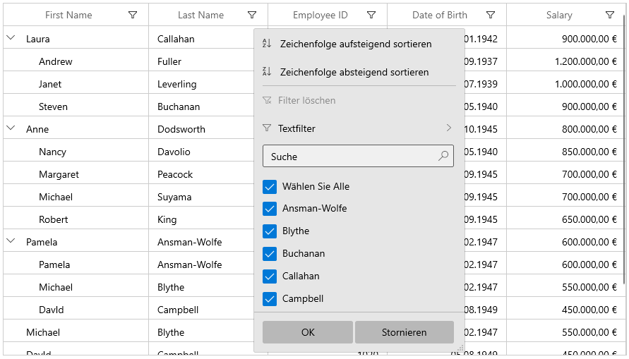
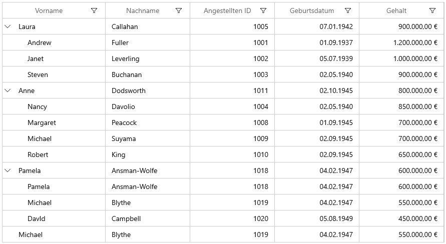

# Localization

Localization is the process of translating the application resources into different language for the specific cultures. You can localize the treegrid by [adding resource file](https://msdn.microsoft.com/library/aa992030.aspx). Application culture can be changed by setting [CurrentUICulture](https://msdn.microsoft.com/en-us/library/system.globalization.cultureinfo.currentuiculture.aspx) before InitializeComponent method.

Below application culture changed to German.



public MainPage()
{
    CultureInfo.CurrentCulture = new CultureInfo("de");
	
    InitializeComponent();
}



To localize the SfTreeGrid based on `CurrentUICulture` using resource files, follow the below steps. 

N> You can get the default resource files of all Syncfusion WinUI libraries from [GitHub](https://github.com/syncfusion/winui-controls-localization-resource-files).

1) Right click your project and add new folder named Resources.

2) Add another folder and name the folder name as culture name. For example, you have to give name as de for German culture. Find the supported culture codes from [here](https://docs.microsoft.com/en-us/windows/uwp/app-resources/how-rms-matches-lang-tags) 

3) Add [default resource files](https://github.com/syncfusion/winui-controls-localization-resource-files) in the following structure.

 
4) Now, you can define the key names from default resource files and assign value based on the culture.

5) Also, localize application text in XAML using below steps

    a)Add resource name in .resx file
	

    b)Refer the mentioned resource name in XAML like below.
	


xmlns:grid="using:Syncfusion.UI.Xaml.Grids"
xmlns:treeGrid="using:Syncfusion.UI.Xaml.TreeGrid"
xmlns:coreconverter="using:Syncfusion.UI.Xaml.Core"

<Page.Resources>        
    <coreconverter:StringFormatConverter x:Key="stringFormatConverter" />
</Page.Resources>

<treeGrid:SfTreeGrid x:Name="sfTreeGrid"
                       AllowFiltering="True"
                       AutoGenerateColumns="False"
                       ChildPropertyName="Children"            
                       ItemsSource="{Binding Employees}">
    <treeGrid:SfTreeGrid.Columns>                
        <treeGrid:TreeGridTextColumn HeaderText="{grid:GridLocalizationResourceExtension ResourceName=FirstNameText}" MappingName="FirstName" />
        <treeGrid:TreeGridTextColumn HeaderText="{grid:GridLocalizationResourceExtension ResourceName=LastNameText}" MappingName="LastName" />
        <treeGrid:TreeGridTextColumn HeaderText="{grid:GridLocalizationResourceExtension ResourceName=EmployeeIDText}" MappingName="EmpID" TextAlignment="Right" />
        <treeGrid:TreeGridTextColumn
                                DisplayBinding="{Binding Path=DOJ, Converter={StaticResource stringFormatConverter}, ConverterParameter=\{0:dd/MM/yyyy\}}"
                                HeaderText="{grid:GridLocalizationResourceExtension ResourceName=DateofBirthText}"
                                MappingName="DOJ"
                                TextAlignment="Right"/>
        <treeGrid:TreeGridTextColumn MappingName="Salary" 
                                     DisplayBinding="{Binding Salary, Converter={StaticResource stringFormatConverter}, ConverterParameter='{}{0:C}'}"
									 HeaderText="{grid:GridLocalizationResourceExtension ResourceName=SalaryText}"
                                     TextAlignment="Right" />
    </treeGrid:SfTreeGrid.Columns>
</treeGrid:SfTreeGrid>




## Edit default culture resource 

You can change the default string of datagrid control by adding the default .resw files ([from GitHub](https://github.com/syncfusion/winui-controls-localization-resource-files)) to Resources folder of your application. Syncfusion WinUI controls reads the default string from the .resw files of application if its added.
