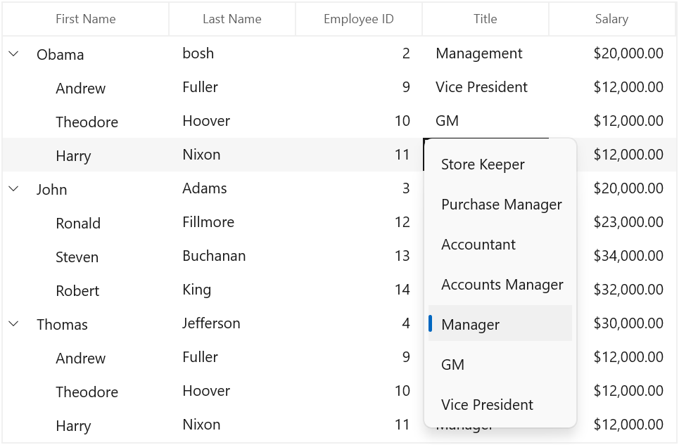
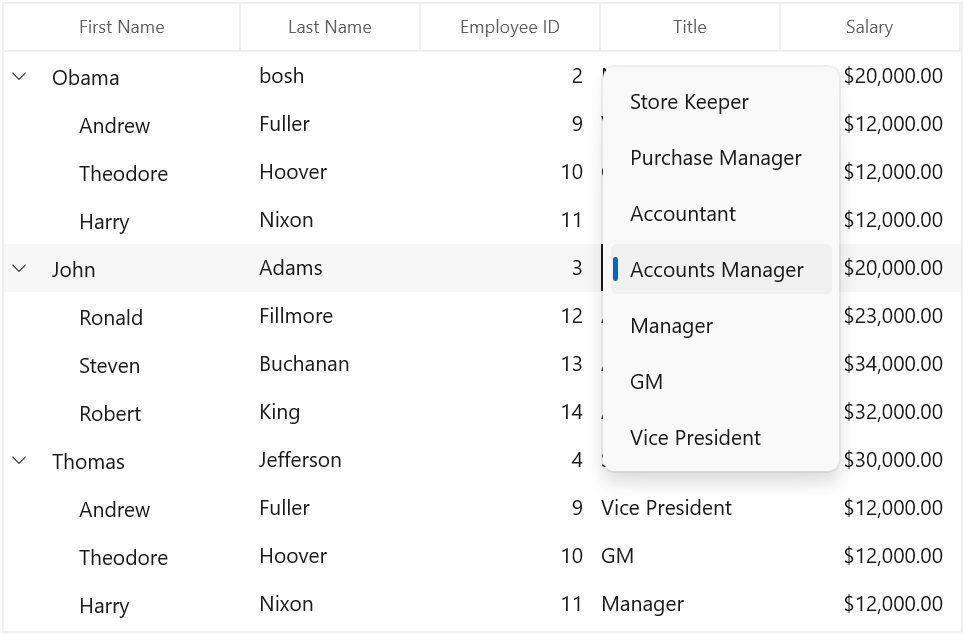

# MVVM in WinUI TreeGrid (SfTreeGrid)

This section explains various MVVM requirements using SfTreeGrid.

## TreeGrid SelectedItem binding

You can bind the [SelectedItem ](https://help.syncfusion.com/cr/winui/Syncfusion.UI.Xaml.Grids.SfGridBase.html#Syncfusion_UI_Xaml_Grids_SfGridBase_SelectedItem) property directly to treegrid by setting the `SfTreeGrid.SelectedItem` property.



<treeGrid:SfTreeGrid x:Name="sfTreeGrid"                                   
                                   ColumnWidthMode="Star"
                                   AllowEditing="True"
                                   AllowFiltering="True"
                                   SelectedItem="{Binding SelectedItem, Mode=TwoWay, UpdateSourceTrigger=PropertyChanged}"
                                   ChildPropertyName="Children"
                                   AutoGenerateColumns="False"
                                   ItemsSource="{Binding Employees}" />



Whenever the `SelectedItem` is changed, the property in the view model will get notified.



public class ViewModel : NotificationObject
{
    public ViewModel()
    {
        _selectedItem = Employees[1];
    }

    private ObservableCollection<Employee> _employees;
    public ObservableCollection<Employee> Employees
    {
        get { return _employees; }
        set { _employees = value; RaisePropertyChanged("Employees"); }
    }
	
    private object _selectedItem;
    public object SelectedItem
    {
        get { return _selectedItem; }
        set { _selectedItem = value; RaisePropertyChanged("SelectedItem"); }       
    }
}



## Button command binding to view model

You can load a button for the columns in treegrid using [TreeGridTemplateColumn](https://help.syncfusion.com/cr/winui/Syncfusion.UI.Xaml.TreeGrid.TreeGridTemplateColumn.html). When loading the buttons, you can bind a command included in view model by using `ElementName` binding.

In the following example, the command receives the underlying data object as command parameter, since the `DataContext` is binding as command parameter.



<treeGrid:SfTreeGrid x:Name="sfTreeGrid"                                   
                                   ColumnWidthMode="Star"
                                   AllowEditing="True"
                                   AllowFiltering="True"
                                   ChildPropertyName="Children"
                                   AutoGenerateColumns="False"
                                   ItemsSource="{Binding Employees}">
    <treeGrid:SfTreeGrid.Columns>
        <treeGrid:TreeGridTextColumn HeaderText="First Name" MappingName="FirstName" />
        <treeGrid:TreeGridTextColumn HeaderText="Last Name" MappingName="LastName" />
        <treeGrid:TreeGridTextColumn HeaderText="Employee ID" MappingName="EmployeeID" TextAlignment="Right" />
        <treeGrid:TreeGridTextColumn HeaderText="Title" MappingName="Title" />
        <treeGrid:TreeGridTemplateColumn HeaderText="City" MappingName="City" >
            <treeGrid:TreeGridTemplateColumn.CellTemplate>		    
                <DataTemplate>
                    <Button  Content="Click" Width="160" Height="30" Command="{Binding Path=DataContext.RowDataCommand,ElementName=sfTreeGrid}" CommandParameter="{Binding}"/>
                </DataTemplate>
            </treeGrid:TreeGridTemplateColumn.CellTemplate>
        </treeGrid:TreeGridTemplateColumn>
    </treeGrid:SfTreeGrid.Columns>
</treeGrid:SfTreeGrid>



using Syncfusion.UI.Xaml.Core;

public class ViewModel
{
    public ViewModel()
    {
        rowDataCommand = new DelegateCommand(ChangeCanExecute);
    }
        
    private DelegateCommand rowDataCommand;

    /// 

    /// Gets and sets the rowdata command.
    /// 

    public DelegateCommand RowDataCommand
    {
        get
        {                
            return rowDataCommand;
        }
        set
        {
            rowDataCommand = value;
        }
    }

    /// 

    /// Shown the selected record.
    /// 
   
    public async void ChangeCanExecute(object obj)
    {
        var rowDataContent = (obj as Employee);

        MessageDialog showDialog = new MessageDialog("SelectedRow Details:\n" +
            "FirstName - " + rowDataContent.FirstName +
            "\nLastName - " + rowDataContent.LastName +
            "\nEmployeeID - " + rowDataContent.EmployeeID +
            "\nTitle - " + rowDataContent.Title);
        await showDialog.ShowAsync();
    }
}




## Binding ComboBoxColumn ItemsSource from view model

You can bind the `ItemsSource` from `ViewModel` to [TreeGridComboBoxColumn](https://help.syncfusion.com/cr/winui/Syncfusion.UI.Xaml.TreeGrid.TreeGridComboBoxColumn.html) by using the `ElementName` binding.



<treeGrid:SfTreeGrid x:Name="sfTreeGrid"                                   
                                   ColumnWidthMode="Star"
                                   AllowFiltering="True"
                                   AllowEditing="True"
                                   ChildPropertyName="Children"
                                   AutoGenerateColumns="False"
                                   ItemsSource="{Binding Employees}">
    <treeGrid:SfTreeGrid.Columns>
        <treeGrid:TreeGridTextColumn HeaderText="First Name" MappingName="FirstName" />
        <treeGrid:TreeGridTextColumn HeaderText="Last Name" MappingName="LastName" />
        <treeGrid:TreeGridTextColumn HeaderText="Employee ID" MappingName="EmployeeID" TextAlignment="Right" />
        <treeGrid:TreeGridComboBoxColumn MappingName="Title" ItemsSource="{Binding Path=DataContext.TitleList, ElementName=sfTreeGrid}"/>
    </treeGrid:SfTreeGrid.Columns>
</treeGrid:SfTreeGrid>



public class ViewModel : NotificationObject
{
    public ViewModel()
    {
        titleList = new ObservableCollection<string>();
        titleList.Add("Store Keeper");
        titleList.Add("Purchase Manager");
        titleList.Add("Accountant");
        titleList.Add("Accounts Manager");
        titleList.Add("Manager");
        titleList.Add("GM");
        titleList.Add("Vice President");
    }

    private ObservableCollection<string> titleList;
    public ObservableCollection<string> TitleList
    {
        get
        {
            return titleList;
        }
        set
        {
            titleList = value;
            RaisePropertyChanged("TitleList");
        }
    }
}




## Binding ItemsSource from view model to ComboBox inside data template

You can load a ComboBox inside [TreeGridTemplateColumn](https://help.syncfusion.com/cr/winui/Syncfusion.UI.Xaml.TreeGrid.TreeGridTemplateColumn.html) and bind the `ItemsSource` from `ViewModel` to ComboBox using `ElementName` binding.



<treeGrid:SfTreeGrid x:Name="sfTreeGrid"                                   
                                   ColumnWidthMode="Star"
                                   AllowFiltering="True"
                                   AllowEditing="True"
                                   ChildPropertyName="Children"
                                   AutoGenerateColumns="False"
                                   ItemsSource="{Binding Employees}">
    <treeGrid:SfTreeGrid.Columns>
        <treeGrid:TreeGridTextColumn HeaderText="First Name" MappingName="FirstName" />
        <treeGrid:TreeGridTextColumn HeaderText="Last Name" MappingName="LastName" />
        <treeGrid:TreeGridTextColumn HeaderText="Employee ID" MappingName="EmployeeID" TextAlignment="Right" />
        <treeGrid:TreeGridTemplateColumn MappingName="Title">
            <treeGrid:TreeGridTemplateColumn.CellTemplate>
                <DataTemplate>
                    <TextBlock Text="{Binding Title}"/>
                </DataTemplate>
            </treeGrid:TreeGridTemplateColumn.CellTemplate>
            <treeGrid:TreeGridTemplateColumn.EditTemplate>
               	<DataTemplate>
                    <ComboBox ItemsSource="{Binding Path=DataContext.TitleList, ElementName=sfTreeGrid}" DisplayMemberPath="{Binding TitleList}" Width="160"/>
                </DataTemplate>
            </treeGrid:TreeGridTemplateColumn.EditTemplate>
        </treeGrid:TreeGridTemplateColumn>			
    </treeGrid:SfTreeGrid.Columns>
</treeGrid:SfTreeGrid>




public class ViewModel : NotificationObject
{
    public ViewModel()
    {
        titleList = new ObservableCollection<string>();
        titleList.Add("Store Keeper");
        titleList.Add("Purchase Manager");
        titleList.Add("Accountant");
        titleList.Add("Accounts Manager");
        titleList.Add("Manager");
        titleList.Add("GM");
        titleList.Add("Vice President");
    }

    private ObservableCollection<string> titleList;
    public ObservableCollection<string> TitleList
    {
        get
        {
            return titleList;
        }
        set
        {
            titleList = value;
            RaisePropertyChanged("TitleList");
        }
    }
}




## Binding TreeGrid columns from view model

You can bind the [SfTreeGrid.Columns](https://help.syncfusion.com/cr/winui/Syncfusion.UI.Xaml.TreeGrid.SfTreeGrid.html#Syncfusion_UI_Xaml_TreeGrid_SfTreeGrid_Columns) property in `ViewModel` by having the binding property of `Syncfusion.UI.Xaml.TreeGrid.TreeGridColumns` type. Thus, you can set binding to the `SfTreeGrid.Columns` property that provides `DataContext` of treegrid in `ViewModel`.



<treeGrid:SfTreeGrid x:Name="sfTreeGrid"                                   
                                   ColumnWidthMode="Star"
                                   AllowFiltering="True"
                                   AllowEditing="True"
                                   ChildPropertyName="Children"
                                   Columns="{Binding SfTreeGridColumns, Mode=TwoWay}"
                                   AutoGenerateColumns="False"
                                   ItemsSource="{Binding Employees}">        
</treeGrid:SfTreeGrid>



Refer to the following code example in which the treegrid column is populated with some [TreeGridTextColumn](https://help.syncfusion.com/cr/winui/Syncfusion.UI.Xaml.TreeGrid.TreeGridTextColumn.html) when creating the `ViewModel` instance.



public class ViewModel
{
    private TreeGridColumns sfTreeGridColumns;

    public ViewModel()
    {
        SetSfTreeGridColumns();        	
    }

    public TreeGridColumns SfTreeGridColumns
    {
       get { return sfTreeGridColumns; }
       set { this.sfTreeGridColumns = value; }
    }

    /// 

    /// To generate the columns for SfTreeGrid.
    /// 

    protected void SetSfTreeGridColumns()
    {
        this.sfTreeGridColumns = new TreeGridColumns();
        sfTreeGridColumns.Add(new TreeGridTextColumn() { MappingName = "FirstName", HeaderText = "First Name" });
        sfTreeGridColumns.Add(new TreeGridTextColumn() { MappingName = "LastName", HeaderText = "Last Name" });
        sfTreeGridColumns.Add(new TreeGridTextColumn() { MappingName = "EmployeeID", HeaderText = "Employee ID", TextAlignment = TextAlignment.Right });
        sfTreeGridColumns.Add(new TreeGridTextColumn() { MappingName = "Title", HeaderText = "Title" });        
    }
}



