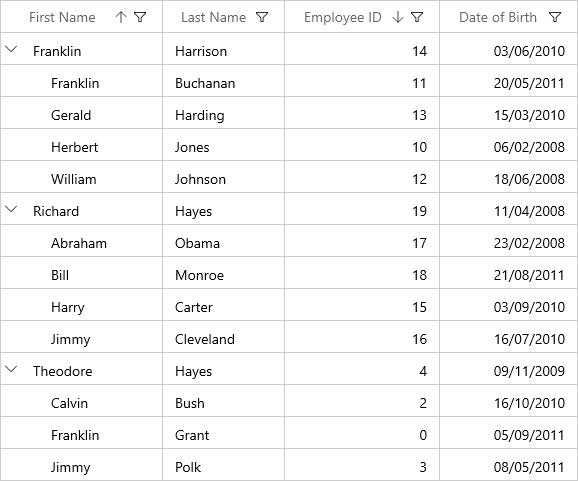
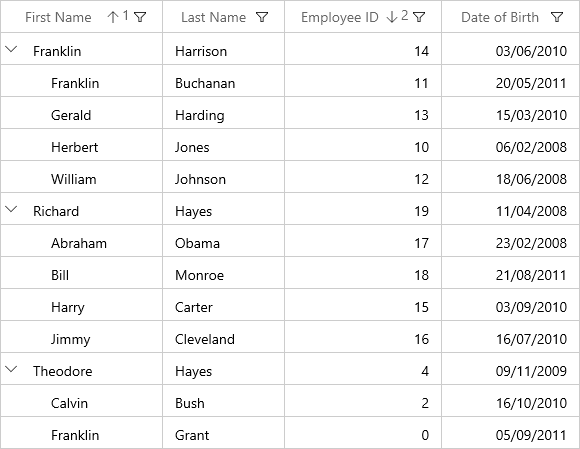

# Sorting in WinUI TreeGrid (SfTreeGrid)

SfTreeGrid allows you to sort the data against one or more columns either in ascending or descending order. When sorting is applied, the rows are rearranged based on sort criteria. You can allow users to sort the data by touching or clicking the column header using [SfTreeGrid.AllowSorting](https://help.syncfusion.com/cr/winui/Syncfusion.UI.Xaml.Grids.SfGridBase.html#Syncfusion_UI_Xaml_Grids_SfGridBase_AllowSortingProperty) property to `true`.




<syncfusion:SfTreeGrid Name="treeGrid"
                       AllowSorting="True"					   
                       AutoExpandMode="RootNodesExpanded"					   
                       ChildPropertyName="Children"					   
                       ItemsSource="{Binding EmployeeDetails}">					   
</syncfusion:SfTreeGrid>					   
					   	   



this.treeGrid.AllowSorting = true;




In another way, you can enable or disable the sorting for particular column by setting the [TreeGridColumn.AllowSorting](https://help.syncfusion.com/cr/winui/Syncfusion.UI.Xaml.Grids.GridColumnBase.html#Syncfusion_UI_Xaml_Grids_GridColumnBase_AllowSorting) property.




<syncfusion:SfTreeGrid Name="treeGrid"
                       AllowSorting="True"
                       AutoExpandMode="RootNodesExpanded"
                       ChildPropertyName="Children"
                       ItemsSource="{Binding EmployeeDetails}">
    <syncfusion:SfTreeGrid.Columns>
        <syncfusion:TreeGridTextColumn HeaderText="First Name" AllowSorting="True" MappingName="FirstName" />
        <syncfusion:TreeGridTextColumn HeaderText="Last Name" AllowSorting="False" MappingName="LastName" />
        <syncfusion:TreeGridTextColumn HeaderText="Employee ID" MappingName="EmployeeID" TextAlignment="Right" />
        <syncfusion:TreeGridTextColumn HeaderText="City" MappingName="City" />
    </syncfusion:SfTreeGrid.Columns>
</syncfusion:SfTreeGrid>
	



this.treeGrid.Columns["FirstName"].AllowSorting = true;
this.treeGrid.Columns["EmployeeID"].AllowSorting = false;




N> The[TreeGridColumn.AllowSorting](https://help.syncfusion.com/cr/winui/Syncfusion.UI.Xaml.Grids.GridColumnBase.html#Syncfusion_UI_Xaml_Grids_GridColumnBase_AllowSorting) takes higher priority than [SfTreeGrid.AllowSorting](https://help.syncfusion.com/cr/winui/Syncfusion.UI.Xaml.Grids.SfGridBase.html#Syncfusion_UI_Xaml_Grids_SfGridBase_AllowSortingProperty) property.

End users can sort the column by clicking column header cell. Once the columns get sorted, the sort indicator will be displayed on the right side of the column header.

## Sort column in double click

By default, column gets sorted when column header clicked. You can change this behavior to sort the column in double click action by setting [SfTreeGrid.SortClickAction](https://help.syncfusion.com/cr/winui/Syncfusion.UI.Xaml.Grids.SfGridBase.html#Syncfusion_UI_Xaml_Grids_SfGridBase_SortClickAction) property to `DoubleClick`.




<syncfusion:SfTreeGrid Name="treeGrid"
                       AllowSorting="True"
                       AutoExpandMode="RootNodesExpanded"
                       SortClickAction="DoubleClick"					   
                       ChildPropertyName="Children"					   
                       ItemsSource="{Binding EmployeeDetails}">					   
</syncfusion:SfTreeGrid>					   
					   							   



this.treeGrid.AllowSorting = true;
this.treeGrid.SortClickAction = SortClickAction.DoubleClick;
	



## Sorting order

By default, the data is sorted in ascending or descending order when clicking column header. You can rearrange the data to its initial order from descending, when clicking column header by setting [SfTreeGrid.AllowTriStateSorting](https://help.syncfusion.com/cr/winui/Syncfusion.UI.Xaml.Grids.SfGridBase.html#Syncfusion_UI_Xaml_Grids_SfGridBase_AllowTriStateSorting) property.

Following are the sequence of sorting orders when clicking column header,

* Sorts the data in ascending order
* Sorts the data in descending order
* Clears the sorting and records displayed in its initial order

## Multi column sorting

SfTreeGrid control allows you to sort more than one column, where sorting is applied one column against other columns. To apply sorting on multiple columns, user have to click the column header by pressing the &lt;kbd&gt;Ctrl&lt;/kbd&gt; key.
In the below screen shot, the `First Name` column sorted. Then the `Employee ID` column is sorted against the `First Name` data by clicking column header by pressing &lt;kbd&gt;Ctrl&lt;/kbd&gt; key. The sorting state of `First Name` column is preserved and `Employee ID` column sorted against `First Name` column.

### Display sort order

It is also possible to display sorted order of columns in header by setting [SfTreeGrid.ShowSortNumbers](https://help.syncfusion.com/cr/winui/Syncfusion.UI.Xaml.Grids.SfGridBase.html#Syncfusion_UI_Xaml_Grids_SfGridBase_ShowSortNumbers) property to `true`.




<syncfusion:SfTreeGrid Name="treeGrid"
                       AllowSorting="True"
                       AutoExpandMode="RootNodesExpanded"
                       ShowSortNumbers="True"
                       ChildPropertyName="Children"
                       ItemsSource="{Binding EmployeeDetails}">
</syncfusion:SfTreeGrid>
						



this.treeGrid.ShowSortNumbers = true;
	



## Programmatic Sorting

You can sort the data programmatically by adding or removing the [SortColumnDescription](https://help.syncfusion.com/cr/winui/Syncfusion.UI.Xaml.Grids.SortColumnDescription.html) in [SfTreeGrid.SortColumnDescriptions](https://help.syncfusion.com/cr/winui/Syncfusion.UI.Xaml.Grids.SfGridBase.html#Syncfusion_UI_Xaml_Grids_SfGridBase_SortColumnDescriptions) property.

N> [SfTreeGrid.SortColumnChanging](https://help.syncfusion.com/cr/winui/Syncfusion.UI.Xaml.TreeGrid.SfTreeGrid.html#Syncfusion_UI_Xaml_TreeGrid_SfTreeGrid_SortColumnsChanging) and [SfTreeGrid.SortColumnChanged](https://help.syncfusion.com/cr/winui/Syncfusion.UI.Xaml.TreeGrid.SfTreeGrid.html#Syncfusion_UI_Xaml_TreeGrid_SfTreeGrid_SortColumnsChanged) events are not raised when the data sorted programmatically through `SfTreeGrid.SortColumnDescriptions`.

### Adding sort columns




<syncfusion:SfTreeGrid Name="treeGrid"
                       AllowSorting="True"
                       AutoExpandMode="RootNodesExpanded"
                       ChildPropertyName="Children"
                       ItemsSource="{Binding EmployeeDetails}">
    <syncfusion:SfTreeGrid.SortColumnDescriptions>
        <sync:SortColumnDescription ColumnName="FirstName" SortDirection="Ascending" />
        <sync:SortColumnDescription ColumnName="EmployeeID" SortDirection="Descending"/>
    </syncfusion:SfTreeGrid.SortColumnDescriptions>
</syncfusion:SfTreeGrid>




this.treeGrid.SortColumnDescriptions.Add(new SortColumnDescription() { ColumnName = "FirstName", SortDirection = SortDirection.Ascending });
this.treeGrid.SortColumnDescriptions.Add(new SortColumnDescription() { ColumnName = "EmployeeID", SortDirection = SortDirection.Descending });




### Removing sort columns

You can unsort the data by removing the corresponding [SortColumnDescription](https://help.syncfusion.com/cr/winui/Syncfusion.UI.Xaml.Grids.SortColumnDescription.html) from the [SfTreeGrid.SortColumnDescriptions](https://help.syncfusion.com/cr/winui/Syncfusion.UI.Xaml.Grids.SfGridBase.html#Syncfusion_UI_Xaml_Grids_SfGridBase_SortColumnDescriptions) property.




var sortColumnDescription = this.treeGrid.SortColumnDescriptions.FirstOrDefault(col => col.ColumnName == "FirstName");

if (sortColumnDescription != null)
    this.treeGrid.SortColumnDescriptions.Remove(sortColumnDescription);
			  



### Clear sorting

You can clear sorting, by clearing the [SfTreeGrid.SortColumnDescriptions](https://help.syncfusion.com/cr/winui/Syncfusion.UI.Xaml.Grids.SfGridBase.html#Syncfusion_UI_Xaml_Grids_SfGridBase_SortColumnDescriptions).




this.treeGrid.SortColumnDescriptions.Clear();
	



## Custom sorting

SfTreeGrid allows you to sort the columns based on the custom logic. 
The custom sorting can be applied by adding the [SortComparer](https://help.syncfusion.com/cr/winui/Syncfusion.UI.Xaml.Data.SortComparer.html) instance to [SfTreeGrid.SortComparers](https://help.syncfusion.com/cr/winui/Syncfusion.UI.Xaml.TreeGrid.SfTreeGrid.html#Syncfusion_UI_Xaml_TreeGrid_SfTreeGrid_SortComparers). 

The [SortComparer](https://help.syncfusion.com/cr/winui/Syncfusion.UI.Xaml.Data.SortComparer.html) have the following properties,

[PropertyName](https://help.syncfusion.com/cr/winui/Syncfusion.UI.Xaml.Data.SortComparer.html#Syncfusion_UI_Xaml_Data_SortComparer_PropertyName) - Gets or sets the name of the column to apply custom sorting.

[Comparer](https://help.syncfusion.com/cr/winui/Syncfusion.UI.Xaml.Data.SortComparer.html#Syncfusion_UI_Xaml_Data_SortComparer_Comparer) - Gets or sets the custom comparer in which you can code to compare the data using custom logic. 

Follow the below steps to add custom comparer to sort using custom logic,

### Define custom comparer with custom sort logic

In the below code snippet, `FirstName` property is compared based on its string length, instead of default string comparison. 
 



public class CustomSortComparer : IComparer<object>
{

	public int Compare(object x, object y)
	{
		var item1 = x as EmployeeInfo;
		var item2 = y as EmployeeInfo;
		var value1 = item1.FirstName;
		var value2 = item2.FirstName;
		int c = 0;

		if (value1 != null && value2 == null)
		{
			c = 1;
		}

		else if (value1 == null && value2 != null)
		{
			c = -1;
		}

		else if (value1 != null && value2 != null)
		{
			c = value1.Length.CompareTo(value2.Length);
		}

		if (SortDirection == ListSortDirection.Descending)
			c = -c;

		return c;
	}

	//Get or Set the SortDirection value
	private ListSortDirection _SortDirection;

	public ListSortDirection SortDirection
	{
		get { return _SortDirection; }
		set { _SortDirection = value; }
	}
}
	



### Adding custom comparer to SfTreeGrid

Custom comparer can be added to [SfTreeGrid.SortComparers](https://help.syncfusion.com/cr/winui/Syncfusion.UI.Xaml.TreeGrid.SfTreeGrid.html#Syncfusion_UI_Xaml_TreeGrid_SfTreeGrid_SortComparers) property. `SortComparers` maintains custom comparers and the custom comparer gets called when corresponding column gets sorted by clicking column header or programmatically.



	
<syncfusion:SfTreeGrid.SortComparers>
    <data:SortComparer Comparer="{StaticResource sortComparer}"  PropertyName="FirstName"/>
</syncfusion:SfTreeGrid.SortComparers>
	



this.treeGrid.SortComparers.Add(new SortComparer() { Comparer = new CustomSortComparer(), PropertyName = "FirstName" });	
	



Sorting `FirstName` column sorts the data using custom sort comparer available in `SfTreeGrid.SortComparers`.

## Handling events

### SortColumnChanging event

[SfTreeGrid.SortColumnChanging](https://help.syncfusion.com/cr/winui/Syncfusion.UI.Xaml.TreeGrid.SfTreeGrid.html#Syncfusion_UI_Xaml_TreeGrid_SfTreeGrid_SortColumnsChanging) event occurs while sorting the columns by clicking column header. [GridSortColumnsChangingEventArgs](https://help.syncfusion.com/cr/winui/Syncfusion.UI.Xaml.Grids.GridSortColumnsChangingEventArgs.html) has following members which provides information for `SortColumnChanging` event.

[Action](https://help.syncfusion.com/cr/winui/Syncfusion.UI.Xaml.Grids.GridSortColumnsChangingEventArgs.html#Syncfusion_UI_Xaml_Grids_GridSortColumnsChangingEventArgs_Action) - Gets the action triggered this event. 

[Cancel](http://msdn2.microsoft.com/en-us/library/system.componentmodel.canceleventargs.cancel.aspx) - Setting value to `true`, cancels the triggered action. 

[AddedItems](https://help.syncfusion.com/cr/winui/Syncfusion.UI.Xaml.Grids.GridSortColumnsChangingEventArgs.html#Syncfusion_UI_Xaml_Grids_GridSortColumnsChangingEventArgs_AddedItems) - Gets the list of new `SortColumnDescriptions` that are added.

[RemovedItems](https://help.syncfusion.com/cr/winui/Syncfusion.UI.Xaml.Grids.GridSortColumnsChangingEventArgs.html#Syncfusion_UI_Xaml_Grids_GridSortColumnsChangingEventArgs_RemovedItems) - Gets the list of `SortColumnDescriptions` that are removed. 

[CancelScroll](https://help.syncfusion.com/cr/winui/Syncfusion.UI.Xaml.Grids.GridSortColumnsChangingEventArgs.html#Syncfusion_UI_Xaml_Grids_GridSortColumnsChangingEventArgs_CancelScroll) - Gets or sets a value that indicates, whether scroll and bring SelectedItem in view after sorting takes place.

You can prevent sorting for the particular column through [GridSortColumnsChangingEventArgs.Cancel](http://msdn2.microsoft.com/en-us/library/system.componentmodel.canceleventargs.cancel.aspx) property of `SortColumnChanging` event.


 

this.treeGrid.SortColumnsChanging += TreeGrid_SortColumnsChanging;

private void TreeGrid_SortColumnsChanging(object sender, GridSortColumnsChangingEventArgs e)
{
	if (e.AddedItems[0].ColumnName == "FirstName")
	{
		e.Cancel = true;
	}
}




### SortColumnChanged event

[SfTreeGrid.SortColumnChanged](https://help.syncfusion.com/cr/winui/Syncfusion.UI.Xaml.TreeGrid.SfTreeGrid.html#Syncfusion_UI_Xaml_TreeGrid_SfTreeGrid_SortColumnsChanged) event occurs when the sorting is applied to the column. [GridSortColumnsChangedEventArgs](https://help.syncfusion.com/cr/winui/Syncfusion.UI.Xaml.Grids.GridSortColumnsChangedEventArgs.html) provides information for `SortColumnChanged` event. 
