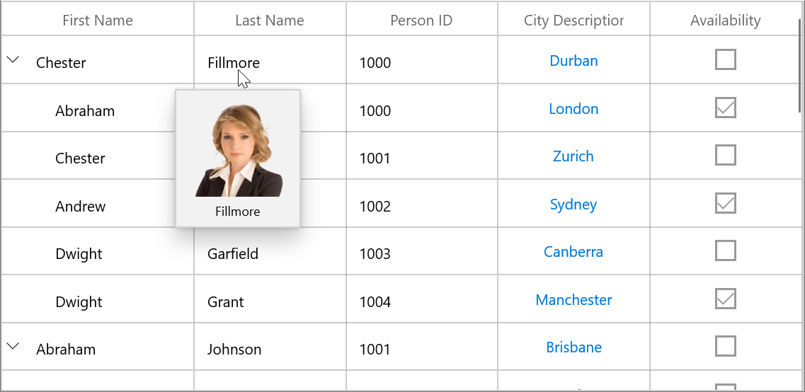

# ToolTip in WinUI TreeGrid

Tooltip supports showing the pop-up window that displays the information when the mouse hovers over a cell of the SfTreeGrid.

## Record cell tooltip

You can enable tooltip for the TreeGridCell by setting the [SfTreeGrid.ShowToolTip](https://help.syncfusion.com/cr/winui/Syncfusion.UI.Xaml.Grids.SfGridBase.html#Syncfusion_UI_Xaml_Grids_SfGridBase_ShowToolTip) property to `true`.




<syncfusion:SfTreeGrid Name="treeGrid"
                       ColumnWidthMode="Star"
                       ShowToolTip="True"
                       AutoExpandMode="RootNodesExpanded"
                       AutoGenerateColumns="False"
                       ChildPropertyName="ReportsTo"
                       ItemsSource="{Binding Employees}"
                       ParentPropertyName="ID"
                       SelfRelationRootValue="-1" >	




this.treeGrid.ShowToolTip = true;




You can enable the tooltip of a particular column by setting the [TreeGridColumn.ShowToolTip](https://help.syncfusion.com/cr/winui/Syncfusion.UI.Xaml.Grids.GridColumnBase.html#Syncfusion_UI_Xaml_Grids_GridColumnBase_ShowToolTip) property to `true`.




<syncfusion:TreeGridTextColumn HeaderText="First Name" MappingName="FirstName" ShowToolTip="True" />
<syncfusion:TreeGridTextColumn HeaderText="Last Name" MappingName="LastName" ShowToolTip="True" />




this.treeGrid.Columns["FirstName"].ShowToolTip = true;
this.treeGrid.Columns["LastName"].ShowToolTip = true;




N> It has higher priority than [SfTreeGrid.ShowToolTip](https://help.syncfusion.com/cr/winui/Syncfusion.UI.Xaml.Grids.SfGridBase.html#Syncfusion_UI_Xaml_Grids_SfGridBase_ShowToolTip).

## Header tooltip

You can enable the tooltip of a header cell by setting the [TreeGridColumn.ShowHeaderToolTip](https://help.syncfusion.com/cr/winui/Syncfusion.UI.Xaml.Grids.GridColumnBase.html#Syncfusion_UI_Xaml_Grids_GridColumnBase_ShowHeaderToolTip) property to `true`.




<syncfusion:SfTreeGrid.Columns>
    <syncfusion:TreeGridTextColumn HeaderText="First Name" MappingName="FirstName" ShowHeaderToolTip="True" />
</syncfusion:SfTreeGrid.Columns>




this.treeGrid.Columns["FirstName"].ShowHeaderToolTip = true;




## Tooltip customization

You can customize the template of ToolTip by using the [TreeGridColumn.ToolTipTemplate](https://help.syncfusion.com/cr/winui/Syncfusion.UI.Xaml.Grids.GridColumnBase.html#Syncfusion_UI_Xaml_Grids_GridColumnBase_ToolTipTemplate) and [TreeGridColumn.ToolTipTemplateSelector](https://help.syncfusion.com/cr/winui/Syncfusion.UI.Xaml.Grids.GridColumnBase.html#Syncfusion_UI_Xaml_Grids_GridColumnBase_ToolTipTemplateSelector) properties. 

#### Customize the tooltip using ToolTipTemplate

You can customize appearance of the tooltip of a particular column by setting the TreeGridColumn.ToolTipTemplate. You can also customize appearance of the header tooltip of a particular column by using the [TreeGridColumn.HeaderToolTipTemplate](https://help.syncfusion.com/cr/winui/Syncfusion.UI.Xaml.Grids.GridColumnBase.html#Syncfusion_UI_Xaml_Grids_GridColumnBase_HeaderToolTipTemplate) property.




<Page.Resources>
    <local:StringToImageConverter x:Key="ImageConverter" />
    <DataTemplate x:Key="TemplateToolTip">
        <Grid>
            <Grid.RowDefinitions>
                <RowDefinition Height="*"/>
                <RowDefinition Height="*"/>
            </Grid.RowDefinitions>
            <Image Height="100" Width="100" Source="{Binding LastName,Converter={StaticResource ImageConverter}}" />
            <TextBlock Grid.Row="1" Text="{Binding LastName}" HorizontalAlignment="Center"/>
        </Grid>
    </DataTemplate>
</Page.Resources>

<syncfusion:SfTreeGrid.Columns>    
    <syncfusion:TreeGridTextColumn HeaderText="Last Name" MappingName="LastName" ToolTipTemplate="{StaticResource TemplateToolTip}" ShowToolTip="True" />
</syncfusion:SfTreeGrid.Columns>




public class StringToImageConverter : IValueConverter
{
    public object Convert(object value, Type targetType, object parameter, string language)
    {
        string imagename = value.ToString();
        return @"Assets\" + imagename + @".png";
    }

    public object ConvertBack(object value, Type targetType, object parameter, string language)
    {
        return value;
    }
}




N> View sample in [GitHub](https://github.com/SyncfusionExamples/How-to-customize-the-tooltip-using-DataTemplate-in-winui-datagrid).

## Events

### CellToolTipOpening event

The [CellToolTipOpening](https://help.syncfusion.com/cr/winui/Syncfusion.UI.Xaml.TreeGrid.SfTreeGrid.html#Syncfusion_UI_Xaml_TreeGrid_SfTreeGrid_CellToolTipOpening) event occurs when any tooltip of the cell is opened. The `CellToolTipOpening` event receives the [TreeGridCellToolTipOpeningEventArgs](https://help.syncfusion.com/cr/winui/Syncfusion.UI.Xaml.TreeGrid.TreeGridCellToolTipOpeningEventArgs.html) as argument which has the following properties:

<ul>
<li> <a href="https://help.syncfusion.com/cr/winui/Syncfusion.UI.Xaml.DataGrid.CellToolTipOpeningEventArgs.html#Syncfusion_UI_Xaml_DataGrid_CellToolTipOpeningEventArgs_Column">Column:</a> Gets the hovered cell column in the SfTreeGrid.</li>
<li> <a href="https://help.syncfusion.com/cr/winui/Syncfusion.UI.Xaml.TreeGrid.TreeGridCellToolTipOpeningEventArgs.html#Syncfusion_UI_Xaml_TreeGrid_TreeGridCellToolTipOpeningEventArgs_Node">Node:</a> Gets the hovered cell node.</li>
<li> <a href="https://help.syncfusion.com/cr/winui/Syncfusion.UI.Xaml.DataGrid.CellToolTipOpeningEventArgs.html#Syncfusion_UI_Xaml_DataGrid_CellToolTipOpeningEventArgs_Record">Record:</a> Gets the data context of hovered cell.</li>
<li> <a href="https://help.syncfusion.com/cr/winui/Syncfusion.UI.Xaml.DataGrid.CellToolTipOpeningEventArgs.html#Syncfusion_UI_Xaml_DataGrid_CellToolTipOpeningEventArgs_RowColumnIndex">RowColumnIndex:</a> Gets the row and column index of the hovered cell.</li>
<li> <a href="https://help.syncfusion.com/cr/winui/Syncfusion.UI.Xaml.DataGrid.CellToolTipOpeningEventArgs.html#Syncfusion_UI_Xaml_DataGrid_CellToolTipOpeningEventArgs_ToolTip">ToolTip:</a> Gets the tooltip of the hovered cells.</li>
</ul>



<syncfusion:SfTreeGrid Name="treeGrid"
                       ColumnWidthMode="Star"
                       AutoExpandMode="RootNodesExpanded"
                       AutoGenerateColumns="False"
                       ChildPropertyName="Children"
                       CellToolTipOpening="treeGrid_CellToolTipOpening"
                       ItemsSource="{Binding EmployeeDetails}" >


this.treeGrid.CellToolTipOpening += TreeGrid_CellToolTipOpening;

private void TreeGrid_CellToolTipOpening(object sender, TreeGridCellToolTipOpeningEventArgs e)
{

}



