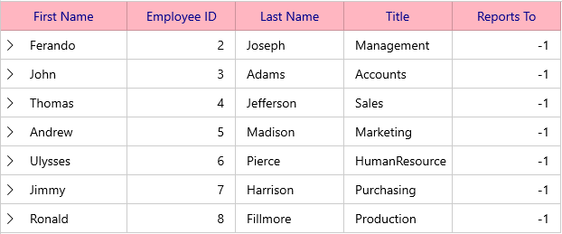

# UI Customization in WinUI TreeGrid (SfTreeGrid)

## Styling Column Header

The header cell can be customized by using `SyncfusionTreeGridHeaderCellBackground` and `SyncfusionTreeGridHeaderCellForeground` these keys.



<Page.Resources>
    <SolidColorBrush x:Key="SyncfusionTreeGridHeaderCellBackground" Color="LightPink"/>
    <SolidColorBrush x:Key="SyncfusionTreeGridHeaderCellForeground" Color="DarkBlue"/>
</Page.Resources>

<syncfusion:SfTreeGrid Name="sfTreeGrid"
                       AutoGenerateColumns="False"
                       ChildPropertyName="ReportsTo"
                       ItemsSource="{Binding Employees}"
                       ParentPropertyName="ID"                             
                       SelfRelationRootValue="-1" >
    <syncfusion:SfTreeGrid.Columns>
        <syncfusion:TreeGridTextColumn HeaderText="First Name" MappingName="FirstName" />
        <syncfusion:TreeGridTextColumn HeaderText="Employee ID" MappingName="ID" TextAlignment="Right" />
        <syncfusion:TreeGridTextColumn HeaderText="Last Name" MappingName="LastName" />
        <syncfusion:TreeGridTextColumn HeaderText="Title" MappingName="Title" />
        <syncfusion:TreeGridTextColumn HeaderText="Reports To" MappingName="ReportsTo" TextAlignment="Right" />
    </syncfusion:SfTreeGrid.Columns>
</syncfusion:SfTreeGrid>




