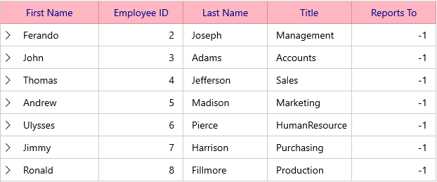

# UI Customization in WinUI SfTreeGrid

## Styling Column Header

The header cell can be customized by using `SyncfusionTreeGridHeaderCellBackground` and `SyncfusionTreeGridHeaderCellForeground` these keys.




<treeGrid:SfTreeGrid Name="sfTreeGrid"
                       AutoGenerateColumns="False"
                       ChildPropertyName="ReportsTo"
                       ItemsSource="{Binding Employees}"
                       ParentPropertyName="ID"                             
                       SelfRelationRootValue="-1" >
    <treeGrid:SfTreeGrid.Resources>
        <SolidColorBrush x:Key="SyncfusionTreeGridHeaderCellBackground" Color="LightPink"/>
        <SolidColorBrush x:Key="SyncfusionTreeGridHeaderCellForeground" Color="DarkBlue"/>
    </treeGrid:SfTreeGrid.Resources>
    <treeGrid:SfTreeGrid.Columns>
        <treeGrid:TreeGridTextColumn HeaderText="First Name" MappingName="FirstName" />
        <treeGrid:TreeGridTextColumn HeaderText="Last Name" MappingName="LastName" />
        <treeGrid:TreeGridNumericColumn HeaderText="Employee ID" MappingName="ID" />
        <treeGrid:TreeGridTextColumn HeaderText="Title" MappingName="Title" />
        <treeGrid:TreeGridNumericColumn HeaderText="Salary" MappingName="Salary" DisplayNumberFormat="C2"/>
        <treeGrid:TreeGridNumericColumn HeaderText="Reports To" MappingName="ReportsTo"  />
    </treeGrid:SfTreeGrid.Columns>
</treeGrid:SfTreeGrid>




