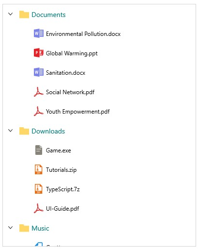
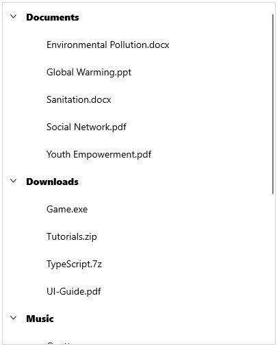

# Appearance in WinUI TreeView

The [TreeView](https://help.syncfusion.com/cr/winui/Syncfusion.UI.Xaml.TreeView.SfTreeView.html) allows customizing appearance of the underlying data, and provides different functionalities to the end-user.

## ItemTemplate

The TreeView allows you to customize the appearance of content view and expander view by setting the [ItemTemplate](https://help.syncfusion.com/cr/winui/Syncfusion.UI.Xaml.TreeView.SfTreeView.html#Syncfusion_UI_Xaml_TreeView_SfTreeView_ItemTemplate) and [ExpanderTemplate](https://help.syncfusion.com/cr/winui/Syncfusion.UI.Xaml.TreeView.SfTreeView.html#Syncfusion_UI_Xaml_TreeView_SfTreeView_ExpanderTemplate) properties.




<Page x:Class="syncfusion.treeviewdemos.winui.NodeWithImagePage"
      xmlns="http://schemas.microsoft.com/winfx/2006/xaml/presentation"
      xmlns:x="http://schemas.microsoft.com/winfx/2006/xaml"
      xmlns:local="using:syncfusion.treeviewdemos.winui"
      xmlns:syncfusion="using:Syncfusion.UI.Xaml.TreeView"
      xmlns:d="http://schemas.microsoft.com/expression/blend/2008"
      xmlns:mc="http://schemas.openxmlformats.org/markup-compatibility/2006"
      mc:Ignorable="d"
      Background="{ThemeResource ApplicationPageBackgroundThemeBrush}"
      NavigationCacheMode="Disabled">

    <Page.DataContext>
        <local:NodeWithImageViewModel />
    </Page.DataContext>

    <Grid>
       <syncfusion:SfTreeView x:Name="treeView"
                              FullRowSelect="True"
                              ChildPropertyName=”Files”  
                              ItemsSource="{Binding Folders}">
                    <syncfusion:SfTreeView.ItemTemplate>
                        <DataTemplate>
                            <StackPanel Orientation="Horizontal">
                                <ContentPresenter Width="20"
                                                  Height="20"
                                                  HorizontalAlignment="Stretch"
                                                  VerticalAlignment="Center"
                                                  ContentTemplate="{Binding ImageTemplate}" />
                                <TextBlock Margin="5"
                                           VerticalAlignment="Center"
                                           Text="{Binding FileName}" />
                            </StackPanel>
                        </DataTemplate>
                    </syncfusion:SfTreeView.ItemTemplate>
        </syncfusion:SfTreeView>
    </Grid >
</Page>




## BindingContext for ItemTemplate

By default, the binding context of treeview item will be the data model object for bound mode and [TreeViewNode](https://help.syncfusion.com/cr/winui/Syncfusion.UI.Xaml.TreeView.Engine.TreeViewNode.html) for unbound mode.

For bound mode, you can change the binding context of the treeview items by using [ItemTemplateContextType](https://help.syncfusion.com/cr/winui/Syncfusion.UI.Xaml.TreeView.SfTreeView.html#Syncfusion_UI_Xaml_TreeView_SfTreeView_ItemTemplateDataContextType) property.




<Page x:Class="syncfusion.treeviewdemos.winui.NodeWithImagePage"
      xmlns="http://schemas.microsoft.com/winfx/2006/xaml/presentation"
      xmlns:x="http://schemas.microsoft.com/winfx/2006/xaml"
      xmlns:local="using:syncfusion.treeviewdemos.winui"
      xmlns:syncfusion="using:Syncfusion.UI.Xaml.TreeView"
      xmlns:d="http://schemas.microsoft.com/expression/blend/2008"
      xmlns:mc="http://schemas.openxmlformats.org/markup-compatibility/2006"
      mc:Ignorable="d"
      Background="{ThemeResource ApplicationPageBackgroundThemeBrush}"
      NavigationCacheMode="Disabled">

    <Page.DataContext>
        <local:NodeWithImageViewModel />
    </Page.DataContext>

    <Grid>
        <Grid.RowDefinitions>
            <RowDefinition Height="Auto" />
            <RowDefinition />
        </Grid.RowDefinitions>

        <TextBlock VerticalAlignment="Center"
                   TextWrapping="Wrap"
                   FontSize="14"
                   Margin="5,5,5,20"
                   Text="This sample demonstrates the default functionalities to include images in SfTreeView." />

        <syncfusion:SfTreeView x:Name="treeView" Grid.Row="1"
                               FullRowSelect="True" 
                               ItemTemplateDataContextType="Node"
                               ChildPropertyName=”Files”  
                               ItemsSource="{Binding Folders}">
                    <syncfusion:SfTreeView.ItemTemplate>
                        <DataTemplate>
                            <StackPanel Orientation="Horizontal">
                                <ContentPresenter Width="20"
                                                  Height="20"
                                                  HorizontalAlignment="Stretch"
                                                  VerticalAlignment="Center"
                                                  ContentTemplate="{Binding Content.ImageTemplate}"/>
                                <TextBlock Margin="5"
                                           VerticalAlignment="Center"
                                           Text="{Binding Content.FileName}"/>
                            </StackPanel>
                        </DataTemplate>
                    </syncfusion:SfTreeView.ItemTemplate>
        </syncfusion:SfTreeView>
    </Grid >
</Page>




## ItemTemplate Selector

The `TreeView` allows to customize the appearance of each item with different templates based on specific constraints by using the [ItemTemplateSelector](https://help.syncfusion.com/cr/winui/Syncfusion.UI.Xaml.TreeView.SfTreeView.html#Syncfusion_UI_Xaml_TreeView_SfTreeView_ItemTemplateSelector). You can choose a [DataTemplate](https://docs.microsoft.com/en-us/uwp/api/windows.ui.xaml.datatemplate?view=winrt-19041) for each item at runtime based on the value of data-bound property using `ItemTemplateSelector`.




<Page x:Class="syncfusion.treeviewdemos.winui.NodeWithImagePage"
      xmlns="http://schemas.microsoft.com/winfx/2006/xaml/presentation"
      xmlns:x="http://schemas.microsoft.com/winfx/2006/xaml"
      xmlns:local="using:syncfusion.treeviewdemos.winui"
      xmlns:syncfusion="using:Syncfusion.UI.Xaml.TreeView"
      xmlns:d="http://schemas.microsoft.com/expression/blend/2008"
      xmlns:mc="http://schemas.openxmlformats.org/markup-compatibility/2006"
      mc:Ignorable="d"
      Background="{ThemeResource ApplicationPageBackgroundThemeBrush}"
      NavigationCacheMode="Disabled">

    <Page.DataContext>
        <local:NodeWithImageViewModel />
    </Page.DataContext>

    <Page.Resources>
        <DataTemplate x:Key="headerTemplate">
            <StackPanel Orientation="Horizontal">
                <ContentPresenter Width="20"
                                  Height="20"
                                  HorizontalAlignment="Stretch"
                                  VerticalAlignment="Center"
                                  ContentTemplate="{Binding Content.ImageTemplate}" />
                <TextBlock Text="{Binding Content.FileName}"
                           Foreground="Teal"
                           Margin="5"
                           FontSize="14"
                           VerticalAlignment="Center" />
            </StackPanel>
        </DataTemplate>

        <DataTemplate x:Key="childTemplate">
            <StackPanel Orientation="Horizontal">
                <ContentPresenter Width="20"
                                  Height="20"
                                  HorizontalAlignment="Stretch"
                                  VerticalAlignment="Center"
                                  ContentTemplate="{Binding Content.ImageTemplate}" />
                <TextBlock Text="{Binding Content.FileName}"
                           Margin="5"
                           FontSize="12"
                           VerticalAlignment="Center" />
            </StackPanel>
        </DataTemplate>

        <local:ItemTemplateSelector x:Key="itemTemplateSelector"
                                    HeaderTemplate="{StaticResource headerTemplate}"
                                    ChildTemplate="{StaticResource childTemplate}">
        </local:ItemTemplateSelector>
    </Page.Resources>

    <Grid>
  	    <syncfusion:SfTreeView x:Name="treeView"
                               ChildPropertyName="Files"
                               ItemTemplateDataContextType="Node"
                               ItemsSource="{Binding Folders}"
                               ItemTemplateSelector="{StaticResource itemTemplateSelector}"/>
    </Grid>
</Page>




class ItemTemplateSelector : DataTemplateSelector
{
    public DataTemplate HeaderTemplate { get; set; }

    public DataTemplate ChildTemplate { get; set; }

    protected override DataTemplate SelectTemplateCore(object item, DependencyObject container)
    {
        var treeviewNode = item as Syncfusion.UI.Xaml.TreeView.Engine.TreeViewNode;
        if (treeviewNode == null)
            return null;
        if (treeviewNode.Level == 0)
            return HeaderTemplate;
        else
            return ChildTemplate;
    }
}




N> [View sample in GitHub](https://github.com/SyncfusionExamples/syncfusion-winui-treeview-examples/tree/main/Samples/Item-Template-Selector)

## Indentation

The `TreeView` allows customizing the indent spacing of items by setting the [Indentation](https://help.syncfusion.com/cr/winui/Syncfusion.UI.Xaml.TreeView.SfTreeView.html#Syncfusion_UI_Xaml_TreeView_SfTreeView_Indentation) property. The default value of this property is 30. This property can be customized at runtime.




<Syncfusion:SfTreeView x:Name="treeView" Indentation="40" />




SfTreeView treeView = new SfTreeView();
treeView.Indentation = 40;




## ExpanderWidth

The `TreeView` allows customizing the width of expander view by setting the [ExpanderWidth](https://help.syncfusion.com/cr/winui/Syncfusion.UI.Xaml.TreeView.SfTreeView.html#Syncfusion_UI_Xaml_TreeView_SfTreeView_ExpanderWidth) property. The default value of this property is 30. This property can be customized at runtime.




<Syncfusion:SfTreeView x:Name="treeView" ExpanderWidth="40" />




SfTreeView treeView = new SfTreeView();
treeView.ExpanderWidth = "40";




## ExpanderPosition

The `TreeView` allows you change the position of expander view by setting the [ExpanderPosition](https://help.syncfusion.com/cr/winui/Syncfusion.UI.Xaml.TreeView.SfTreeView.html#Syncfusion_UI_Xaml_TreeView_SfTreeView_ExpanderPosition) property. The default value of this property is `Start`. This property has following two positions:

* `Start`: Allows displaying the expander view at the start position.
* `End`: Allows displaying the expander view at the end position.




<Syncfusion:SfTreeView x:Name="treeView" ExpanderPosition="End">




SfTreeView treeView = new SfTreeView();
treeView.ExpanderPosition = ExpanderPosition.End;




## Level based styling

The `TreeView` allows to customize the style of [TreeViewItem](https://help.syncfusion.com/cr/winui/Syncfusion.UI.Xaml.TreeView.TreeViewItem.html) based on different levels by using [IValueConverter](https://docs.microsoft.com/en-us/uwp/api/windows.ui.xaml.data.ivalueconverter?view=winrt-19041).




<Page x:Class="syncfusion.treeviewdemos.winui.NodeWithImagePage"
      xmlns="http://schemas.microsoft.com/winfx/2006/xaml/presentation"
      xmlns:x="http://schemas.microsoft.com/winfx/2006/xaml"
      xmlns:local="using:syncfusion.treeviewdemos.winui"
      xmlns:syncfusion="using:Syncfusion.UI.Xaml.TreeView"
      xmlns:d="http://schemas.microsoft.com/expression/blend/2008"
      xmlns:mc="http://schemas.openxmlformats.org/markup-compatibility/2006"
      mc:Ignorable="d"
      Background="{ThemeResource ApplicationPageBackgroundThemeBrush}"
      NavigationCacheMode="Disabled">

    <Page.DataContext>
        <local:NodeWithImageViewModel />
    </Page.DataContext>

    <Page.Resources>
        <local:FontAttributeConverter x:Key="FontAttributeConverter" />
    </Page.Resources>

    <Grid>
        <syncfusion:SfTreeView x:Name="treeView"
                           ChildPropertyName="Files"
                           ItemTemplateDataContextType="Node"
                           ItemsSource="{Binding Folders}">
                    <syncfusion:SfTreeView.ItemTemplate>
                        <DataTemplate>
                            <StackPanel Orientation="Horizontal">
                                <TextBlock FontSize="14"
                                           VerticalAlignment="Center"
                                           FontWeight="{Binding Level, Converter={StaticResource FontAttributeConverter}}"
                                           Text="{Binding Content.FileName}" />
                            </StackPanel>
                        </DataTemplate>
                    </syncfusion:SfTreeView.ItemTemplate>
        </syncfusion:SfTreeView>
    </Grid>
</Page>




public class FontAttributeConverter : IValueConverter
{
    public object Convert(object value, Type targetType, object parameter, string culture)
    {
        var level = (int)value;
        return level == 0 ? FontWeights.ExtraBold : FontWeights.Normal;
    }

    public object ConvertBack(object value, Type targetType, object parameter, string culture)
    {
        throw new NotImplementedException();
    }
}




N> [View sample in GitHub](https://github.com/SyncfusionExamples/syncfusion-winui-treeview-examples/tree/main/Samples/Level-Based-Styling)

## Animation

The `TreeView` supports to animate expanding or collapsing the [TreeViewNode](https://help.syncfusion.com/cr/winui/Syncfusion.UI.Xaml.TreeView.Engine.TreeViewNode.html). To enable/disable the animation use [IsAnimationEnabled](https://help.syncfusion.com/cr/winui/Syncfusion.UI.Xaml.TreeView.SfTreeView.html#Syncfusion_UI_Xaml_TreeView_SfTreeView_IsAnimationEnabled) property of TreeView.




<Syncfusion:SfTreeView x:Name="treeView" IsAnimationEnabled="true">




SfTreeView treeView = new SfTreeView();
treeView.IsAnimationEnabled = true;




