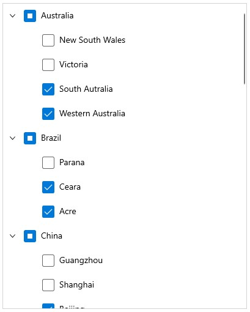
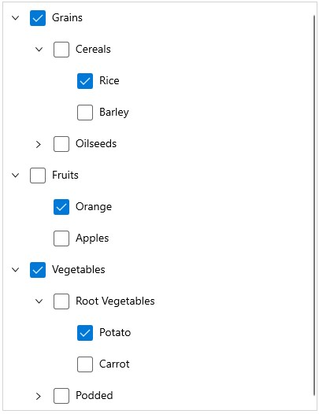

# Checkbox in WinUI TreeView 

The [TreeView](https://help.syncfusion.com/cr/winui/Syncfusion.UI.Xaml.TreeView.SfTreeView.html) provides support for loading `CheckBox` in each node, and allows users to check/uncheck the corresponding node. So, you should add checkbox in the [ItemTemplate](https://help.syncfusion.com/cr/winui/Syncfusion.UI.Xaml.TreeView.SfTreeView.html#Syncfusion_UI_Xaml_TreeView_SfTreeView_ItemTemplate) of the `TreeView` and bind the [IsChecked](https://help.syncfusion.com/cr/winui/Syncfusion.UI.Xaml.TreeView.Engine.TreeViewNode.html#Syncfusion_UI_Xaml_TreeView_Engine_TreeViewNode_IsChecked) property of the [TreeViewNode](https://help.syncfusion.com/cr/winui/Syncfusion.UI.Xaml.TreeView.Engine.TreeViewNode.html).

## Working with CheckBox in Bound Mode

When you are populating treeview nodes from [ItemsSource](https://help.syncfusion.com/cr/winui/Syncfusion.UI.Xaml.TreeView.SfTreeView.html#Syncfusion_UI_Xaml_TreeView_SfTreeView_ItemsSource), then you can get or set the checked items by using [CheckedItems](https://help.syncfusion.com/cr/winui/Syncfusion.UI.Xaml.TreeView.SfTreeView.html#Syncfusion_UI_Xaml_TreeView_SfTreeView_CheckedItems) property.

The `TreeView` supports to check multiple items through binding the [CheckedItems](https://help.syncfusion.com/cr/winui/Syncfusion.UI.Xaml.TreeView.SfTreeView.html#Syncfusion_UI_Xaml_TreeView_SfTreeView_CheckedItems) property from view model with `ObservableCollection<object>` type.

N> Set [ItemTemplateDataContextType](https://help.syncfusion.com/cr/winui/Syncfusion.UI.Xaml.TreeView.SfTreeView.html#Syncfusion_UI_Xaml_TreeView_SfTreeView_ItemTemplateDataContextType) as `Node` to bind the `TreeViewNode.IsChecked` property to `CheckBox` in `ItemTemplate`.

N> TreeView process and sets [TreeViewNode.IsChecked](https://help.syncfusion.com/cr/winui/Syncfusion.UI.Xaml.TreeView.Engine.TreeViewNode.html#Syncfusion_UI_Xaml_TreeView_Engine_TreeViewNode_IsChecked) based on `CheckedItems` only when you are binding `ItemsSource`.




<Page x:Class="syncfusion.treeviewdemos.winui.CheckBoxPage"
      xmlns="http://schemas.microsoft.com/winfx/2006/xaml/presentation"
      xmlns:x="http://schemas.microsoft.com/winfx/2006/xaml"
      xmlns:d="http://schemas.microsoft.com/expression/blend/2008"
      xmlns:mc="http://schemas.openxmlformats.org/markup-compatibility/2006"
      xmlns:local="using:syncfusion.treeviewdemos.winui"
      xmlns:syncfusion="using:Syncfusion.UI.Xaml.TreeView"
      mc:Ignorable="d"
      Background="{ThemeResource ApplicationPageBackgroundThemeBrush}"
      NavigationCacheMode="Disabled">

<Page.DataContext>
    <local:CheckBoxView />
</Page.DataContext>

<Grid>
    <syncfusion:SfTreeView x:Name="treeView"
                           AutoExpandMode="AllNodes"
                           BorderBrush="LightGray"
                           BorderThickness="1"
                           CheckBoxMode="Recursive"
                           CheckedItems="{Binding CheckedItems}"
                           ChildPropertyName="Models"
                           ExpandActionTrigger="Expander"
                           IsAnimationEnabled="True"
                           ItemTemplateDataContextType="Node"
                           ItemsSource="{Binding Items}"
                           NodePopulationMode="Instant">
                    <syncfusion:SfTreeView.ItemTemplate>
                        <DataTemplate>
                            <Grid>
                                <CheckBox x:Name="checkBox"
                                          Content="{Binding Content.State}"
                                          local:NullableTreeCheckbox.IsEnabled="true"
                                          local:NullableTreeCheckbox.IsChecked="{Binding IsChecked, Mode=TwoWay}" />
                            </Grid>
                        </DataTemplate>
                    </syncfusion:SfTreeView.ItemTemplate>
    </syncfusion:SfTreeView>
</Grid>
</Page>




public class CheckBoxView : NotificationObject
{ 
    public ObservableCollection<object> CheckedItems { get; internal set; }

    public ObservableCollection<CheckBoxModel> Items { get; internal set; }

    public CheckBoxView()
    {
        Items = new ObservableCollection<CheckBoxModel>();

        var country1 = new CheckBoxModel { State = "Australia" };
        var country2 = new CheckBoxModel { State = "Brazil" };
        var country3 = new CheckBoxModel { State = "China" };
        var country4 = new CheckBoxModel { State = "France" };
        var country5 = new CheckBoxModel { State = "India" };
        var country6 = new CheckBoxModel { State = "USA" };
        var country7 = new CheckBoxModel { State = "UK" };
        var country8 = new CheckBoxModel { State = "Russia" };
        var country9 = new CheckBoxModel { State = "Canada" };
        var country10 = new CheckBoxModel { State = "Germany" };

        var aus_state1 = new CheckBoxModel { State = "New South Wales" };
        var aus_state2 = new CheckBoxModel { State = "Victoria" };
        var aus_state3 = new CheckBoxModel { State = "South Australia" };
        var aus_state4 = new CheckBoxModel { State = "Western Australia" };

        var brazil_state1 = new CheckBoxModel { State = "Parana" };
        var brazil_state2 = new CheckBoxModel { State = "Ceara" };
        var brazil_state3 = new CheckBoxModel { State = "Acre" };

        var china_state1 = new CheckBoxModel { State = "Guangzhou" };
        var china_state2 = new CheckBoxModel { State = "Shanghai" };
        var china_state3 = new CheckBoxModel { State = "Beijing" };
        var china_state4 = new CheckBoxModel { State = "Shantou" };

        var france_state1 = new CheckBoxModel { State = "Pays de la Loire" };
        var france_state2 = new CheckBoxModel { State = "Aquitaine" };
        var france_state3 = new CheckBoxModel { State = "Brittany" };
        var france_state4 = new CheckBoxModel { State = "Lorraine" };

        var ind_State1 = new CheckBoxModel { State = "Assam" };
        var ind_State2 = new CheckBoxModel { State = "Bihar" };
        var ind_State3 = new CheckBoxModel { State = "Tamil Nadu" };
        var ind_State4 = new CheckBoxModel { State = "Punjab" };

        var usa_state1 = new CheckBoxModel { State = "New York" };
        var usa_state2 = new CheckBoxModel { State = "California" };
        var usa_state3 = new CheckBoxModel { State = "Texas" };
        var usa_state4 = new CheckBoxModel { State = "Washington" };
        var usa_state5 = new CheckBoxModel { State = "Florida" };

        var uk_state1 = new CheckBoxModel { State = "England" };
        var uk_state2 = new CheckBoxModel { State = "Wales" };
        var uk_state3 = new CheckBoxModel { State = "Scotland" };
        var uk_state4 = new CheckBoxModel { State = "Northern Ireland" };

        var russia_state1 = new CheckBoxModel { State = "Mordovia" };
        var russia_state2 = new CheckBoxModel { State = "Chechnya" };
        var russia_state3 = new CheckBoxModel { State = "Tatarstan" };
        var russia_state4 = new CheckBoxModel { State = "Dagestan" };

        var canada_state1 = new CheckBoxModel { State = "Alberta" };
        var canada_state2 = new CheckBoxModel { State = "Manitoba" };
        var canada_state3 = new CheckBoxModel { State = "New Brunswick" };
        var canada_state4 = new CheckBoxModel { State = "Quebec" };

        var germany_state1 = new CheckBoxModel { State = "Berlin" };
        var germany_state2 = new CheckBoxModel { State = "Hamburg" };
        var germany_state3 = new CheckBoxModel { State = "Bremen" };
        var germany_state4 = new CheckBoxModel { State = "Lower Saxony" };

        country1.Models.Add(aus_state1);
        country1.Models.Add(aus_state2);
        country1.Models.Add(aus_state3);
        country1.Models.Add(aus_state4);

        country2.Models.Add(brazil_state1);
        country2.Models.Add(brazil_state2);
        country2.Models.Add(brazil_state3);

        country3.Models.Add(china_state1);
        country3.Models.Add(china_state2);
        country3.Models.Add(china_state3);
        country3.Models.Add(china_state4);

        country4.Models.Add(france_state1);
        country4.Models.Add(france_state2);
        country4.Models.Add(france_state3);
        country4.Models.Add(france_state4);

        country5.Models.Add(ind_State1);
        country5.Models.Add(ind_State2);
        country5.Models.Add(ind_State3);
        country5.Models.Add(ind_State4);

        country6.Models.Add(usa_state1);
        country6.Models.Add(usa_state2);
        country6.Models.Add(usa_state3);
        country6.Models.Add(usa_state4);
        country6.Models.Add(usa_state5);

        country7.Models.Add(uk_state1);
        country7.Models.Add(uk_state2);
        country7.Models.Add(uk_state3);
        country7.Models.Add(uk_state4);

        country8.Models.Add(russia_state1);
        country8.Models.Add(russia_state2);
        country8.Models.Add(russia_state3);
        country8.Models.Add(russia_state4);

        country9.Models.Add(canada_state1);
        country9.Models.Add(canada_state2);
        country9.Models.Add(canada_state3);
        country9.Models.Add(canada_state4);

        country10.Models.Add(germany_state1);
        country10.Models.Add(germany_state2);
        country10.Models.Add(germany_state3);
        country10.Models.Add(germany_state4);

        Items.Add(country1);
        Items.Add(country2);
        Items.Add(country3);
        Items.Add(country4);
        Items.Add(country5);
        Items.Add(country6);
        Items.Add(country7);
        Items.Add(country8);
        Items.Add(country9);
        Items.Add(country10);

        CheckedItems = new ObservableCollection<object>();
        CheckedItems.Add(aus_state3);
        CheckedItems.Add(aus_state4);
        CheckedItems.Add(brazil_state2);
        CheckedItems.Add(brazil_state3);
        CheckedItems.Add(china_state3);
    }
}

public class NullableTreeCheckbox : DependencyObject
{
    public static readonly DependencyProperty IsEnabledProperty =
        DependencyProperty.RegisterAttached("IsEnabled", typeof(bool), typeof(NullableTreeCheckbox), new PropertyMetadata(false, OnIsEnabledChanged));

    public static readonly DependencyProperty IsCheckedProperty =
        DependencyProperty.RegisterAttached("IsChecked", typeof(object),
        typeof(NullableTreeCheckbox), new PropertyMetadata(default(object), IsCheckedChanged));

    private static readonly DependencyProperty IsInternalCheckedProperty =
        DependencyProperty.RegisterAttached("IsInternalChecked", typeof(object),
        typeof(NullableTreeCheckbox), new PropertyMetadata(null, OnIsInternalCheckedChanged));

    public static bool GetIsEnabled(DependencyObject obj)
    {
        if (obj == null)
            return false;

        return (bool)obj.GetValue(IsEnabledProperty);
    }

    public static void SetIsEnabled(DependencyObject obj, bool value)
    {
        if (obj == null)
            return;
        obj.SetValue(IsEnabledProperty, value); 
    }

    public static object GetIsChecked(DependencyObject obj)
    {
        if (obj == null)
            return false;

        return (bool?)obj.GetValue(IsCheckedProperty);
    }

    public static void SetIsChecked(DependencyObject obj, object value)
    {
        if (obj == null)
            return;

        obj.SetValue(IsCheckedProperty, value);
    }

    private static void OnIsInternalCheckedChanged(DependencyObject d, DependencyPropertyChangedEventArgs e)
    {
        SetIsChecked(d, (bool?)e.NewValue);
    }

    private static void OnIsEnabledChanged(DependencyObject d, DependencyPropertyChangedEventArgs e)
    {
        var checkbox = d as Microsoft.UI.Xaml.Controls.CheckBox;
        if ((bool)e.NewValue)
        {
            var binding = new Binding
            {
                Path = new PropertyPath("IsChecked"),
                Mode = BindingMode.TwoWay,
                Source = checkbox,
            };
            checkbox.SetBinding(NullableTreeCheckbox.IsInternalCheckedProperty, binding);
        }
    }

    private static void IsCheckedChanged(DependencyObject d, DependencyPropertyChangedEventArgs e)
    {
        var checkbox = d as Microsoft.UI.Xaml.Controls.CheckBox;
        bool? newValue = null;
        if (e.NewValue is bool?)
            newValue = (bool?)e.NewValue;
        else if (e.NewValue != null)
            newValue = (bool)e.NewValue;
        if (!checkbox.IsChecked.Equals(newValue))
            checkbox.IsChecked = newValue;
    }
}




public class CheckBoxModel : NotificationObject
{
    private ObservableCollection<CheckBoxModel> models;

    private string state;

    public CheckBoxModel()
    {
        Models = new ObservableCollection<CheckBoxModel>();
    }

    public ObservableCollection<CheckBoxModel> Models
    {
        get
        {
            return models;
        }

        internal set
        {
            models = value;
            this.RaisePropertyChanged(nameof(Models));
        }
    }
      
    public string State
    {
        get
        {
            return state;
        }

        set
        {
            state = value;
            this.RaisePropertyChanged(nameof(State));
        }
    }      
}




N> [View sample in GitHub](https://github.com/SyncfusionExamples/syncfusion-winui-treeview-examples/tree/main/Samples/Checkbox-with-Bound-mode)

## Working with CheckBox in Unbound Mode

You can directly set the checkbox state by setting the [TreeViewNode.IsChecked](https://help.syncfusion.com/cr/winui/Syncfusion.UI.Xaml.TreeView.Engine.TreeViewNode.html#Syncfusion_UI_Xaml_TreeView_Engine_TreeViewNode_IsChecked) property value while creating nodes.




<Page x:Class="syncfusion.treeviewdemos.winui.CheckBoxPage"
      xmlns="http://schemas.microsoft.com/winfx/2006/xaml/presentation"
      xmlns:x="http://schemas.microsoft.com/winfx/2006/xaml"
      xmlns:d="http://schemas.microsoft.com/expression/blend/2008"
      xmlns:mc="http://schemas.openxmlformats.org/markup-compatibility/2006"
      xmlns:local="using:syncfusion.treeviewdemos.winui"
      xmlns:syncfusion="using:Syncfusion.UI.Xaml.TreeView"
      xmlns:Engine="using:Syncfusion.UI.Xaml.TreeView.Engine"
      mc:Ignorable="d"
      Background="{ThemeResource ApplicationPageBackgroundThemeBrush}"
      NavigationCacheMode="Disabled">

<Grid>
    <syncfusion:SfTreeView x:Name="TreeView"
                           Width="400"
                           BorderThickness="1"
                           BorderBrush="LightGray"
                           IsAnimationEnabled="True"
                           ItemTemplateDataContextType="Node"
                           CheckBoxMode="Recursive">
                    <syncfusion:SfTreeView.Nodes>
                        <Engine:TreeViewNode Content="Grains"
                                             IsExpanded="True"
                                             IsChecked="True">
                            <Engine:TreeViewNode.ChildNodes>
                                <Engine:TreeViewNode Content="Cereals"
                                                     IsExpanded="True">
                                    <Engine:TreeViewNode.ChildNodes>
                                        <Engine:TreeViewNode Content="Rice"
                                                             IsChecked="True" />
                                        <Engine:TreeViewNode Content="Barley" />
                                    </Engine:TreeViewNode.ChildNodes>
                                </Engine:TreeViewNode>
                                <Engine:TreeViewNode Content="Oilseeds">
                                    <Engine:TreeViewNode.ChildNodes>
                                        <Engine:TreeViewNode Content="Safflower"
                                                             IsChecked="True" />
                                    </Engine:TreeViewNode.ChildNodes>
                                </Engine:TreeViewNode>
                            </Engine:TreeViewNode.ChildNodes>
                        </Engine:TreeViewNode>
                        <Engine:TreeViewNode Content="Fruits"
                                             IsExpanded="true">
                            <Engine:TreeViewNode.ChildNodes>
                                <Engine:TreeViewNode Content="Orange"
                                                     IsChecked="True" />
                                <Engine:TreeViewNode Content="Apples"
                                                     IsExpanded="true" />
                            </Engine:TreeViewNode.ChildNodes>
                        </Engine:TreeViewNode>
                        <Engine:TreeViewNode Content="Vegetables"
                                             IsExpanded="true"
                                             IsChecked="True">
                            <Engine:TreeViewNode.ChildNodes>
                                <Engine:TreeViewNode Content="Root Vegetables"
                                                     IsExpanded="true">
                                    <Engine:TreeViewNode.ChildNodes>
                                        <Engine:TreeViewNode Content="Potato"
                                                             IsChecked="True" />
                                        <Engine:TreeViewNode Content="Carrot" />
                                    </Engine:TreeViewNode.ChildNodes>
                                </Engine:TreeViewNode>
                                <Engine:TreeViewNode Content="Podded">
                                    <Engine:TreeViewNode.ChildNodes>
                                        <Engine:TreeViewNode Content="Peanut"
                                                             IsChecked="True" />
                                        <Engine:TreeViewNode Content="Lentil" />
                                    </Engine:TreeViewNode.ChildNodes>
                                </Engine:TreeViewNode>
                            </Engine:TreeViewNode.ChildNodes>
                        </Engine:TreeViewNode>
                    </syncfusion:SfTreeView.Nodes>

                    <syncfusion:SfTreeView.ItemTemplate>
                        <DataTemplate>
                            <Grid>
                                <CheckBox x:Name="checkBox"
                                          Content="{Binding Content}"
                                          local:NullableTreeCheckbox.IsEnabled="true"
                                          local:NullableTreeCheckbox.IsChecked="{Binding IsChecked, Mode=TwoWay}" />
                            </Grid>
                        </DataTemplate>
                    </syncfusion:SfTreeView.ItemTemplate>
    </syncfusion:SfTreeView>
</Grid>
</Page>




public class NullableTreeCheckbox : DependencyObject
{
    public static readonly DependencyProperty IsEnabledProperty =
        DependencyProperty.RegisterAttached("IsEnabled", typeof(bool), typeof(NullableTreeCheckbox), new PropertyMetadata(false, OnIsEnabledChanged));

    public static readonly DependencyProperty IsCheckedProperty =
        DependencyProperty.RegisterAttached("IsChecked", typeof(object),
        typeof(NullableTreeCheckbox), new PropertyMetadata(default(object), IsCheckedChanged));

    private static readonly DependencyProperty IsInternalCheckedProperty =
        DependencyProperty.RegisterAttached("IsInternalChecked", typeof(object),
        typeof(NullableTreeCheckbox), new PropertyMetadata(null, OnIsInternalCheckedChanged));

    public static bool GetIsEnabled(DependencyObject obj)
    {
        if (obj == null)
            return false;

        return (bool)obj.GetValue(IsEnabledProperty);
    }

    public static void SetIsEnabled(DependencyObject obj, bool value)
    {
        if (obj == null)
            return;
        obj.SetValue(IsEnabledProperty, value); 
    }

    public static object GetIsChecked(DependencyObject obj)
    {
        if (obj == null)
            return false;

        return (bool?)obj.GetValue(IsCheckedProperty);
    }

    public static void SetIsChecked(DependencyObject obj, object value)
    {
        if (obj == null)
            return;

        obj.SetValue(IsCheckedProperty, value);
    }

    private static void OnIsInternalCheckedChanged(DependencyObject d, DependencyPropertyChangedEventArgs e)
    {
        SetIsChecked(d, (bool?)e.NewValue);
    }

    private static void OnIsEnabledChanged(DependencyObject d, DependencyPropertyChangedEventArgs e)
    {
        var checkbox = d as Microsoft.UI.Xaml.Controls.CheckBox;
        if ((bool)e.NewValue)
        {
            var binding = new Binding
            {
                Path = new PropertyPath("IsChecked"),
                Mode = BindingMode.TwoWay,
                Source = checkbox,
            };
            checkbox.SetBinding(NullableTreeCheckbox.IsInternalCheckedProperty, binding);
        }
    }

    private static void IsCheckedChanged(DependencyObject d, DependencyPropertyChangedEventArgs e)
    {
        var checkbox = d as Microsoft.UI.Xaml.Controls.CheckBox;
        bool? newValue = null;
        if (e.NewValue is bool?)
            newValue = (bool?)e.NewValue;
        else if (e.NewValue != null)
            newValue = (bool)e.NewValue;
        if (!checkbox.IsChecked.Equals(newValue))
            checkbox.IsChecked = newValue;
    }
}




N> [View sample in GitHub](https://github.com/SyncfusionExamples/syncfusion-winui-treeview-examples/tree/main/Samples/Checkbox-with-Unbound-mode)

## CheckBox State

The `TreeView` process [IsChecked](https://help.syncfusion.com/cr/winui/Syncfusion.UI.Xaml.TreeView.Engine.TreeViewNode.html#Syncfusion_UI_Xaml_TreeView_Engine_TreeViewNode_IsChecked) property (checkbox state) of `TreeViewNode` based on [CheckBoxMode](https://help.syncfusion.com/cr/winui/Syncfusion.UI.Xaml.TreeView.SfTreeView.html#Syncfusion_UI_Xaml_TreeView_SfTreeView_CheckBoxMode) property. The `CheckBoxMode` defines how parent and child node's checkbox state updates when user check or un-check the node. By default, its value is `None`. 

The Checkbox contains the following three states:

* `None`: Check and uncheck will be updated only in the view, but it will not affect the `CheckedItems` collection.
* `Individual`: This Checkbox state affect individual node only, and it does not affect the parent node or child nodes checkbox state or `IsChecked` property value.
* `Recursive`: Check and uncheck the node value affects the parent and child nodes checkbox state. For example, if parent nodes checkbox state is check/uncheck then all of its child nodes checkbox state will be updated. If all the child nodes in check/uncheck state within the parent node, then parent node checkbox state will be updated. If any of the child node is checked and some child nodes not checked, then the parent node will be in intermediate state.



<syncfusion:SfTreeView x:Name="treeView" CheckBoxMode="Recursive" />


treeView.CheckBoxMode = CheckBoxMode.Recursive;



N> In recursive mode, the parent nodes checkbox state or `IsChecked` property value is updated only in UI interaction.

## Get or Set Checked Items

### Get or Set Checked Items in Bound Mode

You can get or set list of items to be checked or un-checked by using [CheckedItems](https://help.syncfusion.com/cr/winui/Syncfusion.UI.Xaml.TreeView.SfTreeView.html#Syncfusion_UI_Xaml_TreeView_SfTreeView_CheckedItems) property.

When the [CheckBoxMode](https://help.syncfusion.com/cr/winui/Syncfusion.UI.Xaml.TreeView.SfTreeView.html#Syncfusion_UI_Xaml_TreeView_SfTreeView_CheckBoxMode) is other than `None`, the individual `TreeViewNode` or collection of `TreeViewNode` can be checked from the code by setting the  `CheckedItems`, or adding items to the `CheckedItems` property based on the `CheckBoxMode`.

N> Programmatically adding or removing the node value not affects their parent and child nodes checkbox state.




treeView.CheckedItems.Add(viewModel.Items[2]);
treeView.CheckedItems.Add(viewModel.Items[3]);




## Events

### NodeChecked event

The [NodeChecked](https://help.syncfusion.com/cr/winui/Syncfusion.UI.Xaml.TreeView.SfTreeView.html#Syncfusion_UI_Xaml_TreeView_SfTreeView_NodeChecked) event raised when checking and unchecking the checkbox at run time. The [NodeCheckedEventArgs](https://help.syncfusion.com/cr/winui/Syncfusion.UI.Xaml.TreeView.NodeCheckedEventArgs.html) has the following members, which provide information for the `NodeChecked` event.

* `Node`: Gets the `TreeViewNode` and data associated with the checked item as its arguments.



treeView.NodeChecked += treeView_NodeChecked;

private void treeView_NodeChecked(object sender, NodeCheckedEventArgs e)
{
    
}




N> `NodeChecked` event occurs only in UI interactions.
