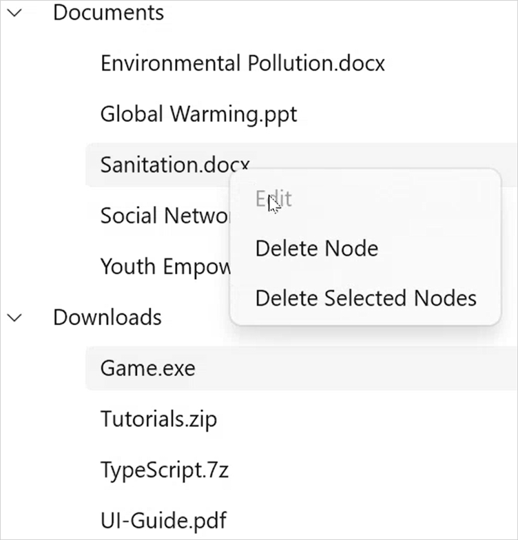
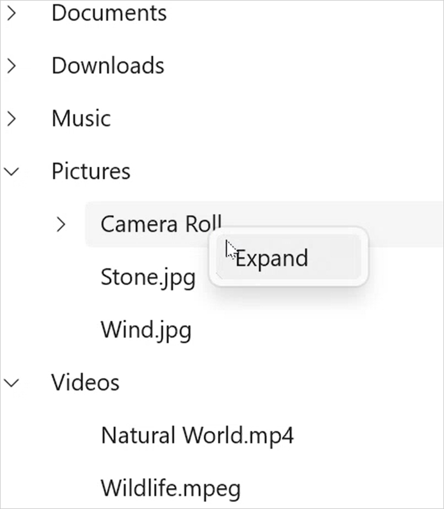

# Context Flyout in WinUI TreeView

This section explains how to show ContextFlyout and using built-in commands in the TreeView.

## ContextFlyout for Nodes

The TreeView provides an entirely customizable context flyout to expose the functionality on user interface. You can create context flyout for nodes in an efficient manner.

You can set context flyout for the nodes by using [SfTreeView.ItemContextFlyout](https://help.syncfusion.com/cr/winui/Syncfusion.UI.Xaml.TreeView.SfTreeView.html#Syncfusion_UI_Xaml_TreeView_SfTreeView_ItemContextFlyout) property.

## Built-in commands

The TreeView provides support for the following built-in commands

* [Edit](https://help.syncfusion.com/cr/winui/Syncfusion.UI.Xaml.TreeView.TreeViewCommands.html#Syncfusion_UI_Xaml_TreeView_TreeViewCommands_Edit) - Command to start the editing of the node.
* [DeleteNode](https://help.syncfusion.com/cr/winui/Syncfusion.UI.Xaml.TreeView.TreeViewCommands.html#Syncfusion_UI_Xaml_TreeView_TreeViewCommands_DeleteNode) - Command to delete the node.
* [DeleteSelectedNodes](https://help.syncfusion.com/cr/winui/Syncfusion.UI.Xaml.TreeView.TreeViewCommands.html#Syncfusion_UI_Xaml_TreeView_TreeViewCommands_DeleteSelectedNodes) - Command to delete all the selected nodes.



<treeView:SfTreeView x:Name="sfTreeView"
				ItemsSource="{Binding Folders}"
				ChildPropertyName="SubFiles"
                AllowEditing="True"
                SelectionMode="Multiple">
		<treeView:SfTreeView.ItemContextFlyout>
            <MenuFlyout>
                <MenuFlyoutItem x:Name="Edit" Text="Edit" Command="{x:Bind treeView:TreeViewCommands.Edit}" CommandParameter="{Binding }"/>
                <MenuFlyoutItem x:Name="DeleteNode" Text="Delete Node" Command="{x:Bind treeView:TreeViewCommands.DeleteNode}" CommandParameter="{Binding }"/>
                <MenuFlyoutItem x:Name="DeleteSelectedNodes" Text="Delete Selected Nodes" Command="{x:Bind treeView:TreeViewCommands.DeleteSelectedNodes}" CommandParameter="{Binding }"/>
            </MenuFlyout>
        </treeView:SfTreeView.ItemContextFlyout>
</treeView:SfTreeView>



## Custom commands

The TreeView allows to show context flyout using custom commands when built-in commands does not meet your requirement.

For an example, custom command is used to expand the nodes using context flyout in the following example



<treeView:SfTreeView x:Name="sfTreeView"
				ItemsSource="{Binding Folders}"
				ChildPropertyName="SubFiles"
                AllowEditing="True"
                SelectionMode="Multiple">
    <treeView:SfTreeView.ItemContextFlyout>
        <MenuFlyout>
            <MenuFlyoutItem x:Name="Expand" Text="Expand" Command="{Binding TreeView.DataContext.ExpandCommand}" CommandParameter="{Binding }"/>
        </MenuFlyout>
    </treeView:SfTreeView.ItemContextFlyout>
</treeView:SfTreeView>


using Syncfusion.UI.Xaml.Core;

public class FileManagerViewModel
{
    public FileManagerViewModel()
    {
        ExpandCommand = new DelegateCommand<object>(ExecuteExpandCommand, CanExecuteExpandCommand);
    }
    
    public ICommand ExpandCommand { get; set; }
    
    private bool CanExecuteExpandCommand(object obj)
    {
            var itemContextFlyoutInfo = parameter as TreeViewItemContextFlyoutInfo;
            if (itemContextFlyoutInfo == null)
                return false;
            if (itemContextFlyoutInfo.Node.HasChildNodes)
                return true;
            return false;
    }

    private static void ExecuteExpandCommand(object obj)
    {
        var itemContextFlyoutInfo = parameter as TreeViewItemContextFlyoutInfo;
        if (itemContextFlyoutInfo == null)
            return;
        itemContextFlyoutInfo.TreeView.ExpandNode(itemContextFlyoutInfo.Node);
    }
}



## Event customization

### Conditionally displaying context flyout on right click

You can cancel showing of [ItemContextFlyout](https://help.syncfusion.com/cr/winui/Syncfusion.UI.Xaml.TreeView.SfTreeView.html#Syncfusion_UI_Xaml_TreeView_SfTreeView_ItemContextFlyout) for certain nodes using custom logic within this event by setting `ItemContextFlyoutOpeningEventArgs.Cancel` as `true`.



sfTreeView.ItemContextFlyoutOpening += TreeView_ItemContextFlyoutOpening;

private void TreeView_ItemContextFlyoutOpening(object sender, Syncfusion.UI.Xaml.TreeView.ItemContextFlyoutOpeningEventArgs e)
{
    if (e.FlyoutInfo.Node.Level == 2)
        e.Cancel = true;
}



