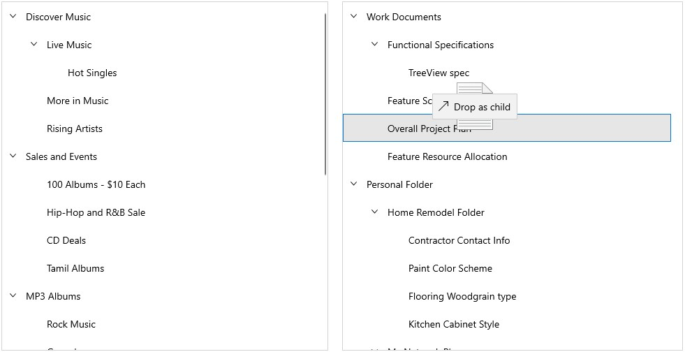

# Drag and drop in WinUI TreeView

[TreeView](https://help.syncfusion.com/cr/winui/Syncfusion.UI.Xaml.TreeView.SfTreeView.html) allows drag and drop the items within the treeview control by setting the [CanDrag](https://docs.microsoft.com/en-us/uwp/api/windows.ui.xaml.uielement.candrag?view=winrt-19041) and [AllowDrop](https://docs.microsoft.com/en-us/uwp/api/windows.ui.xaml.uielement.allowdrop?view=winrt-19041) property as `true`. It is also possible to drag and drop the items between treeview.



<syncfusion:SfTreeView Name="treeView"  
                       CanDrag="True" 
                       AllowDrop="True" 
                       ChildPropertyName="Childs"
                       ItemTemplate="{StaticResource treeView_ItemTemplate}"
                       ItemsSource="{Binding Items}" />


treeView.CanDrag = true;
treeView.AllowDrop = true;



While dropping, the dragged items can be added above or below to the target item based on drag indicator position.

## Dragging multiple items

TreeView allows to drag multiple selected items. To enable multiple selection, set the [TreeView.SelectionMode](https://help.syncfusion.com/cr/winui/Syncfusion.UI.Xaml.TreeView.SfTreeView.html#Syncfusion_UI_Xaml_TreeView_SfTreeView_SelectionMode) as `Multiple` or `Extended`. 

## Drag and drop events

TreeView triggers the following events when drag and drop:

### ItemDragStarting event

[ItemDragStarting](https://help.syncfusion.com/cr/winui/Syncfusion.UI.Xaml.TreeView.SfTreeView.html#Syncfusion_UI_Xaml_TreeView_SfTreeView_ItemDragStarting) event occurs when you starting to drag the items in treeview. The [TreeViewItemDragStartingEventArgs](https://help.syncfusion.com/cr/winui/Syncfusion.UI.Xaml.TreeView.TreeViewItemDragStartingEventArgs.html)  has the following member, which provides information for the `ItemDragStarting` event.

* [Data](https://help.syncfusion.com/cr/winui/Syncfusion.UI.Xaml.TreeView.TreeViewItemDragStartingEventArgs.html#Syncfusion_UI_Xaml_TreeView_TreeViewItemDragStartingEventArgs_Data) : Gets or Sets a data object that contains the data associated while dragging the items. 
* [DraggingNodes](https://help.syncfusion.com/cr/winui/Syncfusion.UI.Xaml.TreeView.TreeViewItemDragStartingEventArgs.html#Syncfusion_UI_Xaml_TreeView_TreeViewItemDragStartingEventArgs_DraggingNodes) : Gets the collection of [TreeViewNode](https://help.syncfusion.com/cr/winui/Syncfusion.UI.Xaml.TreeView.Engine.TreeViewNode.html) which are dragged.If you set the Data property, the value of DraggingNodes property will be `null`.
* [Cancel](https://help.syncfusion.com/cr/winui/Syncfusion.UI.Xaml.TreeView.TreeViewItemDragStartingEventArgs.html#Syncfusion_UI_Xaml_TreeView_TreeViewItemDragStartingEventArgs_Cancel) : Gets or sets a value indicating whether dragging should be canceled.



treeView.ItemDragStarting += treeView_ItemDragStarting;

private void treeView_ItemDragStarting(object sender, Syncfusion.UI.Xaml.TreeView.TreeViewItemDragStartingEventArgs e)
{
    
}




### ItemDragStarted event

[ItemDragStarted](https://help.syncfusion.com/cr/winui/Syncfusion.UI.Xaml.TreeView.SfTreeView.html#Syncfusion_UI_Xaml_TreeView_SfTreeView_ItemDragStarted)  event occurs after started the dragging, in treeview. The [TreeViewItemDragStartedEventArgs](https://help.syncfusion.com/cr/winui/Syncfusion.UI.Xaml.TreeView.TreeViewItemDragStartedEventArgs.html)  has the following member, which provides information for the `ItemDragStarted` event.

* [Data](https://help.syncfusion.com/cr/winui/Syncfusion.UI.Xaml.TreeView.TreeViewItemDragStartedEventArgs.html#Syncfusion_UI_Xaml_TreeView_TreeViewItemDragStartedEventArgs_Data) : Gets a data object that contains the data associated while dragging the items. 
* [DraggingNodes](https://help.syncfusion.com/cr/winui/Syncfusion.UI.Xaml.TreeView.TreeViewItemDragStartedEventArgs.html#Syncfusion_UI_Xaml_TreeView_TreeViewItemDragStartedEventArgs_DraggingNodes) : Gets the collection of [TreeViewNode](https://help.syncfusion.com/cr/winui/Syncfusion.UI.Xaml.TreeView.Engine.TreeViewNode.html) which are dragged.



treeView.ItemDragStarted += treeView_ItemDragStarted;

private void treeView_ItemDragStarted(object sender, Syncfusion.UI.Xaml.TreeView.TreeViewItemDragStartedEventArgs e)
{
   
}



### ItemDropping event

[ItemDropping](https://help.syncfusion.com/cr/winui/Syncfusion.UI.Xaml.TreeView.SfTreeView.html#Syncfusion_UI_Xaml_TreeView_SfTreeView_ItemDropping) event occurs when item is dropping within the targeted `TreeView`. The [TreeViewItemDroppingEventArgs](https://help.syncfusion.com/cr/winui/Syncfusion.UI.Xaml.TreeView.TreeViewItemDroppingEventArgs.html) has the following members, which provide information for the `ItemDropping` event.

* [Data](https://help.syncfusion.com/cr/winui/Syncfusion.UI.Xaml.TreeView.TreeViewItemDroppingEventArgs.html#Syncfusion_UI_Xaml_TreeView_TreeViewItemDroppingEventArgs_Data) : Gets a data object that contains the data associated while dragging the items. 
* [DraggingNodes](https://help.syncfusion.com/cr/winui/Syncfusion.UI.Xaml.TreeView.TreeViewItemDroppingEventArgs.html#Syncfusion_UI_Xaml_TreeView_TreeViewItemDroppingEventArgs_DraggingNodes) : Gets the collection of [TreeViewNode](https://help.syncfusion.com/cr/winui/Syncfusion.UI.Xaml.TreeView.Engine.TreeViewNode.html) which are dragged.
* [DragSource](https://help.syncfusion.com/cr/winui/Syncfusion.UI.Xaml.TreeView.TreeViewItemDroppingEventArgs.html#Syncfusion_UI_Xaml_TreeView_TreeViewItemDroppingEventArgs_DragSource) : Gets the source of the transferred data.
* [DropPosition](https://help.syncfusion.com/cr/winui/Syncfusion.UI.Xaml.TreeView.TreeViewItemDroppingEventArgs.html#Syncfusion_UI_Xaml_TreeView_TreeViewItemDroppingEventArgs_DropPosition) : Gets or sets the position where dragged nodes are going to be dropped.
* [Handled](https://help.syncfusion.com/cr/winui/Syncfusion.UI.Xaml.TreeView.TreeViewItemDroppingEventArgs.html#Syncfusion_UI_Xaml_TreeView_TreeViewItemDroppingEventArgs_Handled) : Gets or sets a value indicating whether the event is handled. If this event is handled, dragged nodes will not be dropped to TreeView.
* [TargetNode](https://help.syncfusion.com/cr/winui/Syncfusion.UI.Xaml.TreeView.TreeViewItemDroppingEventArgs.html#Syncfusion_UI_Xaml_TreeView_TreeViewItemDroppingEventArgs_TargetNode) : Gets the node where the dragged nodes are going to be dropped.



treeView.ItemDropping += treeView_ItemDropping;

private void treeView_ItemDropping(object sender, Syncfusion.UI.Xaml.TreeView.TreeViewItemDroppingEventArgs e)
{
    
}




### ItemDropped event

[ItemDropped](https://help.syncfusion.com/cr/winui/Syncfusion.UI.Xaml.TreeView.SfTreeView.html#Syncfusion_UI_Xaml_TreeView_SfTreeView_ItemDropped) event occurs when item is dropped within the targeted `TreeView`. The [TreeViewItemDroppedEventArgs](https://help.syncfusion.com/cr/winui/Syncfusion.UI.Xaml.TreeView.TreeViewItemDroppedEventArgs.html) has the following members, which provide information for the `Drop` event.
* [Data](https://help.syncfusion.com/cr/winui/Syncfusion.UI.Xaml.TreeView.TreeViewItemDroppedEventArgs.html#Syncfusion_UI_Xaml_TreeView_TreeViewItemDroppedEventArgs_Data) : Gets a data object that contains the data associated while dragging the items. 
* [DraggingNodes](https://help.syncfusion.com/cr/winui/Syncfusion.UI.Xaml.TreeView.TreeViewItemDroppedEventArgs.html#Syncfusion_UI_Xaml_TreeView_TreeViewItemDroppedEventArgs_DraggingNodes) : Gets the collection of [TreeViewNode](https://help.syncfusion.com/cr/winui/Syncfusion.UI.Xaml.TreeView.Engine.TreeViewNode.html) which are dragged.
* [DragSource](https://help.syncfusion.com/cr/winui/Syncfusion.UI.Xaml.TreeView.TreeViewItemDroppedEventArgs.html#Syncfusion_UI_Xaml_TreeView_TreeViewItemDroppedEventArgs_DragSource) : Gets the source of the transferred data.
* [DropPosition](https://help.syncfusion.com/cr/winui/Syncfusion.UI.Xaml.TreeView.TreeViewItemDroppedEventArgs.html#Syncfusion_UI_Xaml_TreeView_TreeViewItemDroppedEventArgs_DropPosition) : Gets the position where dragged nodes are dropped.
* [TargetNode](https://help.syncfusion.com/cr/winui/Syncfusion.UI.Xaml.TreeView.TreeViewItemDroppedEventArgs.html#Syncfusion_UI_Xaml_TreeView_TreeViewItemDroppedEventArgs_TargetNode) : Gets the node where the dragged nodes are dropped.



treeView.ItemDropped += treeView_ItemDropped;

private void treeView_ItemDropped(object sender, Syncfusion.UI.Xaml.TreeView.TreeViewItemDroppedEventArgs e)
{
   
}




## Drag and drop between two TreeView's

You can customize the dragging operation between two treeview by using the [TreeView.ItemDragStarting](https://help.syncfusion.com/cr/winui/Syncfusion.UI.Xaml.TreeView.SfTreeView.html#Syncfusion_UI_Xaml_TreeView_SfTreeView_ItemDragStarting) , [TreeView.ItemDropping](https://help.syncfusion.com/cr/winui/Syncfusion.UI.Xaml.TreeView.SfTreeView.html#Syncfusion_UI_Xaml_TreeView_SfTreeView_ItemDropping) and [TreeView.ItemDropped](https://help.syncfusion.com/cr/winui/Syncfusion.UI.Xaml.TreeView.SfTreeView.html#Syncfusion_UI_Xaml_TreeView_SfTreeView_ItemDropped) events.




treeView1.ItemDragStarting += TreeView1_ItemDragStarting;
treeView1.ItemDropping += TreeView1_ItemDropping;
treeView2.ItemDropping += TreeView2_ItemDropping;
treeView2.ItemDropped += TreeView1_ItemDropped;

/// 

/// Customizing the ItemStarting event
/// 

/// <param name="sender"></param>
/// <param name="e"></param>
private void TreeView1_ItemDragStarting(object sender, Syncfusion.UI.Xaml.TreeView.TreeViewItemDragStartingEventArgs e)
{
    //Restrict the dragging for certain node
    var record = e.DraggingNodes[0].Content as DragAndDropModel;
    if (record.Header == "More in Music")
        e.Cancel = true;
}

/// 

/// Customizing the ItemDropping event
/// 

/// <param name="sender"></param>
/// <param name="e"></param>
private void TreeView1_ItemDropping(object sender, Syncfusion.UI.Xaml.TreeView.TreeViewItemDroppingEventArgs e)
{
    //Restrict the dropping in first treeview
    e.Handled = true;
}

/// 

/// Customizing the ItemDropping event
/// 

/// <param name="sender"></param>
/// <param name="e"></param>
private void TreeView2_ItemDropping(object sender, Syncfusion.UI.Xaml.TreeView.TreeViewItemDroppingEventArgs e)
{
    //Restrict the dropping for drop position as above
    if (e.DropPosition == Syncfusion.UI.Xaml.TreeView.DropPosition.DropAbove)
        e.Handled = true;

    //Restrict the dropping on certain nodes
    var record = e.TargetNode.Content as DragAndDropModel;
    if (record.Header == "Feature Schedule")
        e.Handled = true;
}

/// 

/// Customize the ItemDropped event
/// 

/// <param name="sender"></param>
/// <param name="e"></param>
private void TreeView1_ItemDropped(object sender, Syncfusion.UI.Xaml.TreeView.TreeViewItemDroppedEventArgs e)
{
    var parentNode = e.TargetNode.ParentNode;
    var collection = parentNode.ChildNodes;
    var record = e.DraggingNodes[0].Content as DragAndDropModel;
    int count = 0;
    foreach (var child in parentNode.ChildNodes)
    {
        var childNode = child.Content as DragAndDropModel;
        if (childNode.Header == record.Header)
        {
            count++;
            if (count > 1)
            {
                // Remove dropped node if the parent has the same node in it
                collection.Remove(child);
                return;
            }
        }
    }
}




