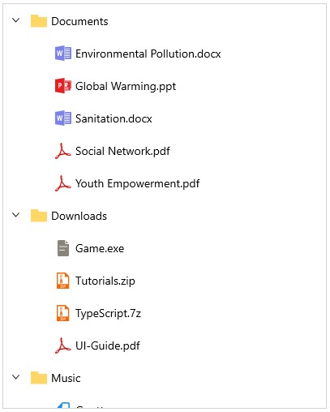

# Getting Started with WinUI TreeView

This section explains the steps required to add the [TreeView](https://help.syncfusion.com/cr/winui/Syncfusion.UI.Xaml.TreeView.SfTreeView.html) control and binding data in Treeview control. This section covers only basic features needed to get started with Syncfusion TreeView control.

## Creating an application with WinUI TreeView

1. Create a [WinUI 3 desktop app for C# and .NET 5](https://docs.microsoft.com/en-us/windows/apps/winui/winui3/get-started-winui3-for-desktop) or [WinUI 3 app in UWP for C#](https://docs.microsoft.com/en-us/windows/apps/winui/winui3/get-started-winui3-for-uwp).
2. Install the [Syncfusion.TreeView.WinUI](https://www.nuget.org/packages/Syncfusion.TreeView.WinUI) NuGet packages.
3. Import the control namespace `Syncfusion.UI.Xaml.TreeView` in XAML or C# code.
4. Initialize the TreeView control.

 
 

<Page x:Class="syncfusion.treeviewdemos.winui.GettingStartedPage"
      xmlns="http://schemas.microsoft.com/winfx/2006/xaml/presentation"
      xmlns:x="http://schemas.microsoft.com/winfx/2006/xaml"
      xmlns:d="http://schemas.microsoft.com/expression/blend/2008"
      xmlns:mc="http://schemas.openxmlformats.org/markup-compatibility/2006"
      xmlns:local="using:syncfusion.treeviewdemos.winui"
      xmlns:treeView="using:Syncfusion.UI.Xaml.TreeView"
      mc:Ignorable="d"
      Background="{ThemeResource ApplicationPageBackgroundThemeBrush}"
      NavigationCacheMode="Disabled">
      <Grid>
          <treeView:SfTreeView x:Name="treeView" />
      </Grid>
</Page>


 

using Microsoft.UI.Xaml.Controls;
using Syncfusion.UI.Xaml.TreeView;

public sealed partial class GettingStartedPage : Page
{
    /// 

    /// Interaction logic for GettingStartedPage.xaml
    /// 

    public GettingStartedPage()
    {
        this.InitializeComponent();
        SfTreeView treeView = new SfTreeView();
        Root_Grid.Children.Add(treeView);
    }
}


 

## Bind to a hierarchical data source - Bound Mode

You can create a tree view by binding the ItemsSource to a hierarchical data source. To create a tree view using data binding, set a hierarchical collection to the [ItemsSource](https://help.syncfusion.com/cr/winui/Syncfusion.UI.Xaml.TreeView.SfTreeView.html#Syncfusion_UI_Xaml_TreeView_SfTreeView_ItemsSource) property. Then using [ItemTemplate](https://help.syncfusion.com/cr/winui/Syncfusion.UI.Xaml.TreeView.SfTreeView.html#Syncfusion_UI_Xaml_TreeView_SfTreeView_ItemTemplate) and [ExpanderTemplate](https://help.syncfusion.com/cr/winui/Syncfusion.UI.Xaml.TreeView.SfTreeView.html#Syncfusion_UI_Xaml_TreeView_SfTreeView_ExpanderTemplate), set the child items collection to the `ItemsSource` property.

 
 

<Page x:Class="syncfusion.treeviewdemos.winui.NodeWithImagePage"
      xmlns="http://schemas.microsoft.com/winfx/2006/xaml/presentation"
      xmlns:x="http://schemas.microsoft.com/winfx/2006/xaml"
      xmlns:local="using:syncfusion.treeviewdemos.winui"
      xmlns:treeView="using:Syncfusion.UI.Xaml.TreeView"
      xmlns:d="http://schemas.microsoft.com/expression/blend/2008"
      xmlns:mc="http://schemas.openxmlformats.org/markup-compatibility/2006"
      mc:Ignorable="d"
      Background="{ThemeResource ApplicationPageBackgroundThemeBrush}"
      NavigationCacheMode="Disabled">

    <Page.DataContext>
        <local:NodeWithImageViewModel />
    </Page.DataContext>

    <Grid>
       <treeView:SfTreeView x:Name="treeView"
                              ChildPropertyName=”Files”  
                              ItemsSource="{Binding Folders}">
                    <treeView:SfTreeView.ItemTemplate>
                        <DataTemplate>
                            <StackPanel Orientation="Horizontal">
                                <ContentPresenter Width="20"
                                                  Height="20"
                                                  HorizontalAlignment="Stretch"
                                                  VerticalAlignment="Center"
                                                  ContentTemplate="{Binding ImageTemplate}" />
                                <TextBlock Margin="5"
                                           VerticalAlignment="Center"
                                           Text="{Binding FileName}" />
                            </StackPanel>
                        </DataTemplate>
                    </treeView:SfTreeView.ItemTemplate>
        </treeView:SfTreeView>
    </Grid>
</Page>


 

public class NodeWithImageViewModel
{
    public ObservableCollection<Folder> Folders { get; internal set; }

    private ResourceDictionary CommonResourceDictionary { get; set; }

    public NodeWithImageViewModel()
    {
        CommonResourceDictionary = new ResourceDictionary() { Source = new Uri("ms-appx:///Icons/PathIcon.xaml", UriKind.RelativeOrAbsolute) };
        this.Folders = GetFiles();
    }

    private ObservableCollection<Folder> GetFiles()
    {
        var nodeImageInfo = new ObservableCollection<Folder>();

        var doc = new Folder() { FileName = "Documents", ImageTemplate = CommonResourceDictionary["Folder"] as DataTemplate };
        var download = new Folder() { FileName = "Downloads", ImageTemplate = CommonResourceDictionary["Folder"] as DataTemplate };
        var mp3 = new Folder() { FileName = "Music", ImageTemplate = CommonResourceDictionary["Folder"] as DataTemplate };
        var pictures = new Folder() { FileName = "Pictures", ImageTemplate = CommonResourceDictionary["Folder"] as DataTemplate };
        var video = new Folder() { FileName = "Videos", ImageTemplate = CommonResourceDictionary["Folder"] as DataTemplate };

        var pollution = new Folder() { FileName = "Environmental Pollution.docx", ImageTemplate = CommonResourceDictionary["Word"] as DataTemplate };
        var globalWarming = new Folder() { FileName = "Global Warming.ppt", ImageTemplate = CommonResourceDictionary["PowerPoint"] as DataTemplate };
        var sanitation = new Folder() { FileName = "Sanitation.docx", ImageTemplate = CommonResourceDictionary["Word"] as DataTemplate };
        var socialNetwork = new Folder() { FileName = "Social Network.pdf", ImageTemplate = CommonResourceDictionary["Pdf"] as DataTemplate };
        var youthEmpower = new Folder() { FileName = "Youth Empowerment.pdf", ImageTemplate = CommonResourceDictionary["Pdf"] as DataTemplate };

        var games = new Folder() { FileName = "Game.exe", ImageTemplate = CommonResourceDictionary["EXE"] as DataTemplate };
        var tutorials = new Folder()  { FileName = "Tutorials.zip", ImageTemplate = CommonResourceDictionary["Zip"] as DataTemplate };
        var typeScript = new Folder() { FileName = "TypeScript.7z", ImageTemplate = CommonResourceDictionary["Zip"] as DataTemplate };
        var uiGuide = new Folder() { FileName = "UI-Guide.pdf", ImageTemplate = CommonResourceDictionary["Pdf"] as DataTemplate };

        var song = new Folder() { FileName = "Gouttes", ImageTemplate = CommonResourceDictionary["Audio"] as DataTemplate };

        var camera = new Folder() { FileName = "Camera Roll", ImageTemplate = CommonResourceDictionary["Folder"] as DataTemplate };
        var stone = new Folder() { FileName = "Stone.jpg", ImageTemplate = CommonResourceDictionary["Png"] as DataTemplate };
        var wind = new Folder() { FileName = "Wind.jpg", ImageTemplate = CommonResourceDictionary["Png"] as DataTemplate };

        var img0 = new Folder() { FileName = "WIN_20160726_094117.JPG", ImageTemplate = CommonResourceDictionary["Png"] as DataTemplate };
        var img1 = new Folder() { FileName = "WIN_20160726_094118.JPG", ImageTemplate = CommonResourceDictionary["Png"] as DataTemplate };

        var video1 = new Folder() { FileName = "Natural World.mp4", ImageTemplate = CommonResourceDictionary["Video"] as DataTemplate };
        var video2 = new Folder() { FileName = "Wildlife.mpeg", ImageTemplate = CommonResourceDictionary["Video"] as DataTemplate };

        doc.Files = new ObservableCollection<Folder>
        {
            pollution,
            globalWarming,
            sanitation,
            socialNetwork,
            youthEmpower
        };

        download.Files = new ObservableCollection<Folder>
        {
            games,
            tutorials,
            typeScript,
            uiGuide
        };

        mp3.Files = new ObservableCollection<Folder>
        {
            song
        };

        pictures.Files = new ObservableCollection<Folder>
        {
            camera,
            stone,
            wind
        };

        camera.Files = new ObservableCollection<Folder>
        {
            img0,
             img1
        };

        video.Files = new ObservableCollection<Folder>
        {
            video1,
            video2
        };

        nodeImageInfo.Add(doc);
        nodeImageInfo.Add(download);
        nodeImageInfo.Add(mp3);
        nodeImageInfo.Add(pictures);
        nodeImageInfo.Add(video);

        return nodeImageInfo;
    }
}

public class Folder : NotificationObject
{ 
        
    private string fileName;

    private DataTemplate imageTemplate;
             
    private ObservableCollection<Folder> files;

    public Folder()
    {

    }

    public ObservableCollection< Folder> Files
    {
        get { return files; }
        internal set
        {
            files = value;
            RaisePropertyChanged(nameof(Files));
        }
    }

    public string FileName
    {
        get { return fileName; }
        set
        {
            fileName = value;
            RaisePropertyChanged(nameof(FileName));
        }
    }

    public DataTemplate ImageTemplate
    {
        get { return imageTemplate; }
        set { imageTemplate = value; }
    }
}


 

N> [View sample in GitHub](https://github.com/SyncfusionExamples/syncfusion-winui-treeview-examples/tree/main/Samples/Populating-Nodes-with-Bound-mode)

## Bind to a Hierarchy Property Descriptors data source - Bound Mode

You can create a tree view by binding the `ItemsSource` to a hierarchy property descriptors data source. To create a tree view using hierarchical data binding, set a hierarchical collection to the [ItemsSource](https://help.syncfusion.com/cr/winui/Syncfusion.UI.Xaml.TreeView.SfTreeView.html#Syncfusion_UI_Xaml_TreeView_SfTreeView_ItemsSource) property, and then set the TargetType and [ChildPropertyName](https://help.syncfusion.com/cr/winui/Syncfusion.UI.Xaml.TreeView.SfTreeView.html#Syncfusion_UI_Xaml_TreeView_SfTreeView_ChildPropertyName) property values in [HierarchyPropertyDescriptors](https://help.syncfusion.com/cr/winui/Syncfusion.UI.Xaml.TreeView.SfTreeView.html#Syncfusion_UI_Xaml_TreeView_SfTreeView_HierarchyPropertyDescriptors).

 
 

<Page x:Class="syncfusion.treeviewdemos.winui.NodeWithImagePage"
      xmlns="http://schemas.microsoft.com/winfx/2006/xaml/presentation"
      xmlns:x="http://schemas.microsoft.com/winfx/2006/xaml"
      xmlns:local="using:syncfusion.treeviewdemos.winui"
      xmlns:treeView="using:Syncfusion.UI.Xaml.TreeView"
      xmlns:d="http://schemas.microsoft.com/expression/blend/2008"
      xmlns:mc="http://schemas.openxmlformats.org/markup-compatibility/2006"
      mc:Ignorable="d"
      Background="{ThemeResource ApplicationPageBackgroundThemeBrush}"
      NavigationCacheMode="Disabled">

    <Page.DataContext>
        <local:NodeWithImageViewModel />
    </Page.DataContext>

    <Grid>
        <treeView:SfTreeView x:Name="treeView"
                               ItemsSource="{Binding Folders}">
                    <treeView:SfTreeView.HierarchyPropertyDescriptors>
                        <treeView:HierarchyPropertyDescriptor ChildPropertyName="Files"
                                                                    TargetType="local:Folder" />
                        <treeView:HierarchyPropertyDescriptor ChildPropertyName="SubFiles"
                                                                    TargetType="local:File" />
                    </treeView:SfTreeView.HierarchyPropertyDescriptors>
                    <treeView:SfTreeView.ItemTemplate>
                        <DataTemplate>
                            <StackPanel Orientation="Horizontal">
                                <ContentPresenter Width="20"
                                                  Height="20"
                                                  HorizontalAlignment="Stretch"
                                                  VerticalAlignment="Center"
                                                  ContentTemplate="{Binding ImageTemplate}" />
                                <TextBlock Margin="5"
                                           VerticalAlignment="Center"
                                           Text="{Binding FileName}" />
                            </StackPanel>
                        </DataTemplate>
                    </treeView:SfTreeView.ItemTemplate>
        </treeView:SfTreeView>
    </Grid>
</Page>


 

public class NodeWithImageViewModel
{
    public NodeWithImageViewModel()
    {
        CommonResourceDictionary = new ResourceDictionary() { Source = new Uri("ms-appx:///Icons/PathIcon.xaml", UriKind.RelativeOrAbsolute) };
        this.Folders = GetFiles();
    }

    public ObservableCollection<Folder> Folders { get; internal set; }

    public ObservableCollection<File> Files { get; internal set; }

    public ObservableCollection<SubFile> SubFiles { get; internal set; }

    private ResourceDictionary CommonResourceDictionary { get; set; }
        
    private ObservableCollection<Folder> GetFiles()
    {
        var nodeImageInfo = new ObservableCollection<Folder>();

        var doc = new Folder() { FileName = "Documents", ImageTemplate = CommonResourceDictionary["Folder"] as DataTemplate };
        var download = new Folder() { FileName = "Downloads", ImageTemplate = CommonResourceDictionary["Folder"] as DataTemplate };
        var mp3 = new Folder() { FileName = "Music", ImageTemplate = CommonResourceDictionary["Folder"] as DataTemplate };
        var pictures = new Folder() { FileName = "Pictures", ImageTemplate = CommonResourceDictionary["Folder"] as DataTemplate };
        var video = new Folder() { FileName = "Videos", ImageTemplate = CommonResourceDictionary["Folder"] as DataTemplate };

        var pollution = new File() { FileName = "Environmental Pollution.docx", ImageTemplate = CommonResourceDictionary["Word"] as DataTemplate };
        var globalWarming = new File() { FileName = "Global Warming.ppt", ImageTemplate = CommonResourceDictionary["PowerPoint"] as DataTemplate };
        var sanitation = new File() { FileName = "Sanitation.docx", ImageTemplate = CommonResourceDictionary["Word"] as DataTemplate };
        var socialNetwork = new File() { FileName = "Social Network.pdf", ImageTemplate = CommonResourceDictionary["Pdf"] as DataTemplate };
        var youthEmpower = new File() { FileName = "Youth Empowerment.pdf", ImageTemplate = CommonResourceDictionary["Pdf"] as DataTemplate};

        var games = new File() { FileName = "Game.exe", ImageTemplate = CommonResourceDictionary["EXE"] as DataTemplate };
        var tutorials = new File() { FileName = "Tutorials.zip", ImageTemplate = CommonResourceDictionary["Zip"] as DataTemplate };
        var typeScript = new File() { FileName = "TypeScript.7z", ImageTemplate = CommonResourceDictionary["Zip"] as DataTemplate };
        var uiGuide = new File() { FileName = "UI-Guide.pdf", ImageTemplate = CommonResourceDictionary["Pdf"] as DataTemplate };

        var song = new File() { FileName = "Gouttes", ImageTemplate = CommonResourceDictionary["Audio"] as DataTemplate };

        var camera = new File() { FileName = "Camera Roll", ImageTemplate = CommonResourceDictionary["Folder"] as DataTemplate };
        var stone = new File() { FileName = "Stone.jpg", ImageTemplate = CommonResourceDictionary["Png"] as DataTemplate };
        var wind = new File() { FileName = "Wind.jpg", ImageTemplate = CommonResourceDictionary["Png"] as DataTemplate };

        var img0 = new SubFile() { FileName = "WIN_20160726_094117.JPG", ImageTemplate = CommonResourceDictionary["Png"] as DataTemplate };
        var img1 = new SubFile() { FileName = "WIN_20160726_094118.JPG", ImageTemplate = CommonResourceDictionary["Png"] as DataTemplate };

        var video1 = new File() { FileName = "Natural World.mp4", ImageTemplate = CommonResourceDictionary["Video"] as DataTemplate };
        var video2 = new File() { FileName = "Wildlife.mpeg", ImageTemplate = CommonResourceDictionary["Video"] as DataTemplate };

        doc.Files = new ObservableCollection<File>
        {
            pollution,
            globalWarming,
            sanitation,
            socialNetwork,
            youthEmpower
        };

        download.Files = new ObservableCollection<File>
        {
            games,
            tutorials,
            typeScript,
            uiGuide
        };

        mp3.Files = new ObservableCollection<File>
        {
            song
        };

        pictures.Files = new ObservableCollection<File>
        {
            camera,
            stone,
            wind
        };

        camera.SubFiles = new ObservableCollection<SubFile>
        {
            img0,
            img1
        };

        video.Files = new ObservableCollection<File>
        {
            video1,
            video2
        };

        nodeImageInfo.Add(doc);
        nodeImageInfo.Add(download);
        nodeImageInfo.Add(mp3);
        nodeImageInfo.Add(pictures);
        nodeImageInfo.Add(video);

        return nodeImageInfo;
    }
}

public class Folder : NotificationObject
{
    private string fileName;

    private DataTemplate imageTemplate;
        
    private ObservableCollection<File> files;
        
    public Folder()
    {

    }

    public ObservableCollection<File> Files
    {
        get { return files; }
        internal set
        {
            files = value;
            RaisePropertyChanged(nameof(Files));
        }
    }

    public string FileName
    {
        get { return fileName; }
        set
        {
            fileName = value;
            RaisePropertyChanged(nameof(FileName));
        }
    }

    public DataTemplate ImageTemplate
    {
        get { return imageTemplate; }
        set { imageTemplate = value; }
    }
}

public class File : NotificationObject
{
    private string fileName;

    private DataTemplate imageTemplate;

    private ObservableCollection<SubFile> subFiles;

    public File()
    {

    }

    public ObservableCollection<SubFile> SubFiles
    {
        get { return subFiles; }
        internal set
        {
            subFiles = value;
            RaisePropertyChanged(nameof(SubFiles));
        }
    }

    public string FileName
    {
        get { return fileName; }
        set
        {
            fileName = value;
            RaisePropertyChanged(nameof(FileName));
        }
    }

    public DataTemplate ImageTemplate
    {
        get { return imageTemplate; }
        set { imageTemplate = value; }
    }
}

public class SubFile : NotificationObject
{      
    private string fileName;

    private DataTemplate imageTemplate;  
      
    public SubFile()
    {

    }
        
    public string FileName
    {
        get { return fileName; }
        set
        {
            fileName = value;
            RaisePropertyChanged(nameof(FileName));
        }
    }

    public DataTemplate ImageTemplate
    {
        get { return imageTemplate; }
        set { imageTemplate = value; }
    }
}


 

## Populating Nodes without data source - Unbound Mode

You can create and manage the [TreeViewNode](https://help.syncfusion.com/cr/winui/Syncfusion.UI.Xaml.TreeView.Engine.TreeViewNode.html) objects by yourself to display the data in a hierarchical view. To create a tree view, you can use a `TreeView` control and a hierarchy of `TreeViewNode` objects. You can create the node hierarchy by adding one or more root nodes to the [TreeView.Nodes](https://help.syncfusion.com/cr/winui/Syncfusion.UI.Xaml.TreeView.SfTreeView.html#Syncfusion_UI_Xaml_TreeView_SfTreeView_Nodes) collection. Each `TreeViewNode` can have more nodes added to its Children collection which helps in populating multiple level of tree view nodes based on needs.

 
 

<Page x:Class="syncfusion.treeviewdemos.winui.GettingStartedPage"
      xmlns="http://schemas.microsoft.com/winfx/2006/xaml/presentation"
      xmlns:x="http://schemas.microsoft.com/winfx/2006/xaml"
      xmlns:d="http://schemas.microsoft.com/expression/blend/2008"
      xmlns:mc="http://schemas.openxmlformats.org/markup-compatibility/2006"
      xmlns:local="using:syncfusion.treeviewdemos.winui"
      xmlns:treeView="using:Syncfusion.UI.Xaml.TreeView"
      mc:Ignorable="d"
      Background="{ThemeResource ApplicationPageBackgroundThemeBrush}"
      NavigationCacheMode="Disabled">
    <Grid> 
        <treeView:SfTreeView x:Name="unboundTreeView" Width="400" Height="500">
            <treeView:SfTreeView.Nodes>
                <treeView:TreeViewNode Content="Chairman and CEO"
                                   IsExpanded="True">
                    <treeView:TreeViewNode.ChildNodes>
                        <treeView:TreeViewNode Content="COO and Director">
                            <treeView:TreeViewNode.ChildNodes>
                                <treeView:TreeViewNode Content="Human Resources" />
                                <treeView:TreeViewNode Content="Platform, EMEA" />
                                <treeView:TreeViewNode Content="Mobile" />
                                <treeView:TreeViewNode Content="Mid-Market Sales EMED" />
                                <treeView:TreeViewNode Content="EMEA Regional Director" />
                                <treeView:TreeViewNode Content="Advertising and Global Operations" />
                                <treeView:TreeViewNode Content="Growth, Engagement, and Moblie" />
                                <treeView:TreeViewNode Content="Global Marketing and Solutions" />
                            </treeView:TreeViewNode.ChildNodes>
                        </treeView:TreeViewNode>
                        <treeView:TreeViewNode Content="CIO" />
                        <treeView:TreeViewNode Content="Security">
                            <treeView:TreeViewNode.ChildNodes>
                                <treeView:TreeViewNode Content="Security Services" />
                            </treeView:TreeViewNode.ChildNodes>
                        </treeView:TreeViewNode>
                        <treeView:TreeViewNode Content="Corporate Development" />
                        <treeView:TreeViewNode Content="Product"
                                           IsExpanded="True">
                            <treeView:TreeViewNode.ChildNodes>
                                <treeView:TreeViewNode Content="Product Advertising" />
                            </treeView:TreeViewNode.ChildNodes>
                        </treeView:TreeViewNode>
                        <treeView:TreeViewNode Content="Communication and Marketing"
                                           IsExpanded="True">
                            <treeView:TreeViewNode.ChildNodes>
                                <treeView:TreeViewNode Content="Consumer Marketing" />
                                <treeView:TreeViewNode Content="Platforms, Partners, and PR" />
                            </treeView:TreeViewNode.ChildNodes>
                        </treeView:TreeViewNode>
                        <treeView:TreeViewNode Content="Legal"
                                           IsExpanded="True">
                            <treeView:TreeViewNode.ChildNodes>
                                <treeView:TreeViewNode Content="Public Policy" />
                            </treeView:TreeViewNode.ChildNodes>
                        </treeView:TreeViewNode>
                        <treeView:TreeViewNode Content="Patnership and Marketing" />
                        <treeView:TreeViewNode Content="Engineering"
                                           IsExpanded="True">
                            <treeView:TreeViewNode.ChildNodes>
                                <treeView:TreeViewNode Content="Engineering" />
                                <treeView:TreeViewNode Content="Software Development" />
                                <treeView:TreeViewNode Content="Engineering and Products" />
                                <treeView:TreeViewNode Content="Infrastructure Engineering" />
                            </treeView:TreeViewNode.ChildNodes>
                        </treeView:TreeViewNode>
                        <treeView:TreeViewNode Content="CFO"
                                                       IsExpanded="True">
                            <treeView:TreeViewNode.ChildNodes>
                                <treeView:TreeViewNode Content="Treasurer" />
                            </treeView:TreeViewNode.ChildNodes>
                        </treeView:TreeViewNode>
                        <treeView:TreeViewNode Content="Brand Design" />
                    </treeView:TreeViewNode.ChildNodes>
                </treeView:TreeViewNode>
            </treeView:SfTreeView.Nodes>
        </treeView:SfTreeView>    
    </Grid>
</Page>


 

N> [View sample in GitHub](https://github.com/SyncfusionExamples/syncfusion-winui-treeview-examples/tree/main/Samples/Populating-Nodes-with-Unbound-mode)
