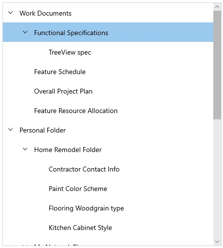
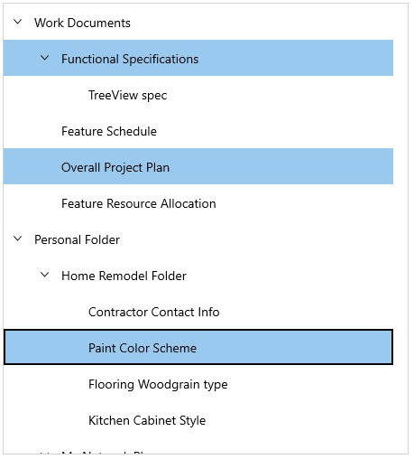

# MVVM in WinUI TreeView 

This section explains about how to work with MVVM pattern in [TreeView](https://help.syncfusion.com/cr/winui/Syncfusion.UI.Xaml.TreeView.SfTreeView.html).

## Binding properties in MVVM pattern

### Binding SelectedItem

The `TreeView` provides support to select the items through binding the [SelectedItem](https://help.syncfusion.com/cr/winui/Syncfusion.UI.Xaml.TreeView.SfTreeView.html#Syncfusion_UI_Xaml_TreeView_SfTreeView_SelectedItem) property from view model by implementing the `INotifyPropertyChanged` interface that gives the call back notification to UI.




<Page x:Class="syncfusion.treeviewdemos.winui.GettingStartedPage"
      xmlns="http://schemas.microsoft.com/winfx/2006/xaml/presentation"
      xmlns:x="http://schemas.microsoft.com/winfx/2006/xaml"
      xmlns:d="http://schemas.microsoft.com/expression/blend/2008"
      xmlns:mc="http://schemas.openxmlformats.org/markup-compatibility/2006"
      xmlns:local="using:syncfusion.treeviewdemos.winui"
      xmlns:syncfusion="using:Syncfusion.UI.Xaml.TreeView"
      mc:Ignorable="d"
      Background="{ThemeResource ApplicationPageBackgroundThemeBrush}"
      NavigationCacheMode="Disabled">

<Page.DataContext>
        <local:SelectionViewModel />
</Page.DataContext>

<Grid>
    <syncfusion:SfTreeView x:Name="treeView"
                           AutoExpandMode="AllNodes" 
                           ChildPropertyName="Childs"                                            
                           ItemsSource="{Binding Collections}"
                           SelectedItem="{Binding SelectedNode}">
                <syncfusion:SfTreeView.ItemTemplate>
                    <DataTemplate>
                        <Grid >
                            <TextBlock Text="{Binding Header}"
                                        VerticalAlignment="Center" />
                        </Grid>
                    </DataTemplate>
                </syncfusion:SfTreeView.ItemTemplate>
    </syncfusion:SfTreeView>
</Grid>
</Page>



treeView.SetBinding(SfTreeView.SelectedItemProperty, new Binding("SelectedNode"));






public class SelectionViewModel : NotificationObject
{
  
    public SelectionViewModel()
    {
        Collections = new ObservableCollection<SelectionModel>();
        PopulateCollections();
    }
   
    public ObservableCollection<SelectionModel> Collections { get; internal set; }

    public object SelectedNode { get; internal set; }
   
    void PopulateCollections()
    {
        var RootNode1 = new SelectionModel { Header = "Work Documents"};
        var RootNode2 = new SelectionModel { Header = "Personal Folder"};

        var ChildNode1 = new SelectionModel { Header = "Functional Specifications"};
        var ChildNode2 = new SelectionModel { Header = "TreeView spec"};
        var ChildNode3 = new SelectionModel { Header = "Feature Schedule"};
        var ChildNode4 = new SelectionModel { Header = "Overall Project Plan"};
        var ChildNode5 = new SelectionModel { Header = "Feature Resource Allocation"};
        var ChildNode6 = new SelectionModel { Header = "Home Remodel Folder"};
        var ChildNode7 = new SelectionModel { Header = "Contractor Contact Info"};
        var ChildNode8 = new SelectionModel { Header = "Paint Color Scheme"};
        var ChildNode9 = new SelectionModel { Header = "Flooring Woodgrain type"};
        var ChildNode10 = new SelectionModel { Header = "Kitchen Cabinet Style"};

        var ChildNode11 = new SelectionModel { Header = "My Network Places"};
        var ChildNode12 = new SelectionModel { Header = "Server"};
        var ChildNode13 = new SelectionModel { Header = "My Folders"};

        var ChildNode14 = new SelectionModel { Header = "My Computer" };
        var ChildNode15 = new SelectionModel { Header = "Music"};
        var ChildNode16 = new SelectionModel { Header = "Videos"};
        var ChildNode17 = new SelectionModel { Header = "Wallpaper.png"};
        var ChildNode18 = new SelectionModel { Header = "My Banner.png"};

        var ChildNode19 = new SelectionModel { Header = "Favourites"};
        var ChildNode20 = new SelectionModel { Header = "Image3.png"};
        var ChildNode21 = new SelectionModel { Header = "Image4.png"};
        var ChildNode22 = new SelectionModel { Header = "Image5.png"};

        var ChildNode23 = new SelectionModel { Header = "Image1.png"};
        var ChildNode24 = new SelectionModel { Header = "Image2.png"};

        RootNode1.Childs.Add(ChildNode1);
        RootNode1.Childs.Add(ChildNode3);
        RootNode1.Childs.Add(ChildNode4);
        RootNode1.Childs.Add(ChildNode5);
        RootNode2.Childs.Add(ChildNode6);

        RootNode2.Childs.Add(ChildNode11);
        RootNode2.Childs.Add(ChildNode14);
        RootNode2.Childs.Add(ChildNode19);

        ChildNode1.Childs.Add(ChildNode2);
        ChildNode6.Childs.Add(ChildNode7);
        ChildNode6.Childs.Add(ChildNode8);
        ChildNode6.Childs.Add(ChildNode9);
        ChildNode6.Childs.Add(ChildNode10);
        ChildNode11.Childs.Add(ChildNode12);
        ChildNode11.Childs.Add(ChildNode13);
            
        ChildNode11.Childs.Add(ChildNode23);
        ChildNode11.Childs.Add(ChildNode24);

        ChildNode14.Childs.Add(ChildNode15);
        ChildNode14.Childs.Add(ChildNode16);
        ChildNode14.Childs.Add(ChildNode17);
        ChildNode14.Childs.Add(ChildNode18);

        ChildNode19.Childs.Add(ChildNode20);
        ChildNode19.Childs.Add(ChildNode21);
        ChildNode19.Childs.Add(ChildNode22);

        SelectedNode = ChildNode1;
        Collections.Add(RootNode1);
        Collections.Add(RootNode2);
    }
}




public class SelectionModel : NotificationObject
{
    
    private string header = string.Empty;
   
    private ObservableCollection<SelectionModel> childs;
 
    public SelectionModel()
    {
        Childs = new ObservableCollection<SelectionModel>();
    }
       
    public string Header
    {
        get
        {
            return header;
        }
        set
        {
            header = value;
            this.RaisePropertyChanged(nameof(Header));
        }
    }
          
    public ObservableCollection<SelectionModel> Childs
    {
        get
        {
            return childs;
        }
        internal set
        {
            childs = value;
            this.RaisePropertyChanged(nameof(Childs));
        }
    }      
}




### Binding SelectedItems

The `TreeView` supports to select multiple items through binding the [SelectedItems](https://help.syncfusion.com/cr/winui/Syncfusion.UI.Xaml.TreeView.SfTreeView.html#Syncfusion_UI_Xaml_TreeView_SfTreeView_SelectedItems) property from view model with `ObservableCollection<object>` type. 



<Page x:Class="syncfusion.treeviewdemos.winui.GettingStartedPage"
      xmlns="http://schemas.microsoft.com/winfx/2006/xaml/presentation"
      xmlns:x="http://schemas.microsoft.com/winfx/2006/xaml"
      xmlns:d="http://schemas.microsoft.com/expression/blend/2008"
      xmlns:mc="http://schemas.openxmlformats.org/markup-compatibility/2006"
      xmlns:local="using:syncfusion.treeviewdemos.winui"
      xmlns:syncfusion="using:Syncfusion.UI.Xaml.TreeView"
      mc:Ignorable="d"
      Background="{ThemeResource ApplicationPageBackgroundThemeBrush}"
      NavigationCacheMode="Disabled">

<Page.DataContext>
        <local:SelectionViewModel />
</Page.DataContext>

<Grid>
    <syncfusion:SfTreeView x:Name="treeView"
                            AutoExpandMode="AllNodes" 
                            ChildPropertyName="Childs"                                            
                            ItemsSource="{Binding Collections}"
                            SelectedItems="{Binding SelectedNodes}"
                            SelectionMode="Multiple">
                <syncfusion:SfTreeView.ItemTemplate>
                    <DataTemplate>
                        <Grid>
                            <TextBlock Text="{Binding Header}"
                                       VerticalAlignment="Center" />
                        </Grid>
                    </DataTemplate>
                </syncfusion:SfTreeView.ItemTemplate>
    </syncfusion:SfTreeView>
</Grid>
</Page>



treeView.SelectionMode = SelectionMode.Multiple;
treeView.SetBinding(SfTreeView.SelectedItemsProperty, new Binding("SelectedNodes"));






public class SelectionViewModel : NotificationObject
{
  
    public SelectionViewModel()
    {
        Collections = new ObservableCollection<SelectionModel>();
        PopulateCollections();
    }
   
    public ObservableCollection<SelectionModel> Collections { get; internal set; }

    public ObservableCollection<object> SelectedNodes { get; internal set; }
   
    void PopulateCollections()
    {
        var RootNode1 = new SelectionModel { Header = "Work Documents"};
        var RootNode2 = new SelectionModel { Header = "Personal Folder"};

        var ChildNode1 = new SelectionModel { Header = "Functional Specifications"};
        var ChildNode2 = new SelectionModel { Header = "TreeView spec"};
        var ChildNode3 = new SelectionModel { Header = "Feature Schedule"};
        var ChildNode4 = new SelectionModel { Header = "Overall Project Plan"};
        var ChildNode5 = new SelectionModel { Header = "Feature Resource Allocation"};
        var ChildNode6 = new SelectionModel { Header = "Home Remodel Folder"};
        var ChildNode7 = new SelectionModel { Header = "Contractor Contact Info"};
        var ChildNode8 = new SelectionModel { Header = "Paint Color Scheme"};
        var ChildNode9 = new SelectionModel { Header = "Flooring Woodgrain type"};
        var ChildNode10 = new SelectionModel { Header = "Kitchen Cabinet Style"};

        var ChildNode11 = new SelectionModel { Header = "My Network Places"};
        var ChildNode12 = new SelectionModel { Header = "Server"};
        var ChildNode13 = new SelectionModel { Header = "My Folders"};

        var ChildNode14 = new SelectionModel { Header = "My Computer" };
        var ChildNode15 = new SelectionModel { Header = "Music"};
        var ChildNode16 = new SelectionModel { Header = "Videos"};
        var ChildNode17 = new SelectionModel { Header = "Wallpaper.png"};
        var ChildNode18 = new SelectionModel { Header = "My Banner.png"};

        var ChildNode19 = new SelectionModel { Header = "Favourites"};
        var ChildNode20 = new SelectionModel { Header = "Image3.png"};
        var ChildNode21 = new SelectionModel { Header = "Image4.png"};
        var ChildNode22 = new SelectionModel { Header = "Image5.png"};

        var ChildNode23 = new SelectionModel { Header = "Image1.png"};
        var ChildNode24 = new SelectionModel { Header = "Image2.png"};

        RootNode1.Childs.Add(ChildNode1);
        RootNode1.Childs.Add(ChildNode3);
        RootNode1.Childs.Add(ChildNode4);
        RootNode1.Childs.Add(ChildNode5);
        RootNode2.Childs.Add(ChildNode6);

        RootNode2.Childs.Add(ChildNode11);
        RootNode2.Childs.Add(ChildNode14);
        RootNode2.Childs.Add(ChildNode19);

        ChildNode1.Childs.Add(ChildNode2);
        ChildNode6.Childs.Add(ChildNode7);
        ChildNode6.Childs.Add(ChildNode8);
        ChildNode6.Childs.Add(ChildNode9);
        ChildNode6.Childs.Add(ChildNode10);
        ChildNode11.Childs.Add(ChildNode12);
        ChildNode11.Childs.Add(ChildNode13);
            
        ChildNode11.Childs.Add(ChildNode23);
        ChildNode11.Childs.Add(ChildNode24);

        ChildNode14.Childs.Add(ChildNode15);
        ChildNode14.Childs.Add(ChildNode16);
        ChildNode14.Childs.Add(ChildNode17);
        ChildNode14.Childs.Add(ChildNode18);

        ChildNode19.Childs.Add(ChildNode20);
        ChildNode19.Childs.Add(ChildNode21);
        ChildNode19.Childs.Add(ChildNode22);

        SelectedNodes = new ObservableCollection<object>();
        SelectedNodes.Add(ChildNode1);
        SelectedNodes.Add(ChildNode4);
        SelectedNodes.Add(ChildNode8);
            
        Collections.Add(RootNode1);
        Collections.Add(RootNode2);
    }
}




public class SelectionModel : NotificationObject
{
    
    private string header = string.Empty;
   
    private ObservableCollection<SelectionModel> childs;
 
    public SelectionModel()
    {
        Childs = new ObservableCollection<SelectionModel>();
    }
       
    public string Header
    {
        get
        {
            return header;
        }
        set
        {
            header = value;
            this.RaisePropertyChanged(nameof(Header));
        }
    }
          
    public ObservableCollection<SelectionModel> Childs
    {
        get
        {
            return childs;
        }
        internal set
        {
            childs = value;
            this.RaisePropertyChanged(nameof(Childs));
        }
    }      
}




N> [View sample in GitHub](https://github.com/SyncfusionExamples/syncfusion-winui-treeview-examples/tree/main/Samples/MVVM-with-Selection)

