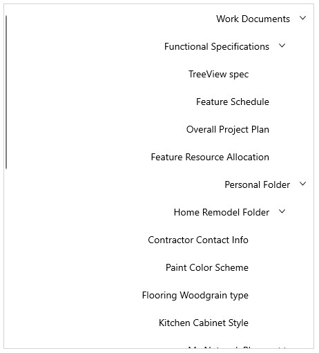

# Right to left(RTL) in WinUI TreeView 

The [TreeView](https://help.syncfusion.com/cr/winui/Syncfusion.UI.Xaml.TreeView.SfTreeView.html) supports to change the flow of text to the right-to-left direction by setting the [FlowDirection](https://docs.microsoft.com/en-us/uwp/api/windows.ui.xaml.frameworkelement.flowdirection?view=winrt-19041) to `RightToLeft`. 




<syncfusion:SfTreeView x:Name="treeView" FlowDirection="RightToLeft"/>




treeView.FlowDirection = FlowDirection.RightToLeft;




