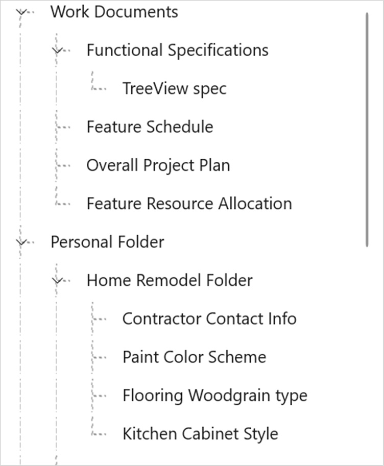
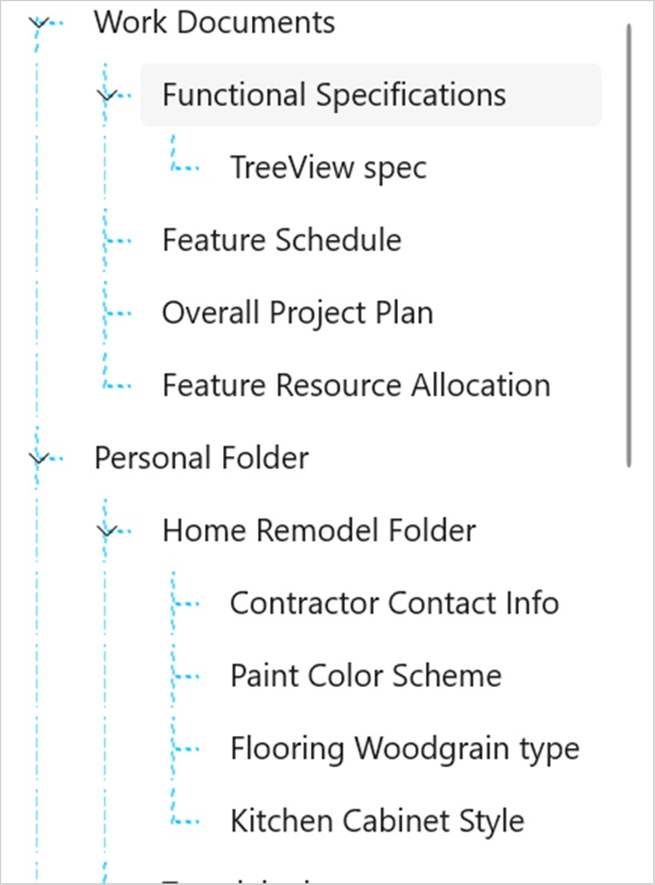

# Tree Lines in WinUI TreeView

The [TreeView](https://help.syncfusion.com/cr/winui/Syncfusion.UI.Xaml.TreeView.SfTreeView.html) allows to show the tree lines for treeview nodes by enabling the [ShowLines](https://help.syncfusion.com/cr/winui/Syncfusion.UI.Xaml.TreeView.SfTreeView.html#Syncfusion_UI_Xaml_TreeView_SfTreeView_ShowLines) property as `true`. The default value is `false`.



<treeView:SfTreeView Name="treeView" ShowLines="True" />


treeView.ShowLines = true;



## Enable tree line for root nodes

The `TreeView` also supports to show the tree lines for root nodes by enabling the [ShowRootLines](https://help.syncfusion.com/cr/winui/Syncfusion.UI.Xaml.TreeView.SfTreeView.html#Syncfusion_UI_Xaml_TreeView_SfTreeView_ShowRootLines) property as `true`. The default value is `false`.



<treeView:SfTreeView Name="treeView"    
                       ShowLines="True"
                       ShowRootLines="True" />


treeView.ShowLines = true;
treeView.ShowRootLines = true;



## Customizing the tree lines

### Customizing the line color
The `TreeView` allows to change the color of tree lines by using the [LineStroke](https://help.syncfusion.com/cr/winui/Syncfusion.UI.Xaml.TreeView.SfTreeView.html#Syncfusion_UI_Xaml_TreeView_SfTreeView_LineStroke) property. The default value is `SystemBaseMediumLowColor`.



<treeView:SfTreeView Name="treeView"    
                       ShowLines="True"
                       ShowRootLines="True"
                       LineStroke="DeepSkyBlue" />


treeView.ShowLines = true;
treeView.ShowRootLines = true;
treeView.LineStroke = new SolidColorBrush(Colors.DeepSkyBlue);



### Customizing the line thickness
The `TreeView` allows to change the thickness of tree lines by using the [LineStrokeThickness](https://help.syncfusion.com/cr/winui/Syncfusion.UI.Xaml.TreeView.SfTreeView.html#Syncfusion_UI_Xaml_TreeView_SfTreeView_LineStrokeThickness) property. The default value is `1`.



<treeView:SfTreeView Name="treeView"           
                       ShowLines="True"
                       ShowRootLines="True"
                       LineStrokeThickness="1.5" />        


treeView.ShowLines = true;
treeView.ShowRootLines = true;
treeView.LineStrokeThickness = 1.5;



