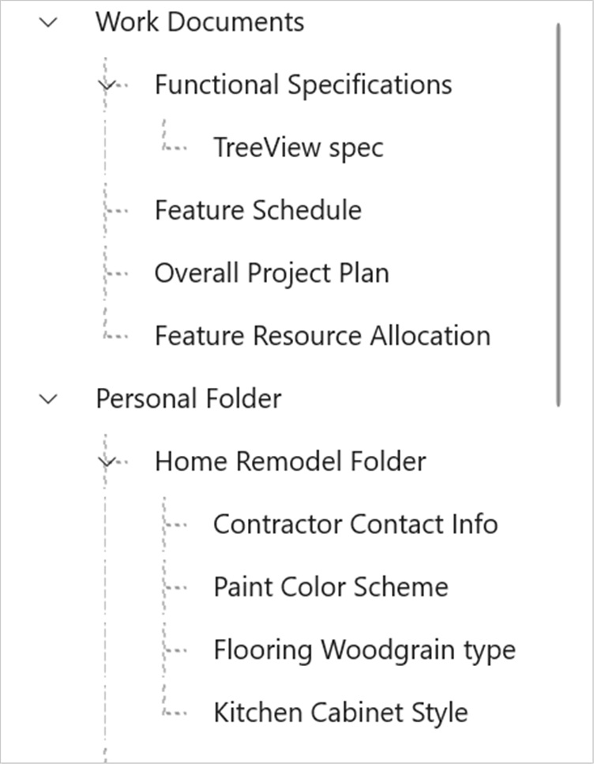
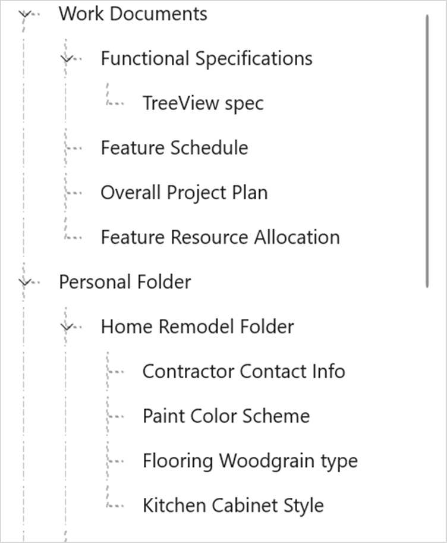
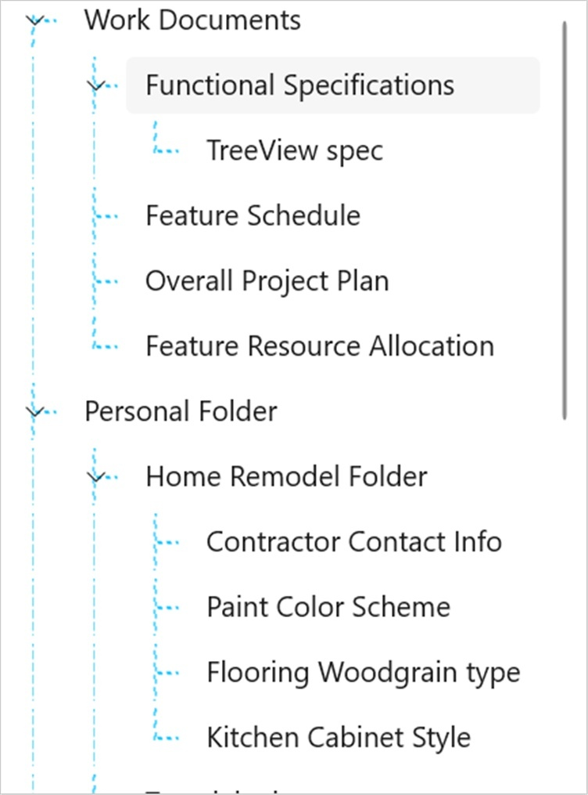

# Tree Lines in WinUI TreeView

The [TreeView](https://help.syncfusion.com/cr/winui/Syncfusion.UI.Xaml.TreeView.SfTreeView.html) allows you to show the tree lines for TreeView nodes by setting the [ShowLines](https://help.syncfusion.com/cr/winui/Syncfusion.UI.Xaml.TreeView.SfTreeView.html#Syncfusion_UI_Xaml_TreeView_SfTreeView_ShowLines) property to `true`. The default value is `false`.



<treeView:SfTreeView Name="treeView" ShowLines="True" />


treeView.ShowLines = true;



## Enable tree lines for root nodes

The `TreeView` also supports showing tree lines for root nodes by setting the [ShowRootLines](https://help.syncfusion.com/cr/winui/Syncfusion.UI.Xaml.TreeView.SfTreeView.html#Syncfusion_UI_Xaml_TreeView_SfTreeView_ShowRootLines) property to `true`. The default value is `false`.



<treeView:SfTreeView Name="treeView"    
                       ShowLines="True"
                       ShowRootLines="True" />


treeView.ShowLines = true;
treeView.ShowRootLines = true;



## Customizing the tree lines

### Customizing the line color
The `TreeView` allows you to change the color of tree lines by using the [LineStroke](https://help.syncfusion.com/cr/winui/Syncfusion.UI.Xaml.TreeView.SfTreeView.html#Syncfusion_UI_Xaml_TreeView_SfTreeView_LineStroke) property. The default value is a brush based on the system `BaseMediumLow` color.



<treeView:SfTreeView Name="treeView"    
                       ShowLines="True"
                       ShowRootLines="True"
                       LineStroke="DeepSkyBlue" />


treeView.ShowLines = true;
treeView.ShowRootLines = true;
treeView.LineStroke = new SolidColorBrush(Colors.DeepSkyBlue);



### Customizing the line thickness
The `TreeView` allows you to change the thickness of tree lines by using the [LineStrokeThickness](https://help.syncfusion.com/cr/winui/Syncfusion.UI.Xaml.TreeView.SfTreeView.html#Syncfusion_UI_Xaml_TreeView_SfTreeView_LineStrokeThickness) property. The default value is `1`.



<treeView:SfTreeView Name="treeView"           
                       ShowLines="True"
                       ShowRootLines="True"
                       LineStrokeThickness="1.5" />        


treeView.ShowLines = true;
treeView.ShowRootLines = true;
treeView.LineStrokeThickness = 1.5;



