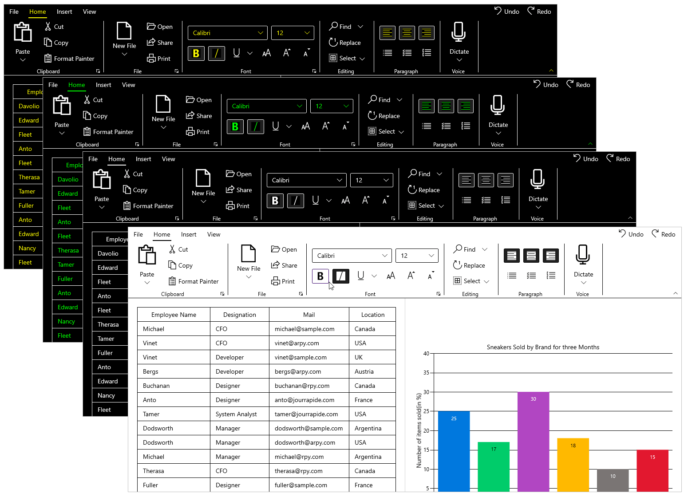

# Accessibility for Syncfusion WinUI Controls

Accessibility is about making a windows application usable in a wide range of environment by people who use technology and approach an UI with a wide range of experiences. There are many different types of disabilities in the world including mobility, vision, color perception, hearing, speech, cognition, and literacy. However, these requirements can be met by utilizing the accessibility features of Syncfusion UI WinUI controls. The controls support assistive technologies like screen readers, which take advantage of accessibility frameworks.

The sections below explains the accessibility features.

## UI automation

The Syncfusion WinUI control provides accessibility for the UI automation framework as well as support provided by base classes derived from `FrameworkElementAutomationPeer`. The control class uses the UI automation concepts of automation peers and automation patterns that report the control's role and content to UI automation clients.

A user can use a tool like screen readers to obtain the necessary information about the controls from UI Automation. When a control receives focus, the screen reader reads the text associated with that control. 

## Keyboard support

Syncfusion WinUI controls provides keyboard support including tab navigation, text input, and control-specific support. For example, the `SfTreeView` control supports arrow-key navigation for item selection.

## High contrast themes

The Windows operating system and applications support all the high contrast themes that users can enable and these themes make the controls more efficient to see and are especially useful for people with limited vision.

