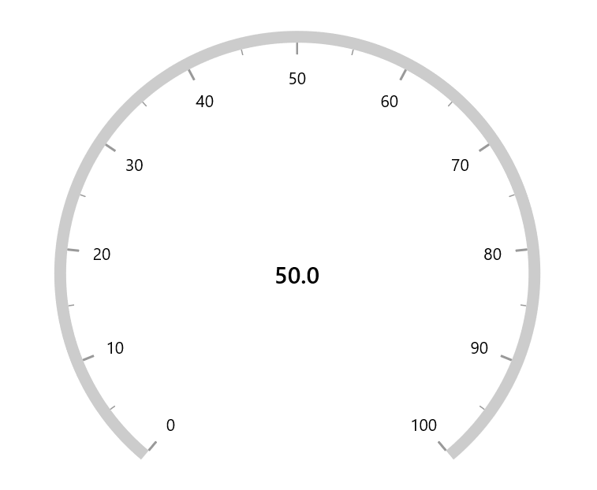
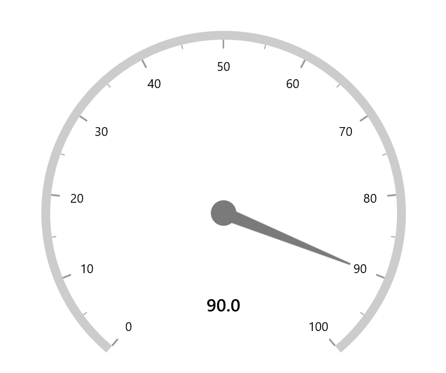
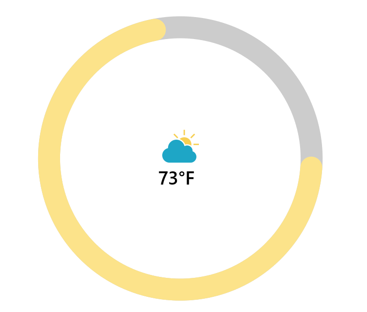
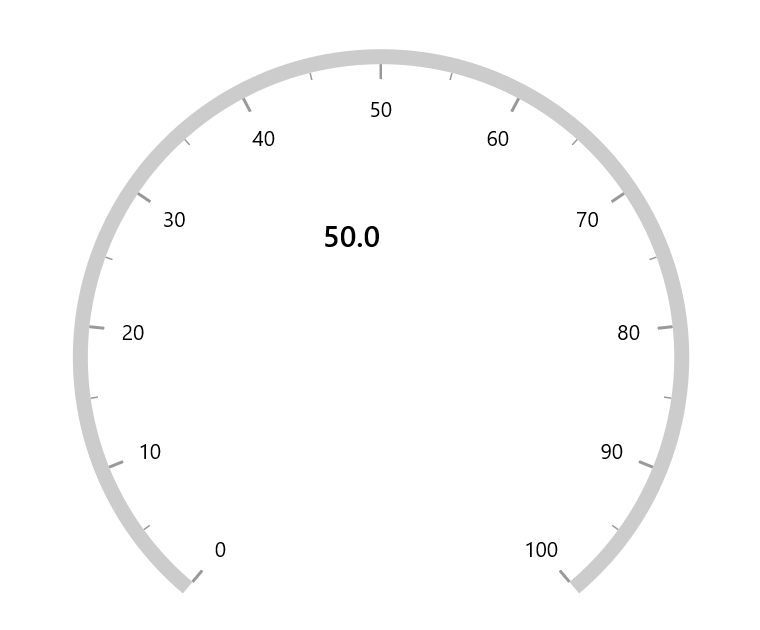
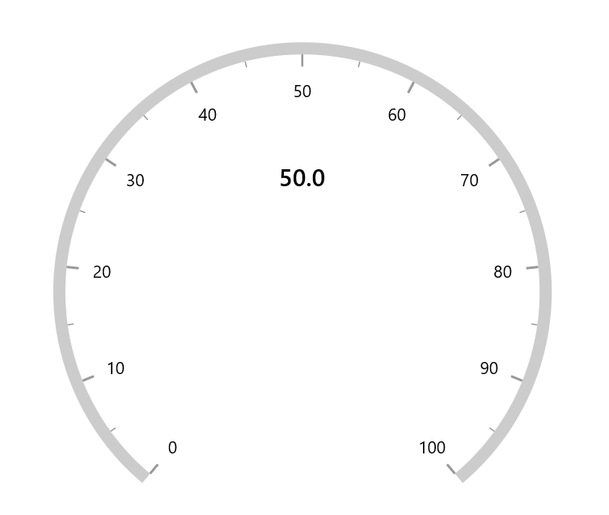

# Annotation in WinUI Radial Gauge (SfRadialGauge)

`Radial axis` allows you to add multiple controls such as text, icon and image etc., as an annotation to a specific point of interest in the radial gauge.

The following properties are available in `Annotation` to customizes the position and alignment.

* `DirectionValue` –  Specifies the value that indicates the direction of the annotation based on `DirectionUnit` property. 

* `DirectionUnit` – Specifies the value that indicates the direction of the annotation to be calculated on the basis of `axis value` or `angle`.

* `PositionFactor` – Specifies the factor value(from 0 to 1) to adjusts the annotation distance from center point.

* `HorizontalAlignment` – Specifies the horizontal alignment for positioning the annotation.

* `VerticalAlignment` – Specifies the vertical alignment for positioning the annotation.





<Page.Resources>
    <DataTemplate x:Name="annotationTemplate">
        <TextBlock Text="50.0"
                   FontWeight="SemiBold"
                   FontSize="20" />
    </DataTemplate>
</Page.Resources>

<gauge:SfRadialGauge>
    <gauge:SfRadialGauge.Axes>
        <gauge:RadialAxis>
            <gauge:RadialAxis.Annotations>
                <gauge:GaugeAnnotation DirectionUnit="AxisValue"
                                       DirectionValue="50"
                                       ContentTemplate="{StaticResource annotationTemplate}">
                </gauge:GaugeAnnotation>
            </gauge:RadialAxis.Annotations>
        </gauge:RadialAxis>
    </gauge:SfRadialGauge.Axes>
</gauge:SfRadialGauge>





SfRadialGauge sfRadialGauge = new SfRadialGauge();

RadialAxis radialAxis = new RadialAxis();
sfRadialGauge.Axes.Add(radialAxis);

GaugeAnnotation gaugeAnnotation = new GaugeAnnotation();
gaugeAnnotation.DirectionUnit = AnnotationDirection.AxisValue;
gaugeAnnotation.DirectionValue = 50;
gaugeAnnotation.ContentTemplate = this.Resources["annotationTemplate"] as DataTemplate;
radialAxis.Annotations.Add(gaugeAnnotation);

this.Content = sfRadialGauge;





**Positioning annotation**

The annotation can be positioned using either the `Angle` or the `Axis value`. It can be controlled by the `DirectionUnit` property of `Annotation`. The default value is `Angle`.

**Positioning annotation using angle**

The following example shows how to position the annotation using angle.





<Page.Resources>
    <DataTemplate x:Name="annotationTemplate">
        <TextBlock Text="90.0"
                   FontWeight="SemiBold"
                   FontSize="20" />
    </DataTemplate>
</Page.Resources>

<gauge:SfRadialGauge>
    <gauge:SfRadialGauge.Axes>
        <gauge:RadialAxis>
            <gauge:RadialAxis.Pointers>
                <gauge:NeedlePointer Value="90" />
            </gauge:RadialAxis.Pointers>
            <gauge:RadialAxis.Annotations>
                <gauge:GaugeAnnotation DirectionValue="90"
                                       PositionFactor="0.5"
                                       ContentTemplate="{StaticResource annotationTemplate}">
                </gauge:GaugeAnnotation>
            </gauge:RadialAxis.Annotations>
        </gauge:RadialAxis>
    </gauge:SfRadialGauge.Axes>
</gauge:SfRadialGauge>





SfRadialGauge sfRadialGauge = new SfRadialGauge();

RadialAxis radialAxis = new RadialAxis();
sfRadialGauge.Axes.Add(radialAxis);

NeedlePointer needlePointer = new NeedlePointer();
needlePointer.Value = 90;
radialAxis.Pointers.Add(needlePointer);

GaugeAnnotation gaugeAnnotation = new GaugeAnnotation();
gaugeAnnotation.DirectionValue = 90;
gaugeAnnotation.PositionFactor = 0.5;
gaugeAnnotation.ContentTemplate = this.Resources["annotationTemplate"] as DataTemplate;
radialAxis.Annotations.Add(gaugeAnnotation);

this.Content = sfRadialGauge;





**Positioning annotation using axis value**

The following example shows how to position the annotation using axis value.





<Page.Resources>
    <DataTemplate x:Name="annotationTemplate">
        <TextBlock Text="50.0"
                   FontWeight="SemiBold"
                   FontSize="20" />
    </DataTemplate>
</Page.Resources>

<gauge:SfRadialGauge>
    <gauge:SfRadialGauge.Axes>
        <gauge:RadialAxis>
            <gauge:RadialAxis.Annotations>
                <gauge:GaugeAnnotation DirectionUnit="AxisValue"
                                       DirectionValue="50"
                                       PositionFactor="0.4"
                                       ContentTemplate="{StaticResource annotationTemplate}">
                </gauge:GaugeAnnotation>
            </gauge:RadialAxis.Annotations>
        </gauge:RadialAxis>
    </gauge:SfRadialGauge.Axes>
</gauge:SfRadialGauge>





SfRadialGauge sfRadialGauge = new SfRadialGauge();

RadialAxis radialAxis = new RadialAxis();
sfRadialGauge.Axes.Add(radialAxis);

GaugeAnnotation gaugeAnnotation = new GaugeAnnotation();
gaugeAnnotation.DirectionUnit = AnnotationDirection.AxisValue;
gaugeAnnotation.DirectionValue = 50;
gaugeAnnotation.PositionFactor = 0.4;
gaugeAnnotation.ContentTemplate = this.Resources["annotationTemplate"] as DataTemplate;
radialAxis.Annotations.Add(gaugeAnnotation);

this.Content = sfRadialGauge;





`PositionFactor` is used to move the annotation from the center of axis to the edge of the axis. For example, when you specify the `positionFactor` as 0.5, the annotation will be moved from the center towards the corresponding direction with the distance of half of the radius value of axis.

By default, the value of `positionFactor` is 0.

## Setting image for annotation

Annotations provide options to add any image over the gauge control with respect to its offset position. You can add multiple images in a single control.





<Page.Resources>
    <DataTemplate x:Name="annotationTemplate">
        <Grid>
            <Grid.RowDefinitions>
                <RowDefinition Height="*" />
                <RowDefinition Height="Auto" />
            </Grid.RowDefinitions>
            <Image Source="CloudDownload.png"
                   Height="50"
                   Width="60" />
            <TextBlock Text="73°F"
                       Grid.Row="1"
                       FontSize="25"
                       FontWeight="SemiBold"
                       VerticalAlignment="Top"
                       HorizontalAlignment="Left" />
        </Grid>
    </DataTemplate>
</Page.Resources>

<gauge:SfRadialGauge>
    <gauge:SfRadialGauge.Axes>
        <gauge:RadialAxis Interval="10"
                          StartAngle="0"
                          EndAngle="360"
                          ShowTicks="False"
                          ShowLabels="False"
                          AxisLineWidth="30">

            <gauge:RadialAxis.Pointers>
                <gauge:RangePointer Value="73"
                                    PointerWidth="30"
                                    EnableAnimation="True"
                                    Background="#FFFCE38A"
                                    CornerStyle="BothCurve" />
            </gauge:RadialAxis.Pointers>

            <gauge:RadialAxis.Annotations>
                <gauge:GaugeAnnotation ContentTemplate="{StaticResource annotationTemplate}" />
            </gauge:RadialAxis.Annotations>

        </gauge:RadialAxis>
    </gauge:SfRadialGauge.Axes>
</gauge:SfRadialGauge>





SfRadialGauge sfRadialGauge = new SfRadialGauge();

RadialAxis radialAxis = new RadialAxis();
radialAxis.Interval = 10;
radialAxis.StartAngle = 0;
radialAxis.EndAngle = 360;
radialAxis.ShowTicks = false;
radialAxis.ShowLabels = false;
radialAxis.AxisLineWidth = 30;
sfRadialGauge.Axes.Add(radialAxis);

RangePointer rangePointer = new RangePointer();
rangePointer.Value = 73;
rangePointer.PointerWidth = 30;
rangePointer.EnableAnimation = true;
rangePointer.Background = new SolidColorBrush(Color.FromArgb(255, 252, 227, 138));
rangePointer.CornerStyle = CornerStyle.BothCurve;
radialAxis.Pointers.Add(rangePointer);

GaugeAnnotation gaugeAnnotation = new GaugeAnnotation();
gaugeAnnotation.ContentTemplate = this.Resources["annotationTemplate"] as DataTemplate;
radialAxis.Annotations.Add(gaugeAnnotation);

this.Content = sfRadialGauge;





## Alignment of annotation

`Annotation` can be aligned to center, near and far using the `HorizontalAlignment` and `VerticalAlignment` properties of annotation.

The following code example demonstrates how to set the `HorizontalAlignment` for annotation





<gauge:SfRadialGauge>
    <gauge:SfRadialGauge.Axes>
        <gauge:RadialAxis>
            <gauge:RadialAxis.Annotations>
                <gauge:GaugeAnnotation DirectionUnit="AxisValue"
                                       DirectionValue="50"
                                       PositionFactor="0.4"
                                       HorizontalAlignment="Left"
                                       ContentTemplate="{StaticResource annotationTemplate}" />
            </gauge:RadialAxis.Annotations>
        </gauge:RadialAxis>
    </gauge:SfRadialGauge.Axes>
</gauge:SfRadialGauge>





SfRadialGauge sfRadialGauge = new SfRadialGauge();

RadialAxis radialAxis = new RadialAxis();
sfRadialGauge.Axes.Add(radialAxis);

GaugeAnnotation gaugeAnnotation = new GaugeAnnotation();
gaugeAnnotation.DirectionUnit = AnnotationDirection.AxisValue;
gaugeAnnotation.DirectionValue = 50;
gaugeAnnotation.HorizontalAlignment = HorizontalAlignment.Left;
gaugeAnnotation.PositionFactor = 0.4;
gaugeAnnotation.ContentTemplate = this.Resources["annotationTemplate"] as DataTemplate;
radialAxis.Annotations.Add(gaugeAnnotation);

this.Content = sfRadialGauge;





The following code example demonstrates how to set `VerticalAlignment` for annotation,





<Page.Resources>
    <DataTemplate x:Name="annotationTemplate">
        <TextBlock Text="50.0"
                   FontWeight="SemiBold"
                   FontSize="20" />
    </DataTemplate>
</Page.Resources>

<gauge:SfRadialGauge>
    <gauge:SfRadialGauge.Axes>
        <gauge:RadialAxis>
            <gauge:RadialAxis.Annotations>
                <gauge:GaugeAnnotation DirectionUnit="AxisValue"
                                       DirectionValue="50"
                                       PositionFactor="0.4"
                                       VerticalAlignment="Top"
                                       ContentTemplate="{StaticResource annotationTemplate}" />
            </gauge:RadialAxis.Annotations>
        </gauge:RadialAxis>
    </gauge:SfRadialGauge.Axes>
</gauge:SfRadialGauge>





SfRadialGauge sfRadialGauge = new SfRadialGauge();

RadialAxis radialAxis = new RadialAxis();
sfRadialGauge.Axes.Add(radialAxis);

GaugeAnnotation gaugeAnnotation = new GaugeAnnotation();
gaugeAnnotation.DirectionUnit = AnnotationDirection.AxisValue;
gaugeAnnotation.DirectionValue = 50;
gaugeAnnotation.VerticalAlignment = VerticalAlignment.Top;
gaugeAnnotation.PositionFactor = 0.4;
gaugeAnnotation.ContentTemplate = this.Resources["annotationTemplate"] as DataTemplate;
radialAxis.Annotations.Add(gaugeAnnotation);

this.Content = sfRadialGauge;





