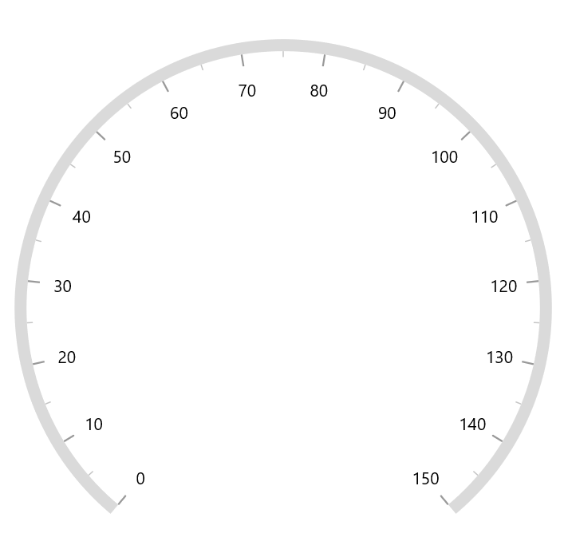
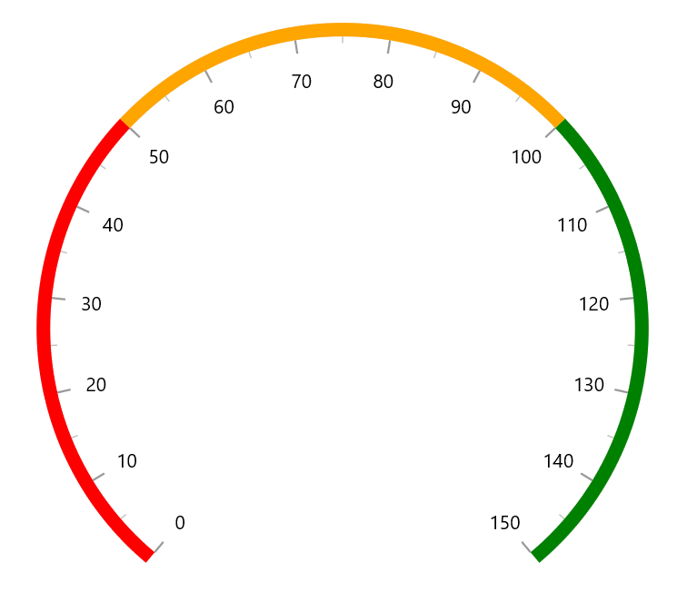
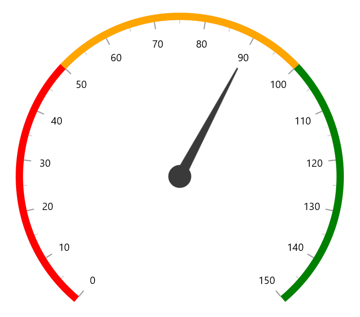
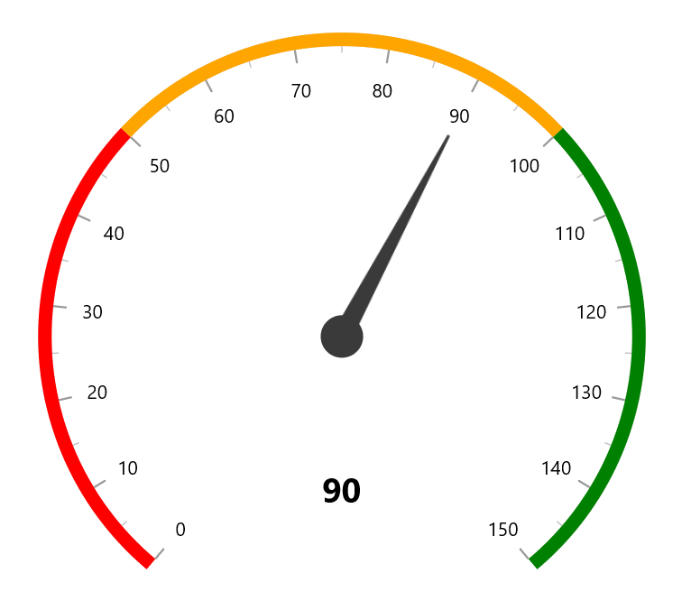

# Getting Started with WinUI Radial Gauge (SfRadialGauge)

This section explains the steps required to add the Radial Gauge control and its elements such as axis, range, pointer and annotation. This section covers only basic features needed to get started with Syncfusion radial gauge control.

## Creating an application with WinUI Radial Gauge

**1.Create new WinUI Project**

Create a simple project using the instructions given in the [Getting Started with your first WinUI app](https://docs.microsoft.com/en-us/windows/apps/winui/winui3/get-started-winui3-for-uwp) documentation.

**2.Add Syncfusion.Gauges.WinUI NuGet.**

**3.Declare namespace**

After the package has been added, declare the namespace like below





xmlns:gauge="using:Syncfusion.UI.Xaml.Gauges"





using Syncfusion.UI.Xaml.Gauges;





**4.Initialize the radial gauge control with axis**

Initialize the SfRadialGauge as a child of any control such as grid, stack panel. Axes contain a list of axis elements, where you can add any number of radial axes inside the gauge. You can specify the minimum and maximum values of axis using the `Minimum` and `Maximum` properties as demonstrated in the following code snippet.





<Grid>
    <gauge:SfRadialGauge>
        <gauge:SfRadialGauge.Axes>
            <gauge:RadialAxis Minimum="0"
                              Maximum="150" />
        </gauge:SfRadialGauge.Axes>
    </gauge:SfRadialGauge>
</Grid>





SfRadialGauge sfRadialGauge = new SfRadialGauge();
RadialAxis radialAxis = new RadialAxis();
radialAxis.Minimum = 0;
radialAxis.Maximum = 150;
sfRadialGauge.Axes.Add(radialAxis);
this.Content = sfRadialGauge;





## Add range

Ranges contain a list of range elements, where you can add any number of ranges inside the axis. You can specify the start value, end value, and background color for range using the `StartValue`, `EndValue`, and `Background` properties as demonstrated in the following code.   





<Grid>
    <gauge:SfRadialGauge>
        <gauge:SfRadialGauge.Axes>
            <gauge:RadialAxis Maximum="150"
                              Interval="10">
                <gauge:RadialAxis.Ranges>
                    <gauge:GaugeRange StartValue="0"
                                      EndValue="50"
                                      Background="Red" />
                    <gauge:GaugeRange StartValue="50"
                                      EndValue="100"
                                      Background="Orange" />
                    <gauge:GaugeRange StartValue="100"
                                      EndValue="150"
                                      Background="Green" />
                </gauge:RadialAxis.Ranges>
            </gauge:RadialAxis>
        </gauge:SfRadialGauge.Axes>
    </gauge:SfRadialGauge>
</Grid>





SfRadialGauge sfRadialGauge = new SfRadialGauge();

RadialAxis radialAxis = new RadialAxis();
radialAxis.Maximum = 150;
sfRadialGauge.Axes.Add(radialAxis);

GaugeRange gaugeRange1 = new GaugeRange();
gaugeRange1.StartValue = 0;
gaugeRange1.EndValue = 50;
gaugeRange1.Background = new SolidColorBrush(Colors.Red);
radialAxis.Ranges.Add(gaugeRange1);

GaugeRange gaugeRange2 = new GaugeRange();
gaugeRange2.StartValue = 50;
gaugeRange2.EndValue = 100;
gaugeRange2.Background = new SolidColorBrush(Colors.Orange);
radialAxis.Ranges.Add(gaugeRange2);

GaugeRange gaugeRange3 = new GaugeRange();
gaugeRange3.StartValue = 100;
gaugeRange3.EndValue = 150;
gaugeRange3.Background = new SolidColorBrush(Colors.Green);
radialAxis.Ranges.Add(gaugeRange3);

this.Content = sfRadialGauge;





## Add pointer

Pointers contains a list of pointer elements, where you can add any number of gauge pointers such as `NeedlePointer`, `RangePointer` and `MarkerPointer` inside the axis to indicate the value.





<Grid>
    <gauge:SfRadialGauge>
        <gauge:SfRadialGauge.Axes>
            <gauge:RadialAxis Maximum="150"
                              Interval="10">
                <gauge:RadialAxis.Pointers>
                    <gauge:NeedlePointer Value="90" />
                </gauge:RadialAxis.Pointers>
            </gauge:RadialAxis>
        </gauge:SfRadialGauge.Axes>
    </gauge:SfRadialGauge>
</Grid>





SfRadialGauge sfRadialGauge = new SfRadialGauge();

RadialAxis radialAxis = new RadialAxis();
radialAxis.Maximum = 150;
sfRadialGauge.Axes.Add(radialAxis);

NeedlePointer needlePointer = new NeedlePointer();
needlePointer.Value = 90;
radialAxis.Pointers.Add(needlePointer);

this.Content = sfRadialGauge;





## Add annotation

You can add any number of control such as text or image as an annotation inside the axis. The position of annotation can be customized using the `DirectionUnit` `DirectionValue` and `PositionFactor` properties as demonstrated in the following code.





<Page.Resources>
    <DataTemplate x:Name="GaugeTextTemplate">
        <Grid>
            <TextBlock Text="90"
                       FontSize="25"
                       FontWeight="Bold" />
        </Grid>
    </DataTemplate>
</Page.Resources>

<Grid>
    <gauge:SfRadialGauge>
        <gauge:SfRadialGauge.Axes>
            <gauge:RadialAxis Maximum="150"
                              Interval="10">
                <gauge:RadialAxis.Annotations>
                    <gauge:GaugeAnnotation x:Name="annotation"
                                           DirectionUnit="Angle"
                                           DirectionValue="90"
                                           PositionFactor="0.5"
                                           ContentTemplate="{StaticResource GaugeTextTemplate}">
                    </gauge:GaugeAnnotation>
                </gauge:RadialAxis.Annotations>
            </gauge:RadialAxis>
        </gauge:SfRadialGauge.Axes>
    </gauge:SfRadialGauge>
</Grid>





SfRadialGauge sfRadialGauge = new SfRadialGauge();

RadialAxis radialAxis = new RadialAxis();
radialAxis.Maximum = 150;
sfRadialGauge.Axes.Add(radialAxis);

GaugeAnnotation gaugeAnnotation = new GaugeAnnotation();
gaugeAnnotation.DirectionUnit = AnnotationDirection.Angle;
gaugeAnnotation.DirectionValue = 90;
gaugeAnnotation.PositionFactor = 0.5;
gaugeAnnotation.ContentTemplate = this.Resources["GaugeTextTemplate"] as DataTemplate;
radialAxis.Annotations.Add(gaugeAnnotation);

this.Content = sfRadialGauge;





The following code example gives you the complete code of above configurations.





<Page.Resources>
    <DataTemplate x:Name="GaugeTextTemplate">
        <Grid>
            <TextBlock Text="90"
                       FontSize="25"
                       FontWeight="Bold" />
        </Grid>
    </DataTemplate>
</Page.Resources>

<Grid>
    <gauge:SfRadialGauge>
        <gauge:SfRadialGauge.Axes>
            <gauge:RadialAxis Maximum="150"
                              Interval="10">
                <gauge:RadialAxis.Ranges>
                    <gauge:GaugeRange StartValue="0"
                                      EndValue="50"
                                      Background="Red" />
                    <gauge:GaugeRange StartValue="50"
                                      EndValue="100"
                                      Background="Orange" />
                    <gauge:GaugeRange StartValue="100"
                                      EndValue="150"
                                      Background="Green" />
                </gauge:RadialAxis.Ranges>

                <gauge:RadialAxis.Pointers>
                    <gauge:NeedlePointer Value="90" />
                </gauge:RadialAxis.Pointers>

                <gauge:RadialAxis.Annotations>
                    <gauge:GaugeAnnotation x:Name="annotation"
                                           DirectionUnit="Angle"
                                           DirectionValue="90"
                                           PositionFactor="0.5"
                                           ContentTemplate="{StaticResource GaugeTextTemplate}">
                    </gauge:GaugeAnnotation>
                </gauge:RadialAxis.Annotations>
            </gauge:RadialAxis>
        </gauge:SfRadialGauge.Axes>
    </gauge:SfRadialGauge>
</Grid>





SfRadialGauge sfRadialGauge = new SfRadialGauge();

RadialAxis radialAxis = new RadialAxis();
radialAxis.Maximum = 150;
sfRadialGauge.Axes.Add(radialAxis);

GaugeRange gaugeRange1 = new GaugeRange();
gaugeRange1.StartValue = 0;
gaugeRange1.EndValue = 50;
gaugeRange1.Background = new SolidColorBrush(Colors.Red);
radialAxis.Ranges.Add(gaugeRange1);

GaugeRange gaugeRange2 = new GaugeRange();
gaugeRange2.StartValue = 50;
gaugeRange2.EndValue = 100;
gaugeRange2.Background = new SolidColorBrush(Colors.Orange);
radialAxis.Ranges.Add(gaugeRange2);

GaugeRange gaugeRange3 = new GaugeRange();
gaugeRange3.StartValue = 100;
gaugeRange3.EndValue = 150;
gaugeRange3.Background = new SolidColorBrush(Colors.Green);
radialAxis.Ranges.Add(gaugeRange3);

NeedlePointer needlePointer = new NeedlePointer();
needlePointer.Value = 90;
radialAxis.Pointers.Add(needlePointer);

GaugeAnnotation gaugeAnnotation = new GaugeAnnotation();
gaugeAnnotation.DirectionUnit = AnnotationDirection.Angle;
gaugeAnnotation.DirectionValue = 90;
gaugeAnnotation.PositionFactor = 0.5;
gaugeAnnotation.ContentTemplate = this.Resources["GaugeTextTemplate"] as DataTemplate;
radialAxis.Annotations.Add(gaugeAnnotation);

this.Content = sfRadialGauge;



