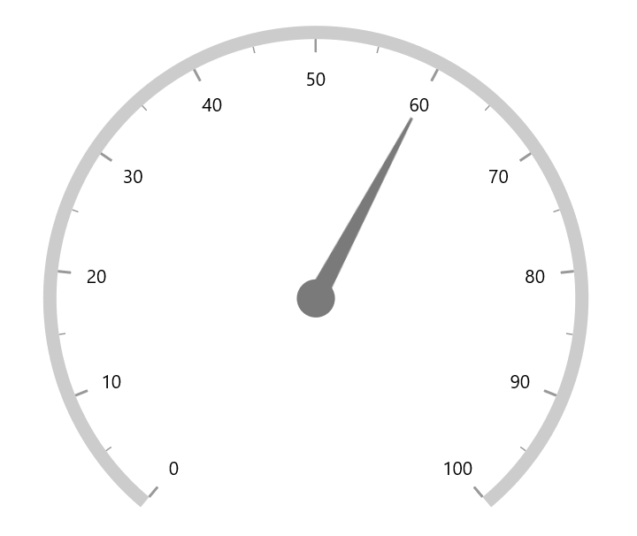
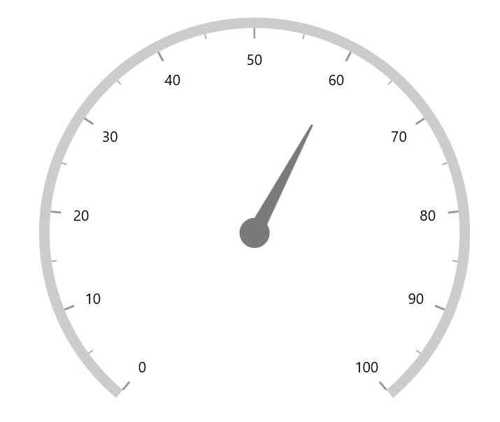
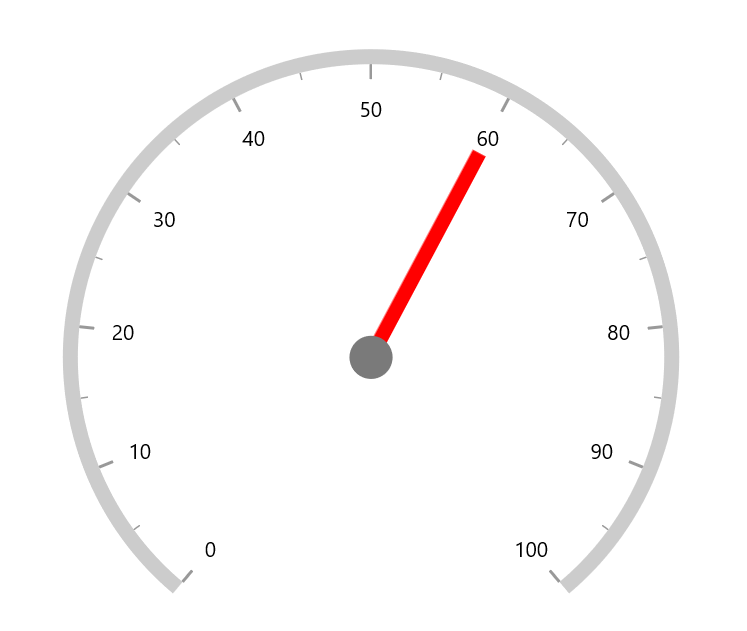
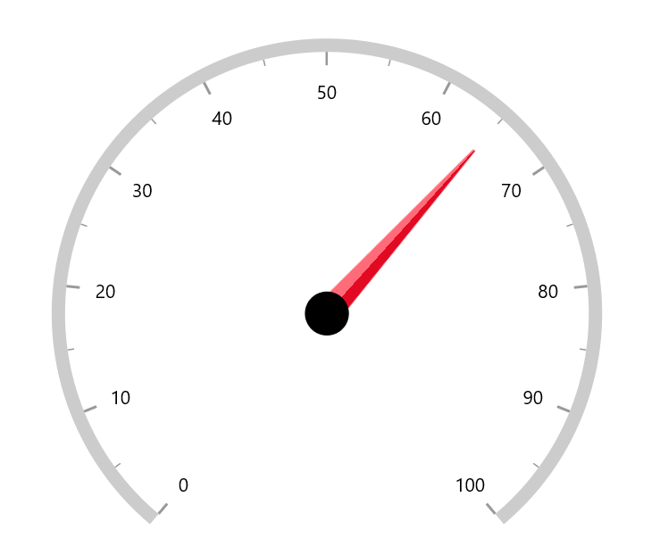
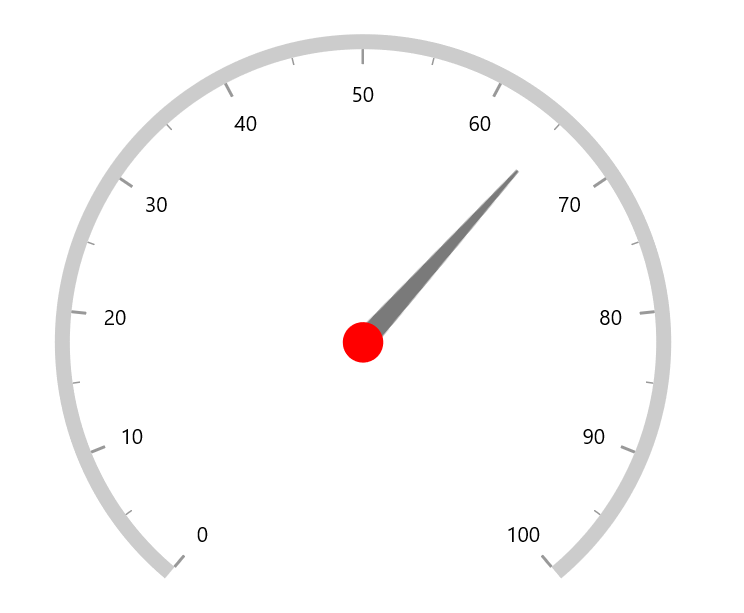
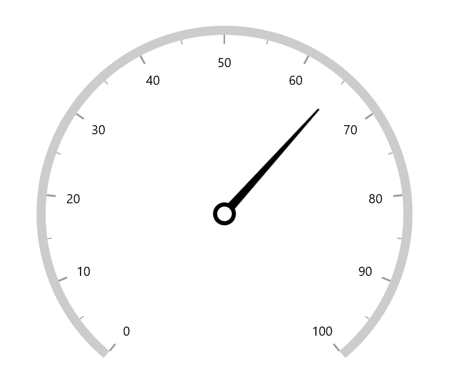
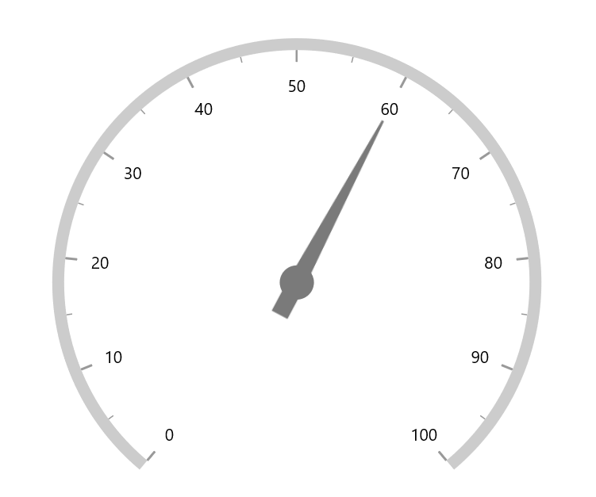
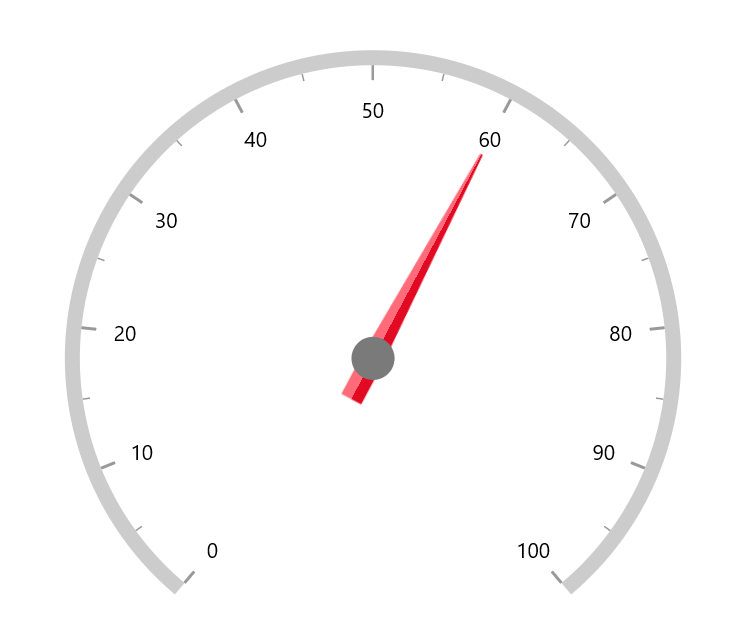

# Needle pointer customization

`Needle Pointer` contains three parts, namely needle, knob, and tail and that can be placed on a gauge to mark the values.





<gauge:SfRadialGauge>
    <gauge:SfRadialGauge.Axes>
        <gauge:RadialAxis>
            <gauge:RadialAxis.Pointers>
                <gauge:NeedlePointer Value="60" />
            </gauge:RadialAxis.Pointers>
        </gauge:RadialAxis>
    </gauge:SfRadialGauge.Axes>
</gauge:SfRadialGauge>





SfRadialGauge sfRadialGauge = new SfRadialGauge();

RadialAxis radialAxis = new RadialAxis();
sfRadialGauge.Axes.Add(radialAxis);

NeedlePointer needlePointer = new NeedlePointer();
needlePointer.Value = 60;
radialAxis.Pointers.Add(needlePointer);

this.Content = sfRadialGauge;





## Needle customization

The needle can be customized using the following properties:

* `NeedleLength` – Customizes the length of the needle. The length of the pointer can be set either in logical pixel or factor.

* `NeedleLengthUnit` – Specifies whether to set the length in logical pixel or factor. 

* `NeedleStartWidth` – Specifies the start width of the needle.

* `NeedleEndWidth` – Specifies the end width of the needle.

* `NeedleFill` – Specifies the needle color.

**Needle length customization**

The needle length can be controlled using the `NeedleLength` and `NeedleLengthUnit` properties. The length can be set either in logical pixels or factor using `NeedleLengthUnit`.

If the `NeedleLengthUnit` is set to logical pixel, the logical pixel value will be set to the `NeedleLength`
If the `NeedleLengthUnit` is set to factor, then the factor value will be set to the `NeedleLength`. The factor value ranges from 0 to 1. For example, if the needle length is set to 0.5, the half of the radius value of axis to needle length. The default value of  `NeedleLengthUnit` is SizeUnit.factor





<gauge:SfRadialGauge>
    <gauge:SfRadialGauge.Axes>
        <gauge:RadialAxis>
            <gauge:RadialAxis.Pointers>
                <gauge:NeedlePointer Value="60"
                                     NeedleLengthUnit="Pixel"
                                     NeedleLength="130" />
            </gauge:RadialAxis.Pointers>
        </gauge:RadialAxis>
    </gauge:SfRadialGauge.Axes>
</gauge:SfRadialGauge>





SfRadialGauge sfRadialGauge = new SfRadialGauge();

RadialAxis radialAxis = new RadialAxis();
sfRadialGauge.Axes.Add(radialAxis);

NeedlePointer needlePointer = new NeedlePointer();
needlePointer.Value = 60;
needlePointer.NeedleLengthUnit = SizeUnit.Pixel;
needlePointer.NeedleLength = 130;
radialAxis.Pointers.Add(needlePointer);

this.Content = sfRadialGauge;





**Needle width customization**

The width of the needle pointer can be customized using the `NeedleStartWidth` and `NeedleEndWidth` properties.





<gauge:SfRadialGauge>
    <gauge:SfRadialGauge.Axes>
        <gauge:RadialAxis>
            <gauge:RadialAxis.Pointers>
                <gauge:NeedlePointer Value="60"
                                     NeedleLengthUnit="Factor"
                                     NeedleLength="0.75"
                                     NeedleStartWidth="10"
                                     NeedleEndWidth="10"
                                     NeedleFill="Red"/>
            </gauge:RadialAxis.Pointers>
        </gauge:RadialAxis>
    </gauge:SfRadialGauge.Axes>
</gauge:SfRadialGauge>





SfRadialGauge sfRadialGauge = new SfRadialGauge();

RadialAxis radialAxis = new RadialAxis();
sfRadialGauge.Axes.Add(radialAxis);

NeedlePointer needlePointer = new NeedlePointer();
needlePointer.Value = 60;
needlePointer.NeedleLengthUnit = SizeUnit.Factor;
needlePointer.NeedleLength = 0.75;
needlePointer.NeedleFill = new SolidColorBrush(Colors.Red);
needlePointer.NeedleStartWidth = 10;
needlePointer.NeedleEndWidth = 10;
radialAxis.Pointers.Add(needlePointer);

this.Content = sfRadialGauge;





**Gradient support for needle**

 The `NeedleFill` property of `needle pointer` is Brush type. So, it accepts gradient brushes by default.





<gauge:SfRadialGauge>
    <gauge:SfRadialGauge.Axes>
        <gauge:RadialAxis>
            <gauge:RadialAxis.Pointers>
                <gauge:NeedlePointer Value="65"
                                     NeedleLengthUnit="Factor"
                                     NeedleLength="0.8"
                                     NeedleEndWidth="20"
                                     KnobRadius="0.08"
                                     KnobFill="Black">
                    <gauge:NeedlePointer.NeedleFill>
                        <LinearGradientBrush StartPoint="0,0.5"
                                             EndPoint="1,0.5">
                            <GradientStop Color="#FFFF6B78"
                                          Offset="0" />
                            <GradientStop Color="#FFFF6B78"
                                          Offset="0.5" />
                            <GradientStop Color="#FFE20A22"
                                          Offset="0.5" />
                            <GradientStop Color="#FFE20A22"
                                          Offset="1" />
                        </LinearGradientBrush>
                    </gauge:NeedlePointer.NeedleFill>
                </gauge:NeedlePointer>
            </gauge:RadialAxis.Pointers>
        </gauge:RadialAxis>
    </gauge:SfRadialGauge.Axes>
</gauge:SfRadialGauge>





SfRadialGauge sfRadialGauge = new SfRadialGauge();

RadialAxis radialAxis = new RadialAxis();
sfRadialGauge.Axes.Add(radialAxis);

NeedlePointer needlePointer = new NeedlePointer();
needlePointer.Value = 65;
needlePointer.NeedleLengthUnit = SizeUnit.Factor;
needlePointer.NeedleLength = 0.8;
needlePointer.NeedleEndWidth = 20;
needlePointer.KnobRadius = 0.08;
needlePointer.KnobFill = new SolidColorBrush(Microsoft.UI.Colors.Black);

LinearGradientBrush linearGradientBrush = new LinearGradientBrush();
linearGradientBrush.StartPoint = new Point(0, 0.5);
linearGradientBrush.EndPoint = new Point(1, 0.5);
linearGradientBrush.GradientStops.Add(new GradientStop { Offset = 0,  Color = Color.FromArgb(255, 255, 107, 120) });
linearGradientBrush.GradientStops.Add(new GradientStop { Offset = 0.5, Color = Color.FromArgb(255, 255, 107, 120) });
linearGradientBrush.GradientStops.Add(new GradientStop { Offset = 0.5, Color = Color.FromArgb(255, 226, 10, 34) });
linearGradientBrush.GradientStops.Add(new GradientStop { Offset = 1, Color = Color.FromArgb(255, 226, 10, 34) });
needlePointer.NeedleFill = linearGradientBrush;

radialAxis.Pointers.Add(needlePointer);

this.Content = sfRadialGauge;





## Knob customization

The knob can be customized using the following properties:

* `knobRadius` – Specifies the knob radius either in logical pixels or factor.

* `KnobFill` – Specifies the knob color.

* `KnobStrokeThickness` – Specifies the width of the knob stroke outline of knob either in logical pixels or factor.

* `KnobStroke` – Specifies the knob border color.

* `KnobSizeUnit` – Allows to specify whether the value of knob radius and border width is in logical pixels or in factor.

**Knob radius customization**

The radius of the knob can be customized using the `KnobRadius` and `KnobSizeUnit`. 
 The logical pixel value can be set to knob radius when the `KnobSizeUnit` is set to logical pixel





<gauge:SfRadialGauge>
    <gauge:SfRadialGauge.Axes>
        <gauge:RadialAxis>
            <gauge:RadialAxis.Pointers>
                <gauge:NeedlePointer Value="65"
                                     KnobSizeUnit="Pixel"
                                     KnobRadius="15"
                                     KnobFill="Red" />
            </gauge:RadialAxis.Pointers>
        </gauge:RadialAxis>
    </gauge:SfRadialGauge.Axes>
</gauge:SfRadialGauge>





SfRadialGauge sfRadialGauge = new SfRadialGauge();

RadialAxis radialAxis = new RadialAxis();
sfRadialGauge.Axes.Add(radialAxis);

NeedlePointer needlePointer = new NeedlePointer();
needlePointer.Value = 65;
needlePointer.KnobRadius = 15;
needlePointer.KnobSizeUnit = SizeUnit.Pixel;
needlePointer.KnobFill = new SolidColorBrush(Colors.Red);
radialAxis.Pointers.Add(needlePointer);

this.Content = sfRadialGauge;





If the `KnobSizeUnit` is set to factor, the factor value will be set to knob radius. The factor value ranges from 0 to 1. For example, if the needle length is set to 0.1, 10% of the radius value of `axis` will be set to knob radius. By default, the value of `KnobSizeUnit` is SizeUnit.factor

**Knob stroke customization**

Like radius, the `KnobStrokeThickness` can be specified either in logical pixel or factor. The `KnobSizeUnit` property is common for both `knobRadius` and `KnobStrokeThickness` properties.





<gauge:SfRadialGauge>
    <gauge:SfRadialGauge.Axes>
        <gauge:RadialAxis>
            <gauge:RadialAxis.Pointers>
                <gauge:NeedlePointer Value="65"
                                     NeedleEndWidth="10"
                                     NeedleFill="Black"
                                     KnobRadius="0.05"
                                     KnobStrokeThickness="0.02"
                                     KnobStroke="Black"
                                     KnobFill="White" />
            </gauge:RadialAxis.Pointers>
        </gauge:RadialAxis>
    </gauge:SfRadialGauge.Axes>
</gauge:SfRadialGauge>





SfRadialGauge sfRadialGauge = new SfRadialGauge();

RadialAxis radialAxis = new RadialAxis();
sfRadialGauge.Axes.Add(radialAxis);

NeedlePointer needlePointer = new NeedlePointer();
needlePointer.Value = 65;
needlePointer.NeedleEndWidth = 10;
needlePointer.NeedleFill = new SolidColorBrush(Colors.Black);
needlePointer.KnobRadius = 0.05;
needlePointer.KnobStrokeThickness = 0.02;
needlePointer.KnobFill = new SolidColorBrush(Colors.White);
needlePointer.KnobStroke = new SolidColorBrush(Colors.Black);
radialAxis.Pointers.Add(needlePointer);

this.Content = sfRadialGauge;





## Tail customization

The `tail` of the needle can be customized using the following properties,

* `TailLength` – Specifies the length of tail either in logical pixels or factor.

* `TailLengthUnit` – Specifies whether the tail length value is defined in logical pixels or factor.

* `TailWidth` – Specifies the width for the tail.

* `TailFill` -  Specifies the tail color.

By default, the value of `TailLengthUnit` is SizeUnit.factor. The factor value ranges from 0 to 1. When the length is set to 0.2, 20 % of axis radius value will be considered as tail length.The following code example shows how to specify the length in factor. 





<gauge:SfRadialGauge>
    <gauge:SfRadialGauge.Axes>
        <gauge:RadialAxis>
            <gauge:RadialAxis.Pointers>
                <gauge:NeedlePointer Value="60"
                                     TailLength="0.15"
                                     TailWidth="15" />
            </gauge:RadialAxis.Pointers>
        </gauge:RadialAxis>
    </gauge:SfRadialGauge.Axes>
</gauge:SfRadialGauge>





SfRadialGauge sfRadialGauge = new SfRadialGauge();

RadialAxis radialAxis = new RadialAxis();
sfRadialGauge.Axes.Add(radialAxis);

NeedlePointer needlePointer = new NeedlePointer();
needlePointer.Value = 60;
needlePointer.TailLength = 0.15;
needlePointer.TailWidth = 15;
radialAxis.Pointers.Add(needlePointer);

this.Content = sfRadialGauge;





The following code shows how to apply the gradient for the tail.





<gauge:SfRadialGauge>
    <gauge:SfRadialGauge.Resources>
        <LinearGradientBrush StartPoint="0,0.5"
                             EndPoint="1,0.5" 
                             x:Key="GradientBrush">
            <GradientStop Color="#FFFF6B78"
                          Offset="0" />
            <GradientStop Color="#FFFF6B78"
                          Offset="0.5" />
            <GradientStop Color="#FFE20A22"
                          Offset="0.5" />
            <GradientStop Color="#FFE20A22"
                          Offset="1" />
        </LinearGradientBrush>
    </gauge:SfRadialGauge.Resources>
    <gauge:SfRadialGauge.Axes>
        <gauge:RadialAxis>
            <gauge:RadialAxis.Pointers>
                <gauge:NeedlePointer Value="60"
                                     TailLength="0.15"
                                     TailWidth="15"
                                     NeedleFill="{StaticResource GradientBrush}"
                                     TailFill="{StaticResource GradientBrush}">
                </gauge:NeedlePointer>
            </gauge:RadialAxis.Pointers>
        </gauge:RadialAxis>
    </gauge:SfRadialGauge.Axes>
</gauge:SfRadialGauge>





SfRadialGauge sfRadialGauge = new SfRadialGauge();

RadialAxis radialAxis = new RadialAxis();
sfRadialGauge.Axes.Add(radialAxis);

NeedlePointer needlePointer = new NeedlePointer();
needlePointer.Value = 60;
needlePointer.TailLength = 0.15;
needlePointer.TailWidth = 15;
LinearGradientBrush linearGradientBrush = new LinearGradientBrush();
linearGradientBrush.StartPoint = new Point(0, 0.5);
linearGradientBrush.EndPoint = new Point(1, 0.5);
linearGradientBrush.GradientStops.Add(new GradientStop { Offset = 0, Color = Color.FromArgb(255, 255, 107, 120) });
linearGradientBrush.GradientStops.Add(new GradientStop { Offset = 0.5, Color = Color.FromArgb(255, 255, 107, 120) });
linearGradientBrush.GradientStops.Add(new GradientStop { Offset = 0.5, Color = Color.FromArgb(255, 226, 10, 34) });
linearGradientBrush.GradientStops.Add(new GradientStop { Offset = 1, Color = Color.FromArgb(255, 226, 10, 34) });
needlePointer.NeedleFill = linearGradientBrush;
needlePointer.TailFill = linearGradientBrush;
radialAxis.Pointers.Add(needlePointer);

this.Content = sfRadialGauge;





